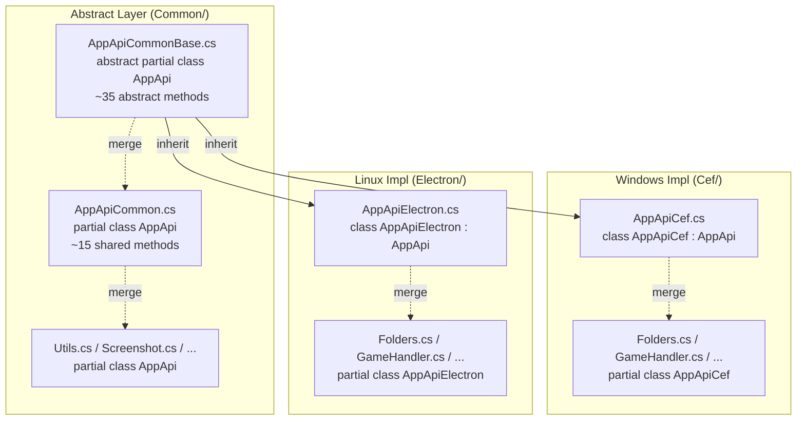
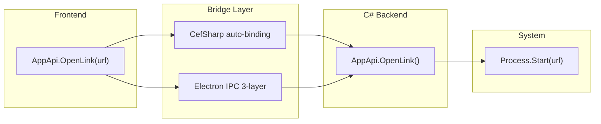

# C# Backend Developer Guide

> A guide to the C# backend for frontend developers. Covers startup flow, syntax reference, core design patterns, and maintenance scenario mapping.
> Complements [Backend Architecture Reference](./backend.md) — which focuses on API interfaces and module mapping, while this guide focuses on **reading the code** and **understanding runtime mechanics**.

## Startup Sequence Diagrams

### Windows (Cef): Startup → Run → Exit

```mermaid
sequenceDiagram
    participant OS as Operating System
    participant Main as Program.Main()
    participant Run as Program.Run()
    participant Services as Service Layer
    participant WinForm as MainForm
    participant JS as Vue Frontend

    OS->>Main: Launch VRCX.exe
    Main->>Main: BrowserSubprocess.Start()
    Main->>Main: Wine detection
    Main->>Run: Run()

    rect rgb(30, 40, 60)
    Note over Run: Phase ① Infrastructure
    Run->>Run: StartupArgs.ArgsCheck(args)
    Run->>Run: SetProgramDirectories()
    Run->>Run: VRCXStorage.Instance.Load()
    Run->>Run: ConfigureLogger()
    Run->>Run: GetVersion()
    Run->>Run: Update.Check()
    end

    rect rgb(25, 50, 70)
    Note over Run,Services: Phase ② Core service init (dependency order)
    Run->>Services: IPCServer.Instance.Init()
    Run->>Services: SQLite.Instance.Init()
    Run->>Services: new AppApiCef()
    Run->>Services: ProcessMonitor.Instance.Init()
    Run->>Services: Discord.Instance.Init()
    Run->>Services: WebApi.Instance.Init()
    Run->>Services: LogWatcher.Instance.Init()
    Run->>Services: AutoAppLaunchManager.Instance.Init()
    Run->>Services: CefService.Instance.Init()
    Run->>Services: OverlayServer.Instance.Init()
    end

    rect rgb(30, 55, 45)
    Note over WinForm: Phase ③ Start window
    Run->>WinForm: Application.Run(new MainForm())
    WinForm->>JS: file://vrcx/index.html
    Note over WinForm,JS: JavascriptBindings registers 7 C# objects
    end

    rect rgb(60, 30, 30)
    Note over Run,Services: Phase ④ Exit (reverse order)
    Run->>Services: WebApi.SaveCookies()
    Run->>Services: OverlayServer → CefService → AutoAppLaunch
    Run->>Services: LogWatcher → WebApi → Discord
    Run->>Services: VRCXStorage.Save() → SQLite → ProcessMonitor
    end
```



Source: `Dotnet/Program.cs` — `Run()` method (L216-L263)

---

### Linux/macOS (Electron) Startup

```mermaid
sequenceDiagram
    participant EMain as main.js
    participant DotNet as C# DLL
    participant Preload as preload.js
    participant Renderer as Vue Frontend

    rect rgb(30, 40, 60)
    Note over EMain: Phase ① Load .NET
    EMain->>EMain: require('VRCX-Electron.cjs')
    EMain->>EMain: new InteropApi()
    end

    rect rgb(25, 50, 70)
    Note over EMain,DotNet: Phase ② Two-stage init
    EMain->>DotNet: ProgramElectron.PreInit(version, args)
    EMain->>DotNet: VRCXStorage.Load()
    EMain->>DotNet: ProgramElectron.Init()
    EMain->>DotNet: SQLite.Init()
    EMain->>DotNet: AppApiElectron.Init()
    EMain->>DotNet: Discord / WebApi / LogWatcher.Init()
    end

    rect rgb(30, 55, 45)
    Note over EMain,Renderer: Phase ③ IPC bridge + window
    EMain->>EMain: ipcMain.handle('callDotNetMethod')
    EMain->>Preload: Load preload.js
    Preload->>Renderer: contextBridge.exposeInMainWorld()
    end
```



Source: `src-electron/main.js` (L84-125)

---

## C# Syntax Quick Reference

> All syntax items below come from actual VRCX code. The "🔍 Search" column provides Google/Microsoft Learn search terms.

### Basics

| Code Example | Meaning | JS Equivalent | 🔍 Search |
|-------------|---------|---------------|----------|
| `using System.IO;` | Import namespace | `import ... from '...'` | `C# using directive` |
| `namespace VRCX { }` | Namespace | File module | `C# namespace` |
| `var x = 42;` | Type inference | `const x = 42` | `C# var keyword` |
| `string name = "hi"` | Explicit typing | `let name = "hi"` | `C# variable types` |
| `$"Hello {name}"` | String interpolation | `` `Hello ${name}` `` | `C# string interpolation` |
| `/// <summary>` | Doc comment | JSDoc `/** */` | `C# XML documentation` |

### Types

| Code Example | Meaning | JS Equivalent | 🔍 Search |
|-------------|---------|---------------|----------|
| `string` / `int` / `double` / `bool` | Primitive types | Dynamic types | `C# value types` |
| `string?` | Nullable string | `string \| undefined` | `C# nullable reference` |
| `List<string>` | Dynamic array | `Array` | `C# List generic` |
| `Dictionary<string, int>` | Key-value map | `Map` / `Object` | `C# Dictionary` |
| `ConcurrentDictionary<K,V>` | Thread-safe dict | None | `C# ConcurrentDictionary` |
| `object[][]` | 2D array | `Array<Array>` | `C# jagged array` |

### Methods & Properties

| Code Example | Meaning | JS Equivalent | 🔍 Search |
|-------------|---------|---------------|----------|
| `public void Init()` | Void method | `init() { }` | `C# void method` |
| `public string Get(string key)` | Return type | `get(key) { return ... }` | `C# return type` |
| `public async Task<double> GetZoom()` | Async method | `async getZoom(): Promise<number>` | **`C# async Task`** |
| `public static void Send(...)` | Static method | `static send(...)` | `C# static method` |
| `private static readonly Logger logger` | Readonly static | `static #logger` | `C# readonly field` |
| `public string Version { get; set; }` | Property | `get version() { }` | `C# property` |
| `params string[] args` | Variadic args | `...args` | `C# params` |

### OOP (Key Concepts)

| Code Example | Meaning | JS Equivalent | 🔍 Search |
|-------------|---------|---------------|----------|
| `public partial class AppApi` | Split class across files | None | **`C# partial class`** |
| `public abstract void ShowDevTools()` | Must be implemented | Interface contract | **`C# abstract method`** |
| `public override void ShowDevTools()` | Override parent | Override | **`C# override`** |
| `class AppApiCef : AppApi` | Inheritance | `extends` | **`C# inheritance`** |
| `public/private/internal` | Access level | `#private` | `C# access modifiers` |

### Control Flow

| Code Example | Meaning | JS Equivalent | 🔍 Search |
|-------------|---------|---------------|----------|
| `try { } catch (Exception ex) { }` | Exception handling | `try/catch` | `C# exception handling` |
| `using var cmd = new SQLiteCommand()` | Auto-dispose | Similar to `finally` | **`C# using statement`** |
| `lock (this) { }` | Mutex | None | **`C# lock statement`** |
| `?.` / `??` | Null safety | `?.` / `??` | `C# null operators` |
| `is` / `as` | Type check/cast | `instanceof` | `C# type checking` |

### Compiler Directives

| Code Example | Meaning | JS Equivalent | 🔍 Search |
|-------------|---------|---------------|----------|
| `#if !LINUX` ... `#endif` | Conditional compilation | None (like `process.platform`) | **`C# preprocessor`** |
| `#region` ... `#endregion` | Code folding | None | `C# region` |
| `[STAThread]` | Attribute (metadata) | Decorator `@xxx` | `C# attributes` |

---

## Core Design Patterns

### Pattern 1: Singleton Service Registry

All backend services are global singletons exposed via `static Instance`:

```csharp
public class Discord
{
    public static readonly Discord Instance = new Discord();  // Single instance
    private Discord() { }                                     // Private ctor prevents external new
}
```

JS mental model:
```javascript
export const discord = new Discord(); // Module-level singleton
```

**Why**: Desktop apps need globally shared resources (DB connections, HTTP clients). Singletons prevent resource conflicts.

---

### Pattern 2: Bridge Exposure

The core pattern of CefSharp/WebView apps — exposing C# objects to browser JS.

**Windows (CefSharp)**: Direct binding

```csharp
// JavascriptBindings.cs (20 lines) — inject C# objects into JS
repository.Register("AppApi", Program.AppApiInstance);
repository.Register("WebApi", WebApi.Instance);
// ... 7 total
```

Frontend calls `await AppApi.GetVersion()` directly; CefSharp auto-serializes.

**Electron (Linux/macOS)**: Three-layer IPC forwarding

```
Frontend JS → preload.js (ipcRenderer) → main.js (ipcMain) → InteropApi → C# DLL
```

Unified frontend entry `src/plugins/interopApi.js` bridges the difference:

```javascript
if (WINDOWS) {
    await CefSharp.BindObjectAsync('AppApi', 'WebApi', ...);
} else {
    window.AppApi = InteropApi.AppApiElectron;
    window.WebApi = InteropApi.WebApi;
}
```

---

### Pattern 3: Init/Exit Lifecycle

Every service follows a uniform lifecycle:

```csharp
public void Init()  { /* Initialize: open files, start threads, establish connections */ }
public void Exit()  { /* Release: close files, stop threads, disconnect */ }
```

`Program.Run()` calls Init in **dependency order**, Exit in **reverse order**.

---

### Pattern 4: Conditional Compilation for Platforms

```csharp
#if !LINUX
    using CefSharp;              // Windows only
    Application.Run(new MainForm());
#else
    // Linux/macOS: driven by Electron main.js
#endif
```

`.csproj` defines the compilation symbol:

```xml
<!-- VRCX-Electron.csproj -->
<DefineConstants>LINUX</DefineConstants>
```

---

### Pattern 5: Partial Class Multi-File Layering

`AppApi` is the prime example — one class split across **14 files**:



> **Key insight**: `partial class` physically splits a **single class** across multiple files, merged at compile time. This is different from inheritance — inheritance is parent-child, partial is fragments of the same class.

---

### Pattern 6: Background Threads + Timers

**Thread loop** (LogWatcher):

```csharp
public void Init()
{
    _thread = new Thread(ThreadLoop) { IsBackground = true };
    _thread.Start();
}

private void ThreadLoop()
{
    while (_threadRunning)
    {
        Update();           // Check log files
        Thread.Sleep(500);  // 500ms polling
    }
}
```

**Timer callback** (Discord):

```csharp
private readonly Timer _timer;

public void Init()  { _timer.Change(0, 3000); }   // Every 3 seconds
public void Exit()  { _timer.Change(-1, -1); }     // Stop
```

---

## Thread Safety Quick Reference

| Pattern | Usage | VRCX Example |
|---------|-------|-------------|
| `lock (obj) { }` | Simple mutex | Discord.Update() |
| `ReaderWriterLockSlim` | Read-heavy | SQLite.cs |
| `ConcurrentDictionary` | Lock-free dict | VRCXStorage |
| `ConcurrentQueue` | Producer-consumer | LogWatcher |
| `Thread` | Background worker | LogWatcher.ThreadLoop |
| `Timer` | Timed callback | Discord |

---

## Data Flow Diagram



---

## Maintenance Scenario Map

| Scenario | Files Involved | Patterns to Know |
|----------|---------------|-----------------|
| Expose new C# method to JS | `AppApiCommonBase.cs` → `AppApiCommon.cs` → `AppApiCef.cs` / `AppApiElectron.cs` | partial class + abstract |
| Add new log event parsing | `LogWatcher.cs` — add `ParseXxx` method | Regex + Thread |
| Modify HTTP request behavior | `WebApi.cs` | async/await + HttpClient |
| Modify local settings storage | `VRCXStorage.cs` | ConcurrentDictionary |
| Modify Discord status | `Discord.cs` → `SetAssets()` | Timer + lock |
| Modify screenshot metadata | `ScreenshotMetadata/` directory | PNG chunk protocol |
| Add process monitoring | `ProcessMonitor.cs` | event + delegate |
| Modify auto-launch apps | `AutoAppLaunchManager.cs` | Process + Shortcut |

---

## Debugging

| Need | Method |
|------|--------|
| View C# logs | `%AppData%/VRCX/logs/VRCX.log` or `~/.config/VRCX/logs/` |
| Log from C# | `logger.Info("xxx")` / `logger.Error(ex, "xxx")` — uses NLog |
| Cef DevTools | `--debug` launch argument |
| Electron DevTools | `--hot-reload` launch argument |

---

## Recommended Learning Resources

| Topic | Resource |
|-------|----------|
| C# basics | [Tour of C# (Microsoft Learn)](https://learn.microsoft.com/en-us/dotnet/csharp/tour-of-csharp/) |
| async/await | [Async Programming (Microsoft Learn)](https://learn.microsoft.com/en-us/dotnet/csharp/asynchronous-programming/) |
| CefSharp | [CefSharp Wiki](https://github.com/AzureAD/CefSharp/wiki/General-Usage) |
| .NET CLI | `dotnet build` / `dotnet run` commands |
| NuGet | `<PackageReference>` in `.csproj` — similar to npm |
