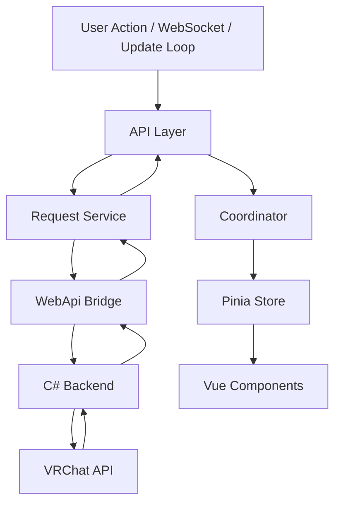
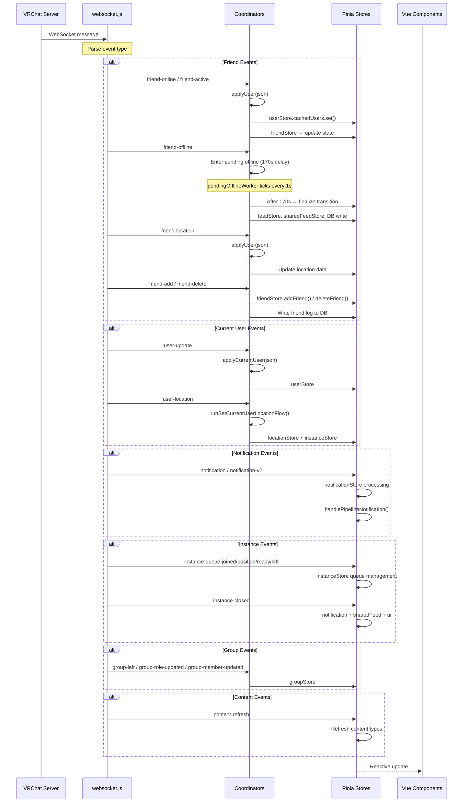
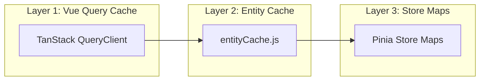
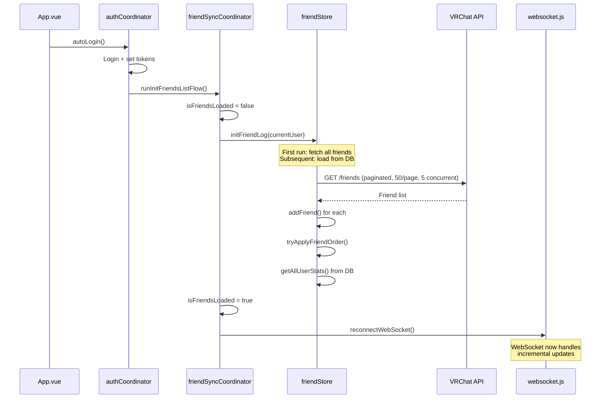

# Data Flow

## Core Request Pipeline

Every API call follows this path:

| Node | Path | Details |
|------|------|---------|
| API Layer | src/api/*.js | — |
| Request Service | src/services/request.js | buildRequestInit(), deduplicateGETs(), parseResponse() |
| WebApi Bridge | src/services/webapi.js | Windows: WebApi.Execute(options) / Linux: WebApi.ExecuteJson(json) |
| C# Backend | — | HTTP proxy to VRChat |
| Coordinator | src/coordinators/*.js | apply*() side-effects, cross-store orchestration |
| Pinia Store | src/stores/*.js | reactive Map/Set, computed properties |
| Vue Components | — | Automatic reactivity |

## WebSocket Real-Time Event Flow

## Complete WebSocket Event Map

| Event | Handler | Stores Affected |
|-------|---------|----------------|
| `friend-online` | `applyUser()` | user, friend |
| `friend-active` | `applyUser()` | user, friend |
| `friend-offline` | `applyUser()` → pending 170s | user, friend, feed, sharedFeed |
| `friend-update` | `applyUser()` | user, friend |
| `friend-location` | `applyUser()` | user, friend, location |
| `friend-add` | `applyUser()` + `handleFriendAdd()` | user, friend |
| `friend-delete` | `handleFriendDelete()` | friend, user |
| `user-update` | `applyCurrentUser()` | user |
| `user-location` | `runSetCurrentUserLocationFlow()` | location, user, instance |
| `notification` | `handleNotification()` | notification |
| `notification-v2` | `handlePipelineNotification()` | notification |
| `notification-v2-update` | `handlePipelineNotification()` | notification |
| `notification-v2-delete` | `handlePipelineNotification()` | notification |
| `instance-queue-joined` | `instanceQueueUpdate()` | instance |
| `instance-queue-position` | `instanceQueueUpdate()` | instance |
| `instance-queue-ready` | `instanceQueueReady()` | instance |
| `instance-queue-left` | `removeQueuedInstance()` | instance |
| `instance-closed` | Queue notification | notification, sharedFeed, ui |
| `group-left` | `onGroupLeft()` | group |
| `group-role-updated` | `applyGroup()` + refetch | group |
| `group-member-updated` | `handleGroupMember()` | group |
| `content-refresh` | Refresh content types | gallery |

## Update Loop Timers

The `updateLoop` store manages periodic background tasks:

| Timer | Interval | What It Does |
|-------|----------|-------------|
| `nextCurrentUserRefresh` | 300s (5 min) | `getCurrentUser()` — refresh own profile |
| `nextFriendsRefresh` | 3600s (1 hour) | `runRefreshFriendsListFlow()` + `runRefreshPlayerModerationsFlow()` |
| `nextGroupInstanceRefresh` | 300s (5 min) | `getUsersGroupInstances()` — group instance data |
| `nextAppUpdateCheck` | 3600s (1 hour) | Check for VRCX auto-update |
| `nextClearVRCXCacheCheck` | 86400s (24 hrs) | `clearVRCXCache()` |
| `nextDatabaseOptimize` | 3600s (1 hour) | SQLite optimization |
| `nextDiscordUpdate` | Variable | Discord Rich Presence refresh |
| `nextAutoStateChange` | Variable | `updateAutoStateChange()` |
| `nextGetLogCheck` | Variable | `addGameLogEvent()` — game log polling |
| `nextGameRunningCheck` | Variable | `AppApi.CheckGameRunning()` |

## Three-Layer Caching Strategy

**Key rule**: Data is only replaced if the incoming data is **newer** (recency-based). This prevents stale WebSocket events from overwriting fresh API responses.

## Friend Sync: Login Flow

