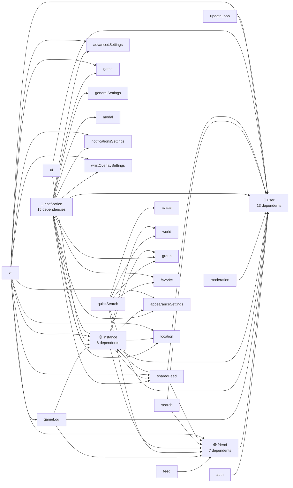

# Module Dependencies

## Store Dependency Graph

## Risk Heatmap

| Store | Dependents Count | Risk | What Happens If You Change It |
|-------|-----------------|------|-------------------------------|
| **user** | 13 stores depend on it | 🔴 Critical | Almost everything breaks — friend display, location, search, moderation, notifications, VR overlay |
| **notification** | Imports 15 other stores | 🔴 Critical | Most complex store — touches favorites, game, groups, locations, moderation, settings. Changes here cascade everywhere |
| **friend** | 7 stores depend on it | 🟠 High | Feed, game log, search, sidebar, VR overlay all read friend data |
| **instance** | 6 stores depend on it | 🟡 Medium-High | Game log, notifications, shared feed, VR all depend on instance state |
| **sharedFeed** | 8 dependencies | 🟡 Medium-High | Aggregates friend, instance, location, notification data for display |
| **location** | Leaf store | 🟢 Low | No cross-store dependencies — safe to modify in isolation |
| **avatar** | Leaf store | 🟢 Low | No cross-store dependencies |
| **game** | Leaf store | 🟢 Low | No cross-store dependencies |
| **modal** | Leaf store | 🟢 Low | No cross-store dependencies |
| **dashboard** | Leaf store | 🟢 Low | No store dependencies — safe to modify independently |

## Coordinator → Store Mapping

Use this table before modifying any coordinator — it tells you exactly which stores will be affected.

| Coordinator | Stores Used |
|-------------|------------|
| **authCoordinator** | auth, notification, updateLoop, user |
| **authAutoLoginCoordinator** | advancedSettings, auth |
| **userCoordinator** | appearanceSettings, auth, avatar, favorite, friend, game, generalSettings, instance, location, moderation, notification, search, sharedFeed, ui, user |
| **userEventCoordinator** | feed, friend, generalSettings, group, instance, notification, sharedFeed, user, world |
| **userSessionCoordinator** | auth, game, instance, user |
| **friendSyncCoordinator** | auth, friend, updateLoop, user |
| **friendPresenceCoordinator** | feed, friend, notification, sharedFeed, user |
| **friendRelationshipCoordinator** | appearanceSettings, friend, modal, notification, sharedFeed, ui, user |
| **avatarCoordinator** | advancedSettings, avatarProvider, avatar, favorite, modal, ui, user, vrcxUpdater |
| **worldCoordinator** | favorite, instance, location, ui, user, world |
| **groupCoordinator** | game, instance, modal, notification, ui, user, group |
| **instanceCoordinator** | instance (focused — low blast radius) |
| **favoriteCoordinator** | appearanceSettings, avatar, friend, generalSettings, user, world |
| **inviteCoordinator** | instance, invite, launch |
| **moderationCoordinator** | avatar, moderation |
| **memoCoordinator** | friend, user |
| **gameCoordinator** | advancedSettings, avatar, gameLog, game, instance, launch, location, modal, notification, updateLoop, user, vr, world |
| **gameLogCoordinator** | advancedSettings, friend, gallery, gameLog, generalSettings, instance, location, modal, notification, sharedFeed, user, vr, vrcx |
| **locationCoordinator** | advancedSettings, gameLog, game, instance, location, notification, user, vr |
| **cacheCoordinator** | auth, avatar, instance, world |
| **imageUploadCoordinator** | (minimal — API calls only) |
| **dateCoordinator** | (pure utility — no stores) |
| **vrcxCoordinator** | (app-level operations) |

### Highest Blast Radius Coordinators

::: danger Top 3 — Change with extreme care
1. **userCoordinator** — touches **16 stores**. Central hub for all user data processing.
2. **gameLogCoordinator** — touches **15 stores**. Game event logging cross-cuts everything.
3. **gameCoordinator** — touches **13 stores**. Game state affects locations, instances, avatars, VR.
:::

::: tip Safe to modify
- **instanceCoordinator** — only touches instance store
- **moderationCoordinator** — only avatar + moderation
- **dateCoordinator** — pure utility, no stores
- **imageUploadCoordinator** — API-only, minimal side effects
:::

## Pre-Modification Checklist

Before changing any module, check this:

1. **Find the module in the tables above** — know its dependents
2. **Search for imports** — `grep -r "from.*/{moduleName}" src/` to find all consumers
3. **Check if it's used in updateLoop** — changes may affect periodic refresh timing
4. **Check if WebSocket events feed into it** — see the [event map](./data-flow.md#complete-websocket-event-map)
5. **Check if VR mode uses it** — VR has separate initialization, may not have Pinia available
6. **Check coordinator usage** — coordinators orchestrate side effects across stores
