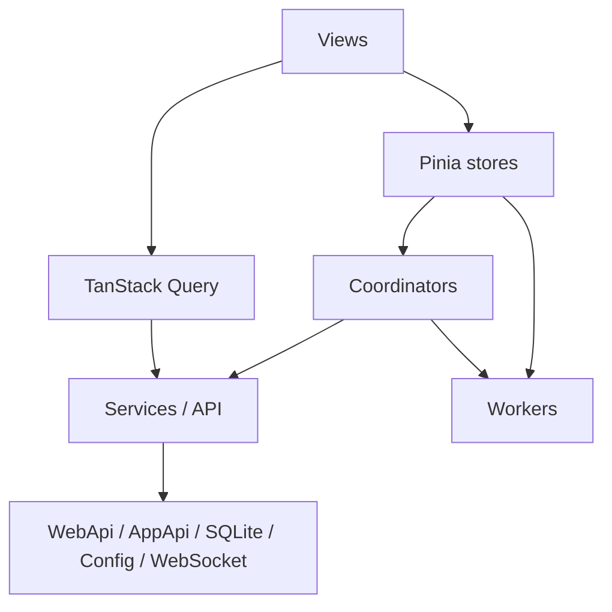

# System Overview

## First Mental Model

The VRCX frontend is not just a page bundle. It behaves more like a realtime desktop client hosted inside a desktop shell. The easiest way to understand the codebase is through five major paths:

1. Startup path: `src/app.js` -> `src/App.vue` -> global store creation -> auto-login and periodic refresh
2. Page path: `route -> view -> store -> coordinator -> service`
3. Realtime path: `services/websocket.js` receives events, coordinators route them, stores update
4. Polling path: `src/stores/updateLoop.js` drives periodic refresh, log checks, and game-state sync every second
5. Background path: SQLite, config persistence, worker computation, and desktop bridge work continue outside the visible UI

Those paths explain the architecture better than volatile counts of pages or components.

## Startup Order

`src/app.js` assembles the application shell:

1. `initPlugins()`
2. `initPiniaPlugins()`
3. create the Vue app
4. register `pinia`, `i18n`, and `VueQueryPlugin`
5. `initComponents(app)`
6. `initRouter(app)`
7. `initSentry(app)`
8. `app.mount('#root')`

`src/App.vue` then connects the runtime:

- `createGlobalStores()` instantiates the global stores
- a few bridge functions are attached to `window` for desktop-side callbacks
- `onBeforeMount()` starts `updateLoop`
- `onMounted()` triggers `getGameLogTable()`, user migration, auto-login, backup checks, and VRChat debug logging checks

This is why a large amount of work is already running before a user opens any specific page.

## Practical Layering

### Startup and assembly layer

`src/app.js`, `src/App.vue`, `src/plugins/`, and `src/stores/index.js` assemble Vue, Pinia, i18n, Query, routing, global stores, and a small number of desktop bridge hooks.

### Data access and cache layer

- `src/services/request.js` is the raw request entry point and owns GET deduplication, failure backoff, and status handling
- `src/api/` and `src/queries/` provide entity fetching with cache policy
- `src/services/database/*` is the local persistence layer for feed, activity, game log, favorites, and related history

### State and orchestration layer

- `src/stores/` owns domain state, view state, and part of the derived-list work
- `src/coordinators/` owns cross-store flows and side effects so stores do not orchestrate each other directly

### Realtime and background task layer

- `src/services/websocket.js` handles VRChat realtime events
- `src/stores/updateLoop.js` handles periodic refresh, log checks, and game-state sync
- `src/workers/*` handles CPU-heavy tasks such as search and activity analysis

### Presentation and interaction layer

- `src/views/` contains page-level containers
- `src/components/` contains reusable UI and large dialogs
- high-volume areas default toward virtualization, while heavy computation should move toward workers or local cache

## Three Runtime Paths That Matter Most

### 1. Page read path

Typical path:

`router -> view -> store/computed -> service/api -> state update -> render`

In pages like `FriendList`, `FriendsLocations`, and `MyAvatars`, the real complexity is usually in derivation, filtering, batch queries, and persistence rather than in the component tree itself.

### 2. Realtime update path

Typical path:

`websocket event -> handlePipeline -> coordinator -> store mutation -> derived lists recompute -> visible view update`

Friend presence, notifications, and location tracking all rely on this path, so the main performance question is often how much derived data gets rebuilt per incoming event.

### 3. Polling and background computation path

Typical path:

`updateLoop / UI action -> SQLite or worker -> cached result -> store/view consume`

Activity analytics, gallery work, game-log-heavy features, and game-state sync live here. The bottleneck is usually query shape, cache granularity, or main-thread blocking, not DOM size.

## Why Store Boundaries Matter

The main engineering rule in this repo is not “tiny beautiful components”. It is “do not push cross-module orchestration back into stores”.

The reasons are practical:

- when one store owns state, derivations, and cross-module flows at the same time, performance issues become much harder to localize
- WebSocket-driven updates and user-driven interactions share the same state graph, so blurred boundaries amplify chain recomputation
- keeping multi-store side effects in coordinators makes docs, debugging, and refactoring much more manageable

## Performance-Friendly Patterns Already Present

These patterns are worth calling out because they show the current optimization direction:

- `src/services/request.js` merges repeated GET requests within a short window to avoid duplicate concurrent fetches
- `src/stores/friend.js` maintains `sortedFriends` and uses `reindexSortedFriend()` plus batching for incremental resorting instead of fully resorting every derived list
- `src/stores/quickSearch.js` routes quick search through a worker and pushes index updates incrementally via `searchIndexStore.version`
- `src/stores/activity.js` caches snapshots, deduplicates in-flight jobs, and moves activity computation to a worker
- several large-list pages already use virtualization, though the real cost can still sit upstream in data preparation

## Recommended Reading Order

- start with [Frontend Change Entry Map](/en/architecture/change-entry-map) to identify the right entry files
- then check whether the relevant store and coordinator already form the full path
- only then drill down into `services/database/*`, `services/request.js`, workers, `services/websocket.js`, or `updateLoop`

Build the path first, then inspect local details.
