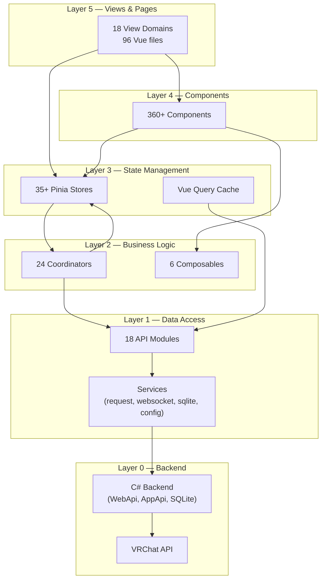
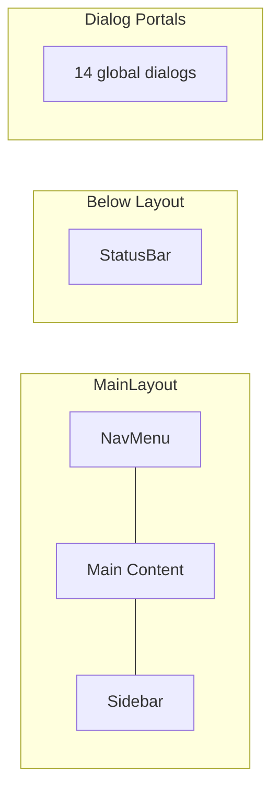

# System Overview

## Tech Stack

| Component | Version | Purpose |
|-----------|---------|---------|
| Vue | 3.5 | UI framework |
| Pinia | 3.0 | State management |
| Vue Router | 4.6 | Hash-based client routing |
| Vite | 7.3 | Build tool & dev server |
| Tailwind CSS | 4.2 | Utility-first styling |
| Reka-ui | — | Headless component library |
| TanStack Vue Query | — | Server-state caching |
| vue-i18n | 11.3 | Internationalization (14 languages) |
| Electron | 39.8 | Desktop wrapper (Linux/Mac) |
| CEF | — | Desktop wrapper (Windows) |

## 5-Layer Architecture



## Layer-by-Layer Breakdown

### Layer 5 — Views (18 domains)

| Domain | Path | Purpose |
|--------|------|---------|
| Login | `views/Login/` | Authentication UI |
| Feed | `views/Feed/` | Social activity timeline |
| FriendsLocations | `views/FriendsLocations/` | Real-time friend location cards |
| Sidebar | `views/Sidebar/` | Right panel — friends & groups |
| FriendList | `views/FriendList/` | Friend data table |
| FriendLog | `views/FriendLog/` | Friend add/remove history |
| PlayerList | `views/PlayerList/` | In-world player tracking |
| Search | `views/Search/` | Player/world search |
| Favorites | `views/Favorites/` | Friends / Worlds / Avatars (3 sub-views) |
| MyAvatars | `views/MyAvatars/` | Avatar management |
| Notifications | `views/Notifications/` | Invites & friend requests |
| Moderation | `views/Moderation/` | Block/kick tools |
| GameLog | `views/GameLog/` | Complete game event log |
| Charts | `views/Charts/` | Instance activity & mutual friends |
| Tools | `views/Tools/` | Gallery, screenshot metadata, exports |
| Settings | `views/Settings/` | 7 tabs + 8 dialogs |
| Dashboard | `views/Dashboard/` | Customizable dashboard (multi-row widget layout) |
| Layout | `views/Layout/` | Main 3-panel layout container |

### Layer 4 — Components

| Category | Count | Examples |
|----------|-------|---------|
| UI Library (`components/ui/`) | ~200 files, 50+ types | Button, Dialog, DataTable, Tabs, Select, Popover, Sheet... |
| Feature Dialogs (`components/dialogs/`) | 20+ | UserDialog (11 tabs), WorldDialog (4 tabs), GroupDialog (12+ tabs) |
| Root Components | 17 | NavMenu, StatusBar, QuickSearchDialog, Location, Timer... |

### Layer 3 — Pinia Stores (35+)

| Category | Stores |
|----------|--------|
| **Core Entity** | user, friend, avatar, avatarProvider, world, instance, group, location |
| **Features** | feed, favorite, search, gallery, invite, moderation |
| **Real-time** | notification (complex), vrcStatus |
| **Game** | game, gameLog (dir), launch |
| **UI State** | ui, modal, quickSearch, sharedFeed, charts, dashboard |
| **Settings** | settings/general, appearance, advanced, notifications, discordPresence, wristOverlay |
| **System** | auth, updateLoop, vrcx, vrcxUpdater |
| **Networking** | photon |
| **VR** | vr |

### Layer 2 — Coordinators (24)

| Category | Coordinators |
|----------|-------------|
| **Auth** | authCoordinator, authAutoLoginCoordinator |
| **User** | userCoordinator, userEventCoordinator, userSessionCoordinator |
| **Friend** | friendSyncCoordinator, friendPresenceCoordinator, friendRelationshipCoordinator |
| **Entity** | avatarCoordinator, worldCoordinator, groupCoordinator, instanceCoordinator |
| **Feature** | favoriteCoordinator, inviteCoordinator, moderationCoordinator, memoCoordinator |
| **Game** | gameCoordinator, gameLogCoordinator, locationCoordinator |
| **System** | cacheCoordinator, imageUploadCoordinator, dateCoordinator, vrcxCoordinator, searchIndexCoordinator |

### Layer 1 — API & Services

**API modules** (18): auth, user, friend, avatar, world, instance, group, favorite, notification, playerModeration, avatarModeration, image, inventory, inviteMessages, prop, misc, vrcPlusIcon, vrcPlusImage

**Services**: request.js (HTTP + dedup), websocket.js (real-time events), sqlite.js (DB wrapper), config.js (key-value config), webapi.js (C# bridge), appConfig.js (debug flags), watchState.js (reactive flags), security.js, jsonStorage.js, confusables.js (confusable character detection), gameLog.js (game log parsing)

**Web Workers**: quickSearchWorker.js (quick search — confusable-character normalization + locale-aware search offloaded to worker thread)

## Main Layout Structure



- **NavMenu**: Collapsible left sidebar, icon-only when collapsed, dropdown submenus, keyboard shortcuts, notification dots
- **Main Content**: `RouterView` wrapped in `KeepAlive` (excludes Charts), `ResizablePanel` with auto-save
- **Sidebar**: Friends/Groups tabs, 7 sort options, favorite group filtering, same-instance grouping
- **Layout persistence**: Panel sizes saved to localStorage as `"vrcx-main-layout-right-sidebar"`

## App Initialization Order

```
app.js
├── 1. initPlugins()          — Custom plugin setup
├── 2. initPiniaPlugins()     — Pinia action trail (nightly)
├── 3. VueQueryPlugin         — TanStack Vue Query
├── 4. Pinia                  — State management
├── 5. i18n                   — Internationalization
├── 6. initComponents()       — Global UI component registration
├── 7. initRouter()           — Vue Router + auth guards
├── 8. initSentry()           — Error tracking
└── 9. app.mount('#root')

App.vue onMounted:
├── updateLoop.init()         — Start all periodic timers
├── migrateUsers()            — DB migration
├── autoLogin()               — Attempt auto-login
├── checkBackup()             — Backup verification
└── VRChat debug logging      — Conditional
```

## VR Mode

VR has a **separate entry point** (`vr.js` → `Vr.vue`):
- Only loads `i18n` plugin (no Pinia, no Vue Query, no Sentry)
- Minimal UI: wrist overlay showing friend locations
- Communicates with main app via shared backend, not shared Vue state
- Separate build output (`vr.html`)
