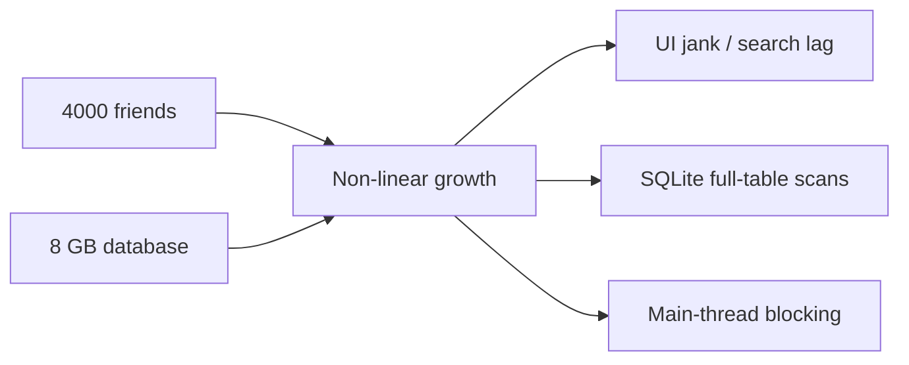

# Performance Analysis

> **Baseline assumption:** ~4000 friends, ~8 GB SQLite database. All bottlenecks discussed below are non-linear — they do **not** degrade gracefully as data grows.

## Overview

VRCX is designed for social VR power-users who often accumulate thousands of friends and years of game-log history. While most features work well during early use, several hot paths exhibit **quadratic (O(n²))**, **full-table-scan**, or **repeated linear-scan** behaviour that can cause visible UI degradation at scale.



---

## Bottleneck 1 — `findUserByDisplayName` Linear Scan

### Location

`src/shared/utils/user.js` line 280

```javascript
function findUserByDisplayName(cachedUsers, displayName) {
    for (const ref of cachedUsers.values()) {  // O(n) scan
        if (ref.displayName === displayName) {
            return ref;
        }
    }
    return undefined;
}
```

### Call-Site Inventory

| Call site | File | Trigger frequency |
|-----------|------|-------------------|
| Player-join event | `gameLogCoordinator.js:89` | **High** — every room join |
| Player-join log | `gameLogCoordinator.js:162` | **High** — same |
| External message | `gameLogCoordinator.js:409` | Medium |
| Video play parser | `mediaParsers.js:142` | Medium |
| Resource load parsers | `mediaParsers.js:210, 273, 330, 387` | **High** — 5 call sites |
| Notification handler | `notification/index.js:1021, 1087` | Medium |
| User coordinator | `userCoordinator.js:635` | Low |

### Complexity

- Single call: **O(n)** where n = `cachedUsers.size` (typically 4000–8000)
- Joining a full 80-player instance: 80 join events × O(n) = **O(80 n)**
- With `mediaParsers` multiplier: each log event may call `findUserByDisplayName` multiple times
- Worst case (join a full room): **~400,000 string comparisons**

### Severity: 🔴 Critical

Highest-priority fix. This single function is responsible for the largest share of avoidable CPU work during real-time event processing.

### Future Direction

Build a reverse-index `Map<displayName, ref>` inside `userStore`, maintained alongside `cachedUsers`:

```javascript
// In user store
const displayNameIndex = new Map(); // displayName → ref

// Maintained inside applyUser():
// displayNameIndex.set(ref.displayName, ref);

// O(1) lookup:
function findUserByDisplayName(cachedUsers, displayName) {
    return displayNameIndex.get(displayName);
}
```

::: warning Note
Display names are **not unique** across VRChat users, but the current implementation already returns the first match. A reverse-index preserves this same semantic.
:::

---

## Bottleneck 2 — GameLog / Notification Database Search

### Location

- `src/services/database/gameLog.js` line 984 (`searchGameLogDatabase`)
- `src/services/database/notifications.js` line 77 (`lookupNotificationDatabase`)

### Problem

Both functions use `LIKE '%search%'` patterns against multiple columns, which **cannot use B-tree indexes** and always triggers a full table scan:

```sql
-- gameLog.js: repeated across 7 tables, UNION ALL'd
SELECT * FROM (
    SELECT ... FROM gamelog_location
    WHERE world_name LIKE @searchLike   -- full scan
    ORDER BY id DESC LIMIT @perTable
)
UNION ALL
SELECT * FROM (
    SELECT ... FROM gamelog_join_leave
    WHERE display_name LIKE @searchLike -- full scan
    ORDER BY id DESC LIMIT @perTable
)
-- ... 5 more UNION ALL blocks
```

```sql
-- notifications.js: raw string interpolation
WHERE (sender_username LIKE '%${search}%'
    OR message LIKE '%${search}%'
    OR world_name LIKE '%${search}%')
```

### Complexity

| Parameter | Estimated value |
|-----------|----------------|
| `gamelog_join_leave` rows | ~5,000,000 (years of play) |
| `gamelog_location` rows | ~500,000 |
| Total tables scanned | 7 (UNION ALL) |
| Scans per search keystroke | 7 × full scan per table |

With `LIKE '%xxx%'`, SQLite must examine **every row** in every table. At 8 GB database size, each search can scan **millions of rows**.

### Additional Issue — SQL Injection

`notifications.js` line 77 uses **raw string interpolation** instead of parameterized queries:

```javascript
// ⚠️ SQL injection vulnerability
`WHERE (sender_username LIKE '%${search}%' ...)`
```

While line 38 does `search.replaceAll("'", "''")`, this is **not a complete defence** against all injection vectors.

### Severity: 🔴 Critical

The performance of search degrades proportionally with database age and size. Users who have run VRCX for years will experience the worst slowdowns.

### Future Direction

**Option A — SQLite FTS5 (Full-Text Search)**

```sql
-- Create FTS table alongside existing tables
CREATE VIRTUAL TABLE gamelog_fts USING fts5(
    display_name, world_name, content='gamelog_join_leave'
);

-- Search becomes O(log n) via inverted index
SELECT * FROM gamelog_fts WHERE gamelog_fts MATCH 'searchterm';
```

- Pros: Orders of magnitude faster for text search; built into SQLite
- Cons: Requires schema migration, FTS tables add ~30% storage overhead, and all inserts must also update the FTS index

**Option B — Prefix-only LIKE (`LIKE 'xxx%'`)**

If full-text search is not needed, dropping the leading `%` allows B-tree index usage:

```sql
WHERE display_name LIKE 'search%'  -- Can use index
```

- Pros: Zero migration; just change the query
- Cons: Only matches prefixes, not substrings — changes user-visible behaviour

**Option C — Application-layer search index**

Build an in-memory trie or inverted index when the search dialog opens, populated from a single `SELECT` query. Subsequent keystrokes search the in-memory index.

- Pros: Extremely fast after initial load; no DB schema changes
- Cons: Memory overhead; stale data until re-indexed

::: tip Recommendation
Option A (FTS5) is the strategic choice. Option C is the pragmatic short-term choice when FTS migration is not feasible.
:::

---

## Bottleneck 3 — Mutual Friends Graph O(n²)

### Location

`src/views/Charts/components/MutualFriends.vue` line 827 (`buildGraphFromMutualMap`)

### Structure

```javascript
for (const [friendId, { friend, mutuals }] of mutualMap.entries()) {
    ensureNode(friendId, ...);
    for (const mutual of mutuals) {       // inner loop
        ensureNode(mutual.id, ...);
        addEdge(friendId, mutual.id);     // edge creation per pair
    }
}
```

### Complexity

- Let N = friend count, M = average mutual-friend count per friend
- Edge creation: **O(N × M)**
- In dense social graphs (friend groups): M approaches N → **O(N²)**
- Graph layout (`forceAtlas2.assign`): already in Web Worker, but grows **super-linearly** with edge count

### Measured Scale

| Friends | Estimated edges | Build time (approx.) |
|---------|----------------|----------------------|
| 100 | ~2,000 | < 1s |
| 500 | ~50,000 | ~3s |
| 2000 | ~800,000 | ~30s+ |
| 4000 | ~3,200,000 | potentially minutes |

### Severity: 🟡 Medium

The graph layout is already in a Web Worker (does not block UI). The graph build itself runs on the main thread but uses hash-based dedup (`graph.hasEdge`). Still, at 4000 friends the volume of edges becomes problematic.

### Future Direction

1. **Pre-filter by community**: Before building the full graph, cluster friends by world/group affinity, then only build sub-graphs. This reduces N per sub-graph dramatically.

2. **Incremental layout**: Cache previous layout positions and only re-layout when the graph changes (new friend added/removed), using the previous layout as initial positions.

3. **Cap graph size**: Add a configurable threshold (e.g., max 500 nodes). Provide UI to filter by friend group before graph generation.

4. **Move graph construction to Worker**: Move `buildGraphFromMutualMap` into the existing `graphLayoutWorker`, so both construction and layout are off the main thread.

---

## Bottleneck 4 — Friend List Repeated Sort/Filter

### Location

`src/stores/friend.js` lines 79–165

### Structure

Five `computed` properties each create a **new array copy** and sort it:

```javascript
const vipFriends = computed(() =>
    Array.from(friends.values())       // O(n) copy
        .filter(f => f.isVIP)          // O(n)
        .sort(sortFn)                  // O(n log n)
);
const onlineFriends = computed(...)    // same pattern
const activeFriends = computed(...)    // same pattern
const offlineFriends = computed(...)   // same pattern
const allFriends = computed(...)       // same pattern
```

### Complexity

- Any friend property change invalidates `friends` (reactive Map)
- This triggers **all 5 computed** to re-evaluate: 5 × (O(n) + O(n log n))
- With 4000 friends: 5 × 4000 × log₂(4000) ≈ **240,000 comparisons**
- Frequent triggers: friend online/offline events during peak hours

### Severity: 🟡 Medium

Vue's computed caching prevents redundant evaluation when dependencies haven't changed, but the `friends` Map is highly volatile — any friend state change (status, location, platform) invalidates all watchers.

### Future Direction

1. **Partition-based caching**: Instead of filtering from the full list, maintain separate `Set`s (`vipIds`, `onlineIds`, etc.) that update incrementally when individual friend states change.

2. **Single sorted array + views**: Sort the full list once, then use binary search or offsets to create category views without re-sorting.

3. **`shallowRef` arrays with manual diffing**: Track only the final sorted array, and only re-sort when the sort order actually changes (not every friend update).

---

## Bottleneck 5 — Quick Search Main-Thread Traversal

### Location

`src/stores/search.js` line 113 (`quickSearchRemoteMethod`)

### Problem

The legacy quick search iterates **all friends** on the main thread for each keystroke:

```javascript
for (const ctx of friendStore.friends.values()) {
    // removeConfusables() + localeIncludes() per friend
}
```

While the new **Quick Search** (`quickSearch.js` + `quickSearchWorker.js`) uses a Web Worker, the **Quick Search** in the top bar still runs on the main thread.

### Mitigated Concern — Index Update Triggering

The previous `globalSearch.js` used 6 `deep: true` watchers on large reactive Maps. This has been refactored:

- **Before**: Deep watchers on `friends`, `cachedAvatars`, `cachedWorlds`, `currentUserGroups`, `favoriteAvatars`, `favoriteWorlds` — Vue's internal deep traversal on every mutation
- **After**: `searchIndexStore` uses an incrementing `version` counter. `quickSearch.js` watches only this scalar `version` (shallow, O(1)). Data updates are pushed by `searchIndexCoordinator` at the point of mutation, not pulled by watchers.

**Remaining overhead:**
- `sendIndexUpdate()` still calls `searchIndexStore.getSnapshot()` which iterates all 6 Maps to build plain-data snapshots sent via `postMessage` structured clone
- Serialization cost is O(friends + avatars + worlds + groups + favAvatars + favWorlds), potentially MB-scale with 4000 friends
- Mitigated by: only active while dialog is open + 200ms debounce

### Severity: 🟢 Low (downgraded from Medium after refactor)

Quick Search is debounced and capped at 4 results, limiting the visible impact. The deep watcher overhead has been eliminated by the version-counter approach.

### Future Direction

1. **Merge Quick Search into the Worker**: Route Quick Search queries through the existing `quickSearchWorker` instead of duplicating logic on the main thread.

2. **Delta updates**: Instead of full snapshot rebuilds, send only changed entries to the worker when `version` increments.

3. **Lazy serialization**: Only serialize data when the worker index is stale, rather than rebuilding on every version change.

---

## Bottleneck 6 — SharedFeed `unshift` + Deep Watch + Async Rebuild

### Location

- `src/stores/sharedFeed.js` line 33 (`rebuildOnPlayerJoining`)
- `src/stores/sharedFeed.js` line 89 (`currentTravelers` deep watch)

### Problem

**1. `unshift` O(n) operation:**

```javascript
// Array.unshift is O(n) — shifts all existing elements
newOnPlayerJoining.unshift(feedEntry);
// ...
sharedFeedData.value.unshift(...onPlayerJoining.value);
```

**2. `currentTravelers` `deep: true` watch:**

```javascript
// sharedFeed.js:89
watch(
    () => userStore.currentTravelers,
    () => rebuildOnPlayerJoining(),
    { deep: true }
);
```

`currentTravelers` is a reactive Map. Every time a friend starts/stops traveling, the deep watch fires, invoking `rebuildOnPlayerJoining()`.

**3. Serial `await` in async rebuild:**

```javascript
// Inside rebuildOnPlayerJoining()
const worldName = await getWorldName(ref.$location.worldId);   // may trigger API request
const groupName = await getGroupName(ref.$location.groupId);   // same
```

Each traveling friend requires `await`ing world and group name lookups. When multiple friends travel simultaneously, the rebuild function waits serially, and since the deep watch fires frequently, this can lead to continuous recalculation.

### Complexity

- `unshift` itself is limited by `maxEntries` (25), minimal impact
- The real issue is: frequent deep watch triggers × serial await chain per trigger
- During travel event bursts (e.g., many friends entering a new world), this produces a cascade of rebuilds

### Severity: 🟡 Medium

`maxEntries = 25` limits the `unshift` impact. However, the deep watch + async rebuild combination creates unnecessary CPU overhead and potential race conditions during travel event bursts.

### Future Direction

1. **Ring buffer**: Use a fixed-size circular buffer instead of `unshift`. New entries overwrite the oldest entry without shifting.

2. **`shallowRef` + manual trigger**: Use `shallowRef([])` for the feed array and call `triggerRef()` after mutation, avoiding Vue's deep traversal.

3. **Debounce rebuild**: Add debounce to `rebuildOnPlayerJoining`, merging multiple travel event triggers within a short window.

4. **Parallelize await**: Change `getWorldName` / `getGroupName` to `Promise.all` for parallel fetching, reducing serial wait time.

---

## Supplementary Finding — Instance Store Full Friend Traversal

### Location

`src/stores/instance.js` lines 74–91, 786, 991

### Problem

```javascript
// cleanInstanceCache: called on every applyInstance()
const friendLocationTags = new Set(
    [...friendStore.friends.values()]      // spread 4000 friends
        .map(f => f.$location?.tag)
        .filter(Boolean)
);
```

### Complexity

- `cleanInstanceCache`: O(friends) per instance apply — called frequently

### Severity: 🟡 Medium

### Future Direction

Maintain a reactive `Set<tag>` of current friend location tags, updated incrementally when friends change location. `cleanInstanceCache` can then use O(1) lookups.

---

## Bottleneck 7 — Instance Dialog Room Aggregation Full Traversal + `some()` Dedup

### Location

- `src/stores/instance.js` line 773 (`applyWorldDialogInstances`)
- `src/stores/instance.js` lines 786-800 (full friend traversal)
- `src/stores/instance.js` line 991 (`applyGroupDialogInstances`)

### Problem

**1. Full friend traversal:**

```javascript
// applyWorldDialogInstances: iterates all friends to find those in target world
for (const friend of friendStore.friends.values()) {   // O(friends)
    const { ref } = friend;
    if (ref.$location.worldId !== D.id || ...) {
        continue;
    }
    instance = instances[instanceId];
    instance.users.push(ref);
}
```

Both `applyWorldDialogInstances` and `applyGroupDialogInstances` fully traverse `friendStore.friends` to find friends in a specific world/group.

**2. `some()` dedup:**

```javascript
// instance.js:773 — dedup using some() on instance users
for (const friend of friendsInInstance.values()) {
    const addUser = !instance.users.some(function (user) {
        return friend.userId === user.id;       // O(users) per friend
    });
    if (addUser) {
        instance.users.push(ref);
    }
}
```

For each friend in `friendsInInstance`, `some()` checks if they're already in `instance.users`. This is an O(friendsInInstance × users) nested loop.

### Complexity

- Full traversal: O(friends) per dialog open (4000 friends = 4000 iterations)
- `some()` dedup: O(k²), k = friends in instance (usually small, large rooms < 80)
- Actual impact depends on dialog open frequency and friend count

### Severity: 🟡 Medium

The `some()` dedup k is typically small (≤ 80), but the full friend traversal executes every time a world/group dialog is opened.

### Future Direction

1. **Maintain `worldId → Set<userId>` index**: Incrementally maintained when friend locations change, O(1) lookup on dialog open.
2. **Replace `some()` dedup with `Set`**: Use `Set<userId>` instead of `Array.some()`, making dedup O(1).

---

## Bottleneck 8 — GameLog `insertGameLogSorted` Linear Insertion

### Location

`src/stores/gameLog/index.js` line 131 (`insertGameLogSorted`)

### Problem

```javascript
function insertGameLogSorted(entry) {
    const arr = gameLogTableData.value;
    for (let i = 1; i < arr.length; i++) {          // O(n) linear scan
        if (compareGameLogRows(entry, arr[i]) < 0) {
            gameLogTableData.value = [
                ...arr.slice(0, i),                  // O(n) array copy
                entry,
                ...arr.slice(i)                      // O(n) array copy
            ];
            return;
        }
    }
    gameLogTableData.value = [...arr, entry];        // O(n) append
}
```

Each insertion performs:
1. **Linear scan** to find insertion position: O(n)
2. **Spread-rebuilds the entire array**: O(n)
3. Total: **O(n) per insertion**

### Mitigating Factors

- `gameLogTableData` uses `shallowRef`, avoiding Vue's deep tracking of array elements
- Head/tail insertion has fast paths (first or last position); most new logs arrive in chronological order
- Array size is limited by UI table display

### Complexity

| Table size | Worst-case insertion cost |
|------------|-------------------------|
| 100 | Negligible |
| 1,000 | ~2,000 operations |
| 10,000 | ~20,000 operations |

### Severity: 🟢 Low

Due to fast paths and `shallowRef` mitigation, impact is minimal in most scenarios. May become a bottleneck with high-frequency events (e.g., frequent join/leave in large rooms) + large tables.

### Future Direction

1. **Binary search**: Replace linear scan with binary search, O(log n) to find insertion position.
2. **`splice` instead of spread**: Use `arr.splice(i, 0, entry)` for in-place insertion, avoiding new array creation. Combined with `shallowRef`, requires explicit `triggerRef()`.

---

## Bottleneck 9 — `getAllUserStats` Large SQL IN Clause

### Location

- `src/services/database/gameLog.js` line 472 (`getAllUserStats`)
- `src/stores/friend.js` line 609 (call site)

### Problem

```javascript
// database/gameLog.js — getAllUserStats
var userIdsString = '';
for (var userId of userIds) {
    userIdsString += `'${userId}', `;              // manual string concatenation
}
var displayNamesString = '';
for (var displayName of displayNames) {
    displayNamesString += `'${displayName.replaceAll("'", "''")}'，`;
}

await sqliteService.execute(
    (dbRow) => { ... },
    `SELECT ... FROM gamelog_join_leave g
     WHERE g.user_id IN (${userIdsString})           -- 4000 IDs!
        OR g.display_name IN (${displayNamesString}) -- 4000 names!
     GROUP BY g.user_id, g.display_name
     ORDER BY g.user_id DESC`
);
```

### Complexity

| Parameter | Estimated value |
|-----------|----------------|
| IN clause userIds | ~4000 |
| IN clause displayNames | ~4000 |
| `gamelog_join_leave` rows | ~5,000,000 |
| SQL string length | ~200,000 characters |

**Analysis:**

1. **Massive SQL string**: 4000 userIds + 4000 displayNames generate ~200K char SQL
2. **OR joining two INs**: `WHERE id IN (...) OR name IN (...)` — SQLite cannot use two indexes simultaneously
3. **GROUP BY full scan**: Groups and aggregates over matched rows
4. **Potential SQL injection**: `displayName` only escaped with `replaceAll("'", "''")`, not complete protection

### Severity: 🟡 Medium

This function is called once during friend list initialization (not a sustained hot path), but with 4000 friends it can cause multi-second SQLite query blocking.

### Future Direction

1. **Temp table + JOIN**: Insert userIds and displayNames into a temp table, use JOIN instead of IN clauses
2. **Batch queries**: Split 4000 IDs into multiple batches (e.g., 500 per batch), query individually
3. **Parameterized queries**: Use `@param` parameter binding instead of string concatenation, eliminating injection risk

---

## Bottleneck 10 — `clearVRCXCache` Nested Scan

### Location

`src/coordinators/vrcxCoordinator.js` lines 62-74

### Problem

```javascript
instanceStore.cachedInstances.forEach((ref, id) => {
    if (
        [...friendStore.friends.values()].some(   // spreads entire friends Map per instance!
            (f) => f.$location?.tag === id
        )
    ) {
        return;
    }
    if (Date.parse(ref.$fetchedAt) < Date.now() - 3600000) {
        instanceStore.cachedInstances.delete(id);
    }
});
```

For each cached instance, the `friends` Map is spread into an array and `some()` performs a linear search.

### Complexity

- O(instances × friends)
- 100 cached instances × 4000 friends = **400,000 iterations**
- Plus GC pressure from creating temporary arrays (`[...friends.values()]`) on each iteration

### Severity: 🟢 Low

`clearVRCXCache` is called infrequently (manual trigger or periodic cleanup), but the code pattern is extremely inefficient.

### Future Direction

Reuse the `Set<tag>` approach from Supplementary Finding — pre-build a friend location tag set, then use O(1) lookups.

---

## Bottleneck 11 — Charts Mutual Friends Serial API Requests

### Location

`src/stores/charts.js` line 218 (`fetchMutualGraph`)

### Problem

```javascript
// charts.js:218 — serial iteration over every friend
for (let index = 0; index < friendSnapshot.length; index += 1) {
    const friend = friendSnapshot[index];
    const mutuals = await fetchMutualFriends(friend.id);   // serial await
    mutualMap.set(friend.id, { friend, mutuals });
}
```

Mutual friend lists are fetched serially per friend, throttled by the rate limiter (5 requests/second).

### Complexity

| Friends | Min requests | Theoretical time (5 req/s) |
|---------|-------------|---------------------------|
| 100 | 100 | ~20s |
| 500 | 500 | ~100s |
| 2000 | 2000 | ~6.7 min |
| 4000 | 4000 | ~13.3 min |

**Note:** If some friends have over 100 mutual friends, pagination is needed, increasing actual request count.

### Mitigating Factors (already implemented)

- Cancellation support (`cancelRequested` flag)
- 429 rate-limit auto-backoff (`executeWithBackoff`)
- Results persisted to database (`saveMutualGraphSnapshot`), avoiding re-fetching
- Friend count changes mark `needsRefetch`, no automatic re-fetch

### Severity: 🟡 Medium

Does not block UI (async execution), but poor user experience — 4000 friends requires 10+ minute wait. This is more of an API limitation than a code issue.

### Future Direction

1. **Limited concurrency**: Use 2-3 concurrent requests within rate limit allowance, reducing total time by ~50-60%
2. **Incremental updates**: Only fetch mutual friend data for newly added friends, merging with cached data
3. **Background pre-fetch**: Gradually fetch during application idle time, rather than blocking on user request

---

## Priority Matrix

| Priority | Bottleneck | Complexity class | User impact | Fix difficulty |
|----------|-----------|-----------------|-------------|---------------|
| **P0** | `findUserByDisplayName` linear scan | O(n) × high-freq | 🔴 Critical | ⭐ Easy |
| **P1** | GameLog/notification `LIKE '%x%'` | O(rows) full scan | 🔴 Critical | ⭐⭐ Medium |
| **P1** | `notifications.js` SQL injection | Security | 🔴 Critical | ⭐ Easy |
| **P2** | Friend list 5× sort recompute | 5 × O(n log n) | 🟡 Medium | ⭐⭐ Medium |
| **P2** | quickSearch snapshot serialization | O(all data) | 🟢 Low | ⭐⭐ Medium (partially mitigated) |
| **P2** | `getAllUserStats` large SQL IN clause | O(rows) + massive SQL | 🟡 Medium | ⭐⭐ Medium |
| **P3** | Instance cache full friend traversal | O(friends) per call | 🟡 Medium | ⭐ Easy |
| **P3** | Instance dialog `some()` dedup | O(k²) per dialog | 🟡 Medium | ⭐ Easy |
| **P3** | SharedFeed deep watch + async rebuild | O(travelers) × await | 🟡 Medium | ⭐⭐ Medium |
| **P3** | Mutual Friends graph O(n²) | O(n²) edges | 🟡 Medium | ⭐⭐⭐ Hard |
| **P3** | Charts serial API requests | O(friends) × API throttle | 🟡 Medium | ⭐⭐ Medium |
| **P4** | GameLog linear insertion | O(n) per insert | 🟢 Low | ⭐ Easy |
| **P4** | clearVRCXCache nested iteration | O(instances × friends) | 🟢 Low | ⭐ Easy |

---

## Non-Linear Scaling Projection

The following chart illustrates how processing cost grows **non-linearly** with friend count for the key bottlenecks:

```
Processing cost (arbitrary units)
│
│                                    ╱ Graph O(n²)
│                                  ╱
│                               ╱
│                            ╱
│                         ╱
│                      ╱          ╱ 5× sort O(n log n)
│                   ╱          ╱
│                ╱          ╱
│             ╱         ╱         ╱ Linear scan O(n)
│          ╱        ╱          ╱
│       ╱       ╱           ╱
│    ╱      ╱            ╱
│ ╱    ╱             ╱
├──────────────────────────── Friend count
0   500  1000  2000  3000  4000
```

**Key insight:** At 4000 friends, the O(n²) graph is **16× slower** than at 1000 friends, not 4×. The linear scans are 4× slower, but they run on **every event**, so total CPU time grows multiplicatively with event rate.
