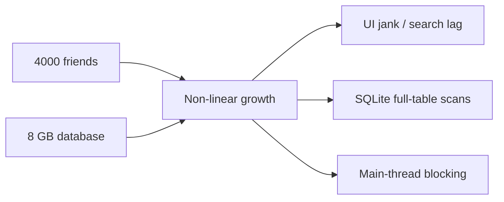

# Performance Analysis

> **Baseline assumption:** ~4000 friends, ~8 GB SQLite database. All bottlenecks discussed below are non-linear — they do **not** degrade gracefully as data grows.

## Overview

VRCX is designed for social VR power-users who often accumulate thousands of friends and years of game-log history. While most features work well during early use, several hot paths exhibit **quadratic (O(n²))**, **full-table-scan**, or **repeated linear-scan** behaviour that can cause visible UI degradation at scale.



---

## Bottleneck 1 — `findUserByDisplayName` Linear Scan

### Location

`src/shared/utils/user.js` line 280

```javascript
function findUserByDisplayName(cachedUsers, displayName) {
    for (const ref of cachedUsers.values()) {  // O(n) scan
        if (ref.displayName === displayName) {
            return ref;
        }
    }
    return undefined;
}
```

### Call-Site Inventory

| Call site | File | Trigger frequency |
|-----------|------|-------------------|
| Player-join event | `gameLogCoordinator.js:89` | **High** — every room join |
| Player-join log | `gameLogCoordinator.js:162` | **High** — same |
| External message | `gameLogCoordinator.js:409` | Medium |
| Video play parser | `mediaParsers.js:142` | Medium |
| Resource load parsers | `mediaParsers.js:210, 273, 330, 387` | **High** — 5 call sites |
| Notification handler | `notification/index.js:1021, 1087` | Medium |
| User coordinator | `userCoordinator.js:635` | Low |

### Complexity

- Single call: **O(n)** where n = `cachedUsers.size` (typically 4000–8000)
- Joining a full 80-player instance: 80 join events × O(n) = **O(80 n)**
- With `mediaParsers` multiplier: each log event may call `findUserByDisplayName` multiple times
- Worst case (join a full room): **~400,000 string comparisons**

### Severity: 🔴 Critical

Highest-priority fix. This single function is responsible for the largest share of avoidable CPU work during real-time event processing.

### Future Direction

Build a reverse-index `Map<displayName, ref>` inside `userStore`, maintained alongside `cachedUsers`:

```javascript
// In user store
const displayNameIndex = new Map(); // displayName → ref

// Maintained inside applyUser():
// displayNameIndex.set(ref.displayName, ref);

// O(1) lookup:
function findUserByDisplayName(cachedUsers, displayName) {
    return displayNameIndex.get(displayName);
}
```

::: warning Note
Display names are **not unique** across VRChat users, but the current implementation already returns the first match. A reverse-index preserves this same semantic.
:::

---

## Bottleneck 2 — GameLog / Notification Database Search

### Location

- `src/services/database/gameLog.js` line 984 (`searchGameLogDatabase`)
- `src/services/database/notifications.js` line 77 (`lookupNotificationDatabase`)

### Problem

Both functions use `LIKE '%search%'` patterns against multiple columns, which **cannot use B-tree indexes** and always triggers a full table scan:

```sql
-- gameLog.js: repeated across 7 tables, UNION ALL'd
SELECT * FROM (
    SELECT ... FROM gamelog_location
    WHERE world_name LIKE @searchLike   -- full scan
    ORDER BY id DESC LIMIT @perTable
)
UNION ALL
SELECT * FROM (
    SELECT ... FROM gamelog_join_leave
    WHERE display_name LIKE @searchLike -- full scan
    ORDER BY id DESC LIMIT @perTable
)
-- ... 5 more UNION ALL blocks
```

```sql
-- notifications.js: raw string interpolation
WHERE (sender_username LIKE '%${search}%'
    OR message LIKE '%${search}%'
    OR world_name LIKE '%${search}%')
```

### Complexity

| Parameter | Estimated value |
|-----------|----------------|
| `gamelog_join_leave` rows | ~5,000,000 (years of play) |
| `gamelog_location` rows | ~500,000 |
| Total tables scanned | 7 (UNION ALL) |
| Scans per search keystroke | 7 × full scan per table |

With `LIKE '%xxx%'`, SQLite must examine **every row** in every table. At 8 GB database size, each search can scan **millions of rows**.

### Additional Issue — SQL Injection

`notifications.js` line 77 uses **raw string interpolation** instead of parameterized queries:

```javascript
// ⚠️ SQL injection vulnerability
`WHERE (sender_username LIKE '%${search}%' ...)`
```

While line 38 does `search.replaceAll("'", "''")`, this is **not a complete defence** against all injection vectors.

### Severity: 🔴 Critical

The performance of search degrades proportionally with database age and size. Users who have run VRCX for years will experience the worst slowdowns.

### Future Direction

**Option A — SQLite FTS5 (Full-Text Search)**

```sql
-- Create FTS table alongside existing tables
CREATE VIRTUAL TABLE gamelog_fts USING fts5(
    display_name, world_name, content='gamelog_join_leave'
);

-- Search becomes O(log n) via inverted index
SELECT * FROM gamelog_fts WHERE gamelog_fts MATCH 'searchterm';
```

- Pros: Orders of magnitude faster for text search; built into SQLite
- Cons: Requires schema migration, FTS tables add ~30% storage overhead, and all inserts must also update the FTS index

**Option B — Prefix-only LIKE (`LIKE 'xxx%'`)**

If full-text search is not needed, dropping the leading `%` allows B-tree index usage:

```sql
WHERE display_name LIKE 'search%'  -- Can use index
```

- Pros: Zero migration; just change the query
- Cons: Only matches prefixes, not substrings — changes user-visible behaviour

**Option C — Application-layer search index**

Build an in-memory trie or inverted index when the search dialog opens, populated from a single `SELECT` query. Subsequent keystrokes search the in-memory index.

- Pros: Extremely fast after initial load; no DB schema changes
- Cons: Memory overhead; stale data until re-indexed

::: tip Recommendation
Option A (FTS5) is the strategic choice. Option C is the pragmatic short-term choice when FTS migration is not feasible.
:::

---

## Bottleneck 3 — Mutual Friends Graph O(n²)

### Location

`src/views/Charts/components/MutualFriends.vue` line 827 (`buildGraphFromMutualMap`)

### Structure

```javascript
for (const [friendId, { friend, mutuals }] of mutualMap.entries()) {
    ensureNode(friendId, ...);
    for (const mutual of mutuals) {       // inner loop
        ensureNode(mutual.id, ...);
        addEdge(friendId, mutual.id);     // edge creation per pair
    }
}
```

### Complexity

- Let N = friend count, M = average mutual-friend count per friend
- Edge creation: **O(N × M)**
- In dense social graphs (friend groups): M approaches N → **O(N²)**
- Graph layout (`forceAtlas2.assign`): already in Web Worker, but grows **super-linearly** with edge count

### Measured Scale

| Friends | Estimated edges | Build time (approx.) |
|---------|----------------|----------------------|
| 100 | ~2,000 | < 1s |
| 500 | ~50,000 | ~3s |
| 2000 | ~800,000 | ~30s+ |
| 4000 | ~3,200,000 | potentially minutes |

### Severity: 🟡 Medium

The graph layout is already in a Web Worker (does not block UI). The graph build itself runs on the main thread but uses hash-based dedup (`graph.hasEdge`). Still, at 4000 friends the volume of edges becomes problematic.

### Future Direction

1. **Pre-filter by community**: Before building the full graph, cluster friends by world/group affinity, then only build sub-graphs. This reduces N per sub-graph dramatically.

2. **Incremental layout**: Cache previous layout positions and only re-layout when the graph changes (new friend added/removed), using the previous layout as initial positions.

3. **Cap graph size**: Add a configurable threshold (e.g., max 500 nodes). Provide UI to filter by friend group before graph generation.

4. **Move graph construction to Worker**: Move `buildGraphFromMutualMap` into the existing `graphLayoutWorker`, so both construction and layout are off the main thread.

---

## Bottleneck 4 — Friend List Repeated Sort/Filter

### Location

`src/stores/friend.js` lines 79–165

### Structure

Five `computed` properties each create a **new array copy** and sort it:

```javascript
const vipFriends = computed(() =>
    Array.from(friends.values())       // O(n) copy
        .filter(f => f.isVIP)          // O(n)
        .sort(sortFn)                  // O(n log n)
);
const onlineFriends = computed(...)    // same pattern
const activeFriends = computed(...)    // same pattern
const offlineFriends = computed(...)   // same pattern
const allFriends = computed(...)       // same pattern
```

### Complexity

- Any friend property change invalidates `friends` (reactive Map)
- This triggers **all 5 computed** to re-evaluate: 5 × (O(n) + O(n log n))
- With 4000 friends: 5 × 4000 × log₂(4000) ≈ **240,000 comparisons**
- Frequent triggers: friend online/offline events during peak hours

### Severity: 🟡 Medium

Vue's computed caching prevents redundant evaluation when dependencies haven't changed, but the `friends` Map is highly volatile — any friend state change (status, location, platform) invalidates all watchers.

### Future Direction

1. **Partition-based caching**: Instead of filtering from the full list, maintain separate `Set`s (`vipIds`, `onlineIds`, etc.) that update incrementally when individual friend states change.

2. **Single sorted array + views**: Sort the full list once, then use binary search or offsets to create category views without re-sorting.

3. **`shallowRef` arrays with manual diffing**: Track only the final sorted array, and only re-sort when the sort order actually changes (not every friend update).

---

## Bottleneck 5 — Quick Search Main-Thread Traversal

### Location

`src/stores/search.js` line 113 (`quickSearchRemoteMethod`)

### Problem

The legacy quick search iterates **all friends** on the main thread for each keystroke:

```javascript
for (const ctx of friendStore.friends.values()) {
    // removeConfusables() + localeIncludes() per friend
}
```

While the new **Global Search** (`globalSearch.js` + `searchWorker.js`) uses a Web Worker, the **Quick Search** in the top bar still runs on the main thread.

### Additional Concern — Deep Watchers in globalSearch.js

```javascript
// 6 deep watchers, each triggering full data serialization to worker
watch(() => friendStore.friends, () => scheduleIndexUpdate(), { deep: true });
watch(() => avatarStore.cachedAvatars, () => scheduleIndexUpdate(), { deep: true });
// ... 4 more
```

Each `deep: true` watcher on a large reactive `Map` triggers Vue's internal deep traversal (visiting every nested property), then `sendIndexUpdate()` serializes **all data** to the worker via `postMessage`. The 200ms debounce mitigates frequency, but the serialization cost is O(total data size).

### Severity: 🟡 Medium

Quick Search is debounced and capped at 4 results, limiting the visible impact. But with 4000 friends, each keystroke may process 4000 × `removeConfusables` calls.

### Future Direction

1. **Merge Quick Search into the Worker**: Route Quick Search queries through the existing `searchWorker` instead of duplicating logic on the main thread.

2. **Replace deep watchers with targeted change tracking**: Instead of deep-watching entire Maps, listen to specific mutation events and only send delta updates to the worker.

---

## Bottleneck 6 — SharedFeed `unshift` + Deep Watch

### Location

`src/stores/sharedFeed.js` line 31 (`rebuildOnPlayerJoining`)

### Problem

```javascript
// Array.unshift is O(n) — shifts all existing elements
onPlayerJoining.unshift(newEntry);
```

Combined with any `deep: true` watchers on the feed array, this creates a pattern where **every new event** causes O(n) element shifting **plus** a full deep-traversal of the array by Vue's reactivity system.

### Severity: 🟢 Low

The `maxEntries` cap limits array size. In practice this is not a major bottleneck, but the pattern is suboptimal.

### Future Direction

1. **Ring buffer**: Use a fixed-size circular buffer instead of `unshift`. New entries overwrite the oldest entry without shifting.

2. **`shallowRef` + manual trigger**: Use `shallowRef([])` for the feed array and call `triggerRef()` after mutation, avoiding Vue's deep traversal.

---

## Supplementary Finding — Instance Store Full Friend Traversal

### Location

`src/stores/instance.js` lines 74–91, 786, 991

### Problem

```javascript
// cleanInstanceCache: called on every applyInstance()
const friendLocationTags = new Set(
    [...friendStore.friends.values()]      // spread 4000 friends
        .map(f => f.$location?.tag)
        .filter(Boolean)
);
```

```javascript
// vrcxCoordinator.js line 62-74: O(instances × friends)
instanceStore.cachedInstances.forEach((ref, id) => {
    if ([...friendStore.friends.values()].some(   // spread AGAIN per instance
        (f) => f.$location?.tag === id
    )) { return; }
});
```

### Complexity

- `cleanInstanceCache`: O(friends) per instance apply — called frequently
- `clearVRCXCache` instance loop: O(instances × friends) — called infrequently but O(n×m) is wasteful

### Severity: 🟡 Medium (instance cache) / 🟢 Low (clearVRCXCache)

### Future Direction

Maintain a reactive `Set<tag>` of current friend location tags, updated incrementally when friends change location. Both functions can then use O(1) lookups.

---

## Priority Matrix

| Priority | Bottleneck | Complexity class | User impact | Fix difficulty |
|----------|-----------|-----------------|-------------|---------------|
| **P0** | `findUserByDisplayName` linear scan | O(n) × high-freq | 🔴 Critical | ⭐ Easy |
| **P1** | GameLog/notification `LIKE '%x%'` | O(rows) full scan | 🔴 Critical | ⭐⭐ Medium |
| **P1** | `notifications.js` SQL injection | Security | 🔴 Critical | ⭐ Easy |
| **P2** | Friend list 5× sort recompute | 5 × O(n log n) | 🟡 Medium | ⭐⭐ Medium |
| **P2** | globalSearch deep watcher serialization | O(all data) | 🟡 Medium | ⭐⭐ Medium |
| **P3** | Instance cache full friend traversal | O(friends) per call | 🟡 Medium | ⭐ Easy |
| **P3** | Mutual Friends graph O(n²) | O(n²) edges | 🟡 Medium | ⭐⭐⭐ Hard |
| **P4** | SharedFeed unshift | O(entries) | 🟢 Low | ⭐ Easy |
| **P4** | clearVRCXCache nested iteration | O(instances × friends) | 🟢 Low | ⭐ Easy |

---

## Non-Linear Scaling Projection

The following chart illustrates how processing cost grows **non-linearly** with friend count for the key bottlenecks:

```
Processing cost (arbitrary units)
│
│                                    ╱ Graph O(n²)
│                                  ╱
│                               ╱
│                            ╱
│                         ╱
│                      ╱          ╱ 5× sort O(n log n)
│                   ╱          ╱
│                ╱          ╱
│             ╱         ╱         ╱ Linear scan O(n)
│          ╱        ╱          ╱
│       ╱       ╱           ╱
│    ╱      ╱            ╱
│ ╱    ╱             ╱
├──────────────────────────── Friend count
0   500  1000  2000  3000  4000
```

**Key insight:** At 4000 friends, the O(n²) graph is **16× slower** than at 1000 friends, not 4×. The linear scans are 4× slower, but they run on **every event**, so total CPU time grows multiplicatively with event rate.
