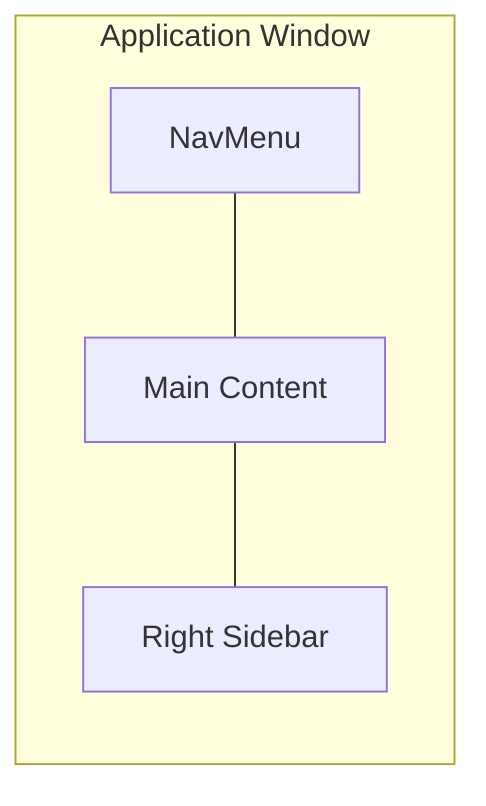

# Layout Strategy

## Current Layout Architecture



**Key layout facts:**
- `ResizablePanelGroup` with auto-save to localStorage
- Right sidebar collapsible (0px) via toggle or drag
- NavMenu collapsible to icon-only (48px)
- `KeepAlive` preserves component state when switching routes (excludes Charts)
- 14 global dialogs render in portal outside layout

## Current Component Sizing

| Component | Default | Min | Max | Behavior |
|-----------|---------|-----|-----|----------|
| NavMenu | ~200px | 48px (icon-only) | ~200px | Collapse to icons |
| Main Content | 75% | — | — | Flexible |
| Right Sidebar | 25% | 12% | 700px | Collapsible to 0 |
| FriendsLocations Cards | 100% scale | 50% scale | 100% | User-configurable |
| FriendsLocations Spacing | 100% | 25% | 100% | User-configurable |

## Sidebar Current Features

```
┌─ Search (Ctrl+K / ⌘K) ───────────────┐
├─ [Refresh] [Notifications 🔔] [⚙️] ──┤
├─ Tabs: [Friends (X/Y)] [Groups (Z)] ─┤
│                                        │
│  ★ VIP Friends (favorite groups)      │
│  ● Online Friends                      │
│  ◐ Active Friends                      │
│  ○ Offline Friends                     │
│  ▣ Same Instance Groups (optional)    │
│                                        │
│  Settings: 7 sort methods             │
│  Group by instance (toggle)            │
│  Split by favorite group (toggle)     │
└────────────────────────────────────────┘
```

**Sort options**: Alphabetical, by Status, Private to Bottom, Last Active, Last Seen, Time in Instance, by Location

## Design Principles

### Principle 1: Progressive Enhancement

> Design for the **smallest viable viewport first**, then add complexity for larger screens.

| Viewport | Strategy |
|----------|----------|
| Small (400-600px) | Show only essential info: friend count, online status, name. Hide secondary data. |
| Medium (600-1000px) | Add location info, status details, friend cards. |
| Large (1000px+) | Full experience: multi-column layouts, all data visible, charts, dashboards. |

### Principle 2: Information Density Control

> Users should control how much info they see, not be forced into one density.

Current mechanisms:
- Card scale slider (50-100%) in FriendsLocations
- Card spacing slider (25-100%)
- Table density setting (from NavMenu theme dropdown)
- Collapsible sidebar
- Collapsible NavMenu
- Collapsible favorite groups in FriendsLocations

### Principle 3: Route-Based Not Panel-Based

> Major features live in routes (tabs), not in sidebar panels. The sidebar is for **quick glance** only.

This means:
- Sidebar should stay lightweight (friend list + basic status)
- Complex features (FriendsLocations, GameLog, Charts) are full-page routes
- Dialogs handle deep-dives (UserDialog with 11 tabs, GroupDialog with 12+ tabs)

### Principle 4: Degraded VR Mode

> VR mode is a **separate app** with minimal functionality. Don't try to make desktop features work in VR.

VR mode has:
- Separate entry point (`vr.js`)
- No Pinia, no Vue Query
- Only friend locations on wrist overlay
- Design specifically for glance interaction

## Layout Decision Framework

When considering a new layout change, answer these questions:

```
1. Who benefits?
   □ All personas     → Worth doing
   □ Only power users → Must not hurt others
   □ Only large window → Must degrade gracefully
   □ Only VR          → Separate consideration

2. What happens at 400px width?
   □ Still usable     → ✅ Good
   □ Hidden/collapsed → ✅ Acceptable
   □ Broken           → ❌ Redesign needed

3. Does it add UI complexity?
   □ No new controls  → ✅ Simple
   □ New toggle/setting → 🔶 Consider if really needed
   □ New panel/tab    → ⚠️ High cost — justify carefully

4. Where does it live?
   □ In sidebar       → Must be glance-friendly
   □ In a route       → Can be complex
   □ In a dialog      → Best for deep-dives
   □ New panel        → Avoid — use existing route or dialog
```

## Current Pain Points & Options

### Sidebar: Too Complex Yet Not Enough Info

**Problem**: Users want more info in sidebar (e.g., show same-instance friends in favorites), but sidebar is already dense and small-window users suffer.

**Options**:
| Option | Pros | Cons |
|--------|------|------|
| A. Add toggleable sections | Users choose what to see | More settings complexity, code complexity |
| B. Enhance FriendsLocations instead | Full-page has room | Doesn't help sidebar-focused users |
| C. Compact cards with expandable details | Best of both worlds | Complex implementation |
| D. Do nothing — keep sidebar simple | Less code to maintain | Users keep asking |

### FriendsLocations: Tab vs Dashboard

**Problem**: FriendsLocations is a route/tab. Users want it as the main view or as a customizable dashboard.

**Options**:
| Option | Pros | Cons |
|--------|------|------|
| A. Make FriendsLocations the default route | Most useful page for many | Feed users lose their default |
| B. Allow user to pick default route | Everyone happy | One more setting |
| C. Build custom dashboard view | Maximum flexibility | Massive implementation cost, only for power + large window users |
| D. Add widgets to FriendsLocations | Incremental improvement | May become too complex |

### Same-Instance Friends: Where to Show

**Problem**: Same-instance grouping exists in both Sidebar and FriendsLocations with separate toggles. Users want it visible in favorites too.

**Options**:
| Option | Pros | Cons |
|--------|------|------|
| A. Show in sidebar favorites section | Visible at a glance | Sidebar gets denser, duplicated info |
| B. Add indicator badge instead of full display | Compact, informative | Less detail |
| C. Keep in FriendsLocations only | Clean sidebar | Users must switch tabs |
