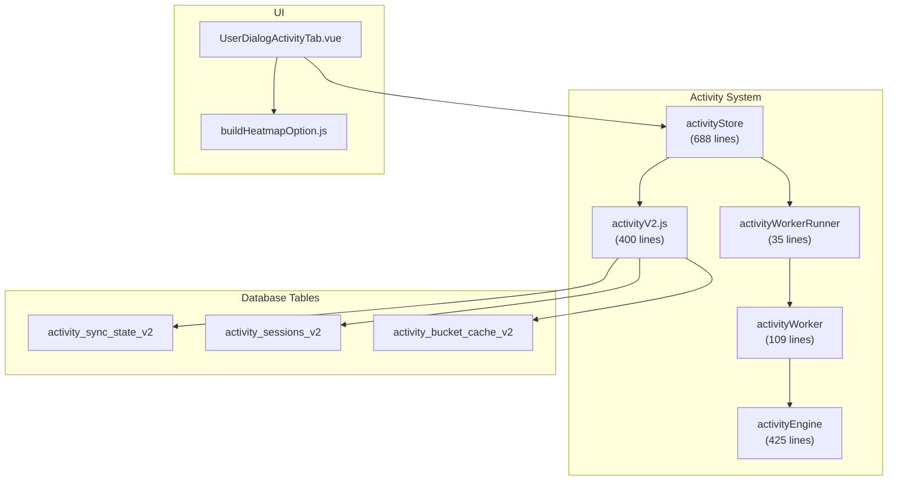
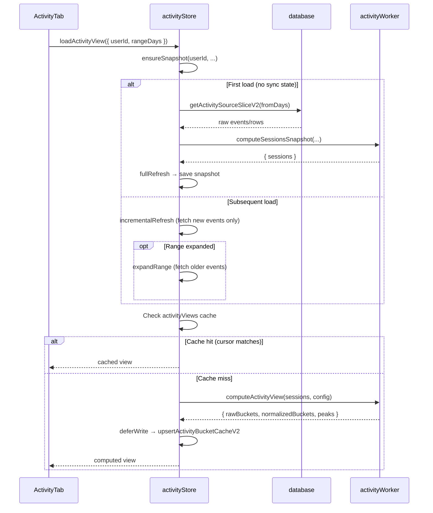

# Activity System

The Activity System provides heatmap visualizations and overlap analysis for user online activity. It processes raw database events into sessions, computes 7×24 heatmap buckets, and renders ECharts heatmaps — all through a three-layer architecture that keeps the main thread responsive.



## Overview


## Architecture

The system uses three layers to separate concerns:

| Layer | File | Responsibility |
|-------|------|----------------|
| **Store** | `stores/activity.js` | State management, snapshot caching, in-flight job deduplication, cache invalidation |
| **Engine** | `shared/utils/activityEngine.js` | Pure functions: session building, bucket computation, normalization, peak detection |
| **Worker** | `workers/activityWorker.js` | Runs engine functions off the main thread via `postMessage` |

### Worker Communication

`activityWorkerRunner.js` wraps the raw Worker API in a Promise-based interface:

```js
// Singleton lazy-init worker
let worker = null;
let workerSeq = 0;
const pendingWorkerCallbacks = new Map();

export function runActivityWorkerTask(type, payload) {
    return new Promise((resolve, reject) => {
        const seq = ++workerSeq;
        pendingWorkerCallbacks.set(seq, { resolve, reject });
        getWorker().postMessage({ type, seq, payload });
    });
}
```

The worker supports these message types:

| Type | Input | Output |
|------|-------|--------|
| `computeSessionsSnapshot` | Raw events/rows | `{ sessions, pendingSessionStartAt }` |
| `computeActivityView` | Sessions + config | Heatmap buckets + peaks |
| `computeOverlapView` | Self + target sessions | Overlap buckets + percent |
| `buildSessionsFromGamelog` | Gamelog rows | `{ sessions }` |
| `buildSessionsFromEvents` | Online/offline events | `{ sessions, pendingSessionStartAt }` |
| `buildHeatmapBuckets` | Sessions + window | `{ buckets }` |
| `buildOverlapBuckets` | Two session arrays | `{ buckets }` |
| `normalizeHeatmapBuckets` | Raw buckets + config | `{ normalized }` |

## Data Source Differences

The system handles two fundamentally different data sources depending on whether the viewed user is the current user or a friend:

| Aspect | Self (Current User) | Friend |
|--------|-------------------|--------|
| **Source Table** | `gamelog_location` (join/leave timestamps) | `feed_online_offline` (online/offline events) |
| **Session Builder** | `buildSessionsFromGamelog()` | `buildSessionsFromEvents()` |
| **Granularity** | Per-instance session accuracy | Online/offline transitions only |
| **Open Tail** | Last session may be open (still in-game) | No open tail concept |
| **Pending Start** | N/A | Tracks `pendingSessionStartAt` for incomplete sessions |

## Session Snapshot System

The store maintains an in-memory LRU cache of session snapshots:

```js
const snapshotMap = new Map();  // userId → snapshot
const MAX_SNAPSHOT_ENTRIES = 12;
```

### Snapshot Structure

```js
{
    userId: string,
    isSelf: boolean,
    sync: {
        userId: string,
        updatedAt: string,         // ISO timestamp of last refresh
        isSelf: boolean,
        sourceLastCreatedAt: string, // cursor for incremental updates
        pendingSessionStartAt: number | null,
        cachedRangeDays: number    // max range already fetched
    },
    sessions: Array<{ start, end, isOpenTail, sourceRevision }>,
    activityViews: Map,   // rangeDays → computed view
    overlapViews: Map     // cacheKey → computed view
}
```

### LRU Eviction

Snapshots use insertion-order eviction via `Map.delete()` + `Map.set()` (touch on access). The oldest untouched, non-in-flight snapshot is evicted when the cache exceeds 12 entries.

### In-Flight Job Deduplication

Concurrent requests for the same user/range are deduplicated via `inFlightJobs` Map. The job key format is `${userId}:${isSelf}:${rangeDays}:${force|normal}`.

## Data Flow

### Loading Activity Heatmap



### Three Refresh Strategies

| Strategy | When | What It Does |
|----------|------|-------------|
| **Full Refresh** | First load or force refresh | Fetches all source data for `rangeDays`, builds sessions from scratch |
| **Incremental Refresh** | Subsequent loads | Fetches only events after `sourceLastCreatedAt`, merges new sessions |
| **Range Expansion** | User selects longer period | Fetches events from `cachedRangeDays` to `rangeDays`, prepends older sessions |

### Deferred Writes

Database writes (session persistence, sync state updates) are queued through `deferWrite()` which uses `requestIdleCallback` (with `setTimeout(0)` fallback) to avoid blocking the UI:

```js
function deferWrite(task) {
    const run = () => {
        deferredWriteQueue = deferredWriteQueue
            .catch(() => {})
            .then(task)
            .catch((error) => { ... });
    };
    if (typeof requestIdleCallback === 'function') {
        requestIdleCallback(run);
        return;
    }
    setTimeout(run, 0);
}
```

## Overlap Analysis

The overlap view compares two users' session data to find when they were both online:

1. Both users' snapshots are loaded in parallel via `ensureSnapshot`
2. Cache key includes `targetUserId:rangeDays:excludeKey`
3. Cursor is a pair: `selfCursor|targetCursor`
4. Worker computes `buildOverlapBuckets()` → intersection of two session arrays
5. Results include `overlapPercent` and `bestOverlapTime`

### Exclude Hours

Users can exclude specific hour ranges (e.g., sleeping hours) from overlap analysis. This is encoded as an `excludeKey` (`startHour-endHour`) in the cache key, ensuring different exclusion settings produce different cache entries.

## Normalization Algorithm

Raw bucket values (minutes per hour-slot) are normalized to 0–1 for heatmap coloring using `normalizeBuckets()`:

### Configuration Parameters

```js
{
    floorPercentile: 15,    // values below this percentile → 0
    capPercentile: 85,      // values above this percentile → 1
    rankWeight: 0.2,        // blend weight for rank-based scoring
    targetCoverage: 0.25,   // target % of non-zero cells
    targetVolume: 60        // target total "visual weight"
}
```

These parameters are tuned per role (self vs friend) and per range (7/30/90 days) via `pickActivityNormalizeConfig()` and `pickOverlapNormalizeConfig()`.

## Database Schema (V2)

Three tables per user, prefixed with `{userPrefix}_`:

### `activity_sync_state_v2`

| Column | Type | Purpose |
|--------|------|---------|
| `user_id` | TEXT PK | Target user |
| `updated_at` | TEXT | Last refresh timestamp |
| `is_self` | INTEGER | Whether this is the current user's data |
| `source_last_created_at` | TEXT | Cursor for incremental updates |
| `pending_session_start_at` | INTEGER | Incomplete session start (friends only) |
| `cached_range_days` | INTEGER | Max range already fetched |

### `activity_sessions_v2`

| Column | Type | Purpose |
|--------|------|---------|
| `session_id` | INTEGER PK AUTO | Primary key |
| `user_id` | TEXT | Target user |
| `start_at` | INTEGER | Session start timestamp (ms) |
| `end_at` | INTEGER | Session end timestamp (ms) |
| `is_open_tail` | INTEGER | Whether session is still active |
| `source_revision` | TEXT | Source data cursor at build time |

Indexes: `(user_id, start_at)`, `(user_id, end_at)`

### `activity_bucket_cache_v2`

| Column | Type | Purpose |
|--------|------|---------|
| `user_id` | TEXT | Owner user |
| `target_user_id` | TEXT | Target user (empty for activity view) |
| `range_days` | INTEGER | Time range |
| `view_kind` | TEXT | `'activity'` or `'overlap'` |
| `exclude_key` | TEXT | Exclude hours key |
| `bucket_version` | INTEGER | Schema version |
| `raw_buckets_json` | TEXT | Raw minute values (168 slots) |
| `normalized_buckets_json` | TEXT | Normalized 0–1 values |
| `built_from_cursor` | TEXT | Source cursor at build time |
| `summary_json` | TEXT | Peaks / overlap stats |
| `built_at` | TEXT | Build timestamp |

Primary Key: `(user_id, target_user_id, range_days, view_kind, exclude_key)`

## Heatmap Rendering

`buildHeatmapOption.js` generates ECharts configuration for the 7×24 heatmap:

- **Grid**: 7 rows (days) × 24 columns (hours)
- **Color Scale**: 6-level piecewise (`0`, `0–0.2`, `0.2–0.4`, `0.4–0.6`, `0.6–0.8`, `0.8–1`)
- **Week Start**: Configurable via `weekStartsOn` parameter
- **Dark Mode**: Adapts border and emphasis colors
- **Tooltip**: Shows raw minutes for each cell

## Features

| Feature | Details |
|---------|---------|
| **Activity Heatmap** | 7×24 grid showing online frequency by day × hour |
| **Overlap Charts** | Compare online times between current user and any friend |
| **Top Worlds** | Ranked list of most-visited worlds (by time or visit count) |
| **Peak Stats** | Most active day and most active time slot |
| **Period Filter** | 7, 30, 90, 180 days |
| **Exclude Hours** | Filter out sleeping/inactive hours from overlap analysis |
| **Context Menu** | Right-click to save chart as PNG |
| **Empty State** | Shows `DataTableEmpty` when no data found |

## File Map

| File | Lines | Purpose |
|------|-------|---------|
| `stores/activity.js` | 688 | Pinia store: snapshot caching, job dedup, load orchestration |
| `shared/utils/activityEngine.js` | 425 | Pure functions: session building, bucket computation, normalization |
| `workers/activityWorker.js` | 109 | Web Worker message handler |
| `workers/activityWorkerRunner.js` | 35 | Promise-based worker communication wrapper |
| `services/database/activityV2.js` | 400 | Database CRUD for V2 schema |
| `components/dialogs/UserDialog/activity/buildHeatmapOption.js` | 99 | ECharts heatmap config builder |
| `components/dialogs/UserDialog/UserDialogActivityTab.vue` | ~600 | Activity tab UI component |

## Risks & Gotchas

- **Snapshot LRU eviction skips in-flight jobs.** If all 12 snapshot slots are occupied by in-flight requests, the cache will temporarily exceed its limit.
- **`deferWrite()` is fire-and-forget.** Write failures are logged but do not affect the UI. This means the database may lag behind the in-memory state after errors.
- **Self vs friend data asymmetry.** Self data uses gamelog (per-instance), friend data uses feed events (online/offline only). The same heatmap UI shows fundamentally different granularity.
- **`mergeGapMs` (5 minutes) affects session accuracy.** Events within 5 minutes of each other are merged into a single session. This is a deliberate trade-off between visual noise and precision.
- **Normalization is role-aware.** Different `pickActivityNormalizeConfig` presets for self vs friend mean the same raw data may produce different visual results depending on who is viewing.
- **Worker is shared.** All activity computations share a single Worker instance. A very large computation (e.g., 180 days of data) will block subsequent requests until it completes.
