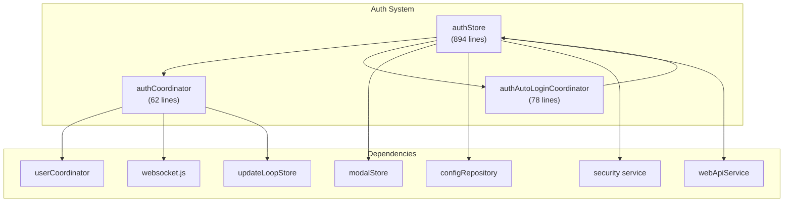
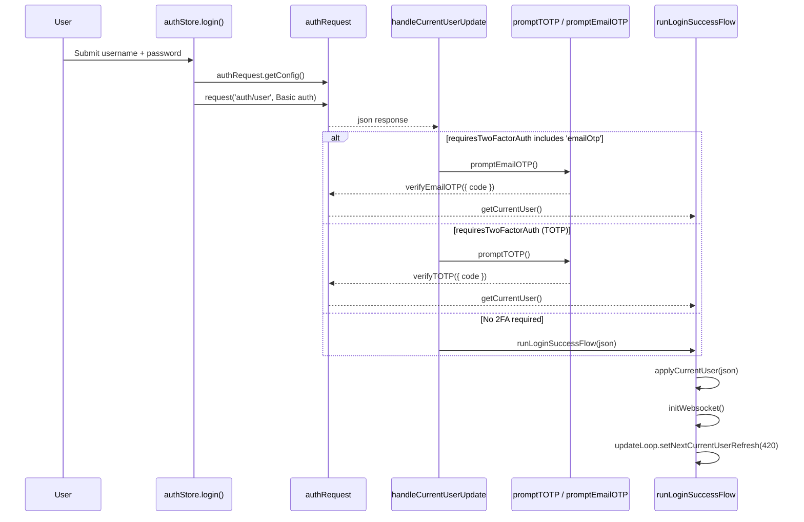
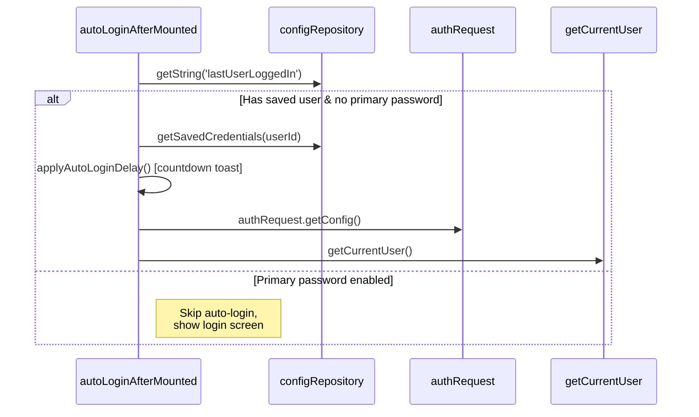
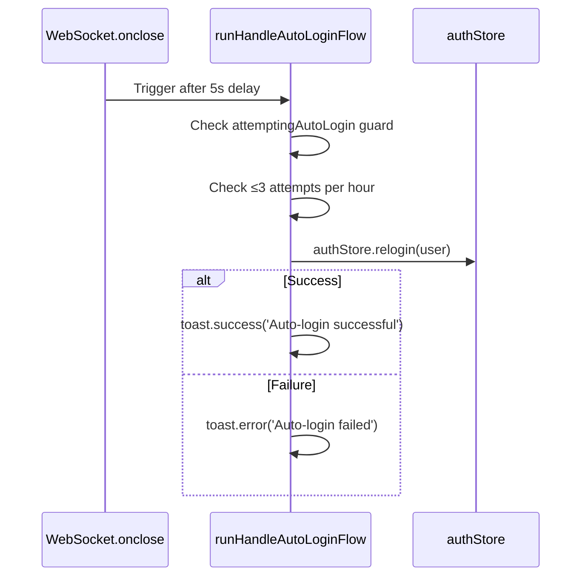
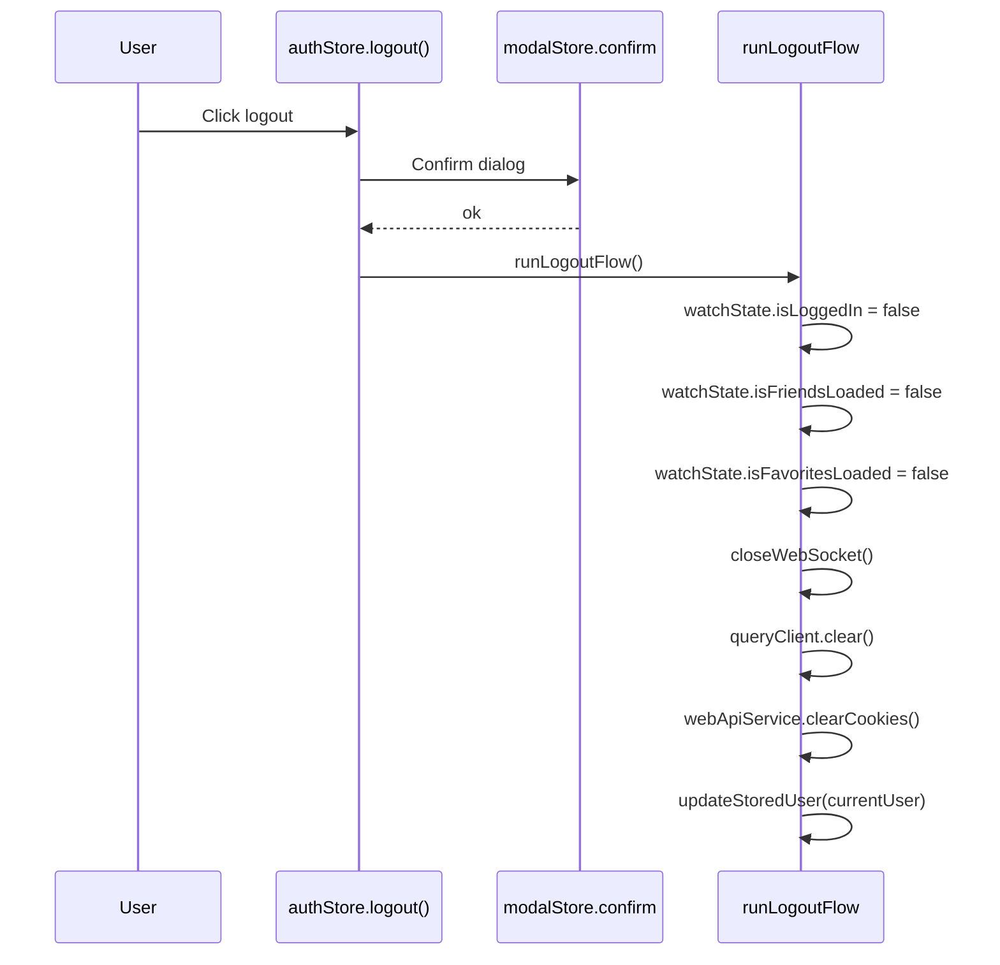

# Auth System

The Auth System manages the full authentication lifecycle for VRCX, including manual login, auto-login, credential persistence, two-factor authentication (2FA), primary password encryption, and logout. It is the first system that activates on app launch and gates all other subsystems behind `watchState.isLoggedIn`.



## Overview


## State Shape

```js
// loginForm — persisted selection state
loginForm: {
    loading: false,         // true during any auth request
    username: '',
    password: '',
    endpoint: '',           // custom API endpoint (optional)
    websocket: '',          // custom WS endpoint (optional)
    saveCredentials: false, // whether to persist credentials
    lastUserLoggedIn: ''    // userId of last successful login
}

// enablePrimaryPasswordDialog — modal for setting primary password
enablePrimaryPasswordDialog: {
    visible: false,
    password: '',
    rePassword: ''
}

// Other reactive state
credentialsToSave: null,            // pending credentials to persist
twoFactorAuthDialogVisible: false,  // 2FA modal active
cachedConfig: {},                   // latest VRC config payload
enableCustomEndpoint: false,        // custom API toggle
attemptingAutoLogin: false          // auto-login guard flag
```

## Authentication Flows

### Manual Login



**Key details:**
- Credentials are encoded via `btoa(encodeURIComponent(username):encodeURIComponent(password))` as Basic Auth
- If `saveCredentials` is enabled with primary password, an additional encrypt step wraps the password via `security.encrypt()`
- The `credentialsToSave` ref acts as a "pending write" that gets consumed by `updateStoredUser()` after login success

### Auto-Login at Startup



### Auto-Login on Disconnect (WebSocket close)

When the WebSocket closes unexpectedly and login state is still valid:



**Rate limiting:** Maximum 3 auto-login attempts within a 1-hour rolling window. Timestamps are stored in `state.autoLoginAttempts` (a `Set`).

### Login Complete

```js
async function loginComplete() {
    await database.initUserTables(userStore.currentUser.id);
    watchState.isLoggedIn = true;         // triggers all store watchers
    AppApi.CheckGameRunning();            // restore state from hot-reload
}
```

Setting `watchState.isLoggedIn = true` is the **master trigger** that activates:
- Friend sync (`friendSyncCoordinator`)
- Notification init
- GameLog processing
- Favorite loading
- Group initialization
- All other subsystems that watch `watchState.isLoggedIn`

### Logout



## Two-Factor Authentication

VRCX supports three 2FA methods, each using the shared `modalStore.otpPrompt()` dialog:

| Method | Function | API Endpoint | Code Format |
|--------|----------|-------------|-------------|
| TOTP (Authenticator App) | `promptTOTP()` | `verifyTOTP` | 6-digit code |
| Recovery OTP | `promptOTP()` | `verifyOTP` | 8-char, formatted as `XXXX-XXXX` |
| Email OTP | `promptEmailOTP()` | `verifyEmailOTP` | Code from email |

**Flow between methods:**
- TOTP dialog has "Use Recovery Code" button → switches to OTP
- OTP dialog has "Use Authenticator" button → switches to TOTP
- Email OTP dialog has "Resend" button → calls `resendEmail2fa()` which clears cookies and re-triggers login

## Credential Management

### Storage Structure

Credentials are stored in `configRepository` (SQLite) under the key `savedCredentials`:

```json
{
    "usr_xxxx": {
        "user": { "id": "usr_xxxx", "displayName": "...", ... },
        "loginParams": {
            "username": "user@example.com",
            "password": "plaintext-or-encrypted",
            "endpoint": "",
            "websocket": ""
        },
        "cookies": "..."
    }
}
```

### Primary Password Encryption

When `enablePrimaryPassword` is true:
1. **Login:** User is prompted for primary password → `security.decrypt(storedPassword, primaryPassword)` → actual password used for auth
2. **Save:** `security.encrypt(actualPassword, primaryPassword)` → stored as cipher text
3. **Disable:** User enters primary password → all stored passwords are decrypted and re-saved as plaintext
4. **Impact:** Primary password **disables auto-login** entirely

### Migration

`migrateStoredUsers()` handles legacy data where credentials were keyed by username instead of userId. It re-keys entries so all credentials use `usr_xxxx` format.

## Custom API Endpoint

For development/testing, users can toggle `enableCustomEndpoint` to specify:
- Custom REST API endpoint (replaces `api.vrchat.cloud`)
- Custom WebSocket endpoint

These are stored in `AppDebug.endpointDomain` / `AppDebug.websocketDomain` and applied before any login attempt.

## File Map

| File | Lines | Purpose |
|------|-------|---------|
| `stores/auth.js` | 894 | All auth state, login/logout, 2FA prompts, credential management |
| `coordinators/authCoordinator.js` | 62 | `runLogoutFlow()`, `runLoginSuccessFlow()` |
| `coordinators/authAutoLoginCoordinator.js` | 78 | `runHandleAutoLoginFlow()` with rate limiting |
| `services/security.js` | — | Encrypt/decrypt via Web Crypto API |
| `services/webapi.js` | — | Cookie management, clearCookies, setCookies |
| `services/config.js` | — | SQLite-backed key-value persistence |

## Key Dependencies

| Auth touches | Direction | Purpose |
|-------------|-----------|---------|
| `userCoordinator` | out → | `applyCurrentUser()` on login success |
| `updateLoopStore` | out → | Schedule next user refresh (7min) |
| `websocket.js` | out → | `initWebsocket()` / `closeWebSocket()` |
| `watchState` | out → | Set `isLoggedIn`, `isFriendsLoaded`, etc. |
| `modalStore` | out → | OTP prompts, confirm dialogs |
| `notificationStore` | out → | Reset notification init status on logout |
| `queryClient` | out → | Clear Vue Query cache on logout |

## Risks & Gotchas

- **`watchState.isLoggedIn` is the master switch.** Setting it to `true` in `loginComplete()` triggers watchers across 15+ stores. Setting it to `false` in `runLogoutFlow()` triggers cleanup across all the same stores.
- **Auto-login delay** (`applyAutoLoginDelay`) uses a countdown toast with `workerTimers.setTimeout` — this is a user-configurable delay (0-60s) to prevent rapid reconnection loops.
- **Cookie persistence:** `user.cookies` is saved alongside credentials. On `relogin()`, cookies are restored before auth to maintain session — if cookies are invalid, a fresh auth request is made.
- **Primary password is client-side encryption only** — it does not provide server-side security, only prevents local credential exposure.
