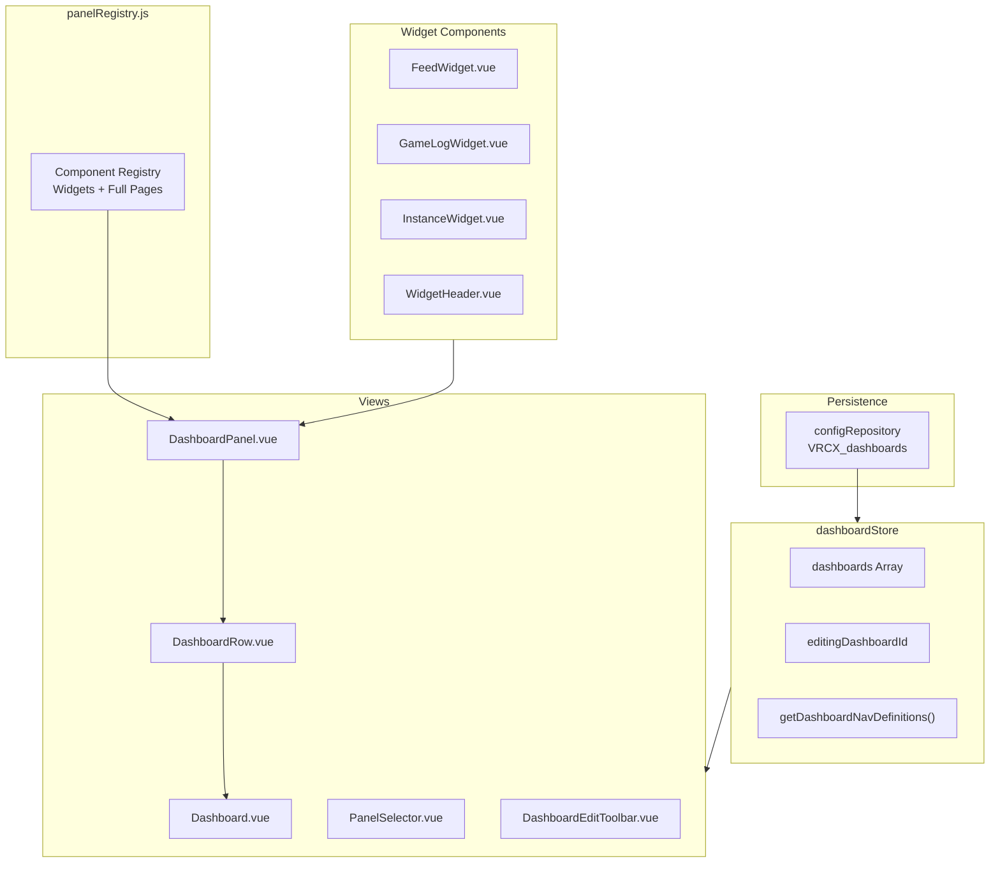

# Dashboard System

## Current Status: ✅ Base version implemented (2026-03-13)

## System Overview



## Data Structure

### Dashboard Config

```javascript
{
    id: "uuid",              // crypto.randomUUID()
    name: "My Dashboard",    // User-defined name
    icon: "LayoutDashboard", // Lucide icon name
    rows: [
        {
            direction: "horizontal" | "vertical",
            panels: [
                // Full page: string
                "feed",
                // Widget: object
                { key: "widget-feed", config: { enabledTypes: [...] } }
            ]
        }
    ]
}
```

Each row supports up to 2 panels with horizontal or vertical arrangement.

## Widget Details

### FeedWidget

| Item | Details |
|------|---------|
| **Data Source** | `feedStore.feedTableData` (WebSocket real-time push) |
| **Entry Limit** | 100 entries |
| **Configurable** | Event type filtering (toggle Online/Offline/Location etc. in edit mode) |
| **Interaction** | Username clickable → `showUserDialog()`, world name clickable → `showWorldDialog()` |

### GameLogWidget

| Item | Details |
|------|---------|
| **Data Source** | Independent DB load + `vrcx:gamelog-entry` CustomEvent real-time push |
| **Entry Limit** | 200 entries |
| **Configurable** | Event type filtering |
| **Independence** | Does not reuse `gameLogStore.gameLogTableData` (independent data source to avoid requiring GameLog page to be open) |

### InstanceWidget

| Item | Details |
|------|---------|
| **Data Source** | `instanceStore.currentInstanceUsersData` |
| **Display** | Current world name + scrollable player list |
| **Not in game** | Shows empty state message |

## Navigation Integration

Dashboards are dynamically rendered in NavMenu. `dashboardStore.getDashboardNavDefinitions()` returns navigation entry array with keys in `dashboard:{id}` format.

Users can create multiple dashboards, each appearing in the navigation menu.

## Future Direction

### Planned Widgets

| Widget | Priority | Data Source | Real-time | Effort |
|--------|----------|------------|-----------|--------|
| **OnlineFriends** | ⭐⭐⭐ | `friendStore` computed | ✅ WebSocket | Low (~80 lines) |
| **Notification** | ⭐⭐⭐ | `notificationStore` | ✅ WebSocket | Medium (~150 lines) |
| **FriendsLocations** | ⭐⭐⭐ | `friend + location + favorite` | ✅ WebSocket | Medium |
