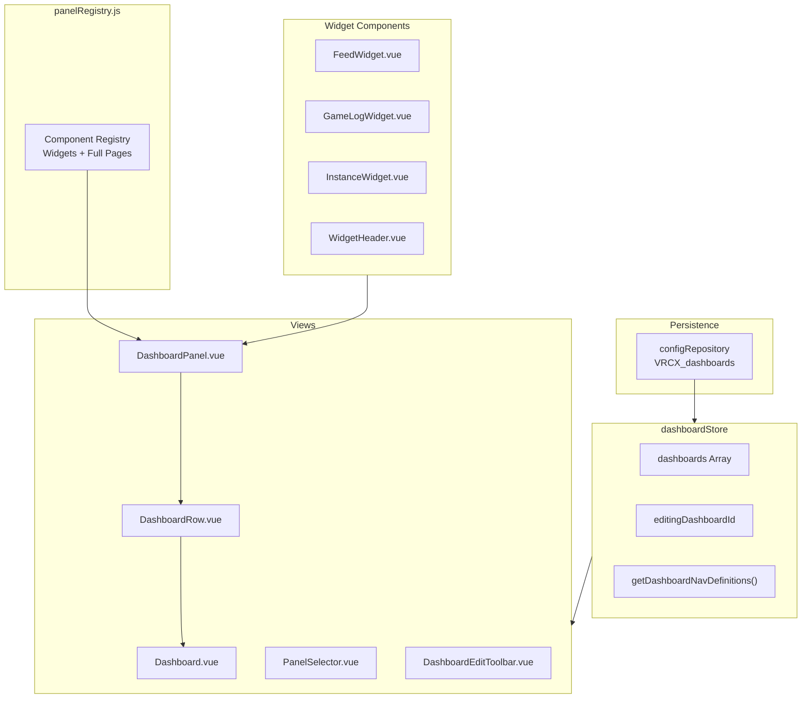

# Dashboard System

The Dashboard System provides customizable, multi-panel layouts where users can compose widgets and full-page views into personalized dashboards.



## Overview

## Data Structure

### Dashboard Config

```javascript
{
    id: "uuid",              // crypto.randomUUID()
    name: "My Dashboard",    // User-defined name
    icon: "LayoutDashboard", // Lucide icon name
    rows: [
        {
            direction: "horizontal" | "vertical",
            panels: [
                // Full page: string
                "feed",
                // Widget: object with config
                {
                    key: "widget:feed",
                    config: {
                        filters: ["GPS", "Online", "Offline"],  // Event type filter
                        showType: true                          // Show type column
                    }
                },
                {
                    key: "widget:game-log",
                    config: {
                        filters: ["Location", "OnPlayerJoined"],
                        showDetail: true                        // Show detail for event/external types
                    }
                },
                {
                    key: "widget:instance",
                    config: {
                        columns: ["icon", "displayName", "timer", "rank"]  // Column visibility
                    }
                }
            ]
        }
    ]
}
```

Each row supports up to 2 panels with horizontal or vertical arrangement.

## Widget Configuration

Widget settings are accessed via a **gear icon** in the WidgetHeader. The gear appears on hover over the widget title bar, and opens a dropdown menu for multi-select configuration.

### Config Data Flow

```
User clicks checkbox in dropdown
  → Widget's toggleFilter/toggleColumn/toggleBooleanConfig
  → props.configUpdater(newConfig)
  → DashboardPanel.emitConfigUpdate → emit('select', { key, config })
  → DashboardRow forwards → emit('update-panel', rowIndex, panelIndex, value)
  → Dashboard.handleLiveUpdatePanel
  → dashboardStore.updateDashboard (persisted to configRepository)
  → Reactive update flows back through props
```

Key design decisions:

- The `configUpdater` prop (not `onConfigUpdate`) avoids Vue 3's automatic `on*` → event listener conversion
- Config updates in non-editing mode go directly to the store via `handleLiveUpdatePanel`
- Config updates in editing mode go to `editRows` (temporary editing state) via `handleUpdatePanel`
- `@select.prevent` on `DropdownMenuCheckboxItem` keeps the dropdown open for multi-selection

## Editing Mode

In edit mode, each panel shows:

- **If a panel is selected**: Panel icon + name + trash icon (to clear selection)
- **If no panel is selected**: "No Panel Selected" text + "Select Panel" button
- Row-level X button to remove the entire panel slot

## Widget Details

### FeedWidget

| Item                  | Details                                                                                  |
| --------------------- | ---------------------------------------------------------------------------------------- |
| **Data Source**       | `feedStore.feedTableData` (WebSocket real-time push)                                     |
| **Entry Limit**       | 100 entries                                                                              |
| **Config: Filters**   | Event type filtering: GPS, Online, Offline, Status, Avatar, Bio                          |
| **Config: Show Type** | Toggle type column visibility                                                            |
| **Interaction**       | Username clickable → `showUserDialog()`                                                  |
| **Styling**           | Username uses default foreground color (no bold), consistent with Feed tab's columns.jsx |

### GameLogWidget

| Item                | Details                                                                                                                 |
| ------------------- | ----------------------------------------------------------------------------------------------------------------------- |
| **Data Source**     | Independent DB load via `database.lookupGameLogDatabase()` + real-time push via `gameLogStore.latestGameLogEntry` watch |
| **Entry Limit**     | 200 entries                                                                                                             |
| **Config: Filters** | Event type filtering: Location, OnPlayerJoined, OnPlayerLeft, VideoPlay, PortalSpawn, Event, External                   |
| **Config: Detail**  | Toggle detail display for Event/External types (shows data/message inline instead of tooltip)                           |
| **Independence**    | Does not reuse `gameLogStore.gameLogTableData` (independent data source to avoid requiring GameLog page to be open)     |
| **Friend Icons**    | Shows ⭐ (favorite) or 💚 (friend) after player names for OnPlayerJoined/OnPlayerLeft                                   |
| **VideoPlay**       | Shows `videoId: videoName` with tooltip, clickable to open external URL (except LSMedia/PopcornPalace)                  |
| **Location**        | Includes `grouphint` prop for group name display                                                                        |
| **Styling**         | OnPlayerJoined: default color; OnPlayerLeft: `text-muted-foreground/70`; no hover row highlighting                      |

### InstanceWidget

| Item                | Details                                                                                          |
| ------------------- | ------------------------------------------------------------------------------------------------ |
| **Data Source**     | `instanceStore.currentInstanceUsersData`                                                         |
| **Display**         | Current world name + location info + player count + scrollable player list                       |
| **Config: Columns** | Toggle column visibility: icon, displayName (always on), rank, timer, platform, language, status |
| **Default Columns** | icon, displayName, timer                                                                         |
| **Not in game**     | Shows empty state message                                                                        |

## Navigation Integration

Dashboards are dynamically rendered in NavMenu. `dashboardStore.getDashboardNavDefinitions()` returns navigation entry array with keys in `dashboard:{id}` format.

Users can create multiple dashboards, each appearing in the navigation menu.

## Panel Restrictions

Certain panels are blocked from being added to dashboards. The `panelRegistry.js` maintains a `restrictedPanels` set — panels in this set do not appear in the PanelSelector during editing. This prevents navigation-only or tool panels (e.g., Settings, Search) from being placed in dashboards where they would not function correctly.

## Default Hidden Columns

DataTable columns can now declare `defaultHidden: true` in their column definition. These columns are hidden on first load but can be revealed via the column visibility toggle. The visibility state is persisted per-table via `configRepository`.

- **Implementation**: Column definitions in `columns.jsx` files set `meta.defaultHidden`
- **Persistence**: `useVrcxVueTable` reads/writes column visibility to `configRepository`

## Future Direction

### Planned Widgets

| Widget               | Priority | Data Source                    | Real-time    | Effort              |
| -------------------- | -------- | ------------------------------ | ------------ | ------------------- |
| **OnlineFriends**    | ⭐⭐⭐   | `friendStore` computed         | ✅ WebSocket | Low (~80 lines)     |
| **Notification**     | ⭐⭐⭐   | `notificationStore`            | ✅ WebSocket | Medium (~150 lines) |
| **FriendsLocations** | ⭐⭐⭐   | `friend + location + favorite` | ✅ WebSocket | Medium              |
