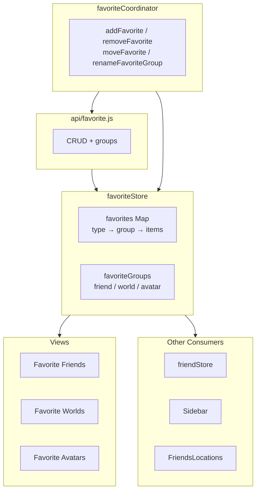
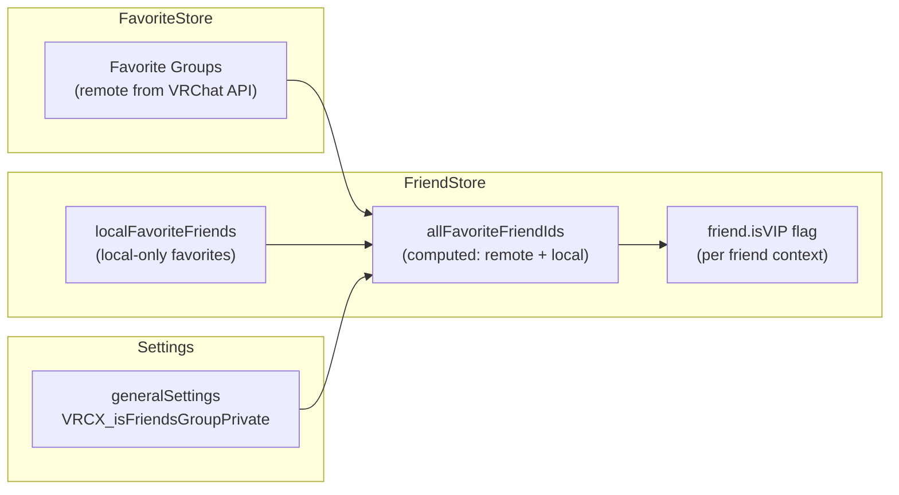

# Favorite System

The Favorite System manages VRChat favorites (friends, worlds, avatars) across remote API groups and local-only VRCX groups.




## Overview

## Favorite Types

VRChat supports three types of favorites, each with their own group structure:

| Type | Max Groups | Items Per Group | Used In |
|------|-----------|----------------|---------|
| **friend** | Dynamic | Dynamic | Sidebar VIP, FriendsLocations |
| **world** | Dynamic | Dynamic | Favorites/Worlds view |
| **avatar** | Dynamic | Dynamic | Favorites/Avatars view |

## How Favorites Interact with Friends

The integration between favorites and the friend system is one of the most cross-cutting concerns:



### Remote vs Local Favorites

| Source | Where Stored | Synced | Purpose |
|--------|-------------|--------|---------|
| **Remote** | VRChat API | Yes, across devices | Official VRChat favorite groups |
| **Local** | VRCX local DB | No, this device only | VRCX-specific extra favorites |

The `allFavoriteFriendIds` computed property merges both sources, so the UI treats them identically.

## Favorite Operations

### Add Favorite
```
favoriteCoordinator.addFavorite(type, id, group)
├── Validate: not already in group
├── API: POST /favorites
├── Update favoriteStore
├── If type === "friend":
│   └── friendStore.updateSidebarFavorites()
└── Notification toast
```

### Remove Favorite
```
favoriteCoordinator.removeFavorite(type, id)
├── API: DELETE /favorites/{id}
├── Update favoriteStore
├── If type === "friend":
│   └── friendStore.updateSidebarFavorites()
└── Notification toast
```

### Favorite Group Reordering

Users can reorder favorite groups in the Sidebar settings. This affects:
- Sidebar VIP section ordering
- FriendsLocations "Favorite" tab grouping
- Favorites/Friends view group ordering

## Views

### Favorites/Friends

Data table showing friends organized by favorite group. Features:
- Group tabs/sections
- Click to open UserDialog
- Drag to reorder (within group)
- Remove from favorites

### Favorites/Worlds

Data table with world details:
- Thumbnail, name, author, capacity
- Click to open WorldDialog
- Launch options
- Remove from favorites

**Sort Options** (via toolbar dropdown):

| Sort Value | Behavior |
|-----------|----------|
| `name` | Alphabetical by world name (default) |
| `date` | By date added to favorites |
| `players` | By current player count (descending) — uses `ref.occupants` for remote favorites, `occupants` for local |

The `players` sort is applied per-group as a local `.toSorted()` on the already-grouped list, so it does not affect the underlying favorite order.

### Favorites/Avatars

Data table with avatar details:
- Thumbnail, name, author
- "Switch to" button
- Remove from favorites

## File Map

| File | Lines | Purpose |
|------|-------|---------|
| `stores/favorite.js` | ~400 | Favorite state, groups, cached favorites |
| `coordinators/favoriteCoordinator.js` | ~350 | Add/remove/move favorites, group operations |
| `api/favorite.js` | ~80 | VRChat favorites API wrapper |

## Risks & Gotchas

- **Remote vs local favorites** are merged in `allFavoriteFriendIds`. Forgetting either source will cause VIP friends to disappear from the sidebar.
- **Favorite group ordering** affects sidebar VIP section display order. The sidebar settings popover controls which groups are visible.
- **`updateSidebarFavorites()`** triggers `reindexSortedFriend` for every affected friend — uses batch mode to defer the sort until all changes are applied.

### Key Dependencies

| Module | How It Uses Favorites |
|--------|----------------------|
| **friendStore** | Reads favorite IDs to compute VIP friends |
| **Sidebar** | Displays VIP section based on favorite groups |
| **FriendsLocations** | "Favorite" tab filters by favorite groups |
| **userCoordinator** | Updates favorites when user data changes |
| **friendRelationshipCoordinator** | Removes from favorites on unfriend |
| **avatarCoordinator** | Reads avatar favorites |
| **worldCoordinator** | Reads world favorites |
