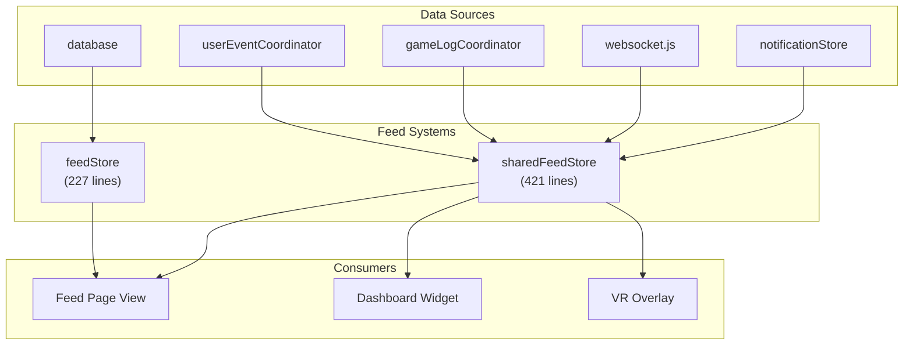

# Feed System

VRCX has two feed systems that serve different scopes: **Feed Store** for historical social event viewing, and **Shared Feed Store** for real-time event aggregation across the dashboard, VR overlay, and notification center.



## Overview


## Feed Store (`feedStore`)

### Purpose

The feed store is a **database-backed historical viewer** for social events. It reads from the SQLite database where `userEventCoordinator` has already persisted events.

### State

```js
feedTable: {
    data: [],
    search: '',
    filter: [],        // event type filters
    dateFrom: '',
    dateTo: '',
    vip: false,        // filter to favorites only
    loading: false,
    pageSize: 20,
    pageSizeLinked: true
}
```

### Key Functions

| Function | Purpose |
|----------|---------|
| `feedTableLookup()` | Query database for feed entries with current filters |
| `feedSearch(row)` | Client-side text search filter |
| `feedIsFriend(row)` | Check if row's user is still a friend |
| `feedIsFavorite(row)` | Check if row's user is a favorite |

### Event Types Stored

| Type | Description |
|------|-------------|
| `Online` / `Offline` | Friend online/offline transitions |
| `GPS` | Friend location changes |
| `Status` | Status text/type changes |
| `Avatar` | Avatar changes |
| `Bio` | Bio text changes |

## Shared Feed Store (`sharedFeedStore`)

### Purpose

The shared feed store is a **real-time event aggregator** used as the live feed for the dashboard, VR overlay, and GameLog integration. Unlike the feed store, it doesn't read from the database — events are pushed directly from coordinators and the WebSocket pipeline.

### State

```js
feedSessionTable: []               // current session's events
pendingUpdate: false               // batch update flag
currentTravelers: reactive(new Map())  // userId → traveling info
```

### `addEntry(entry)` — Core Entry Point

Every real-time event in VRCX flows through this function:

```js
function addEntry(entry) {
    // 1. Check moderation (skip if user is blocked/muted)
    if (moderationStore.isModerationBlocked(entry.userId)) return;

    // 2. Add to session table
    feedSessionTable.unshift(entry);

    // 3. Cap table size
    if (feedSessionTable.length > maxEntries) {
        feedSessionTable.pop();
    }

    // 4. Notify VR overlay if needed
    if (gameStore.isGameRunning) {
        vrStore.sendFeedEntry(entry);
    }
}
```

### Traveler Tracking

The shared feed maintains a `currentTravelers` Map that tracks friends who are currently "traveling" (moving between instances):

```js
currentTravelers: reactive(new Map())
// Key: userId
// Value: { displayName, location, travelingTo, startTime }

function rebuildOnPlayerJoining() {
    // Called when friend-location events show traveling state
    // Adds entry to currentTravelers
    // Auto-removes after arrival or timeout
}
```

This is consumed by the dashboard and VR overlay to show "who is currently moving."

### Moderation Integration

Before adding any entry, the shared feed checks `moderationStore`:
- Blocked users' events are silently dropped
- Muted users' events are dropped
- This prevents blocked users from appearing in the dashboard feed

## Comparison

| Feature | feedStore | sharedFeedStore |
|---------|-----------|-----------------|
| Data source | Database (historical) | Direct push (real-time) |
| Persistence | SQLite | In-memory only |
| Scope | All historical events | Current session |
| Filtering | Database query + client search | Moderation check only |
| Consumers | Feed page | Dashboard, VR overlay, feed page |
| Size management | Database pagination | Array cap (maxEntries) |

## File Map

| File | Lines | Purpose |
|------|-------|---------|
| `stores/feed.js` | 227 | Historical feed viewer, database queries |
| `stores/sharedFeed.js` | 421 | Real-time feed aggregation, traveler tracking |

## Risks & Gotchas

- **`sharedFeedStore` is session-scoped.** Data is lost on page refresh. Only the database-backed `feedStore` persists across sessions.
- **`feedSessionTable` is a plain array with `unshift()`.** For very active users, frequent `unshift()` operations on large arrays can degrade performance.
- **Moderation filtering in `addEntry()`** means blocked users' events are silently lost from the session — they won't appear even if the user is later unblocked.
- **`currentTravelers`** is deeply watched. Frequent location updates can trigger many reactive recalculations.
