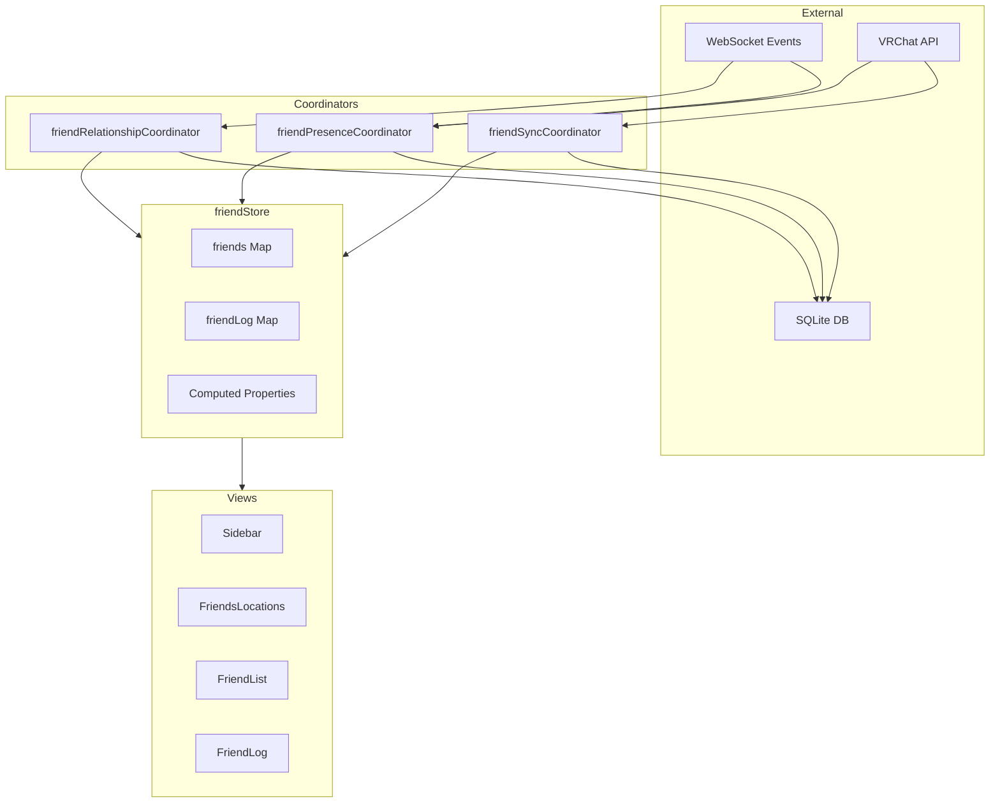
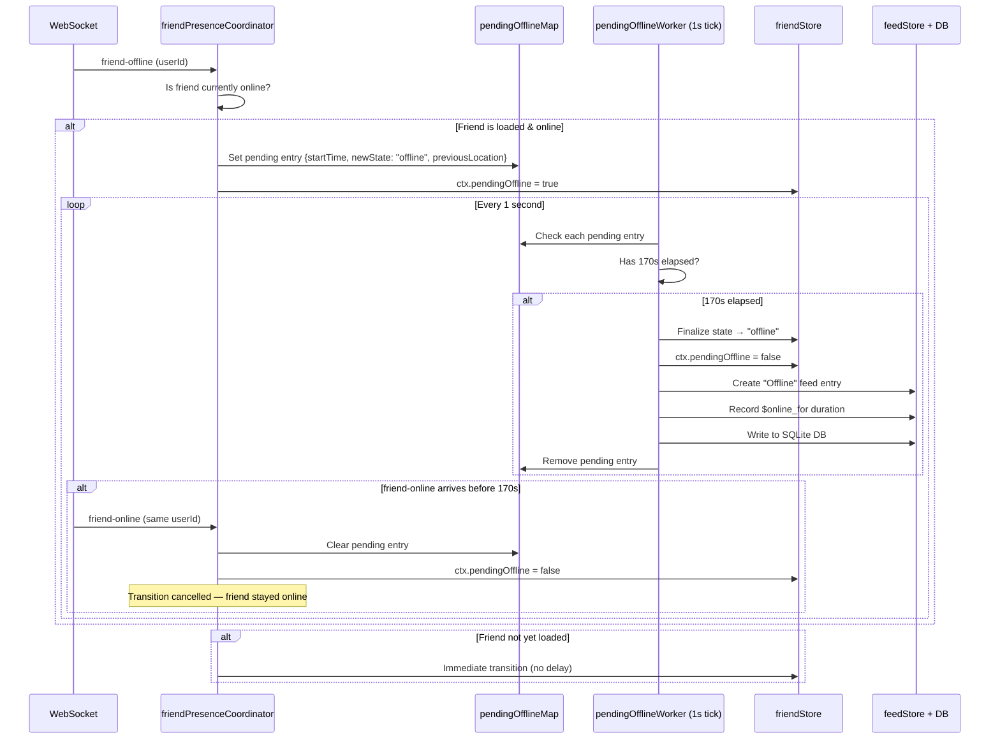

# Friend System

The Friend system is the most complex subsystem in VRCX, spanning 1 store, 3 coordinators, and 4 major views.



## Overview

| Component | Details |
|-----------|--------|
| **WebSocket Events** | friend-online/offline/active, friend-location/update, friend-add/delete |
| **VRChat API** | GET /friends, GET /users/{id} |
| **SQLite DB** | friendLog table, user stats |
| **friendRelationshipCoordinator** | addFriendship(), runDeleteFriendshipFlow(), updateFriendship() |
| **friendPresenceCoordinator** | runUpdateFriendFlow(), 170s pending offline, pendingOfflineWorker |
| **friendSyncCoordinator** | runInitFriendsListFlow(), runRefreshFriendsListFlow() |
| **friends Map** | ID → FriendContext |
| **sortedFriends** | `shallowRef` — globally pre-sorted friend list, incrementally maintained |
| **Computed Properties** | vipFriends, onlineFriends, activeFriends, offlineFriends — filter from `sortedFriends` |
| **Sidebar** | Quick friend list (VIP / Online / Active / Offline) |
| **FriendsLocations** | Card-based view + virtual scrolling |
| **FriendList** | Data table, search + bulk ops |
| **FriendLog** | History table, add/remove/rename events |

## FriendContext Data Structure

Each friend in the `friends` Map has this shape:

```javascript
{
    id,                    // VRChat user ID (e.g., "usr_xxx")
    state,                 // "online" | "active" | "offline"
    isVIP,                 // true if in any favorite group
    ref,                   // Full user object reference (from userStore)
    name,                  // Display name (for fast access)
    memo,                  // User memo text
    pendingOffline,        // true if in 170s delay
    $nickName              // First line of memo (nickname)
}
```

## Sorted Friends Architecture

Instead of each `computed` independently sorting the full `friends` Map, the store maintains a single globally pre-sorted list (`sortedFriends`) as a `shallowRef`. All derived computeds (`vipFriends`, `onlineFriends`, etc.) simply **filter** this list — no per-computed sorting.

### How It Works

```
sortedFriends  (shallowRef, incrementally maintained)
  ├── vipFriends       = sortedFriends.filter(online && isVIP)
  ├── onlineFriends    = sortedFriends.filter(online && !isVIP)
  ├── activeFriends    = sortedFriends.filter(active)
  ├── offlineFriends   = sortedFriends.filter(offline)
  └── friendsInSameInstance = sortedFriends.filter(online).groupBy(location)
```

### Incremental Maintenance

| Operation | Function | Mechanism |
|-----------|----------|-----------|
| **Insert / Re-sort** | `reindexSortedFriend(ctx)` | Remove existing → binary search → splice insert |
| **Remove** | `removeSortedFriend(id)` | Find index → splice remove |
| **Full rebuild** | `rebuildSortedFriends()` | `Array.from(friends.values()).sort(comparator)` |

### Batch Mode

During bulk operations (login friend sync, friend order assignment, mutual count loading), individual `reindexSortedFriend()` calls would trigger O(n²) work. Batch mode defers all updates:

```
runInSortedFriendsBatch(() => {
    // reindexSortedFriend() calls inside only set pendingSortedFriendsRebuild = true
    for (const friend of friends) {
        applyUser(friend);
        reindexSortedFriend(ctx);  // → no-op, just marks dirty
    }
});
// batch end → rebuildSortedFriends() → single full sort
```

`sortedFriendsBatchDepth` is a counter (not boolean) to support nested batches.

### Rebuild Triggers

| Trigger | Mechanism |
|---------|-----------|
| Sort method change | `watch(sidebarSortMethods)` → `rebuildSortedFriends()` |
| Login/logout | `watch(isLoggedIn)` → `sortedFriends.value = []` |
| Batch end | `endSortedFriendsBatch()` → `rebuildSortedFriends()` (if dirty) |

### Call Sites for `reindexSortedFriend()`

| Location | When |
|----------|------|
| `friendStore.addFriend()` | New friend added to Map |
| `friendPresenceCoordinator.runUpdateFriendFlow()` | Status/location/name change |
| `friendPresenceCoordinator.runUpdateFriendDelayedCheckFlow()` | VIP status change after delayed check |
| `userCoordinator.applyUser()` | Full user data arrives |
| `friendStore.setFriendNumber()` | Friend number assigned |
| `friendStore.getFriendLog()` → batch | Friend log data loaded |
| `friendStore.getAllUserMutualCount()` → batch | Mutual counts loaded |
| `friendStore.updateSidebarFavorites()` → batch | Favorite group changes |

## Computed Properties

| Property | Source | When Used |
|----------|--------|-----------|
| `allFavoriteFriendIds` | favoriteStore + localFavorites + settings | Sidebar VIP section, filtering |
| `allFavoriteOnlineFriends` | `sortedFriends` filtered by VIP + online | Sidebar VIP list |
| `onlineFriends` | `sortedFriends` filtered by online, not VIP | Sidebar online list |
| `activeFriends` | `sortedFriends` filtered by active state | Sidebar active list |
| `offlineFriends` | `sortedFriends` filtered by offline/missing | Sidebar offline list |
| `friendsInSameInstance` | `sortedFriends` grouped by shared instance | Sidebar grouping, FriendsLocations |

## 170-Second Pending Offline Mechanism

This is the most subtle piece of the friend system. It prevents false offline notifications from network jitter.



**Why 170 seconds?** VRChat's networking can cause brief disconnects during world transitions. 170s gives enough time for a player to travel between worlds without triggering a false offline notification.

## Friend Sync Flow

### Initial Load (Login)

```
runInitFriendsListFlow()
├── isFriendsLoaded = false
├── initFriendLog(currentUser)
│   ├── First run? → fetch all friends, create log entries
│   └── Subsequent? → load from DB
├── tryApplyFriendOrder() → sequential friendNumber assignment
├── getAllUserStats() → joinCount, lastSeen, timeSpent from DB
├── getAllUserMutualCount() → mutual friend counts
├── Migrate old JSON data → SQLite (legacy)
└── isFriendsLoaded = true
```

### Incremental Refresh

```
runRefreshFriendsListFlow()
├── getCurrentUser() (if > 5min since last)
├── friendStore.refreshFriends()
│   └── GET /friends?offset=X&n=50 (5 concurrent, rate-limited)
│       ├── For each friend: addFriend() or update existing
│       └── Rate limit: 50/page with concurrent cap
└── reconnectWebSocket()
```

### Friend Refresh Pagination

The API is paginated (50 per page, 5 concurrent requests). The store handles:
- New friends found → `addFriend()`
- Existing friends → update state
- Missing friends → handled by `runUpdateFriendshipsFlow()`

## Relationship Events

### Friend Add Flow
```
handleFriendAdd(args)
├── Validate: not already friend, not self
├── API: verify friendship status
├── Create friend log entry (type: "Friend")
├── Assign friendNumber (sequential)
├── Write to SQLite
├── Queue notification
└── Delete corresponding friend request notification
```

### Friend Delete Flow
```
runDeleteFriendshipFlow(id)
├── confirmDeleteFriend() → show dialog
├── API: verify friendship
├── Create friend log entry (type: "Unfriend")
├── Remove from all favorite groups
├── Write to SQLite + notification
├── Hide from log (if setting enabled)
└── Remove from friendStore
```

### Tracked Changes
| Event Type | When | What's Recorded |
|------------|------|-----------------|
| `Friend` | New friend added | displayName, friendNumber |
| `Unfriend` | Friend removed | displayName |
| `FriendRequest` | Incoming request | displayName |
| `CancelFriendRequest` | Request cancelled | displayName |
| `DisplayName` | Name changed | previousDisplayName → displayName |
| `TrustLevel` | Rank changed | previousTrustLevel → trustLevel |

## View Details

### Sidebar (Right Panel)

**Structure**: Search → Action buttons → Tabs (Friends / Groups) → Sorted lists

**Friend Categories** (default order):
1. VIP Friends (favorite groups)
2. Same Instance Groups (optional)
3. Online Friends
4. Active Friends
5. Offline Friends

The order of items 1 and 2 is controlled by `isSameInstanceAboveFavorites`. When enabled, same-instance groups appear **above** VIP favorites; when disabled (default), they appear below.

**7 Sort Methods**: Alphabetical, by Status, Private to Bottom, Last Active, Last Seen, Time in Instance, by Location

**Settings**: Group by instance, hide same-instance group, **prioritize same instance above favorites**, split by favorite group, favorite group filter

**Context Menu Features**:
- Right-click on the user status area reveals a context menu with status options and, if presets exist, a **Status Presets** submenu for quick status switching (see [Social Status Presets](/en/modules/user-system#social-status-presets))

### FriendsLocations (Full Page)

**5 Tabs**: Online, Favorite, Same Instance, Active, Offline

**Virtual Scrolling** with dynamic row types:
- `header` — Instance name + player count
- `group-header` — Collapsible favorite group
- `divider` — Visual separator
- `card` — Friend card row (1 or more cards)

**Card Features**: Scale 50-100%, spacing 25-100%, search by name/signature/world

### FriendList (Data Table)

**Features**: Click to open UserDialog, multi-column sort, pagination, column pinning, search with confusable detection, bulk unfriend mode, load profiles (fetch missing data)

### FriendLog (History Table)

**Event Types**: Friend, Unfriend, FriendRequest, CancelFriendRequest, DisplayName, TrustLevel

**Columns**: Date, type, display name, previous name, trust level, friend number

## File Map

| File | Lines | Purpose |
|------|-------|---------|
| `stores/friend.js` | ~1400 | Friend state, sortedFriends (shallowRef + batch), computed lists, friend log |
| `coordinators/friendPresenceCoordinator.js` | ~315 | WebSocket presence events, 170s pending offline |
| `coordinators/friendRelationshipCoordinator.js` | ~300 | Add/remove friendship, friend log entries |
| `coordinators/friendSyncCoordinator.js` | ~200 | Initial load, incremental refresh, pagination |

## Sidebar Persistence Keys

| Key | Type | Default | Purpose |
|-----|------|---------|---------|
| `VRCX_sameInstanceAboveFavorites` | Boolean | `false` | When true, same-instance friends appear above VIP favorites |

## Risks & Gotchas

- **`sortedFriends` is a `shallowRef`**, not a `computed`. It is incrementally maintained via binary-insert (`reindexSortedFriend`) and splice-remove (`removeSortedFriend`). Full rebuilds only happen on sort method changes or login state transitions.
- **Batch operations** (`beginSortedFriendsBatch` / `endSortedFriendsBatch`) defer sort updates during bulk friend list refreshes. Forgetting `endSortedFriendsBatch` will silently suppress all sort updates until the next rebuild.
- **170s pending offline** is the most timing-sensitive code path. Race conditions between the 1s tick worker and incoming WebSocket events can cause stale state if not handled carefully.
- **`friendsInSameInstance`** now iterates `sortedFriends` (already sorted) instead of concatenating `vipFriends + onlineFriends`, so group ordering matches sidebar order without re-sorting.
- **Known architecture compromise**: `friend.js` imports `searchIndexCoordinator` directly (store → coordinator reverse dependency) for async memo/note loading callbacks.
