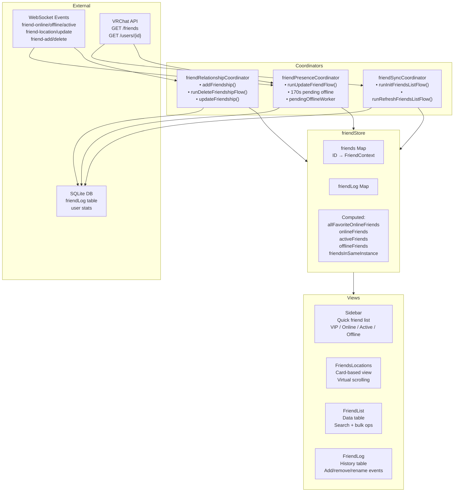
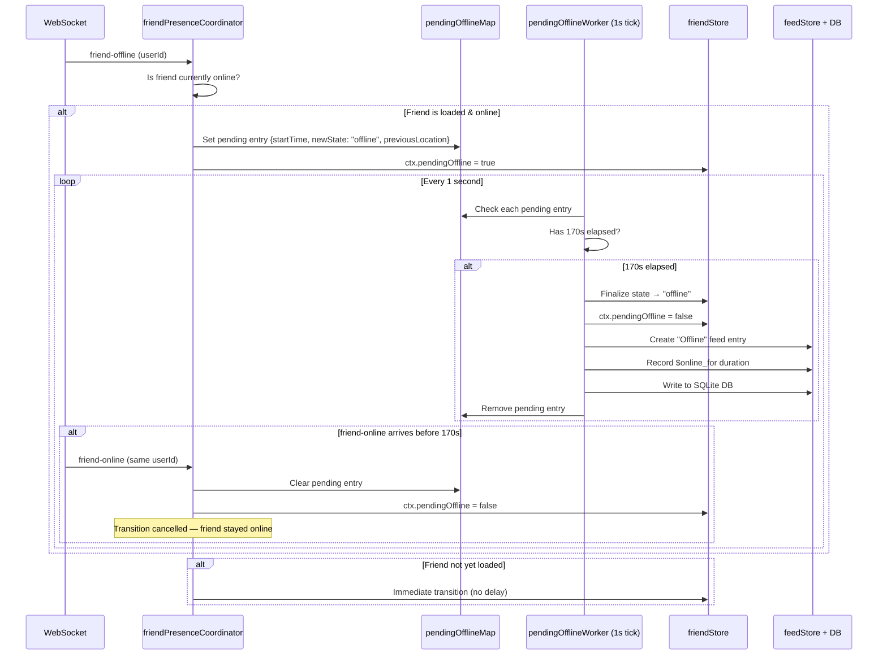

# Friend System

The Friend system is the most complex subsystem in VRCX, spanning 1 store, 3 coordinators, and 4 major views.

## System Overview



## FriendContext Data Structure

Each friend in the `friends` Map has this shape:

```javascript
{
    id,                    // VRChat user ID (e.g., "usr_xxx")
    state,                 // "online" | "active" | "offline"
    isVIP,                 // true if in any favorite group
    ref,                   // Full user object reference (from userStore)
    name,                  // Display name (for fast access)
    memo,                  // User memo text
    pendingOffline,        // true if in 170s delay
    $nickName              // First line of memo (nickname)
}
```

## Friend Store Computed Properties

| Property | Source | When Used |
|----------|--------|-----------|
| `allFavoriteFriendIds` | favoriteStore + localFavorites + settings | Sidebar VIP section, filtering |
| `allFavoriteOnlineFriends` | friends filtered by VIP + online | Sidebar VIP list |
| `onlineFriends` | friends filtered by online, not VIP | Sidebar online list |
| `activeFriends` | friends filtered by active state | Sidebar active list |
| `offlineFriends` | friends filtered by offline/missing | Sidebar offline list |
| `friendsInSameInstance` | friends grouped by shared instance | Sidebar grouping, FriendsLocations |

## 170-Second Pending Offline Mechanism

This is the most subtle piece of the friend system. It prevents false offline notifications from network jitter.



**Why 170 seconds?** VRChat's networking can cause brief disconnects during world transitions. 170s gives enough time for a player to travel between worlds without triggering a false offline notification.

## Friend Sync Flow

### Initial Load (Login)

```
runInitFriendsListFlow()
├── isFriendsLoaded = false
├── initFriendLog(currentUser)
│   ├── First run? → fetch all friends, create log entries
│   └── Subsequent? → load from DB
├── tryApplyFriendOrder() → sequential friendNumber assignment
├── getAllUserStats() → joinCount, lastSeen, timeSpent from DB
├── getAllUserMutualCount() → mutual friend counts
├── Migrate old JSON data → SQLite (legacy)
└── isFriendsLoaded = true
```

### Incremental Refresh

```
runRefreshFriendsListFlow()
├── getCurrentUser() (if > 5min since last)
├── friendStore.refreshFriends()
│   └── GET /friends?offset=X&n=50 (5 concurrent, rate-limited)
│       ├── For each friend: addFriend() or update existing
│       └── Rate limit: 50/page with concurrent cap
└── reconnectWebSocket()
```

### Friend Refresh Pagination

The API is paginated (50 per page, 5 concurrent requests). The store handles:
- New friends found → `addFriend()`
- Existing friends → update state
- Missing friends → handled by `runUpdateFriendshipsFlow()`

## Relationship Events

### Friend Add Flow
```
handleFriendAdd(args)
├── Validate: not already friend, not self
├── API: verify friendship status
├── Create friend log entry (type: "Friend")
├── Assign friendNumber (sequential)
├── Write to SQLite
├── Queue notification
└── Delete corresponding friend request notification
```

### Friend Delete Flow
```
runDeleteFriendshipFlow(id)
├── confirmDeleteFriend() → show dialog
├── API: verify friendship
├── Create friend log entry (type: "Unfriend")
├── Remove from all favorite groups
├── Write to SQLite + notification
├── Hide from log (if setting enabled)
└── Remove from friendStore
```

### Tracked Changes
| Event Type | When | What's Recorded |
|------------|------|-----------------|
| `Friend` | New friend added | displayName, friendNumber |
| `Unfriend` | Friend removed | displayName |
| `FriendRequest` | Incoming request | displayName |
| `CancelFriendRequest` | Request cancelled | displayName |
| `DisplayName` | Name changed | previousDisplayName → displayName |
| `TrustLevel` | Rank changed | previousTrustLevel → trustLevel |

## View Details

### Sidebar (Right Panel)

**Structure**: Search → Action buttons → Tabs (Friends / Groups) → Sorted lists

**Friend Categories** (in order):
1. VIP Friends (favorite groups)
2. Online Friends
3. Active Friends
4. Offline Friends
5. Same Instance Groups (optional)

**7 Sort Methods**: Alphabetical, by Status, Private to Bottom, Last Active, Last Seen, Time in Instance, by Location

**Settings**: Group by instance, hide same-instance group, split by favorite group, favorite group filter

### FriendsLocations (Full Page)

**5 Tabs**: Online, Favorite, Same Instance, Active, Offline

**Virtual Scrolling** with dynamic row types:
- `header` — Instance name + player count
- `group-header` — Collapsible favorite group
- `divider` — Visual separator
- `card` — Friend card row (1 or more cards)

**Card Features**: Scale 50-100%, spacing 25-100%, search by name/signature/world

### FriendList (Data Table)

**Features**: Click to open UserDialog, multi-column sort, pagination, column pinning, search with confusable detection, bulk unfriend mode, load profiles (fetch missing data)

### FriendLog (History Table)

**Event Types**: Friend, Unfriend, FriendRequest, CancelFriendRequest, DisplayName, TrustLevel

**Columns**: Date, type, display name, previous name, trust level, friend number
