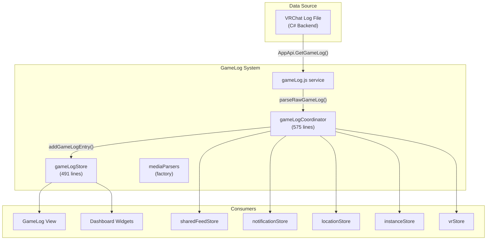
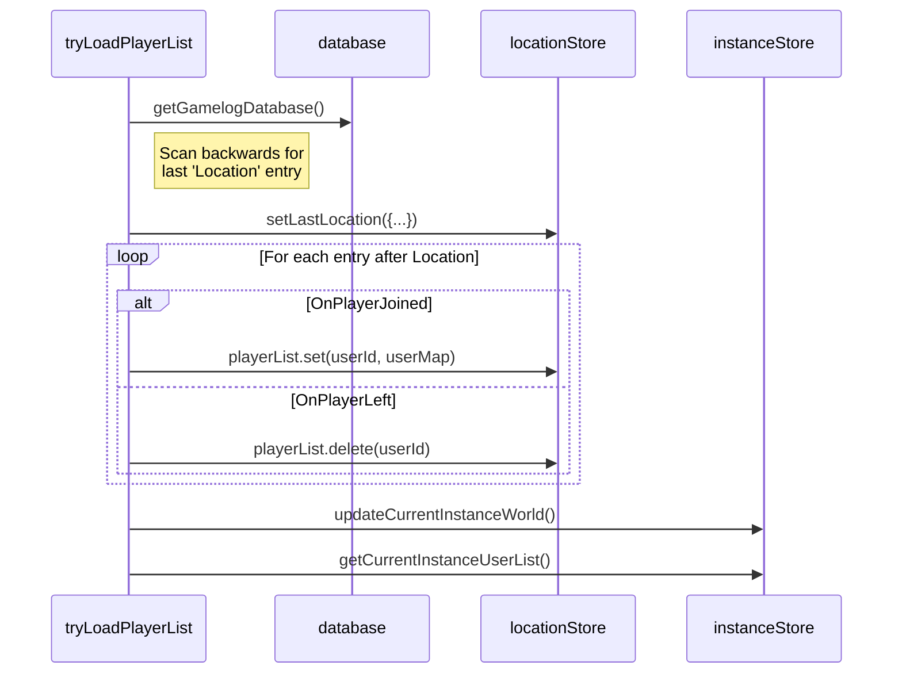

# GameLog System

## Overview

The GameLog System processes VRChat's local game log file to track player interactions, instance transitions, media playback, and in-game events. It serves as VRCX's primary source of "what's happening right now in the game" — complementing the WebSocket-based real-time data with client-side observation data that VRChat's API doesn't expose.



## Event Types

The coordinator dispatches events based on `gameLog.type`:

### Instance & Location Events

| Type | Description | Side Effects |
|------|-------------|-------------|
| `location-destination` | Traveling to a new instance | Reset location, clear now playing, update world info |
| `location` | Arrived at a new instance | Set `lastLocation`, create entry, update VR overlay |
| `vrc-quit` | VRChat quit signal | Optional QuitFix (kill VRC process if stuck) |
| `openvr-init` | SteamVR initialized | Set `isGameNoVR = false`, update OpenVR state |
| `desktop-mode` | Desktop mode (no VR) | Set `isGameNoVR = true` |

### Player Events

| Type | Description | Side Effects |
|------|-------------|-------------|
| `player-joined` | Player joined current instance | Add to `playerList`, fetch user if unknown |
| `player-left` | Player left current instance | Remove from `playerList`, calculate session time |

### Media Events

| Type | Description | Side Effects |
|------|-------------|-------------|
| `video-play` | Video player started | Parse media source, update now playing |
| `video-sync` | Video seek/position update | Update playback offset |
| `vrcx` | Custom VRCX events from worlds | Dispatch to world-specific parsers |

### Asset Events

| Type | Description | Side Effects |
|------|-------------|-------------|
| `resource-load-string` | String resource loaded | Log if enabled |
| `resource-load-image` | Image resource loaded | Log if enabled |
| `api-request` | VRC API request from game | Parse emoji/print/inventory URLs |
| `screenshot` | Screenshot taken | Process via `vrcxStore.processScreenshot` |
| `sticker-spawn` | Sticker spawned | Save sticker to file if enabled |

### Other Events

| Type | Description | Side Effects |
|------|-------------|-------------|
| `portal-spawn` | Portal spawned in world | Log to database |
| `avatar-change` | Player changed avatar | Track per-player avatar history |
| `event` | Custom game event | Log to database |
| `notification` | In-game notification | (no-op) |
| `udon-exception` | Udon script error | Console log if enabled |
| `photon-id` | Photon network player ID | Map photonId → user in lobby |

## Data Flow

### Game Log Processing Pipeline

```mermaid
sequenceDiagram
    participant Backend as C# Backend
    participant Loop as updateLoop
    participant Parse as addGameLogEvent
    participant Service as gameLogService
    participant Process as addGameLogEntry
    participant Stores as Multiple Stores
    participant DB as Database

    Backend->>Loop: AppApi.GetGameLog()
    Loop->>Parse: addGameLogEvent(json)
    Parse->>Service: parseRawGameLog(type, data, args)
    Service-->>Parse: structured gameLog object
    Parse->>Process: addGameLogEntry(gameLog, location)

    alt Location event
        Process->>Stores: locationStore.setLastLocation()
        Process->>Stores: instanceStore.updateCurrentInstanceWorld()
        Process->>Stores: vrStore.updateVRLastLocation()
    end

    alt Player event
        Process->>Stores: locationStore.lastLocation.playerList.set/delete
        Process->>Stores: instanceStore.getCurrentInstanceUserList()
        Process->>DB: database.addGamelogJoinLeaveToDatabase()
    end

    Process->>Stores: sharedFeedStore.addEntry(entry)
    Process->>Stores: notificationStore.queueGameLogNoty(entry)
    Process->>Stores: gameLogStore.addGameLog(entry)
```

### Startup Player List Recovery

When VRCX starts while VRChat is already running, `tryLoadPlayerList()` reconstructs the current player list from database history:



## Now Playing System

The GameLog tracks media currently playing in-world via the `nowPlaying` state:

```js
nowPlaying: {
    playing: false,
    url: '',
    title: '',          // resolved title
    displayName: '',    // who started it
    offset: 0,          // playback offset in seconds
    startTime: 0,       // timestamp when started
    // ... source-specific fields
}
```

### Media Source Parsers

World-specific media parsers are created via `createMediaParsers()` factory:

| Parser | World | Purpose |
|--------|-------|---------|
| `addGameLogVideo` | Any | Generic video URL detection |
| `addGameLogPyPyDance` | PyPyDance | PyPyDance world song parsing |
| `addGameLogVRDancing` | VRDancing | VRDancing world song parsing |
| `addGameLogZuwaZuwaDance` | ZuwaZuwaDance | ZuwaZuwaDance world song parsing |
| `addGameLogLSMedia` | LS Media | LS Media world URL parsing |
| `addGameLogPopcornPalace` | Popcorn Palace | Cinema world video parsing |

### Now Playing Update Cycle

```js
function updateNowPlaying() {
    if (!nowPlaying.value.playing) return;

    // Calculate current playback position
    const elapsed = (Date.now() - nowPlaying.value.startTime) / 1000;
    const currentPosition = nowPlaying.value.offset + elapsed;

    // Update VR overlay with current media info
    // Called from updateLoop timer
}
```

## GameLog Store

### State

```js
state: {
    lastLocationAvatarList: new Map(), // displayName → avatarName
}

gameLogTable: {
    search: '',
    dateFrom: '',
    dateTo: '',
    vip: false,           // filter to favorites only
    loading: false,
    filter: [],           // type filters
    pageSize: 20,
    pageSizeLinked: true
}

gameLogTableData: []       // shallowRef — current displayed rows
latestGameLogEntry: {}     // most recent entry for dashboard widget
lastVideoUrl: ''           // dedup guard
lastResourceloadUrl: ''    // dedup guard
```

### Key Functions

| Function | Purpose |
|----------|---------|
| `addGameLog(entry)` | Insert entry into table with sorted position |
| `insertGameLogSorted(entry)` | Binary-search insert maintaining sort order |
| `gameLogTableLookup()` | Refresh table from database with filters |
| `gameLogSearch(row)` | Client-side search filter |
| `gameLogIsFriend(row)` | Check if row's user is a friend |
| `gameLogIsFavorite(row)` | Check if row's user is a favorite |
| `sweepGameLog()` | Trim table to `maxTableSize + 50` entries |
| `clearNowPlaying()` | Reset now playing state |
| `setNowPlaying(data)` | Update now playing with new media |

### Table Size Management

The game log table implements automatic cleanup:
```js
function sweepGameLog() {
    if (gameLogTableData.length > maxTableSize + 50) {
        gameLogTableData = gameLogTableData.slice(0, -50);
    }
}
```

This caps the in-memory table at ~`maxTableSize + 50` entries. Older entries remain in the database but are removed from the reactive display.

## QuitFix Feature

The `vrc-quit` event handler includes an optional "QuitFix" feature for when VRChat hangs during shutdown:

```js
case 'vrc-quit':
    if (advancedSettingsStore.vrcQuitFix) {
        const bias = Date.parse(gameLog.dt) + 3000;
        if (bias < Date.now()) {
            // Ignore stale quit signals
            break;
        }
        AppApi.QuitGame().then((processCount) => {
            if (processCount === 1) {
                console.log('QuitFix: Killed VRC');
            }
        });
    }
    break;
```

**Safety checks:**
- Only activates if the quit signal is within 3 seconds of current time (prevents acting on replayed logs)
- Does not kill if more than 1 VRC process is running (multi-instance)

## Disable GameLog Dialog

Users can disable game log processing entirely. This requires VRChat to be closed:

```js
export async function disableGameLogDialog() {
    if (gameStore.isGameRunning) {
        toast.error('VRChat must be closed');
        return;
    }
    // Show confirmation dialog before toggling
}
```

## File Map

| File | Lines | Purpose |
|------|-------|---------|
| `stores/gameLog/index.js` | 491 | GameLog state, now playing, table management |
| `stores/gameLog/mediaParsers.js` | — | Factory for world-specific media parsers |
| `coordinators/gameLogCoordinator.js` | 575 | Core event processor, player list recovery |
| `services/gameLog.js` | — | Raw log parsing, backend bridge |
| `views/GameLog/` | — | GameLog page view components |

## Key Dependencies

| Dependency | Direction | Purpose |
|-----------|-----------|---------|
| `locationStore` | read/write | `lastLocation`, player list management |
| `instanceStore` | write | Instance world updates, join history |
| `userStore` | read | Cached users for name resolution |
| `friendStore` | read | Friend checks for player events |
| `vrStore` | write | VR location updates |
| `photonStore` | read/write | Photon lobby avatar tracking |
| `galleryStore` | write | Emoji/print/sticker auto-capture |
| `sharedFeedStore` | write | Push entries for dashboard/VR |
| `notificationStore` | write | Desktop/sound notifications |
| `gameStore` | read | `isGameRunning` checks |

## Risks & Gotchas

- **The coordinator (575 lines) is a single giant switch statement.** Each case handles a different game log type with cross-store side effects.
- **`tryLoadPlayerList()` does sequential API calls** for unknown users in the player list — if the game has many non-friend players, this can cause rate limiting.
- **Deduplication is URL-based** (`lastVideoUrl`, `lastResourceloadUrl`) — this prevents spam but can miss legitimate replays.
- **The now playing system** relies on world-specific parsers. Adding support for new worlds requires adding new parser functions.
- **`addGameLogEntry()` is called from the update loop** — it runs on every poll cycle when the game is active. Performance is critical.
- **`photon-id` handling** maps display names to users via linear scan of `cachedUsers` — `findUserByDisplayName()` is O(n) on the cache size.
