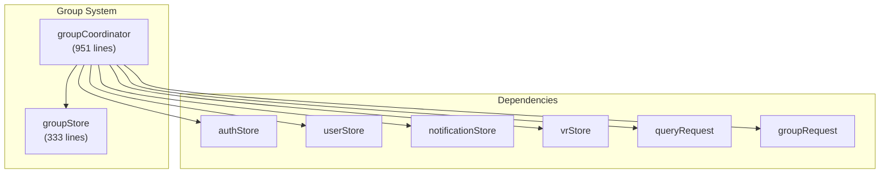
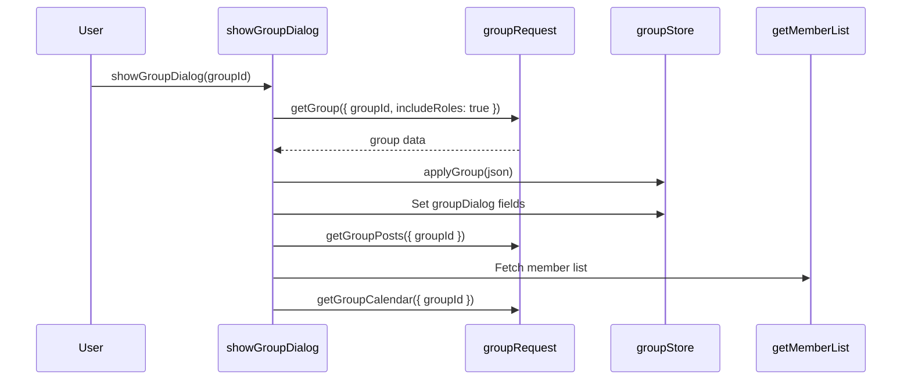

# Group System

The Group System manages VRChat group data, including group dialogs, member management, moderation, and group instances. It is split between a store (state + simple UI logic) and a coordinator (complex cross-store operations), following the standard VRCX separation pattern.



## Overview


## State Shape

### `groupDialog` — Multi-Tab Group Detail Popup

```js
groupDialog: {
    visible: false,
    loading: false,
    activeTab: 'Info',
    lastActiveTab: 'Info',
    isGetGroupDialogGroupLoading: false,
    id: '',
    inGroup: false,            // current user is a member
    ownerDisplayName: '',
    ref: {},                   // cached group reference
    announcement: {},          // latest announcement post
    posts: [],                 // all group posts
    postsFiltered: [],         // search-filtered posts
    calendar: [],              // group events
    members: [],               // member list
    memberSearch: '',
    memberSearchResults: [],
    instances: [],             // active group instances
    memberRoles: [],           // available roles
    lastVisit: '',
    memberFilter: { name: '...', id: null },        // member filter
    memberSortOrder: { name: '...', value: 'joinedAt:desc' },
    postsSearch: '',
    galleries: {}
}
```

### Other Dialogs

```js
inviteGroupDialog: { visible, loading, groupId, groupName, userId, userIds, userObject }
moderateGroupDialog: { visible, groupId, groupName, userId, userObject }
groupMemberModeration: { visible, loading, id, groupRef, auditLogTypes, openWithUserId }
```

### Shared State

```js
currentUserGroups: reactive(new Map())  // groupId → group data for logged-in user
cachedGroups: new Map()                  // all encountered groups
inGameGroupOrder: []                     // in-game group tab ordering
groupInstances: []                       // current active group instances
```

## Coordinator Functions

### `groupCoordinator.js` (951 lines)

| Function | Lines | Purpose |
|----------|-------|---------|
| `initUserGroups()` | ~80 | Fetch and cache all user groups on login |
| `applyGroup(json)` | ~60 | Entity transform for group data |
| `showGroupDialog(groupId)` | ~200 | Open group dialog, load all tabs |
| `getGroupDialogGroup(groupId)` | ~100 | Refresh group dialog data |
| `handleGroupMember(args)` | ~50 | Process member updates from WebSocket |
| `onGroupLeft(groupId)` | ~30 | Handle group leave event |
| `onGroupJoined(groupId)` | ~30 | Handle group join event |
| Moderation functions | ~200 | Ban, kick, role management |
| Gallery/Post functions | ~200 | Group galleries and post management |

### Key Flows

#### Group Dialog Opening


#### Login Initialization
```js
watch(watchState.isLoggedIn, (isLoggedIn) => {
    // Clear all state on logout
    groupDialog.visible = false;
    cachedGroups.clear();
    currentUserGroups.clear();

    if (isLoggedIn) {
        initUserGroups(); // Fetch all user groups
    }
});
```

## Member Management

### Member Filtering & Sorting

The group dialog supports member filtering by role and sorting by various criteria:

```js
memberFilter: {
    name: 'dialog.group.members.filters.everyone',
    id: null  // null = all, roleId = specific role
}
memberSortOrder: {
    name: 'dialog.group.members.sorting.joined_at_desc',
    value: 'joinedAt:desc'
}
```

### Group Member Moderation

A dedicated full-screen moderation view for group admins:

```js
groupMemberModeration: {
    visible: false,
    loading: false,
    id: '',              // groupId
    groupRef: {},        // group data with permissions
    auditLogTypes: [],   // available audit log type filters
    openWithUserId: ''   // pre-select a specific user
}
```

Features:
- Bulk ban/kick operations
- CSV import/export of ban lists
- Audit log viewer with type filtering
- Role assignment

## File Map

| File | Lines | Purpose |
|------|-------|---------|
| `stores/group.js` | 333 | Group state, dialogs, cached groups |
| `coordinators/groupCoordinator.js` | 951 | All cross-store group logic |

## Risks & Gotchas

- **`cachedGroups` is not reactive** — it's a plain `Map()`, not `reactive()`. Components should reference `currentUserGroups` (which is reactive) or `groupDialog.ref` instead.
- **`getAllGroupPosts` has a 50-page safety cap** to prevent infinite pagination loops.
- **Group role permission checking** uses `hasGroupPermission()` utility, which requires the full group ref with roles populated.
- **In-game group ordering** (`inGameGroupOrder`) is maintained separately and only updated from game log events.
