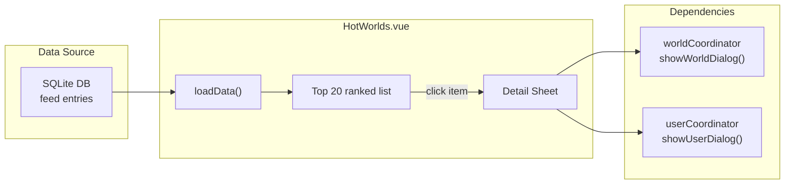

# Hot Worlds (Experimental)

Hot Worlds is an experimental tab in the Charts page that ranks VRChat worlds based on friend visit data from the local database.



## Overview

| Item | Details |
|------|---------|
| **Location** | Charts page → Hot Worlds tab |
| **Component** | `views/Charts/components/HotWorlds.vue` |
| **Data source** | `database.getHotWorlds(days)` — aggregates friend visit feed entries |
| **Status** | Experimental |

## Features

| Feature | Details |
|---------|---------|
| **Period selector** | ToggleGroup: 7 / 30 / 90 days (default: 30) |
| **Ranking** | Top 20 worlds sorted by unique friend count |
| **Two-column layout** | Splits top-20 into two columns for wider screens |
| **Progress bar** | Width proportional to `uniqueFriends / maxFriends` |
| **Trend indicators** | `TrendingUp` / `TrendingDown` icons per world (from `world.trend`) |
| **Summary stats** | Total worlds, rising/cooling counts, total visits |
| **Detail panel** | Side sheet showing friend visit breakdown per world |

## Data Flow

```
User selects period (7/30/90 days)
  → database.getHotWorlds(selectedDays)
  → Returns: [{ worldId, worldName, uniqueFriends, visitCount, trend, ... }]
  → Display top 20, compute columns/stats

User clicks a world row
  → openDetail(world)
  → database.getHotWorldFriendDetail(worldId, selectedDays)
  → Returns: [{ userId, displayName, visitCount }]
  → Display in Sheet panel
```

## Key Design Decisions

1. **Local data only**: All rankings are computed from the user's own feed database — no API calls to VRChat. This means the ranking reflects the user's friend circle, not global popularity.
2. **Capped at 20**: Only top 20 are displayed to keep the UI focused. The full dataset may contain more entries.
3. **Period resets detail**: Changing the period closes the detail sheet and reloads data.

## File Map

| File | Purpose |
|------|---------|
| `views/Charts/components/HotWorlds.vue` | Full component — data loading, display, detail sheet |
| `services/database.js` | `getHotWorlds()`, `getHotWorldFriendDetail()` queries |
