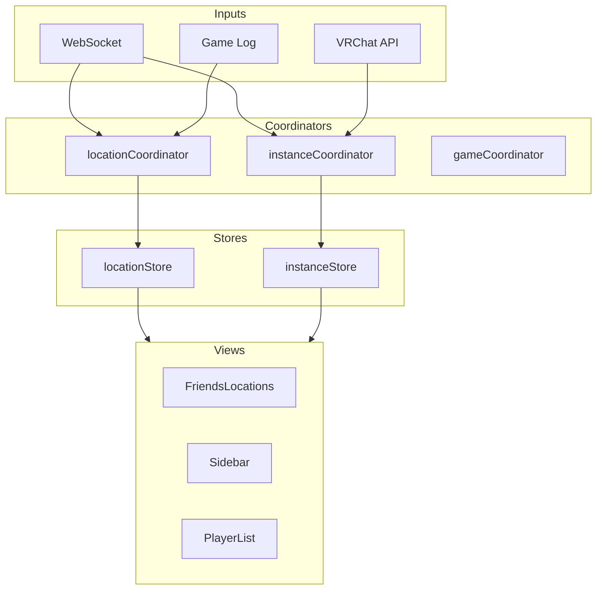
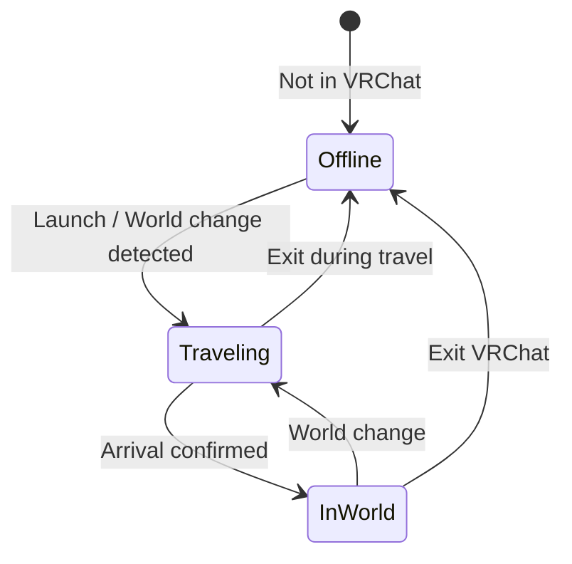

# Instance & Location System

The Instance & Location System tracks the current user's position in VRChat worlds and manages cached instance data for friends and other players.




## Overview

| Component | Details |
|-----------|--------|
| **locationStore** | lastLocation (current), lastLocation$traveling, $travelingToLocation |
| **instanceStore** | cachedInstances Map (200-entry LRU), playerList per instance, queuedInstances |
| **locationCoordinator** | runSetCurrentUserLocationFlow(), parseLocationTag() |
| **instanceCoordinator** | getInstance(), player list management |
| **gameCoordinator** | CheckGameRunning(), instance launch |
| **WebSocket** | user-location, friend-location |
| **VRChat API** | GET /instances/{id} |
| **Game Log** | Location events from VRChat log files |

## Location Tracking

### Current User Location States

The current user can be in one of these states:



**Key fields in locationStore:**

| Field | Type | Purpose |
|-------|------|---------|
| `lastLocation` | string | Current location tag (e.g., `wrld_xxx:12345~private(usr_yyy)`) |
| `lastLocation$traveling` | string | Location being traveled to |
| `$travelingToLocation` | boolean | Currently in transit |

### Location Tag Format

VRChat locations use a tag format:

```
wrld_xxxxxxxx-xxxx-xxxx-xxxx-xxxxxxxxxxxx:12345~type(usr_xxx)~region(us)~nonce(xxx)
│                                          │     │              │           │
│                                          │     │              │           └─ Nonce
│                                          │     │              └─ Region
│                                          │     └─ Instance type + owner
│                                          └─ Instance ID
└─ World ID
```

**Instance types:** `public`, `hidden`, `friends`, `private`, `group`

### Location Update Sources

Location data comes from multiple sources with different priorities:

| Source | Priority | Trigger | Latency |
|--------|----------|---------|---------|
| WebSocket `user-location` | Highest | Server push | ~1-5s |
| WebSocket `friend-location` | High | Server push | ~1-5s |
| Game Log file | Medium | File polling | Variable |
| API `GET /users/{id}` | Lower | Periodic refresh | 300s-3600s |

## Instance Store

### Cached Instances

The instance store maintains a **200-entry cache** based on `$fetchedAt` timestamp:

```javascript
cachedInstances = reactive(new Map())  // instanceId → instance data

// Each cached instance contains:
{
    id,                    // Full instance tag
    worldId,               // World ID portion
    instanceId,            // Numeric instance ID
    type,                  // public|hidden|friends|private|group
    ownerId,               // Instance owner user ID
    region,                // us|eu|jp
    capacity,              // Player limit
    userCount,             // Current player count
    users,                 // Player list preview
    $fetchedAt,            // Cache timestamp (for LRU)
    // ... world data, group data, etc.
}
```

### Player List Per Instance

Each instance tracks its player list. This data comes from:
1. **VRChat API** — `GET /instances/{id}` returns user list
2. **Game Log** — When current user is in the instance

### Queue System

VRChat supports instance queues (waiting to join full instances):

| Event | Handler | Effect |
|-------|---------|--------|
| `instance-queue-joined` | `instanceQueueUpdate()` | Add to `queuedInstances` |
| `instance-queue-position` | `instanceQueueUpdate()` | Update position |
| `instance-queue-ready` | `instanceQueueReady()` | Notify user, ready to join |
| `instance-queue-left` | `removeQueuedInstance()` | Remove from queue |

## Location Coordinator

### `runSetCurrentUserLocationFlow()`

Called when the current user's location changes (WebSocket `user-location` event):

```
runSetCurrentUserLocationFlow(location, $location_at)
├── Parse location tag → worldId, instanceId, type, region
├── Is this a new location? (different from lastLocation)
│   ├── Yes:
│   │   ├── Set $travelingToLocation = true
│   │   ├── Update lastLocation$traveling
│   │   ├── Fetch instance data from API
│   │   ├── Update instanceStore cache
│   │   ├── Create game log entry
│   │   └── Finalize: lastLocation = newLocation
│   └── No:
│       └── Refresh instance player count
└── Notify VR overlay if active
```

## Interaction with Other Systems

### Game Log Integration

The `gameLogCoordinator` creates location-related log entries:

| Event | When | Data Recorded |
|-------|------|---------------|
| `Location` | User enters a world | worldId, instanceId, player count |
| `OnPlayerJoined` | Another player joins | player userId, displayName |
| `OnPlayerLeft` | A player leaves | player userId, displayName |

### VR Overlay

Location data is displayed on the VR wrist overlay:
- Current world name
- Player count
- Friend list with location summaries

## Key Dependencies

| Module | Reads From | Writes To |
|--------|-----------|-----------|
| **locationStore** | — (leaf store) | — |
| **instanceStore** | user, friend, group, location, world, notification, sharedFeed, appearanceSettings | — |
| **locationCoordinator** | advancedSettings, gameLog, game, instance, location, notification, user, vr | location, instance, gameLog |
| **instanceCoordinator** | instance | instance |
| **gameCoordinator** | advancedSettings, avatar, gameLog, game, instance, launch, location, modal, notification, updateLoop, user, vr, world | game, instance, location |

::: tip Safe modification zone
`locationStore` is a **leaf store** — it has no cross-store dependencies. You can modify its internal structure safely without affecting other stores. However, many coordinators and views **read** from it, so changing its public API requires checking consumers.
:::

::: warning High-risk area
`instanceStore` has **6 dependent stores**. Changes to instance data shape can cascade to game log, notifications, shared feed, and VR overlay.
:::
