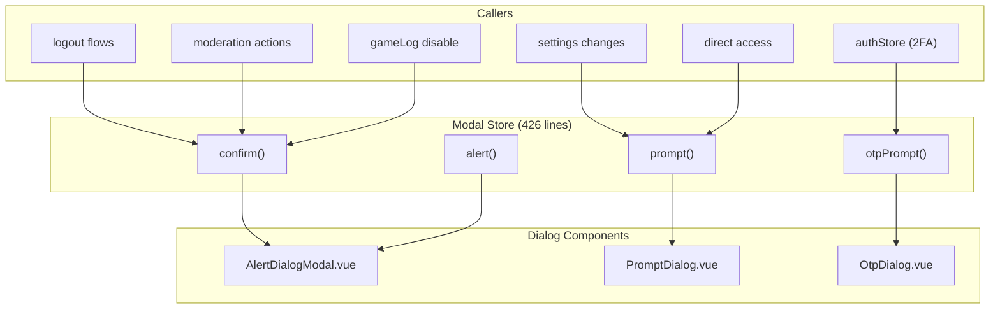

# Modal System

## Overview

The Modal System provides a centralized, promise-based dialog API for confirmations, alerts, text prompts, and OTP input. It replaces the need for scattered dialog state across stores — any store or coordinator can `await modalStore.confirm(...)` to get user input.



## API

### `confirm(options)` → `Promise<ConfirmResult>`

Shows a confirmation dialog with OK/Cancel buttons.

```js
const { ok, reason } = await modalStore.confirm({
    title: 'Confirm',
    description: 'Are you sure?',
    confirmText: 'Yes',        // optional, default: i18n 'Confirm'
    cancelText: 'No',          // optional, default: i18n 'Cancel'
    dismissible: true,         // optional, default: true
    destructive: false         // optional, use destructive button style
});
// reason: 'ok' | 'cancel' | 'dismiss' | 'replaced'
```

### `alert(options)` → `Promise<ConfirmResult>`

Shows an alert dialog with only an OK button. Both cancel and dismiss resolve as `ok`.

```js
const { ok } = await modalStore.alert({
    title: 'Notice',
    description: 'Something happened.',
    confirmText: 'Got it',     // optional
    dismissible: true,         // optional
    destructive: false         // optional
});
// ok is always true
```

### `prompt(options)` → `Promise<PromptResult>`

Shows a text input dialog with validation.

```js
const { ok, value } = await modalStore.prompt({
    title: 'Enter Name',
    description: 'Please enter a name.',
    inputValue: '',            // pre-fill value
    inputType: 'text',         // 'text' | 'password'
    pattern: /\S+/,            // validation regex
    errorMessage: 'Invalid',   // shown when pattern fails
    confirmText: 'Save',
    cancelText: 'Cancel',
    dismissible: true
});
```

### `otpPrompt(options)` → `Promise<PromptResult>`

Shows a specialized OTP input dialog for 2FA authentication.

```js
const { ok, reason, value } = await modalStore.otpPrompt({
    title: 'Enter Code',
    description: 'Enter your authenticator code.',
    mode: 'totp',              // 'totp' | 'emailOtp' | 'otp'
    confirmText: 'Verify',
    cancelText: 'Use Recovery Code',
    dismissible: true
});
// reason: 'ok' | 'cancel' | 'dismiss' | 'replaced'
// cancel can mean "switch to another 2FA method"
```

## Replacement Semantics

When a new dialog is opened while another is still pending, the old one is resolved with `reason: 'replaced'`:

```js
function openBase(mode, options) {
    if (pending) {
        // Old dialog force-finished — do NOT close visually
        finishWithoutClosing('replaced');
    }
    // Open new dialog
    return new Promise((resolve) => {
        pending = { resolve };
    });
}
```

This prevents promise leaks — callers always get a resolution.

## Dialog State

Each dialog type maintains independent state:

```js
// Alert/Confirm (shared)
alertOpen, alertMode, alertTitle, alertDescription,
alertOkText, alertCancelText, alertDismissible, alertDestructive

// Prompt
promptOpen, promptTitle, promptDescription,
promptOkText, promptCancelText, promptDismissible,
promptInputValue, promptInputType, promptPattern, promptErrorMessage

// OTP
otpOpen, otpTitle, otpDescription,
otpOkText, otpCancelText, otpDismissible, otpMode
```

## Usage Patterns

### Destructive Confirmation
```js
await modalStore.confirm({
    title: t('confirm.title'),
    description: t('confirm.delete_account'),
    destructive: true  // → red confirm button
});
```

### Chained 2FA Dialogs
```js
// Auth store chains OTP dialogs for method switching:
const { ok, reason, value } = await modalStore.otpPrompt({ mode: 'totp' });
if (reason === 'cancel') {
    // User wants recovery code instead
    return modalStore.otpPrompt({ mode: 'otp' });
}
```

## File Map

| File | Lines | Purpose |
|------|-------|---------|
| `stores/modal.js` | 426 | Promise-based dialog API |
| `components/ui/alert-dialog/AlertDialogModal.vue` | — | Confirm/Alert rendering |
| `components/dialogs/PromptDialog.vue` | — | Text input dialog |
| `components/dialogs/OtpDialog.vue` | — | OTP input dialog |

## Risks & Gotchas

- **Only one dialog per type can be open.** Opening a second `confirm()` while one is pending replaces the first (resolved as `'replaced'`).
- **`alert()` has no cancel semantics.** Both ESC/dismiss and clicking OK resolve as `ok: true`. This is by design.
- **`destructive` flag** is purely visual — it only changes the confirm button style. The actual destructive action is the caller's responsibility.
- **OTP mode** has semantic overloading: the "cancel" button in TOTP mode means "switch to recovery code," not "abort authentication."
