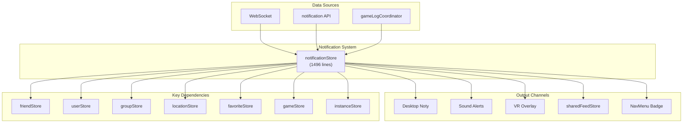
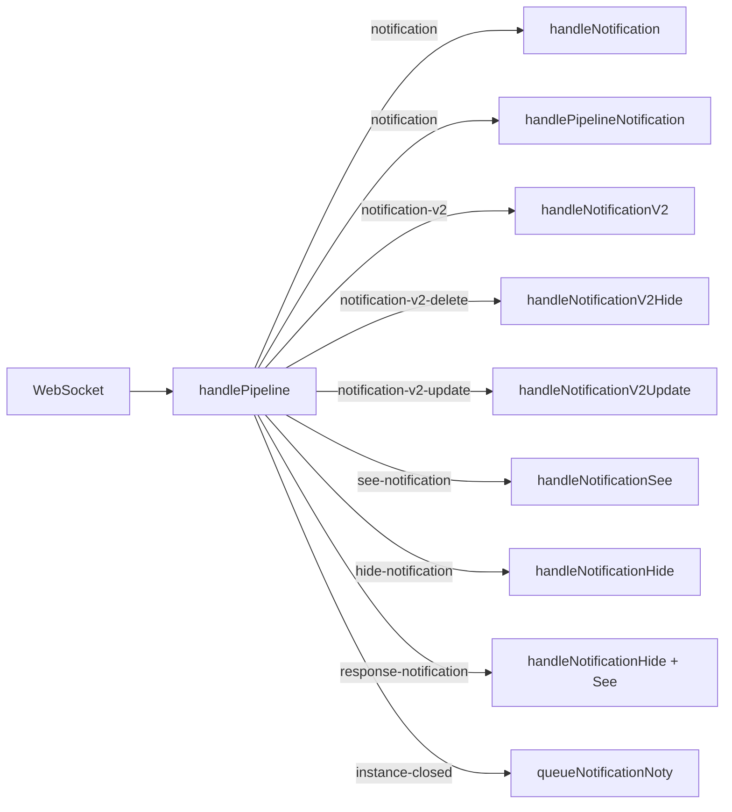
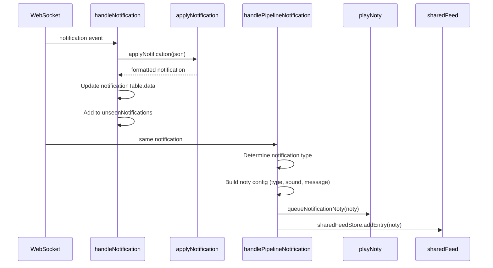
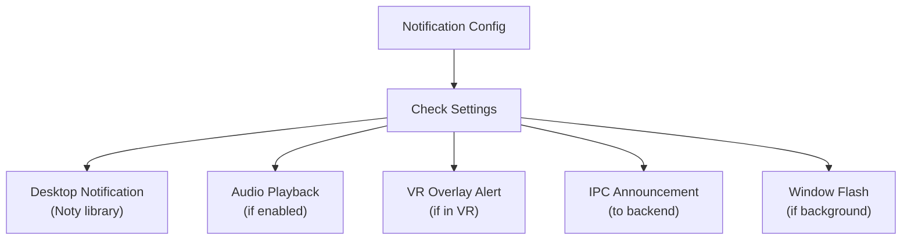

# Notification System

## Overview

The Notification System is the most complex single store in VRCX (1496 lines). It handles all notification types from VRChat — friend requests, invites, invite requests, vote kicks, instance closures — and bridges them into desktop notifications, sound alerts, VR overlay alerts, and the in-app notification center. With 15 dependent stores, it has the highest dependency count and the widest blast radius in the codebase.



## Notification Types

### V1 Notifications (Legacy)

| Type | Description | Source |
|------|-------------|--------|
| `friendRequest` | Incoming friend request | WS: `notification` |
| `requestInvite` | Someone requests invite to you | WS: `notification` |
| `requestInviteResponse` | Response to your invite request | WS: `notification` |
| `invite` | Direct invite to an instance | WS: `notification` |
| `inviteResponse` | Response to your invite | WS: `notification` |
| `voterequired` | Vote kick initiation | WS: `notification` |
| `boop` | Boop notification | WS: `notification` |

### V2 Notifications (New)

| Type | Description | Source |
|------|-------------|--------|
| `group.announcement` | Group announcement | WS: `notification-v2` |
| `group.invite` | Group join invite | WS: `notification-v2` |
| `group.joinRequest` | Group join request | WS: `notification-v2` |
| `group.queueReady` | Group instance queue ready | WS: `notification-v2` |
| `group.informative` | Group info notification | WS: `notification-v2` |
| `instance.closed` | Instance closed notification | WS: `instance-closed` |

### GameLog Notifications

| Type | Description | Source |
|------|-------------|--------|
| `OnPlayerJoined` | Player joined current instance | GameLog |
| `OnPlayerLeft` | Player left current instance | GameLog |
| `PortalSpawn` | Portal spawned in world | GameLog |
| `AvatarChange` | Player changed avatar | GameLog |
| `Event` | Custom Udon event | GameLog |
| `VideoPlay` | Video player started | GameLog |

## State Shape

```js
// Notification table — displayed in Notification Center
notificationTable: {
    data: [],                                      // all notifications
    search: '',
    filters: [
        { prop: 'type', value: [] },              // type filter
        { prop: ['senderDisplayName'], value: '' } // text filter
    ],
    pageSize: 20,
    pageSizeLinked: true,
    paginationProps: { layout: 'sizes,prev,pager,next,total' }
}

unseenNotifications: []    // notification IDs not yet seen
isNotificationsLoading: false
isNotificationCenterOpen: false
```

### Computed Properties

```js
// Friend-category notifications
friendNotifications = notificationTable.data.filter(n => category === 'friend')

// Group-category notifications
groupNotifications = notificationTable.data.filter(n => category === 'group')

// Recently received (not yet seen and within time window)
recentFriendNotifications = friendNotifications.filter(n => !unseen && recent)
recentGroupNotifications = groupNotifications.filter(n => !unseen && recent)
```

## WebSocket Event Handling

### Pipeline Dispatch



### V1 Notification Processing



### `handlePipelineNotification` — The Big Switch

This ~120-line function handles all V1 notification types. For each type it:

1. Determines the notification message (with i18n)
2. Sets the appropriate sound
3. Determines whether to show desktop notification
4. Checks if friend is a favorite (for VIP alerts)
5. Handles special actions (e.g., auto-accept invites)
6. Queues the notification for display

**Special behaviors:**
- **`requestInvite`**: Can auto-accept based on settings
- **`invite`**: Shows location details, handles `canInvite` check
- **`friendRequest`**: Triggers `handleFriendAdd()` if auto-accepted
- **`boop`**: Legacy handling with compatibility for old boop format

## Mark as Seen System

The notification system uses a **queued batch processing** approach for marking notifications as seen:

```js
const seeQueue = [];       // pending notification IDs
const seenIds = new Set();  // already-processed IDs
let seeProcessing = false;  // mutex

// Queue a notification to be marked as seen
function queueMarkAsSeen(notificationId, version = 1) {
    if (seenIds.has(notificationId)) return;
    seenIds.add(notificationId);
    seeQueue.push({ id: notificationId, version });
    processSeeQueue();
}

// Process queue sequentially with retry logic
async function processSeeQueue() {
    if (seeProcessing) return;
    seeProcessing = true;
    while (seeQueue.length > 0) {
        const item = seeQueue.shift();
        try {
            await notificationAPI.see(item);
        } catch (err) {
            if (shouldRetry(err)) {
                seeQueue.unshift(item); // retry at front
                await delay(429_RETRY_MS);
            }
        }
    }
    seeProcessing = false;
}
```

**Batch mark all as seen:**
```js
function markAllAsSeen() {
    for (const n of notificationTable.data) {
        if (!seenIds.has(n.id)) {
            queueMarkAsSeen(n.id, n.$version || 1);
        }
    }
    unseenNotifications = [];
}
```

## Desktop Notification System (`playNoty`)

The `playNoty` function (~145 lines) is the unified notification renderer. It handles:



**Configuration options per notification type:**
- Enable/disable desktop notification
- Sound file selection
- Volume
- Custom sound override
- VR wrist overlay display
- Detailed message vs. summary

**Sound playback:**
Each notification type can have an independent sound configuration:
```js
function playNoty(noty) {
    // 1. Check if notification type is enabled in settings
    // 2. Play configured sound (if any)
    // 3. Show Noty desktop notification
    // 4. Send to VR overlay (if game running)
    // 5. Flash window (if not focused)
    // 6. Send IPC announcement for TTS/external integrations
}
```

## Notification Refresh

On login, `refreshNotifications()` fetches all active notifications from the API:

```js
async function refreshNotifications() {
    // 1. Fetch all active notifications (paginated)
    // 2. Apply each notification via applyNotification()
    // 3. Fetch all active v2 notifications
    // 4. Apply each v2 notification via applyNotificationV2()
    // 5. Expire old friend request notifications
}
```

## File Map

| File | Lines | Purpose |
|------|-------|---------|
| `stores/notification/index.js` | 1496 | All notification state, handlers, noty queue, mark-as-seen |
| `stores/notification/notificationUtils.js` | — | Utility functions for notification categorization |
| `api/notification.js` | — | API request wrappers for notification endpoints |

## Key Dependencies

| Dependency | Direction | Purpose |
|-----------|-----------|---------|
| `friendStore` | read | Check if sender is friend/favorite |
| `favoriteStore` | read | Check VIP favorite status for sounds |
| `groupStore` | read | Show group dialog from group notifications |
| `locationStore` | read | Get current location for invite checking |
| `userStore` | read | Get user refs, show user dialog |
| `gameStore` | read | Check if game running (for VR notifications) |
| `instanceStore` | read | Instance details for invite notifications |
| `sharedFeedStore` | write | Push notification entries to feed |
| `uiStore` | write | `notifyMenu('notification')` badge update |
| `wristOverlaySettingsStore` | read | VR notification configuration |
| `generalSettingsStore` | read | Notification enable/disable settings |

## Risks & Gotchas

- **1496 lines in a single store.** This is the largest store and a candidate for future extraction into multiple coordinators.
- **15 store dependencies.** Any change to dependent stores' APIs can cascade here.
- **The `playNoty` function** directly uses the `Noty` library AND `vue-sonner` toasts — two different notification rendering systems coexist.
- **`unseenNotifications`** is an array of IDs, not a Set. Linear scan performance degrades with many unseen notifications.
- **V1 and V2 notifications** use different data shapes and different API endpoints. The store maintains parallel handling paths.
- **Sound playback** happens on the main thread via `Audio()` API — a burst of notifications can cause audio stacking.
- **Rate limit handling** in `processSeeQueue` uses simple retry with `shouldRetry(err)` — if the VRC API returns 429, the queue backs off but continues.
