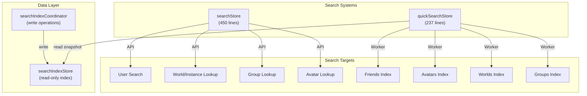
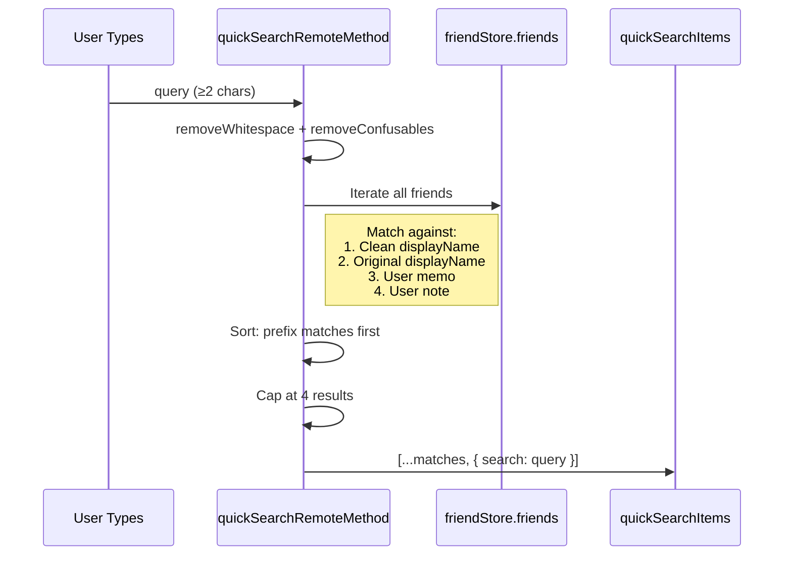
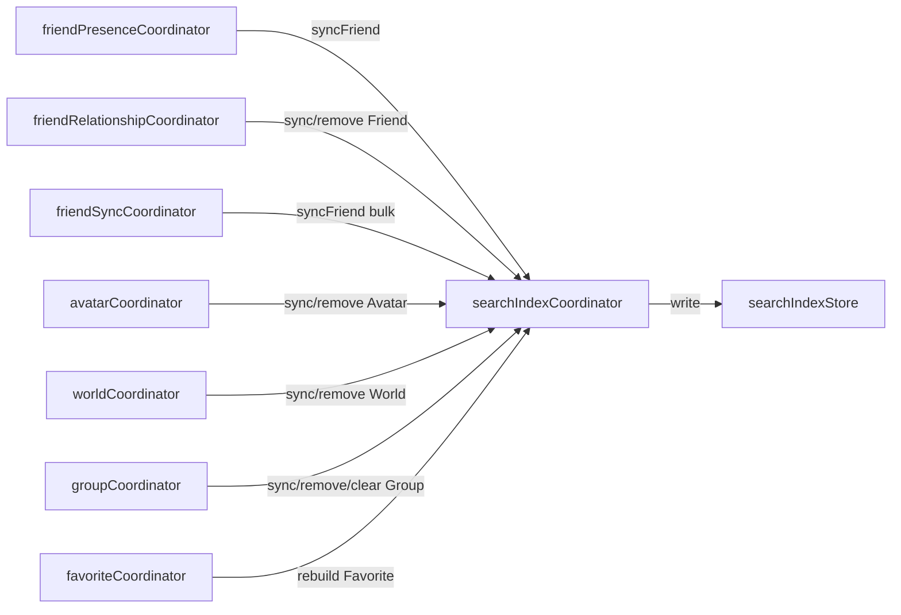
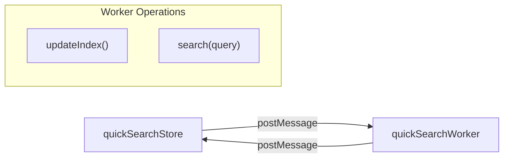

# Search & Direct Access

VRCX has two search systems that serve different scopes: **Search Store** for VRC API-powered search and direct entity access, and **Quick Search** for client-side fuzzy search across indexed local data via Web Worker.

## Overview

## Search Store (`searchStore`)

### Quick Search

The top-bar search component uses quick search for instant friend lookup:

**Key behaviors:**
- Uses `Intl.Collator` with locale-aware case-insensitive comparison
- Falls back to user history (last 5 viewed users) when query is empty
- Appends a "search for..." option at the end of results
- Confusables removal (`removeConfusables`) normalizes Unicode lookalike characters

### Direct Access Parser

The `directAccessParse(input)` function is a universal entity resolver that parses various input formats:

| Input Format | Entity | Example |
|-------------|--------|---------|
| `usr_xxxx` | User | `usr_12345678-abcd-...` |
| `avtr_xxxx` / `b_xxxx` | Avatar | `avtr_12345678-abcd-...` |
| `wrld_xxxx` / `wld_xxxx` / `o_xxxx` | World | `wrld_12345678-abcd-...` |
| `grp_xxxx` | Group | `grp_12345678-abcd-...` |
| `XXX.0000` (short code) | Group | `ABC.1234` |
| `https://vrchat.com/home/user/usr_xxxx` | User | VRChat URL |
| `https://vrchat.com/home/world/wrld_xxxx` | World | VRChat URL |
| `https://vrchat.com/home/avatar/avtr_xxxx` | Avatar | VRChat URL |
| `https://vrchat.com/home/group/grp_xxxx` | Group | VRChat URL |
| `https://vrc.group/XXX.0000` | Group | Short group URL |
| `https://vrch.at/XXXXXXXX` | Instance | Short instance URL |
| `https://vrchat.com/home/launch?worldId=...` | Instance | Launch URL |
| `XXXXXXXX` (8 chars) | Instance | Short name |
| `XXXXXXXXXX` (10 alphanum) | User | Display name-style ID |

**Priority:** World → VRChat URL → Short group URL → Short code → Entity prefix → Alphanumeric ID

### Direct Access Paste

`directAccessPaste()` reads from clipboard (platform-aware: Electron vs CEF), attempts to parse, and falls back to the omni-access dialog if parsing fails.

## Search Index Architecture

### Three-Layer Separation

The search index uses a strict three-layer architecture:

1. **`searchIndexStore`** — Pure data container holding indexed friends, avatars, worlds, groups, and favorites. Exposes read-only `getSnapshot()` for the Worker and a `version` counter for change tracking.
2. **`searchIndexCoordinator`** — The **sole write entry point** for all search index mutations. No other coordinator, store, or view may call `useSearchIndexStore()` directly for writes.
3. **`quickSearchStore`** — Consumes the index read-only via `getSnapshot()`, sends data to a Web Worker for off-thread search.

### searchIndexCoordinator API

| Function | Purpose |
|----------|---------|
| `syncFriendSearchIndex(ctx)` | Upsert friend into index |
| `removeFriendSearchIndex(id)` | Remove friend from index |
| `clearFriendSearchIndex()` | Clear all friends |
| `syncAvatarSearchIndex(ref)` | Upsert avatar into index |
| `removeAvatarSearchIndex(id)` | Remove avatar from index |
| `clearAvatarSearchIndex()` | Clear all avatars |
| `syncWorldSearchIndex(ref)` | Upsert world into index |
| `removeWorldSearchIndex(id)` | Remove world from index |
| `clearWorldSearchIndex()` | Clear all worlds |
| `syncGroupSearchIndex(ref)` | Upsert group into index |
| `removeGroupSearchIndex(id)` | Remove group from index |
| `clearGroupSearchIndex()` | Clear all groups |
| `rebuildFavoriteSearchIndex()` | Rebuild favorites from store |
| `clearFavoriteSearchIndex()` | Clear all favorites |
| `resetSearchIndexOnLogin()` | Watch `isLoggedIn`, clear all on transition |

### Write Call Sites

## Quick Search Store (`quickSearchStore`)

### Web Worker Architecture

The quick search uses a dedicated Web Worker to avoid blocking the UI thread:

1. **Index Snapshot:** When the dialog opens, sends a full data snapshot to the worker via `searchIndexStore.getSnapshot()`
2. **Search Execution:** Queries are sent to the worker, which returns ranked results
3. **Re-indexing:** Triggered reactively when `searchIndexStore.version` changes while the dialog is open

### Search Categories

| Category | Data Source | Indexed Fields |
|----------|-----------|----------------|
| Friends | `friendStore.friends` | displayName, memo, note |
| Own Avatars | `avatarStore` (filtered by authorId) | name |
| Favorite Avatars | `favoriteStore` | name |
| Own Worlds | `worldStore` (filtered by authorId) | name |
| Favorite Worlds | `favoriteStore` | name |
| Own Groups | `groupStore` (filtered by ownerId) | name |
| Joined Groups | `groupStore.currentUserGroups` | name |

## File Map

| File | Lines | Purpose |
|------|-------|---------|
| `stores/search.js` | 450 | Quick search, direct access, user search API |
| `stores/searchIndex.js` | ~260 | Search index data container |
| `stores/quickSearch.js` | 237 | Worker-based quick search orchestration |
| `stores/quickSearchWorker.js` | 373 | Web Worker: confusables, locale search |
| `coordinators/searchIndexCoordinator.js` | 107 | Centralized search index write operations |

## Risks & Gotchas

- **Quick search iterates ALL friends** on every keystroke (debounced). For users with 5000+ friends, this can be noticeable.
- **`removeConfusables`** handles Unicode normalization but may miss new Unicode characters.
- **Direct access parsing** uses regex and string prefix matching — some edge cases with malformed URLs may not parse correctly.
- **The search worker** holds a complete copy of all indexed data in memory. This doubles the memory usage for friend data.
- **Known architecture compromise**: `friend.js` and `user.js` still import `searchIndexCoordinator` directly (store → coordinator reverse dependency) for async memo/note loading callbacks.
