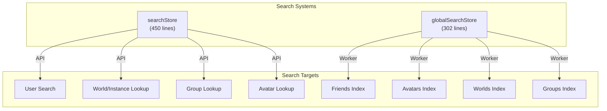
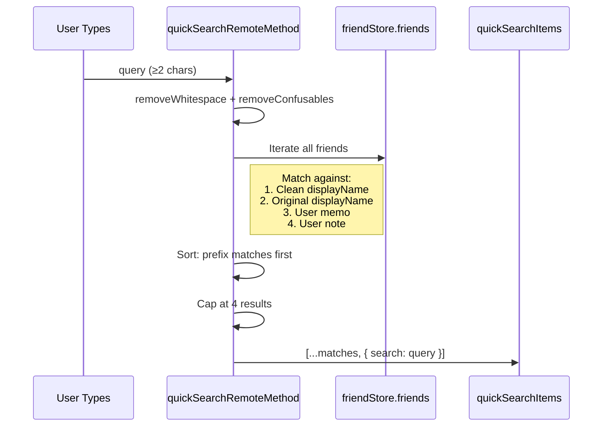
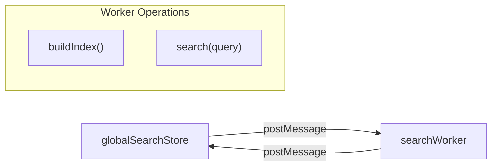

# Search & Direct Access

## Overview

VRCX has two search systems that serve different scopes: **Search Store** for VRC API-powered search and direct entity access, and **Global Search Store** for client-side fuzzy search across indexed local data via Web Worker.

## Search Store (`searchStore`)

### Quick Search

The top-bar search component uses quick search for instant friend lookup:

**Key behaviors:**
- Uses `Intl.Collator` with locale-aware case-insensitive comparison
- Falls back to user history (last 5 viewed users) when query is empty
- Appends a "search for..." option at the end of results
- Confusables removal (`removeConfusables`) normalizes Unicode lookalike characters

### Direct Access Parser

The `directAccessParse(input)` function is a universal entity resolver that parses various input formats:

| Input Format | Entity | Example |
|-------------|--------|---------|
| `usr_xxxx` | User | `usr_12345678-abcd-...` |
| `avtr_xxxx` / `b_xxxx` | Avatar | `avtr_12345678-abcd-...` |
| `wrld_xxxx` / `wld_xxxx` / `o_xxxx` | World | `wrld_12345678-abcd-...` |
| `grp_xxxx` | Group | `grp_12345678-abcd-...` |
| `XXX.0000` (short code) | Group | `ABC.1234` |
| `https://vrchat.com/home/user/usr_xxxx` | User | VRChat URL |
| `https://vrchat.com/home/world/wrld_xxxx` | World | VRChat URL |
| `https://vrchat.com/home/avatar/avtr_xxxx` | Avatar | VRChat URL |
| `https://vrchat.com/home/group/grp_xxxx` | Group | VRChat URL |
| `https://vrc.group/XXX.0000` | Group | Short group URL |
| `https://vrch.at/XXXXXXXX` | Instance | Short instance URL |
| `https://vrchat.com/home/launch?worldId=...` | Instance | Launch URL |
| `XXXXXXXX` (8 chars) | Instance | Short name |
| `XXXXXXXXXX` (10 alphanum) | User | Display name-style ID |

**Priority:** World → VRChat URL → Short group URL → Short code → Entity prefix → Alphanumeric ID

### Direct Access Paste

`directAccessPaste()` reads from clipboard (platform-aware: Electron vs CEF), attempts to parse, and falls back to the omni-access dialog if parsing fails.

## Global Search Store (`globalSearchStore`)

### Web Worker Architecture

The global search uses a dedicated Web Worker to avoid blocking the UI thread:

1. **Index Building:** On login, sends all friends, avatars, worlds, and groups to the worker for indexing
2. **Search Execution:** Queries are sent to the worker, which returns ranked results
3. **Re-indexing:** Triggered when data changes (new friends, updated favorites, etc.)

### Search Categories

| Category | Data Source | Indexed Fields |
|----------|-----------|----------------|
| Friends | `friendStore.friends` | displayName, memo, note |
| Avatars | `avatarStore` + `favoriteStore` | name, authorName |
| Worlds | `favoriteStore` | name, authorName |
| Groups | `groupStore.currentUserGroups` | name, shortCode |

## File Map

| File | Lines | Purpose |
|------|-------|---------|
| `stores/search.js` | 450 | Quick search, direct access, user search API |
| `stores/globalSearch.js` | 302 | Worker-based global fuzzy search |

## Risks & Gotchas

- **Quick search iterates ALL friends** on every keystroke (debounced). For users with 5000+ friends, this can be noticeable.
- **`removeConfusables`** handles Unicode normalization but may miss new Unicode characters.
- **Direct access parsing** uses regex and string prefix matching — some edge cases with malformed URLs may not parse correctly.
- **The search worker** holds a complete copy of all indexed data in memory. This doubles the memory usage for friend data.
