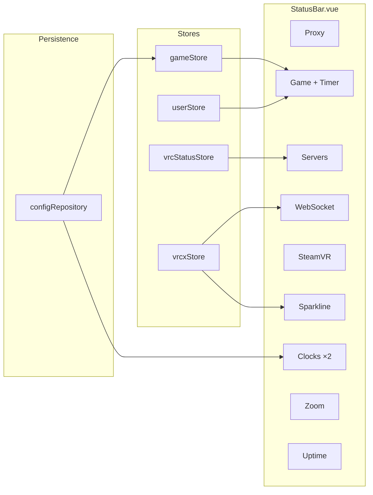
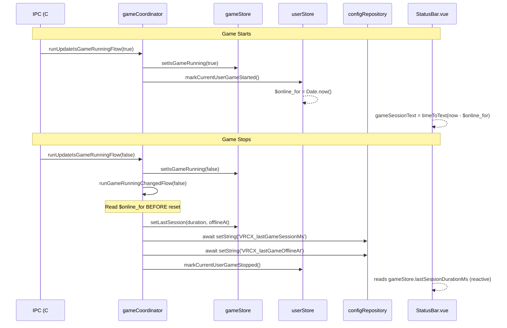

# Status Bar System

The Status Bar is a fixed 22px strip at the bottom of the application, providing at-a-glance system status, game session tracking, and configurable timezone clocks.



## Overview

## Indicators

| Indicator | Data Source | Interaction |
|-----------|-----------|-------------|
| **Proxy** | `generalSettingsStore.proxyEnabled` | Tooltip |
| **Game** | `gameStore.isGameRunning` + `userStore.currentUser.$online_for` | HoverCard (session details) |
| **Servers** | `vrcStatusStore.hasIssue` + `isMajor` | HoverCard (incident list); dot color: red if `isMajor`, amber otherwise |
| **WebSocket** | `vrcxStore.wsConnected` | Tooltip |
| **SteamVR** | `gameStore.isSteamVRRunning` | Tooltip |
| **Sparkline** | `vrcxStore.wsMessageRates` | Canvas graph (msg/min) |
| **Clocks** | `dayjs` + UTC offset config | Click to configure |
| **Zoom** | `generalSettingsStore.zoomLevel` | NumberField ± buttons |
| **Uptime** | `vrcxStore.startTime` | Tooltip |

All indicators are toggleable via right-click context menu. Visibility is persisted to `configRepository` as `VRCX_statusBarVisibility`.

## Game Session Timer

### Feature Summary

- **Running**: Displays live elapsed time next to the "Game" label (e.g. `1h 30m`, no seconds)
- **Running + Hover**: HoverCard shows started time (`MM/DD HH:mm`) and precise duration with seconds (`1h 30m 25s`)
- **Stopped + Hover**: HoverCard shows last session duration and offline-since time (`MM/DD HH:mm`)
- **No history**: HoverCard hidden when no previous session exists

### Data Flow



### Key Design Decisions

1. **Store-first, DB-second**: Session data is set on `gameStore` synchronously via `setLastSession()`, then persisted to `configRepository` with `await`. This avoids the read/write race condition where the StatusBar's watch would fire before the DB write completes.

2. **Timing of $online_for capture**: The session start timestamp (`$online_for`) is read in `gameCoordinator` *before* calling `markCurrentUserGameStopped()`, which resets it to `0`.

3. **Startup restoration**: `gameStore.init()` loads persisted session data from `configRepository`, so last session info survives app restarts.

### Persistence Keys

| Key | Type | Purpose |
|-----|------|---------|
| `VRCX_lastGameSessionMs` | String (number) | Duration of last game session in milliseconds |
| `VRCX_lastGameOfflineAt` | String (number) | Timestamp when last game session ended |

## Font Strategy

The status bar uses a custom font stack `--font-mono-cjk` defined in `fonts.css`:

```css
--font-mono-cjk:
    ui-monospace, SFMono-Regular, Menlo, Monaco, Consolas,
    'Liberation Mono', 'Courier New',
    var(--font-primary-cjk), monospace;
```

- **ASCII characters**: Rendered with system monospace fonts (retro terminal aesthetic)
- **CJK characters**: Falls back to the project's Noto Sans CJK stack (`--font-primary-cjk`), which reorders by language via `:root[lang]` selectors

This ensures the status bar looks good in all 14 supported languages.

## Clock System

Up to 3 configurable timezone clocks, each with:
- UTC offset (-12 to +14, 0.5h increments)
- Display format: `HH:mm UTC±N`

Configuration stored in `configRepository` as:
- `VRCX_statusBarClocks` — JSON array of 3 clock configs
- `VRCX_statusBarClockCount` — Number of visible clocks (0–3, default: 2)

## Platform Compatibility

| Feature | Windows (CEF) | macOS (Electron) |
|---------|:---:|:---:|
| Proxy indicator | ✅ | ❌ (AppApi unavailable) |
| Game indicator | ✅ | ❌ |
| SteamVR indicator | ✅ | ❌ |
| Servers, WS, Sparkline, Clocks, Zoom, Uptime | ✅ | ✅ |

## i18n Keys

All status bar strings are under the `status_bar` namespace in localization files:

| Key | EN Value | Purpose |
|-----|----------|---------|
| `game` | Game | Label |
| `game_running` | VRChat is running | — |
| `game_stopped` | VRChat is not running | — |
| `game_started_at` | Started | Hover: game start time |
| `game_session_duration` | Duration | Hover: precise session length |
| `game_last_session` | Last Session | Hover: previous session length |
| `game_last_offline` | Offline Since | Hover: previous offline time |

## Server Status Severity

`vrcStatusStore` exposes two new reactive fields for severity-aware rendering:

| Field | Type | Purpose |
|-------|------|---------|
| `lastStatusIndicator` | `ref('')` | Raw indicator string from Statuspage API (`'minor'`, `'major'`, `'critical'`, etc.) |
| `isMajor` | `computed` | `true` when `lastStatusIndicator === 'major'` |

The StatusBar dot uses `bg-destructive` (red) when `isMajor` is true, and `bg-status-askme` (amber) otherwise.

## Login Page Server Alert

When `vrcStatusStore.hasIssue` is `true`, the **Login page** (`Login.vue`) displays an `<Alert>` banner above the login form:

- **Variant**: `destructive` (red) if `isMajor`, `warning` (amber) otherwise
- **Content**: `statusText` from `vrcStatusStore` (incident description)
- **Click**: Opens the VRChat status page via `vrcStatusStore.openStatusPage()`

This ensures users are aware of server issues before attempting to log in.
