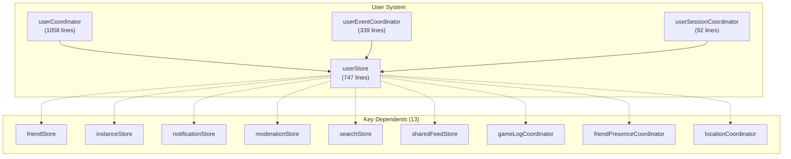
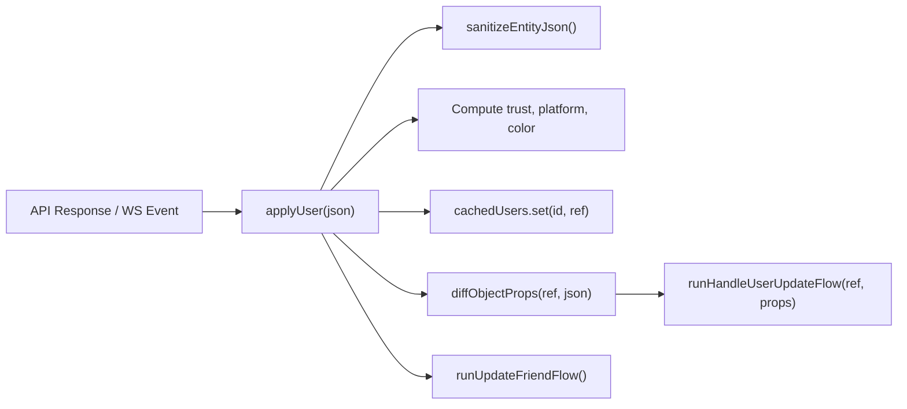
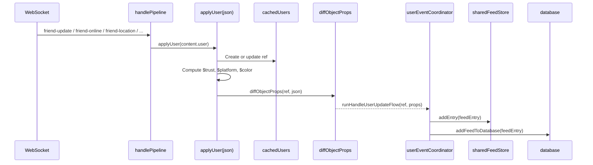

# User System

The User System is the **central hub** of the VRCX data model. It manages the current user's state, cached user references for all known users, the user dialog (a 12-tab user detail popup), and user-related coordinators that bridge API responses into reactive state. With 13 direct dependents, changes to the User System have the highest blast radius of any store in the codebase.



## Overview


## State Shape

### `currentUser` — The Logged-in User

```js
currentUser: {
    // VRC API fields
    id: '',
    displayName: '',
    currentAvatar: '',
    currentAvatarThumbnailImageUrl: '',
    status: '',               // 'active', 'join me', 'ask me', 'busy', 'offline'
    statusDescription: '',
    bio: '',
    friends: [],              // friend userId array
    onlineFriends: [],
    activeFriends: [],
    offlineFriends: [],
    homeLocation: '',
    presence: { ... },        // real-time presence data
    queuedInstance: '',

    // VRCX-computed fields ($ prefix)
    $isVRCPlus: false,
    $isModerator: false,
    $trustLevel: 'Visitor',
    $trustClass: 'x-tag-untrusted',
    $userColour: '',
    $languages: [],
    $locationTag: '',
    $travelingToLocation: ''
}
```

### `cachedUsers` — All Known Users

```js
// Managed by userCoordinator.applyUser()
// Key: userId, Value: reactive user reference
const cachedUsers = shallowReactive(new Map());
```

Every user encountered through friend lists, instance player lists, search results, or WebSocket events is cached here. The cache uses `shallowReactive` for performance — only the Map membership triggers reactivity, not deep property changes on individual user objects.

### `userDialog` — 12-Tab User Detail Popup

```js
userDialog: {
    visible: false,
    loading: false,
    activeTab: 'Info',       // Info | Worlds | Avatars | Favorites | Groups | Activity | JSON | ...
    id: '',                  // userId being viewed
    ref: {},                 // cached user reference
    friend: {},              // friend context (if friend)
    isFriend: false,
    note: '',                // VRC user note
    memo: '',                // VRCX local memo
    previousDisplayNames: [],
    dateFriended: '',
    mutualFriendCount: 0,
    mutualGroupCount: 0,
    mutualFriends: [],
    // ... 30+ more fields for various tabs
}
```

## Core Coordinators

### `userCoordinator.js` (1058 lines)

The largest coordinator in the codebase. Key functions:

#### `applyUser(json)` — Entity Transform

The most critical function in the entire application. Every user data update passes through here:



**Processing steps:**
1. Sanitize raw API JSON (`sanitizeEntityJson`)
2. Create or update cached user ref
3. Compute derived fields:
   - `$trustLevel` / `$trustClass` — from tags array
   - `$userColour` — from custom tags or trust level
   - `$platform` / `$previousPlatform` — from platform string
   - `$isVRCPlus` / `$isModerator` / `$isTroll` — from tags
   - `$languages` — from language tags
4. Diff old vs new props → emit change events
5. Update friend state if applicable

#### `applyCurrentUser(json)` — Current User Hydration

Significantly more complex than `applyUser()` — 220 lines. Handles:
- First login initialization (`runFirstLoginFlow`)
- Avatar swap detection (`runAvatarSwapFlow`)
- Home location sync (`runHomeLocationSyncFlow`)
- Post-apply cross-store sync (`runPostApplySyncFlow`)
- Friend list friendship updates
- Queued instance processing
- Status change detection → auto state change logic

#### `showUserDialog(userId)` — Dialog Opening

~260 lines handling:
1. Check cache for existing user data
2. Fetch fresh data from API
3. Load local data (memo, friend date, notes, previous display names)
4. Populate all dialog fields
5. Fetch avatar info, mutual friends, mutual groups
6. Apply location data to dialog

#### `updateAutoStateChange()` — Auto Status

Automatically changes user status based on game state:
- Game running + in VR → set configured VR status
- Game not running → restore previous status
- Configurable via `generalSettingsStore.autoStateChange`

### `userEventCoordinator.js` (339 lines)

Single function: `runHandleUserUpdateFlow(ref, props)`. This is the **change event dispatcher** — when `applyUser()` detects property diffs, this function:

1. Generates feed entries for each change type:
   - Status changes → feed entry + desktop notification
   - Location changes (GPS) → feed entry + Noty notification
   - Avatar changes → feed entry
   - Bio changes → feed entry
   - Online/Offline transitions → feed entry + VR notification
2. Writes to database via `database.addFeedToDatabase()`
3. Pushes to `sharedFeedStore.addEntry()` for dashboard/VR overlay
4. Handles the **170-second pending offline** mechanism for offline events

### `userSessionCoordinator.js` (92 lines)

Four small flows triggered during current user processing:

| Function | Purpose |
|----------|---------|
| `runAvatarSwapFlow` | Detect avatar change, record to history, track wear time |
| `runFirstLoginFlow` | One-time setup: clear cache, set currentUser, call `loginComplete()` |
| `runPostApplySyncFlow` | Sync groups, queued instances, friendships after data apply |
| `runHomeLocationSyncFlow` | Parse home location, update dialog if visible |

## Data Flow

### User Update Pipeline



### WebSocket Events → User Updates

| WS Event | Action |
|----------|--------|
| `friend-online` | Merge `content.user` with location data → `applyUser()` |
| `friend-active` | Set state='active', location='offline' → `applyUser()` |
| `friend-offline` | Set state='offline' → `applyUser()` |
| `friend-update` | Direct `applyUser(content.user)` |
| `friend-location` | Merge location fields → `applyUser()` |
| `user-update` | `applyCurrentUser(content.user)` for self |
| `user-location` | `runSetCurrentUserLocationFlow()` for self |

## Activity Heatmap

> **Full documentation**: See [Activity System](./activity-system.md) for the complete architecture, data flow, and database schema.

The **Activity** tab (`UserDialogActivityTab.vue`) displays an ECharts heatmap visualizing a user's online frequency by day-of-week × hour-of-day. It is powered by the three-layer Activity System: `activityStore` → `activityEngine` → `activityWorker`.

### Data Source

- **Self (current user)**: Queries `gamelog_location` for per-instance join/leave timestamps → `buildSessionsFromGamelog()`
- **Friend**: Queries `feed_online_offline` for online/offline transition events → `buildSessionsFromEvents()`
- Sessions are cached in-memory (LRU, max 12 users) and persisted to `activity_sessions_v2` / `activity_sync_state_v2` tables
- Heatmap buckets and normalization are computed in a dedicated Web Worker and cached in `activity_bucket_cache_v2`

### Features

| Feature | Details |
|---------|---------|
| **Activity Heatmap** | 7×24 grid showing online frequency by day × hour |
| **Overlap Charts** | Compare online times between current user and any friend |
| **Top Worlds** | Ranked list of most-visited worlds (by time or visit count), with option to exclude home world |
| **Peak Stats** | Most active day and most active time slot above the chart |
| **Period Filter** | 7, 30, 90, 180 days selectable via dropdown |
| **Exclude Hours** | Filter out sleeping/inactive hours from overlap analysis |
| **Dark Mode** | Adapts color scheme via `isDarkMode` watch |
| **Refresh** | Manual reload button; auto-loads when the tab becomes active |
| **Context Menu** | Right-click to save chart as PNG |
| **Empty State** | Shows `DataTableEmpty` when no data found |

### Three Refresh Strategies

| Strategy | When | What It Does |
|----------|------|-------------|
| **Full Refresh** | First load or force refresh | Fetches all source data, builds sessions from scratch |
| **Incremental** | Subsequent loads | Fetches only events after cursor, merges new sessions |
| **Range Expansion** | User selects longer period | Fetches older events, prepends sessions |

- **Files**: `UserDialogActivityTab.vue`, `stores/activity.js`, `shared/utils/activityEngine.js`, `workers/activityWorker.js`

## Previous Instances Chart View

The Previous Instances dialog (`PreviousInstancesInfoDialog.vue`) adds a **chart view** toggle alongside the existing table view. The chart uses ECharts to visualize session visit data as a timeline.

- **Toggle**: `ToggleGroup` switches between `table` and `chart` views
- **Data**: `database.getPlayerDetailFromInstance()` fetches per-player visit detail
- **Component**: `PreviousInstancesInfoChart.vue`

## UserDialog Tab Search

Four UserDialog tabs now support **client-side search** via a text input that filters the displayed list:

| Tab | Search Scope | Implementation |
|-----|-------------|----------------|
| **Mutual Friends** | `displayName` | Filter `mutualFriends` array |
| **Groups** | `name` | Filter across all group divisions (own, mutual, remaining) as a flat list; group division headers hidden during search |
| **Worlds** | `name` | Filter `userWorlds` array |
| **Favorite Worlds** | `name` | Filter across all sub-tabs; sub-tab navigation hidden during search |

Search is case-insensitive and visible for all user profiles (not just the current user).

## Social Status Presets

Users can save and quickly apply social status presets (status + statusDescription combinations).

### Architecture

```
useStatusPresets() composable
├── presets: ref([])              // Reactive preset array
├── addPreset(status, desc)       // Add new, returns 'ok' | 'exists' | 'limit'
├── removePreset(index)           // Remove by index
├── getStatusClass(status)        // CSS class mapping
└── MAX_PRESETS = 10              // Hard limit
```

### Data Flow

- **Storage**: `configRepository` key `VRCX_statusPresets` (JSON array)
- **Load**: Lazy-loaded once on first `useStatusPresets()` call
- **Apply**: Clicking a preset fills `socialStatusDialog.status` and `socialStatusDialog.statusDescription`
- **Delete**: Hover reveals an X button on each preset tag

### Access Points

| Location | Interaction |
|----------|-------------|
| **SocialStatusDialog** | Save current status as preset; click preset to apply; hover-delete |
| **FriendsSidebar** (right-click context menu) | Quick-apply presets from a submenu |

## Recent Action Indicators

A clock icon appears next to recently performed actions (invites, friend requests) in the UserDialog action dropdown.

### Architecture

```
useRecentActions.js composable (module-level state)
├── recordRecentAction(userId, actionType)   // Record timestamp
├── isActionRecent(userId, actionType)       // Check if within cooldown
└── clearRecentActions()                     // Reset all
```

### Tracked Actions

`Send Friend Request`, `Request Invite`, `Invite`, `Request Invite Message`, `Invite Message`

### Settings

| Setting | Key | Default |
|---------|-----|---------|
| Enable | `VRCX_recentActionCooldownEnabled` | `false` |
| Cooldown (minutes) | `VRCX_recentActionCooldownMinutes` | `60` (range: 1–1440) |

### Storage

Uses `localStorage` via `@vueuse/core`'s `useLocalStorage('VRCX_recentActions', {})`. Key format: `${userId}:${actionType}` → timestamp (ms). Expired entries are cleaned up lazily on read.

## User Notes System

VRCX maintains a local **user notes** system separate from VRChat's built-in notes:

```js
// Stored in SQLite via database service
// Checked periodically via getLatestUserNotes()
// Synced when friends are loaded (watch: isFriendsLoaded)

function checkNote(userId, newNote) {
    // Compare with locally stored note
    // If changed, update database
    // If userDialog is showing this user, refresh
}
```

## File Map

| File | Lines | Purpose |
|------|-------|---------|
| `stores/user.js` | 747 | User state, userDialog, cachedUsers, notes, language dialog |
| `coordinators/userCoordinator.js` | 1058 | `applyUser`, `applyCurrentUser`, `showUserDialog`, `updateAutoStateChange` |
| `coordinators/userEventCoordinator.js` | 339 | `runHandleUserUpdateFlow` — change event dispatcher |
| `coordinators/userSessionCoordinator.js` | 92 | Avatar swap, first login, post-apply sync |
| `types/api/user.d.ts` | — | TypeScript definitions for API responses |

## Risks & Gotchas

- **`applyUser()` is called on EVERY user data update.** Performance is critical — avoid adding expensive computations here.
- **`cachedUsers` uses `shallowReactive`.** Individual user properties are NOT reactive. Components must use the whole ref or specific computed properties.
- **`userDialog` has 30+ fields.** It's effectively a sub-store. Changes to dialog logic must consider all 12 tabs.
- **The `$trustLevel` computation** relies on parsing VRChat tags. If VRC changes their tag format, this will break silently.
- **`currentTravelers`** (Map) tracks friends who are currently traveling. It's rebuilt by `sharedFeedStore.rebuildOnPlayerJoining()` and is deep-watched.
- **Auto state change** modifies the user's VRChat status automatically. This is a **destructive action** that changes server-side state — bugs here directly affect the user's social presence.
