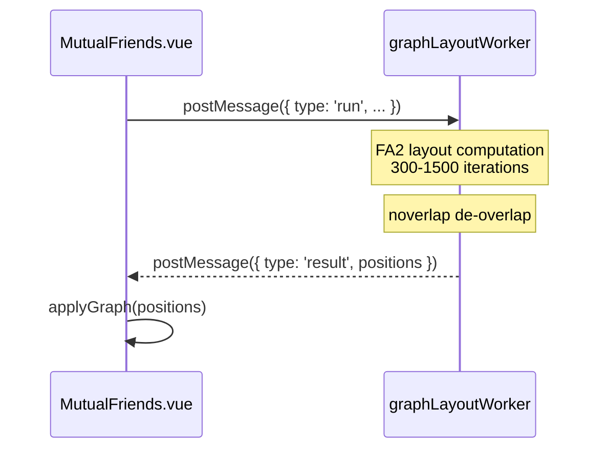
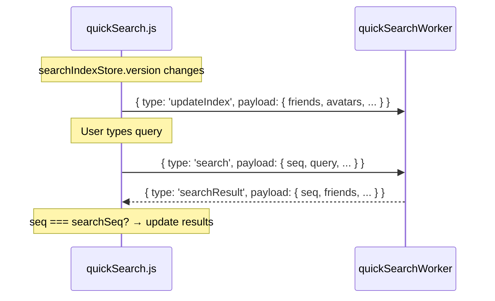
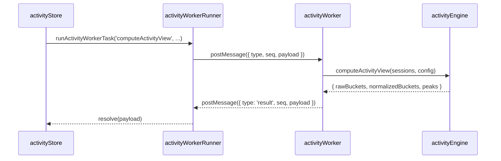

# Web Worker Architecture

The Web Worker system offloads CPU-intensive computations (graph layout, fuzzy search, activity analysis) to dedicated worker threads to prevent UI blocking.

## Overview

| Worker | Status | File |
|--------|--------|------|
| graphLayoutWorker | ✅ Implemented | `src/workers/graphLayoutWorker.js` |
| quickSearchWorker | ✅ Implemented | `src/stores/quickSearchWorker.js` |
| activityWorker | ✅ Implemented | `src/workers/activityWorker.js` |
| Photon Worker | 📋 Planned | Waiting for `photon.js` rewrite |

## Implemented Workers

### graphLayoutWorker (Graph Layout Computation)

**Problem**: `forceAtlas2.assign()` synchronously runs 300-1500 iterations on the main thread, **blocking UI for 1-5 seconds** on graphs with hundreds of nodes.

**Solution**: Move FA2 + noverlap computation to a dedicated Worker.

| Item | Details |
|------|---------|
| **Message Protocol** | `{ type: 'run', requestId, graph, settings }` → `{ type: 'result', requestId, positions }` |
| **Race Protection** | Uses `requestId` to prevent concurrent calls from overwriting results |
| **Build Output** | ~82KB |

### quickSearchWorker (Quick Search)

**Problem**: `removeConfusables()` (Unicode normalization + Map lookups + regex) + `localeIncludes()` causes jank on every keystroke with 1000+ friends.

**Solution**: Move search index and search logic entirely to a Worker.

| Item | Details |
|------|---------|
| **Message Protocol** | `updateIndex` (sync data snapshot) + `search` (execute search) |
| **Race Protection** | Incrementing `searchSeq` counter; stale results are discarded |
| **Build Output** | ~6KB |

### activityWorker (Activity Heatmap & Overlap Computation)

**Problem**: Building sessions from thousands of gamelog/feed rows and computing 7×24 heatmap buckets with normalization blocks the main thread for 200–800ms on large datasets (90–180 day ranges).

**Solution**: Move all session building, bucket computation, and normalization to a dedicated Worker.

| Item | Details |
|------|---------|
| **Message Protocol** | `{ type, seq, payload }` → `{ type: 'result'\|'error', seq, payload }` |
| **Race Protection** | Incrementing `workerSeq` counter with per-request Promise callbacks |
| **Supported Tasks** | `computeSessionsSnapshot`, `computeActivityView`, `computeOverlapView`, `buildSessionsFromGamelog`, `buildSessionsFromEvents`, `buildHeatmapBuckets`, `buildOverlapBuckets`, `normalizeHeatmapBuckets` |
| **Communication Wrapper** | `activityWorkerRunner.js` — singleton lazy-init Worker with Promise-based `runActivityWorkerTask()` |
| **Shared Worker** | All activity computations share a single Worker instance |

> **Full documentation**: See [Activity System](./activity-system.md) for the complete architecture and data flow.

## Future Direction

### P2: Photon Event Parsing Worker

`photon.js` (1891 lines, 72KB) is deeply coupled with 18 stores. Current decision: wait for planned rewrite.

### Not Suitable for Workers

| Module | Reason |
|--------|--------|
| **WebSocket handling** | Needs direct Pinia store access |
| **updateLoop** | Requires `AppApi`/`LogWatcher` main-thread bindings |
| **GameLog processing** | Each log entry immediately updates multiple stores |
| **SQLite queries** | `window.SQLite` binding inaccessible from Worker |
