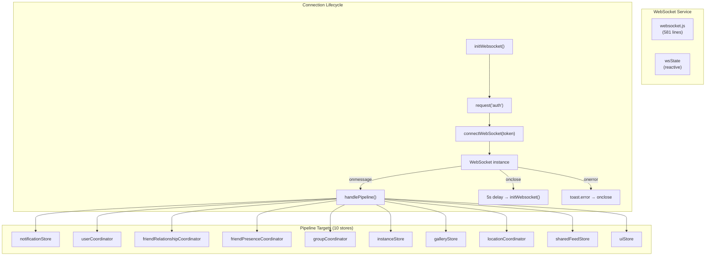

# WebSocket Service

## Overview

The WebSocket service (`services/websocket.js`) is VRCX's real-time event pipeline. It maintains a persistent WebSocket connection to VRChat's servers and dispatches incoming events to the appropriate stores and coordinators. It is the **only** real-time data source in the application — all other data flows are poll-based.



## Reactive State

```js
export const wsState = reactive({
    connected: false,      // WebSocket currently open
    messageCount: 0,       // total messages received (for rate delta)
    bytesReceived: 0       // total bytes received
});
```

This state is consumed by `StatusBar.vue` for the WebSocket indicator and sparkline message rate graph.

## Connection Lifecycle

### Initialization

```js
export function initWebsocket() {
    // Guard: only connect when friends are loaded AND no existing socket
    if (!watchState.isFriendsLoaded || webSocket !== null) return;

    // 1. Request auth token from VRC API
    request('auth', { method: 'GET' })
        .then((json) => {
            if (json.ok) {
                connectWebSocket(json.token);
            }
        });
}
```

**Trigger:** `initWebsocket()` is called from `authStore`'s watcher on `watchState.isFriendsLoaded`. It only fires after both login is complete AND the friend list is fully synchronized.

### Connection

```js
function connectWebSocket(token) {
    const socket = new WebSocket(`${AppDebug.websocketDomain}/?auth=${token}`);

    socket.onopen = () => { wsState.connected = true; };
    socket.onclose = () => {
        wsState.connected = false;
        // Auto-reconnect after 5 seconds
        workerTimers.setTimeout(() => {
            if (watchState.isLoggedIn && watchState.isFriendsLoaded && webSocket === null) {
                initWebsocket();
            }
        }, 5000);
    };
    socket.onerror = () => {
        // Trigger onclose with error code
        socket.onclose(new CloseEvent('close', { code: 1006 }));
    };
    socket.onmessage = ({ data }) => {
        // Parse and dispatch
        handlePipeline({ json });
    };
}
```

### Reconnection Strategy

- On close: 5-second delay, then re-authenticate and reconnect
- Guards: Only reconnect if still logged in, friends loaded, and no existing socket
- On error: Treated as abnormal close (code 1006), triggers same reconnection path

### Deduplication

```js
let lastWebSocketMessage = '';

socket.onmessage = ({ data }) => {
    if (lastWebSocketMessage === data) return; // skip exact duplicates
    lastWebSocketMessage = data;
    // ... process
};
```

Simple last-message deduplication prevents processing identical consecutive messages (VRChat sometimes sends duplicates).

## Pipeline Event Types

### `handlePipeline` — The Main Dispatcher

The 350-line switch statement processes all WebSocket message types:

#### Notification Events

| Type | Handler | Purpose |
|------|---------|---------|
| `notification` | `notificationStore.handleNotification` + `handlePipelineNotification` | V1 notification |
| `notification-v2` | `notificationStore.handleNotificationV2` | V2 notification |
| `notification-v2-delete` | `handleNotificationV2Hide` + `handleNotificationSee` | V2 deletion |
| `notification-v2-update` | `handleNotificationV2Update` | V2 update |
| `see-notification` | `handleNotificationSee` | Mark as seen |
| `hide-notification` | `handleNotificationHide` + `handleNotificationSee` | Hide |
| `response-notification` | `handleNotificationHide` + `handleNotificationSee` | Response |

#### Friend Events

| Type | Handler | Purpose |
|------|---------|---------|
| `friend-add` | `applyUser` + `handleFriendAdd` | New friend added |
| `friend-delete` | `handleFriendDelete` | Friend removed |
| `friend-online` | `applyUser` (with location merge) | Friend came online |
| `friend-active` | `applyUser` (state='active') | Friend became active |
| `friend-offline` | `applyUser` (state='offline') | Friend went offline |
| `friend-update` | `applyUser` | Friend data changed |
| `friend-location` | `applyUser` (with location merge) | Friend location changed |

#### User Events

| Type | Handler | Purpose |
|------|---------|---------|
| `user-update` | `applyCurrentUser` | Current user data changed |
| `user-location` | `runSetCurrentUserLocationFlow` | Current user location changed |

#### Group Events

| Type | Handler | Purpose |
|------|---------|---------|
| `group-joined` | (no-op, commented out) | Joined a group |
| `group-left` | `onGroupLeft` | Left a group |
| `group-role-updated` | `getGroup` + `applyGroup` | Role permissions changed |
| `group-member-updated` | `getGroupDialogGroup` + `handleGroupMember` | Member data changed |

#### Instance Events

| Type | Handler | Purpose |
|------|---------|---------|
| `instance-queue-joined` | `instanceQueueUpdate` | Joined instance queue |
| `instance-queue-position` | `instanceQueueUpdate` | Queue position changed |
| `instance-queue-ready` | `instanceQueueReady` | Queue spot ready |
| `instance-queue-left` | `removeQueuedInstance` | Left queue |
| `instance-closed` | Notification + feed entry | Instance closed |

#### Content Events

| Type | Handler | Purpose |
|------|---------|---------|
| `content-refresh` | Conditional gallery refresh | Content type updated |

Content refresh subtypes: `icon`, `gallery`, `emoji`, `sticker`, `print`, `prints`, `avatar`, `world`, `created`, `avatargallery`, `invitePhoto`, `inventory`

## Data Transform: Friend Events

The WebSocket events deliver user data in different formats. The pipeline normalizes them before passing to `applyUser()`:

### `friend-online` Transform
```js
const onlineJson = {
    id: content.userId,
    platform: content.platform,
    state: 'online',
    location: content.location,
    worldId: content.worldId,
    instanceId: parseLocation(content.location).instanceId,
    travelingToLocation: content.travelingToLocation,
    travelingToWorld: parseLocation(content.travelingToLocation).worldId,
    travelingToInstance: parseLocation(content.travelingToLocation).instanceId,
    ...content.user  // spread user data last to override
};
```

### `friend-offline` Transform
```js
const offlineJson = {
    id: content.userId,
    platform: content.platform,
    state: 'offline',
    location: 'offline',
    worldId: 'offline',
    instanceId: 'offline',
    travelingToLocation: 'offline',
    travelingToWorld: 'offline',
    travelingToInstance: 'offline'
};
```

## External API

| Function | Purpose | Called By |
|----------|---------|----------|
| `initWebsocket()` | Start connection | `authStore` (on friends loaded) |
| `closeWebSocket()` | Terminate connection | `authCoordinator.runLogoutFlow()` |
| `reconnectWebSocket()` | Force reconnect | Manual trigger |
| `wsState` | Reactive telemetry | `StatusBar.vue` |

## File Map

| File | Lines | Purpose |
|------|-------|---------|
| `services/websocket.js` | 581 | Connection management, pipeline dispatch |

## Risks & Gotchas

- **Single `lastWebSocketMessage` deduplication** only catches consecutive duplicates. Non-consecutive duplicates will be processed twice.
- **The pipeline switch statement** is 350+ lines. Each case directly accesses stores — there's no intermediate event bus or queue.
- **`friend-online`/`friend-location` events** have inconsistent data shapes from VRChat (sometimes `content.user` is missing). The pipeline has fallback handling but logs errors.
- **`content.user.state` is deleted** (`delete content.user.state`) before processing — VRChat sends stale state in user objects.
- **Reconnection has no exponential backoff.** The 5-second fixed delay may cause rapid reconnection attempts during VRC API outages.
- **`workerTimers.setTimeout`** is used instead of native `setTimeout` to avoid browser throttling of background tabs.
