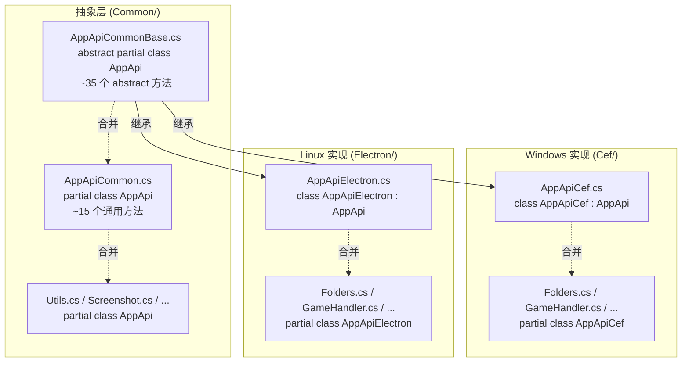
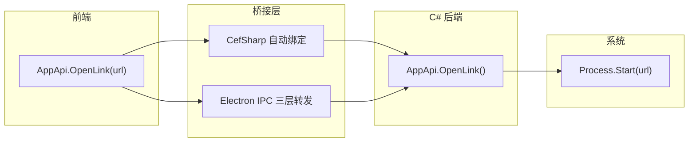

# C# 后端开发者指南

> 面向前端开发者的 C# 后端入门指南。涵盖启动流程、语法速查、核心设计模式和维护场景映射。
> 与 [后端架构参考](./backend.md) 互补——后者侧重 API 接口和模块映射，本文侧重**读懂代码**和**理解运行机制**。

## 启动时序图

### Windows (Cef) 启动 → 运行 → 退出

```mermaid
sequenceDiagram
    participant OS as 操作系统
    participant Main as Program.Main()
    participant Run as Program.Run()
    participant Services as 服务层
    participant WinForm as MainForm
    participant JS as 前端 Vue

    OS->>Main: 启动 VRCX.exe
    Main->>Main: BrowserSubprocess.Start()
    Main->>Main: Wine 检测
    Main->>Run: Run()

    rect rgb(30, 40, 60)
    Note over Run: 阶段 ① 基础设施
    Run->>Run: StartupArgs.ArgsCheck(args)
    Run->>Run: SetProgramDirectories()
    Run->>Run: VRCXStorage.Instance.Load()
    Run->>Run: ConfigureLogger()
    Run->>Run: GetVersion()
    Run->>Run: Update.Check()
    end

    rect rgb(25, 50, 70)
    Note over Run,Services: 阶段 ② 核心服务初始化（按依赖顺序）
    Run->>Services: IPCServer.Instance.Init()
    Run->>Services: SQLite.Instance.Init()
    Run->>Services: new AppApiCef()
    Run->>Services: ProcessMonitor.Instance.Init()
    Run->>Services: Discord.Instance.Init()
    Run->>Services: WebApi.Instance.Init()
    Run->>Services: LogWatcher.Instance.Init()
    Run->>Services: AutoAppLaunchManager.Instance.Init()
    Run->>Services: CefService.Instance.Init()
    Run->>Services: OverlayServer.Instance.Init()
    end

    rect rgb(30, 55, 45)
    Note over WinForm: 阶段 ③ 启动窗口
    Run->>WinForm: Application.Run(new MainForm())
    WinForm->>JS: file://vrcx/index.html
    Note over WinForm,JS: JavascriptBindings 注册 7 个 C# 对象
    end

    rect rgb(60, 30, 30)
    Note over Run,Services: 阶段 ④ 退出（逆序释放资源）
    Run->>Services: WebApi.SaveCookies()
    Run->>Services: OverlayServer → CefService → AutoAppLaunch
    Run->>Services: LogWatcher → WebApi → Discord
    Run->>Services: VRCXStorage.Save() → SQLite → ProcessMonitor
    end
```



对应源码：`Dotnet/Program.cs` — `Run()` 方法（L216-L263）

---

### Linux/macOS (Electron) 启动

```mermaid
sequenceDiagram
    participant EMain as main.js
    participant DotNet as C# DLL
    participant Preload as preload.js
    participant Renderer as Vue 前端

    rect rgb(30, 40, 60)
    Note over EMain: 阶段 ① 加载 .NET
    EMain->>EMain: require('VRCX-Electron.cjs')
    EMain->>EMain: new InteropApi()
    end

    rect rgb(25, 50, 70)
    Note over EMain,DotNet: 阶段 ② 两阶段初始化
    EMain->>DotNet: ProgramElectron.PreInit(version, args)
    EMain->>DotNet: VRCXStorage.Load()
    EMain->>DotNet: ProgramElectron.Init()
    EMain->>DotNet: SQLite.Init()
    EMain->>DotNet: AppApiElectron.Init()
    EMain->>DotNet: Discord / WebApi / LogWatcher.Init()
    end

    rect rgb(30, 55, 45)
    Note over EMain,Renderer: 阶段 ③ IPC 桥接 + 窗口
    EMain->>EMain: ipcMain.handle('callDotNetMethod')
    EMain->>Preload: 加载 preload.js
    Preload->>Renderer: contextBridge.exposeInMainWorld()
    end
```



对应源码：`src-electron/main.js`（L84-125）

---

## C# 语法速查

> 以下所有语法项均来自 VRCX 真实代码。"🔍 关键字" 列提供 Google/Microsoft Learn 搜索词。

### 基础

| 代码示例 | 含义 | JS 等价 | 🔍 关键字 |
|---------|------|---------|----------|
| `using System.IO;` | 导入命名空间 | `import ... from '...'` | `C# using directive` |
| `namespace VRCX { }` | 命名空间 | 文件模块 | `C# namespace` |
| `var x = 42;` | 类型推断 | `const x = 42` | `C# var keyword` |
| `string name = "hi"` | 显式类型 | `let name = "hi"` | `C# variable types` |
| `$"Hello {name}"` | 字符串插值 | `` `Hello ${name}` `` | `C# string interpolation` |
| `/// <summary>` | 文档注释 | JSDoc `/** */` | `C# XML documentation` |

### 类型

| 代码示例 | 含义 | JS 等价 | 🔍 关键字 |
|---------|------|---------|----------|
| `string` / `int` / `double` / `bool` | 基本类型 | 动态类型 | `C# value types` |
| `string?` | 可空字符串 | `string \| undefined` | `C# nullable reference` |
| `List<string>` | 动态数组 | `Array` | `C# List generic` |
| `Dictionary<string, int>` | 键值映射 | `Map` / `Object` | `C# Dictionary` |
| `ConcurrentDictionary<K,V>` | 线程安全字典 | 无 | `C# ConcurrentDictionary` |
| `object[][]` | 二维数组 | `Array<Array>` | `C# jagged array` |

### 方法与属性

| 代码示例 | 含义 | JS 等价 | 🔍 关键字 |
|---------|------|---------|----------|
| `public void Init()` | 无返回值方法 | `init() { }` | `C# void method` |
| `public string Get(string key)` | 有返回值 | `get(key) { return ... }` | `C# return type` |
| `public async Task<double> GetZoom()` | 异步方法 | `async getZoom(): Promise<number>` | **`C# async Task`** |
| `public static void Send(...)` | 静态方法 | `static send(...)` | `C# static method` |
| `private static readonly Logger logger` | 只读静态字段 | `static #logger` | `C# readonly field` |
| `public string Version { get; set; }` | 属性 | `get version() { }` | `C# property` |
| `params string[] args` | 可变参数 | `...args` | `C# params` |

### OOP（重点）

| 代码示例 | 含义 | JS 等价 | 🔍 关键字 |
|---------|------|---------|----------|
| `public partial class AppApi` | 同一类拆多文件 | 无 | **`C# partial class`** |
| `public abstract void ShowDevTools()` | 子类必须实现 | 接口约束 | **`C# abstract method`** |
| `public override void ShowDevTools()` | 覆写父类方法 | 重写 | **`C# override`** |
| `class AppApiCef : AppApi` | 继承 | `extends` | **`C# inheritance`** |
| `public/private/internal` | 访问级别 | `#private` | `C# access modifiers` |

### 控制流

| 代码示例 | 含义 | JS 等价 | 🔍 关键字 |
|---------|------|---------|----------|
| `try { } catch (Exception ex) { }` | 异常处理 | `try/catch` | `C# exception handling` |
| `using var cmd = new SQLiteCommand()` | 自动释放资源 | 类似 `finally` | **`C# using statement`** |
| `lock (this) { }` | 互斥锁 | 无 | **`C# lock statement`** |
| `?.` / `??` | 空值安全 | `?.` / `??` | `C# null operators` |
| `is` / `as` | 类型检查/转换 | `instanceof` | `C# type checking` |

### 编译指令

| 代码示例 | 含义 | JS 等价 | 🔍 关键字 |
|---------|------|---------|----------|
| `#if !LINUX` ... `#endif` | 条件编译 | 无（类似 `process.platform`） | **`C# preprocessor`** |
| `#region` ... `#endregion` | 代码折叠 | 无 | `C# region` |
| `[STAThread]` | 特性（元数据标注） | 装饰器 `@xxx` | `C# attributes` |

---

## 核心设计模式

### 模式 1：单例服务注册

所有后端服务都是全局单例，通过 `static Instance` 字段暴露：

```csharp
public class Discord
{
    public static readonly Discord Instance = new Discord();  // 唯一实例
    private Discord() { }                                     // 私有构造器防止外部 new
}
```

JS 理解方式：
```javascript
// 类似于
export const discord = new Discord(); // 模块级单例
```

**为什么这样设计**：桌面应用需要全局共享资源（数据库连接、HTTP 客户端等），单例保证只有一份实例，避免资源冲突。

---

### 模式 2：桥接暴露

CefSharp/WebView 程序最核心的模式——把 C# 对象暴露给浏览器 JS 调用。

**Windows (CefSharp)**：直接绑定

```csharp
// JavascriptBindings.cs (20 行) — C# 对象注入 JS
repository.Register("AppApi", Program.AppApiInstance);
repository.Register("WebApi", WebApi.Instance);
// ... 共 7 个
```

前端直接调用 `await AppApi.GetVersion()`，CefSharp 自动序列化/反序列化。

**Electron (Linux/macOS)**：三层 IPC 转发

```
前端 JS → preload.js (ipcRenderer) → main.js (ipcMain) → InteropApi → C# DLL
```

前端统一入口 `src/plugins/interopApi.js` 抹平两者差异：

```javascript
if (WINDOWS) {
    await CefSharp.BindObjectAsync('AppApi', 'WebApi', ...);
} else {
    window.AppApi = InteropApi.AppApiElectron;
    window.WebApi = InteropApi.WebApi;
}
```

---

### 模式 3：Init/Exit 生命周期

每个服务都遵循统一的生命周期：

```csharp
public void Init()  { /* 初始化：打开文件、启动线程、建立连接 */ }
public void Exit()  { /* 释放：关闭文件、停止线程、断开连接 */ }
```

由 `Program.Run()` **按依赖顺序** Init，退出时**反序** Exit。

---

### 模式 4：条件编译分平台

```csharp
#if !LINUX
    using CefSharp;              // Windows 独占
    Application.Run(new MainForm());
#else
    // Linux/macOS: 由 Electron main.js 驱动
#endif
```

`.csproj` 中定义编译符号：

```xml
<!-- VRCX-Electron.csproj -->
<DefineConstants>LINUX</DefineConstants>
```

---

### 模式 5：Partial Class 多文件分层

`AppApi` 是最典型的例子——一个类拆到 **14 个文件**：



> **关键理解**：`partial class` 是把**同一个类**物理拆分到多个文件，编译时合并。跟继承不同——继承是父子关系，partial 是同一个类的分片。

---

### 模式 6：后台线程 + 定时器

**线程循环**（LogWatcher）：

```csharp
public void Init()
{
    _thread = new Thread(ThreadLoop) { IsBackground = true };
    _thread.Start();
}

private void ThreadLoop()
{
    while (_threadRunning)
    {
        Update();           // 检查日志文件
        Thread.Sleep(500);  // 500ms 轮询
    }
}
```

**定时器回调**（Discord）：

```csharp
private readonly Timer _timer;

public void Init()  { _timer.Change(0, 3000); }   // 每 3 秒
public void Exit()  { _timer.Change(-1, -1); }     // 停止
```

---

## 线程安全速查

| 模式 | 用法 | VRCX 示例 |
|------|------|----------|
| `lock (obj) { }` | 简单互斥 | Discord.Update() |
| `ReaderWriterLockSlim` | 读多写少 | SQLite.cs |
| `ConcurrentDictionary` | 无锁并发字典 | VRCXStorage |
| `ConcurrentQueue` | 生产者-消费者 | LogWatcher |
| `Thread` | 后台工作线程 | LogWatcher.ThreadLoop |
| `Timer` | 定时回调 | Discord |

---

## 数据流向图



---

## 维护场景速查

| 场景 | 涉及文件 | 需要了解的模式 |
|------|----------|--------------|
| 给 JS 暴露新的 C# 方法 | `AppApiCommonBase.cs` → `AppApiCommon.cs` → `AppApiCef.cs` / `AppApiElectron.cs` | partial class + abstract |
| 修改日志解析（新事件类型） | `LogWatcher.cs` 中添加 `ParseXxx` 方法 | Regex + Thread |
| 修改 HTTP 请求行为 | `WebApi.cs` | async/await + HttpClient |
| 修改本地设置存储 | `VRCXStorage.cs` | ConcurrentDictionary |
| 修改 Discord 状态 | `Discord.cs` → `SetAssets()` | Timer + lock |
| 修改截图元数据 | `ScreenshotMetadata/` 目录 | PNG chunk 协议 |
| 添加进程监控 | `ProcessMonitor.cs` | event + delegate |
| 修改自动启动应用 | `AutoAppLaunchManager.cs` | Process + Shortcut |

---

## 调试方法

| 需求 | 方法 |
|------|------|
| 查看 C# 日志 | `%AppData%/VRCX/logs/VRCX.log` 或 `~/.config/VRCX/logs/` |
| 在 C# 中打日志 | `logger.Info("xxx")` / `logger.Error(ex, "xxx")` — 使用 NLog |
| Cef 版 DevTools | `--debug` 启动参数 |
| Electron 版 DevTools | `--hot-reload` 启动参数 |

---

## 推荐学习资源

| 主题 | 资源 |
|------|------|
| C# 入门 | [C# 导览 (Microsoft Learn 中文)](https://learn.microsoft.com/zh-cn/dotnet/csharp/tour-of-csharp/) |
| async/await | [异步编程 (Microsoft Learn)](https://learn.microsoft.com/zh-cn/dotnet/csharp/asynchronous-programming/) |
| CefSharp | [CefSharp Wiki](https://github.com/AzureAD/CefSharp/wiki/General-Usage) |
| .NET CLI | `dotnet build` / `dotnet run` 命令 |
| NuGet | `.csproj` 中的 `<PackageReference>` — 类似 npm |
