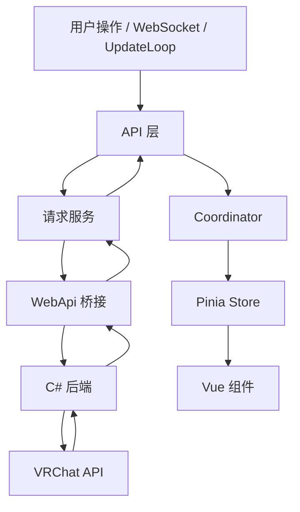
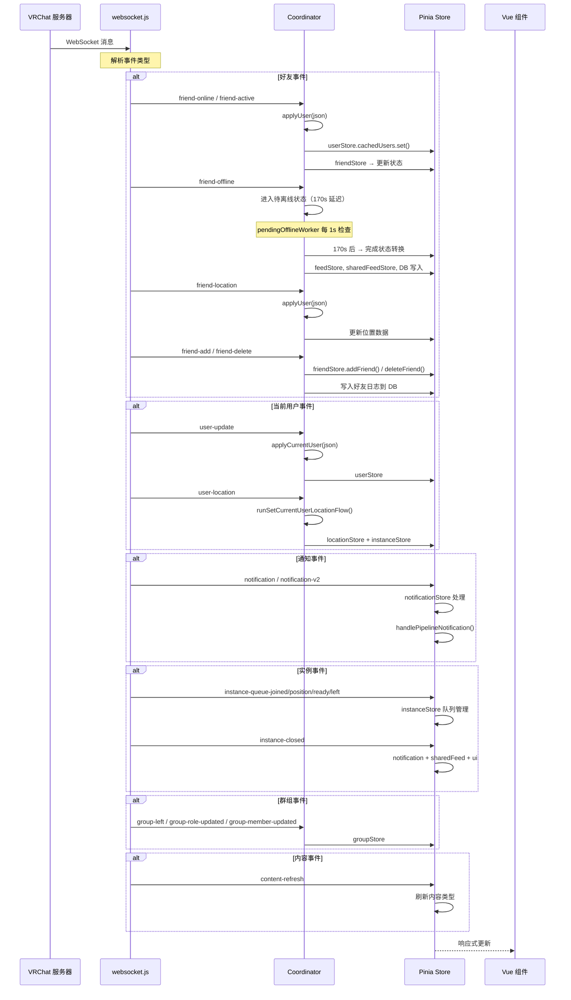
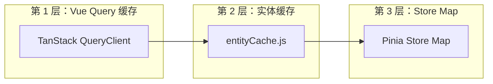
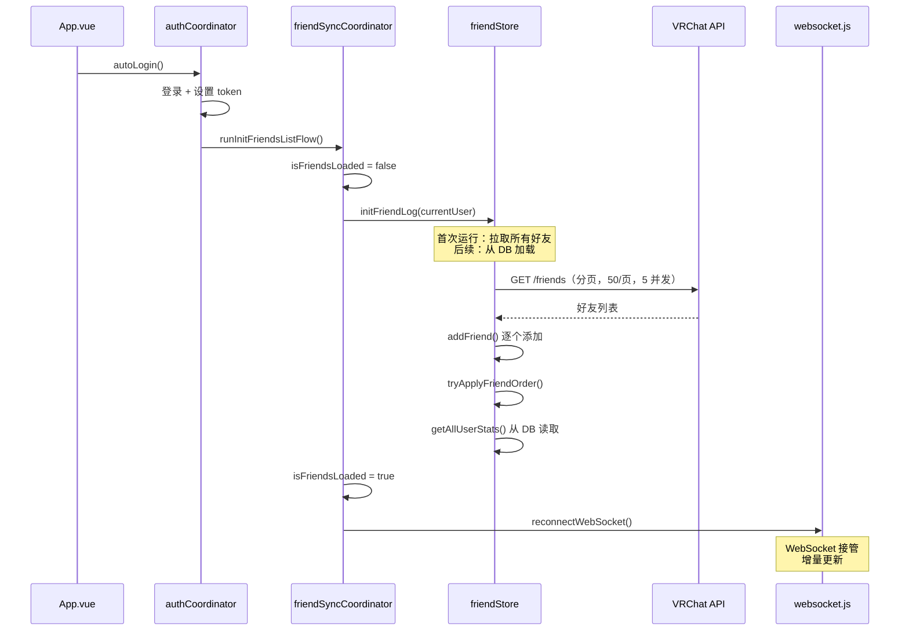

# 数据流

## 核心请求管线

每个 API 调用都经过这条路径：

| 节点 | 路径 | 说明 |
|------|------|------|
| API 层 | src/api/*.js | — |
| 请求服务 | src/services/request.js | buildRequestInit(), deduplicateGETs(), parseResponse() |
| WebApi 桥接 | src/services/webapi.js | Windows: WebApi.Execute(options) / Linux: WebApi.ExecuteJson(json) |
| C# 后端 | — | HTTP 代理到 VRChat |
| Coordinator | src/coordinators/*.js | apply*() 副作用, 跨 Store 编排 |
| Pinia Store | src/stores/*.js | reactive Map/Set, computed 派生 |
| Vue 组件 | — | 自动响应式更新 |

## WebSocket 实时事件流

## 完整 WebSocket 事件映射表

| 事件 | 处理函数 | 影响的 Store |
|------|---------|-------------|
| `friend-online` | `applyUser()` | user, friend |
| `friend-active` | `applyUser()` | user, friend |
| `friend-offline` | `applyUser()` → 待离线 170s | user, friend, feed, sharedFeed |
| `friend-update` | `applyUser()` | user, friend |
| `friend-location` | `applyUser()` | user, friend, location |
| `friend-add` | `applyUser()` + `handleFriendAdd()` | user, friend |
| `friend-delete` | `handleFriendDelete()` | friend, user |
| `user-update` | `applyCurrentUser()` | user |
| `user-location` | `runSetCurrentUserLocationFlow()` | location, user, instance |
| `notification` | `handleNotification()` | notification |
| `notification-v2` | `handlePipelineNotification()` | notification |
| `notification-v2-update` | `handlePipelineNotification()` | notification |
| `notification-v2-delete` | `handlePipelineNotification()` | notification |
| `instance-queue-joined` | `instanceQueueUpdate()` | instance |
| `instance-queue-position` | `instanceQueueUpdate()` | instance |
| `instance-queue-ready` | `instanceQueueReady()` | instance |
| `instance-queue-left` | `removeQueuedInstance()` | instance |
| `instance-closed` | 排队通知 | notification, sharedFeed, ui |
| `group-left` | `onGroupLeft()` | group |
| `group-role-updated` | `applyGroup()` + 重新拉取 | group |
| `group-member-updated` | `handleGroupMember()` | group |
| `content-refresh` | 刷新内容类型 | gallery |

## UpdateLoop 定时器

`updateLoop` store 管理所有后台定时任务：

| 定时器 | 间隔 | 功能 |
|--------|------|------|
| `nextCurrentUserRefresh` | 300s（5 分钟） | `getCurrentUser()` — 刷新自己的资料 |
| `nextFriendsRefresh` | 3600s（1 小时） | `runRefreshFriendsListFlow()` + `runRefreshPlayerModerationsFlow()` |
| `nextGroupInstanceRefresh` | 300s（5 分钟） | `getUsersGroupInstances()` — 群组实例数据 |
| `nextAppUpdateCheck` | 3600s（1 小时） | 检查 VRCX 自动更新 |
| `nextClearVRCXCacheCheck` | 86400s（24 小时） | `clearVRCXCache()` |
| `nextDatabaseOptimize` | 3600s（1 小时） | SQLite 优化 |
| `nextDiscordUpdate` | 动态 | Discord Rich Presence 刷新 |
| `nextAutoStateChange` | 动态 | `updateAutoStateChange()` |
| `nextGetLogCheck` | 动态 | `addGameLogEvent()` — 游戏日志轮询 |
| `nextGameRunningCheck` | 动态 | `AppApi.CheckGameRunning()` |

## 三层缓存策略

**关键规则**：数据只有在传入数据**更新**时才会被替换（基于新鲜度）。这防止了陈旧的 WebSocket 事件覆盖新鲜的 API 响应。

## 好友同步：登录流程

