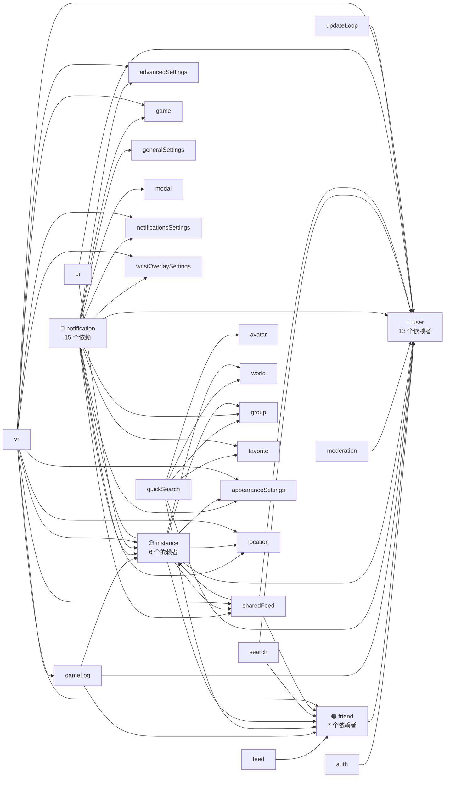

# 模块依赖

## Store 依赖图

## 风险热力表

| Store | 被依赖数量 | 风险 | 改它会怎样 |
|-------|-----------|------|-----------|
| **user** | 13 个 store 依赖 | 🔴 极高 | 几乎所有东西都会崩——好友显示、位置、搜索、管理、通知、VR 覆盖层 |
| **notification** | 导入 15 个其他 store | 🔴 极高 | 最复杂的 store——涉及收藏、游戏、群组、位置、管理、设置。改动会级联到各处 |
| **friend** | 7 个 store 依赖 | 🟠 高 | Feed、游戏日志、搜索、侧边栏、VR 覆盖层都读取好友数据 |
| **instance** | 6 个 store 依赖 | 🟡 中高 | 游戏日志、通知、共享 feed、VR 都依赖实例状态 |
| **sharedFeed** | 8 个依赖 | 🟡 中高 | 聚合好友、实例、位置、通知数据用于展示 |
| **location** | 叶子 store | 🟢 低 | 无跨 store 依赖——可安全独立修改 |
| **avatar** | 叶子 store | 🟢 低 | 无跨 store 依赖 |
| **game** | 叶子 store | 🟢 低 | 无跨 store 依赖 |
| **modal** | 叶子 store | 🟢 低 | 无跨 store 依赖 |
| **dashboard** | 叶子 store | 🟢 低 | 无 store 依赖——可安全独立修改 |

## Coordinator → Store 映射表

修改任何 coordinator 之前查这张表——它精确告诉你会影响哪些 store。

| Coordinator | 使用的 Store |
|-------------|-------------|
| **authCoordinator** | auth, notification, updateLoop, user |
| **authAutoLoginCoordinator** | advancedSettings, auth |
| **userCoordinator** | appearanceSettings, auth, avatar, favorite, friend, game, generalSettings, instance, location, moderation, notification, search, sharedFeed, ui, user |
| **userEventCoordinator** | feed, friend, generalSettings, group, instance, notification, sharedFeed, user, world |
| **userSessionCoordinator** | auth, game, instance, user |
| **friendSyncCoordinator** | auth, friend, updateLoop, user |
| **friendPresenceCoordinator** | feed, friend, notification, sharedFeed, user |
| **friendRelationshipCoordinator** | appearanceSettings, friend, modal, notification, sharedFeed, ui, user |
| **avatarCoordinator** | advancedSettings, avatarProvider, avatar, favorite, modal, ui, user, vrcxUpdater |
| **worldCoordinator** | favorite, instance, location, ui, user, world |
| **groupCoordinator** | game, instance, modal, notification, ui, user, group |
| **instanceCoordinator** | instance（专注——爆炸半径小） |
| **favoriteCoordinator** | appearanceSettings, avatar, friend, generalSettings, user, world |
| **inviteCoordinator** | instance, invite, launch |
| **moderationCoordinator** | avatar, moderation |
| **memoCoordinator** | friend, user |
| **gameCoordinator** | advancedSettings, avatar, gameLog, game, instance, launch, location, modal, notification, updateLoop, user, vr, world |
| **gameLogCoordinator** | advancedSettings, friend, gallery, gameLog, generalSettings, instance, location, modal, notification, sharedFeed, user, vr, vrcx |
| **locationCoordinator** | advancedSettings, gameLog, game, instance, location, notification, user, vr |
| **cacheCoordinator** | auth, avatar, instance, world |
| **imageUploadCoordinator** | （最小化——仅 API 调用） |
| **dateCoordinator** | （纯工具——无 store） |
| **vrcxCoordinator** | （应用级操作） |

### 最大爆炸半径的 Coordinator

::: danger Top 3 — 修改时需极度小心
1. **userCoordinator** — 涉及 **16 个 store**。所有用户数据处理的中心枢纽。
2. **gameLogCoordinator** — 涉及 **15 个 store**。游戏事件日志横切所有模块。
3. **gameCoordinator** — 涉及 **13 个 store**。游戏状态影响位置、实例、模型、VR。
:::

::: tip 安全修改区
- **instanceCoordinator** — 只涉及 instance store
- **moderationCoordinator** — 只涉及 avatar + moderation
- **dateCoordinator** — 纯工具，无 store
- **imageUploadCoordinator** — 仅 API 调用，最小副作用
:::

## 修改前检查清单

改任何模块之前，检查这些：

1. **在上面的表中查找该模块** — 了解它的依赖者
2. **搜索引用** — `grep -r "from.*/{模块名}" src/` 找到所有消费者
3. **检查是否在 updateLoop 中使用** — 改动可能影响定时刷新的时机
4. **检查是否有 WebSocket 事件注入** — 查看[事件映射表](./data-flow.md#完整-websocket-事件映射表)
5. **检查 VR 模式是否使用它** — VR 有独立初始化，可能没有 Pinia
6. **检查 coordinator 使用情况** — coordinator 编排跨 store 副作用
