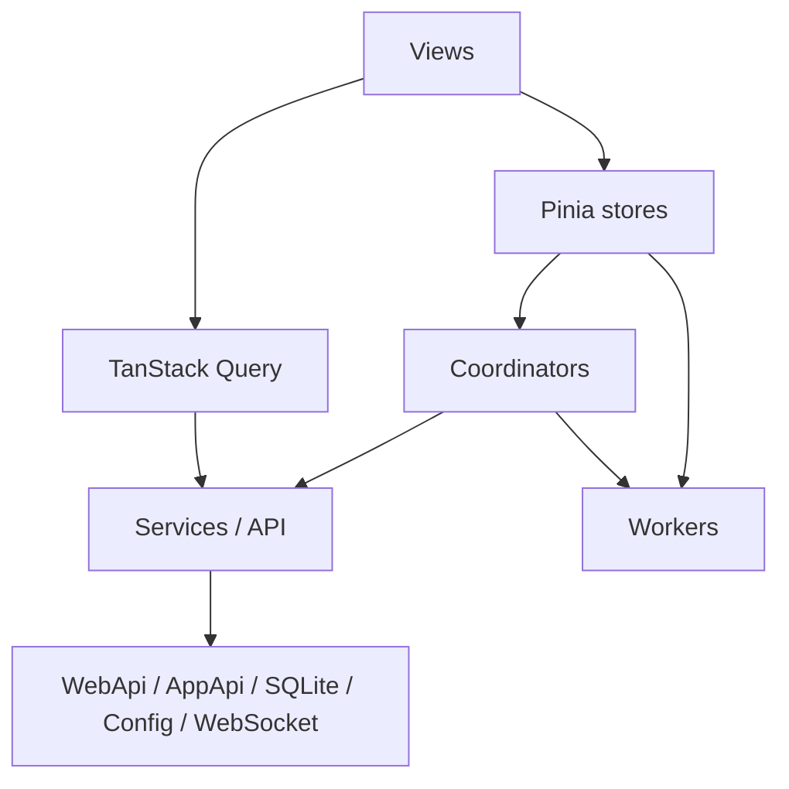

# 系统总览

## 先建立的心智模型

VRCX 前端不是“纯页面应用”，更像一个以桌面壳为宿主的实时客户端。对代码的理解可以先抓住五条主链路：

1. 启动链路：`src/app.js` -> `src/App.vue` -> 全局 store 初始化 -> 自动登录/定时刷新
2. 页面链路：`route -> view -> store -> coordinator -> service`
3. 实时链路：`services/websocket.js` 接事件，coordinator 分发，再回写 store
4. 轮询链路：`src/stores/updateLoop.js` 每秒驱动定时刷新、日志检查、游戏状态同步
5. 后台链路：SQLite、配置持久化、Worker 计算、桌面桥接在 UI 之外持续工作

比起“有多少页面、多少组件”，这几条链路更能解释代码为什么这样组织，也更能指导后续改动和性能判断。

## 启动顺序

`src/app.js` 负责组装应用壳：

1. `initPlugins()`
2. `initPiniaPlugins()`
3. 创建 Vue App
4. 注册 `pinia`、`i18n`、`VueQueryPlugin`
5. `initComponents(app)`
6. `initRouter(app)`
7. `initSentry(app)`
8. `app.mount('#root')`

`src/App.vue` 再把运行期能力接起来：

- `createGlobalStores()` 一次性拉起全局 store
- 在 `window` 上挂接少量桥接入口，供桌面侧回调调用
- `onBeforeMount()` 启动 `updateLoop`
- `onMounted()` 触发 `getGameLogTable()`、用户迁移、自动登录、备份检查、VRChat debug logging 检查

这意味着很多“页面还没打开就已经在跑”的逻辑，其实在根组件阶段就已经启动。

## 实际分层

### 启动与装配层

`src/app.js`、`src/App.vue`、`src/plugins/`、`src/stores/index.js` 负责把 Vue、Pinia、i18n、Query、router、全局 store 和少量桌面桥接入口装起来。

### 数据获取与缓存层

- `src/services/request.js` 是原始请求入口，负责 GET 合并、失败熔断和状态码处理
- `src/api/` 与 `src/queries/` 是带缓存策略的实体读取层
- `src/services/database/*` 是本地持久化缓存层，承接 feed、activity、game log、favorites 等本地数据

### 状态与编排层

- `src/stores/` 保存领域状态、视图状态以及部分派生列表
- `src/coordinators/` 处理跨 store 的流程和副作用，避免 store 之间互相编排

### 实时与后台任务层

- `src/services/websocket.js` 处理 VRChat 实时事件
- `src/stores/updateLoop.js` 处理定时刷新、日志检查、游戏状态同步
- `src/workers/*` 处理搜索、活动分析等 CPU 密集任务

### 展示与交互层

- `src/views/` 是页面级容器
- `src/components/` 是复用 UI 和大型对话框
- 大数据量区域优先走虚拟化，大计算优先走 Worker 或本地缓存

## 三条最关键的运行路径

### 1. 页面读取路径

典型路径是：

`router -> view -> store/computed -> service/api -> state update -> render`

例如 `FriendList`、`FriendsLocations`、`MyAvatars` 这类页面，真正的复杂度主要不在组件树，而在页面进入后触发的派生、过滤、批量查询和持久化。

### 2. 实时更新路径

典型路径是：

`websocket event -> handlePipeline -> coordinator -> store mutation -> derived lists recompute -> visible view update`

好友状态、通知、实例位置这几类功能都依赖这条路径，因此实时场景的性能重点往往是“每次事件后要重建多少派生数据”。

### 3. 轮询与后台计算路径

典型路径是：

`updateLoop / UI action -> SQLite or worker -> cached result -> store/view consume`

活跃度统计、截图/图库、游戏日志、游戏状态检查都在这条线上。这里的关键不是 DOM，而是查询形态、缓存粒度、是否阻塞主线程。

## 为什么 store 边界重要

这个仓库的核心工程约束不是“组件小而美”，而是“不要把跨模块编排塞回 store”。

原因很直接：

- store 一旦同时拥有状态、派生、跨模块流程，性能问题会很难定位
- WebSocket 事件和页面动作会共享同一批状态对象，边界混乱时很容易形成连锁重算
- 把跨 store 副作用收敛到 coordinator，文档、排障和重构都会简单很多

## 当前代码里已经存在的性能友好设计

这些点值得在阅读代码时优先识别，因为它们解释了项目当前的优化方向：

- `src/services/request.js` 会合并短时间内重复的 GET 请求，避免相同接口被并发重复打爆
- `src/stores/friend.js` 已维护 `sortedFriends`，并通过 `reindexSortedFriend()` 和 batch 机制走增量重排，而不是每个派生列表都各自完整排序
- `src/stores/quickSearch.js` 已把快速搜索交给 Worker，并通过 `searchIndexStore.version` 做增量索引推送
- `src/stores/activity.js` 会缓存 snapshot、去重 in-flight 任务，并把活跃度计算交给 Worker
- 多个大列表页面已经用了虚拟列表，但真正瓶颈仍可能在虚拟化之前的数据准备阶段

## 阅读代码时的建议顺序

- 先看 [前端改动入口地图](/zh/architecture/change-entry-map)，确认入口文件
- 再看这个功能的 store 和 coordinator 是否构成完整链路
- 最后再下钻到 `services/database/*`、`services/request.js`、Worker、`services/websocket.js` 或 `updateLoop`

先建立链路，再看实现细节，会比直接读组件更快。
