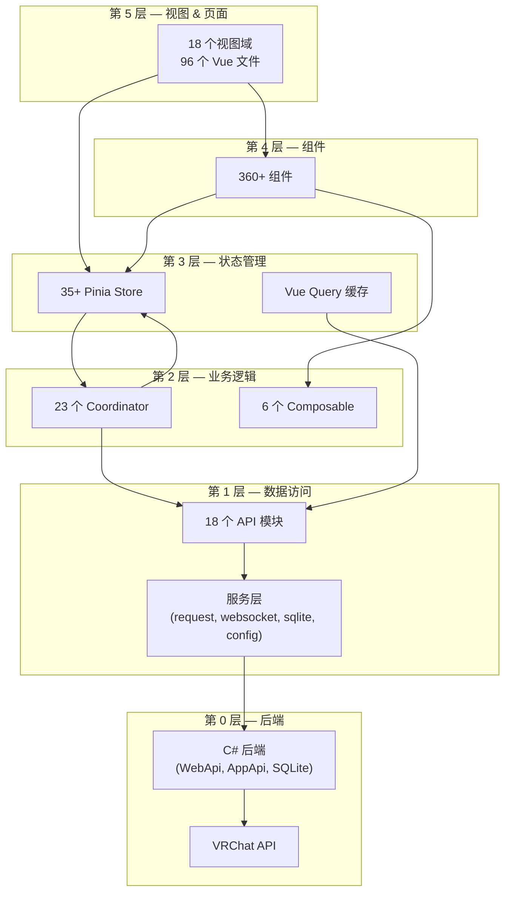
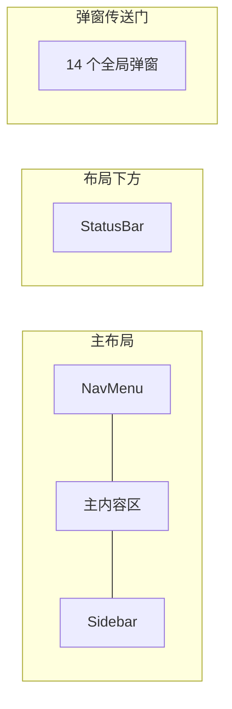

# 系统总览

## 技术栈

| 组件 | 版本 | 用途 |
|------|------|------|
| Vue | 3.5 | UI 框架 |
| Pinia | 3.0 | 状态管理 |
| Vue Router | 4.6 | Hash 路由 |
| Vite | 7.3 | 构建工具 & 开发服务器 |
| Tailwind CSS | 4.2 | 原子化 CSS |
| Reka-ui | — | 无头组件库 |
| TanStack Vue Query | — | 服务端状态缓存 |
| vue-i18n | 11.3 | 国际化（14 种语言） |
| Electron | 39.8 | 桌面容器（Linux/Mac） |
| CEF | — | 桌面容器（Windows） |

## 5 层架构



## 逐层分解

### 第 5 层 — 视图（18 个域）

| 域 | 路径 | 用途 |
|----|------|------|
| Login | `views/Login/` | 认证 UI |
| Feed | `views/Feed/` | 社交动态时间线 |
| FriendsLocations | `views/FriendsLocations/` | 实时好友位置卡片 |
| Sidebar | `views/Sidebar/` | 右侧面板——好友 & 群组 |
| FriendList | `views/FriendList/` | 好友数据表 |
| FriendLog | `views/FriendLog/` | 好友添加/删除历史 |
| PlayerList | `views/PlayerList/` | 同世界玩家追踪 |
| Search | `views/Search/` | 玩家/世界搜索 |
| Favorites | `views/Favorites/` | 好友/世界/模型收藏（3 个子视图） |
| MyAvatars | `views/MyAvatars/` | 模型管理 |
| Notifications | `views/Notifications/` | 邀请 & 好友请求 |
| Moderation | `views/Moderation/` | 屏蔽/踢人工具 |
| GameLog | `views/GameLog/` | 完整游戏事件日志 |
| Charts | `views/Charts/` | 实例活动 & 共同好友图表 |
| Tools | `views/Tools/` | 图库、截图元数据、导出 |
| Settings | `views/Settings/` | 7 个选项卡 + 8 个弹窗 |
| Dashboard | `views/Dashboard/` | 可自定义仪表盘（多行 Widget 布局） |
| Layout | `views/Layout/` | 主三面板布局容器 |

### 第 4 层 — 组件

| 类别 | 数量 | 示例 |
|------|------|------|
| UI 组件库 (`components/ui/`) | ~200 文件, 50+ 类型 | Button, Dialog, DataTable, Tabs, Select, Popover, Sheet... |
| 功能弹窗 (`components/dialogs/`) | 20+ | UserDialog (11 标签页), WorldDialog (4 标签页), GroupDialog (12+ 标签页) |
| 顶层组件 | 17 | NavMenu, StatusBar, GlobalSearchDialog, Location, Timer... |

### 第 3 层 — Pinia Store（35+）

| 类别 | Store |
|------|-------|
| **核心实体** | user, friend, avatar, avatarProvider, world, instance, group, location |
| **功能** | feed, favorite, search, gallery, invite, moderation |
| **实时** | notification（复杂）, vrcStatus |
| **游戏** | game, gameLog (目录), launch |
| **UI 状态** | ui, modal, globalSearch, sharedFeed, charts, dashboard |
| **设置** | settings/general, appearance, advanced, notifications, discordPresence, wristOverlay |
| **系统** | auth, updateLoop, vrcx, vrcxUpdater |
| **网络** | photon |
| **VR** | vr |

### 第 2 层 — Coordinator（23 个）

| 类别 | Coordinator |
|------|------------|
| **认证** | authCoordinator, authAutoLoginCoordinator |
| **用户** | userCoordinator, userEventCoordinator, userSessionCoordinator |
| **好友** | friendSyncCoordinator, friendPresenceCoordinator, friendRelationshipCoordinator |
| **实体** | avatarCoordinator, worldCoordinator, groupCoordinator, instanceCoordinator |
| **功能** | favoriteCoordinator, inviteCoordinator, moderationCoordinator, memoCoordinator |
| **游戏** | gameCoordinator, gameLogCoordinator, locationCoordinator |
| **系统** | cacheCoordinator, imageUploadCoordinator, dateCoordinator, vrcxCoordinator |

### 第 1 层 — API & 服务

**API 模块**（18 个）：auth, user, friend, avatar, world, instance, group, favorite, notification, playerModeration, avatarModeration, image, inventory, inviteMessages, prop, misc, vrcPlusIcon, vrcPlusImage

**服务层**：request.js（HTTP + 去重）、websocket.js（实时事件）、sqlite.js（数据库封装）、config.js（键值配置）、webapi.js（C# 桥接）、appConfig.js（调试标志）、watchState.js（响应式标志）、security.js、jsonStorage.js、confusables.js（混淆字符检测）、gameLog.js（游戏日志解析）

**Web Worker**：searchWorker.js（全局搜索——混淆字符归一化 + locale-aware 搜索卸载到 Worker 线程）

## 主布局结构



- **NavMenu**: 可折叠左侧栏，折叠时仅显示图标，下拉子菜单，键盘快捷键，通知红点
- **主内容区**: `RouterView` 包裹在 `KeepAlive` 中（排除 Charts），`ResizablePanel` 自动保存
- **Sidebar**: 好友/群组标签页，7 种排序方式，收藏分组过滤，同实例分组
- **布局持久化**: 面板尺寸通过 localStorage `"vrcx-main-layout-right-sidebar"` 保存

## 应用初始化顺序

```
app.js
├── 1. initPlugins()          — 自定义插件初始化
├── 2. initPiniaPlugins()     — Pinia action trail (nightly)
├── 3. VueQueryPlugin         — TanStack Vue Query
├── 4. Pinia                  — 状态管理
├── 5. i18n                   — 国际化
├── 6. initComponents()       — 全局 UI 组件注册
├── 7. initRouter()           — Vue Router + 认证守卫
├── 8. initSentry()           — 错误追踪
└── 9. app.mount('#root')

App.vue onMounted:
├── updateLoop.init()         — 启动所有定时器
├── migrateUsers()            — 数据库迁移
├── autoLogin()               — 尝试自动登录
├── checkBackup()             — 备份验证
└── VRChat debug logging      — 条件启用
```

## VR 模式

VR 有**独立入口**（`vr.js` → `Vr.vue`）：
- 只加载 `i18n` 插件（无 Pinia、无 Vue Query、无 Sentry）
- 极简 UI：手腕覆盖层显示好友位置
- 通过共享后端通信，不共享 Vue 状态
- 独立构建输出（`vr.html`）
