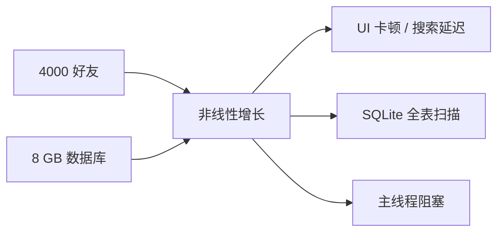

# 性能分析

> **基准假设：** ~4000 位好友，~8 GB SQLite 数据库。以下讨论的所有瓶颈均为非线性 —— 随着数据增长，性能**不会**平滑退化。

## 概述

VRCX 面向社交型 VR 重度用户，这类用户往往积累了数千好友和数年的游戏日志。虽然大多数功能在早期使用时表现良好，但多个热路径存在 **二次方（O(n²)）**、**全表扫描** 或 **重复线性扫描** 的行为，在大规模数据下会导致明显的 UI 退化。



---

## 瓶颈 1 — `findUserByDisplayName` 线性扫描

### 定位

`src/shared/utils/user.js` 第 280 行

```javascript
function findUserByDisplayName(cachedUsers, displayName) {
    for (const ref of cachedUsers.values()) {  // O(n) 扫描
        if (ref.displayName === displayName) {
            return ref;
        }
    }
    return undefined;
}
```

### 调用点清单

| 调用位置 | 文件 | 触发频率 |
|---------|------|---------|
| 玩家加入事件 | `gameLogCoordinator.js:89` | **高频** — 每次进房间 |
| 玩家加入日志 | `gameLogCoordinator.js:162` | **高频** — 同上 |
| 外部消息 | `gameLogCoordinator.js:409` | 中频 |
| 视频播放解析 | `mediaParsers.js:142` | 中频 |
| 资源加载解析 | `mediaParsers.js:210, 273, 330, 387` | **高频** — 5 个调用点 |
| 通知处理 | `notification/index.js:1021, 1087` | 中频 |
| 用户协调器 | `userCoordinator.js:635` | 低频 |

### 复杂度

- 单次调用：**O(n)**，n = `cachedUsers.size`（通常 4000–8000）
- 加入 80 人满房间：80 次加入事件 × O(n) = **O(80n)**
- 加上 `mediaParsers` 的乘数效应：每个日志事件可能多次调用 `findUserByDisplayName`
- 最坏情况（加入满房间）：约 **400,000 次字符串比较**

### 严重性：🔴 关键

最高优先级修复项。这个函数在实时事件处理中贡献了最大份额的可避免 CPU 开销。

### 未来方向

在 `userStore` 中构建反向索引 `Map<displayName, ref>`，与 `cachedUsers` 同步维护：

```javascript
// 在 user store 中
const displayNameIndex = new Map(); // displayName → ref

// 在 applyUser() 中维护：
// displayNameIndex.set(ref.displayName, ref);

// O(1) 查找：
function findUserByDisplayName(cachedUsers, displayName) {
    return displayNameIndex.get(displayName);
}
```

::: warning 注意
VRChat 中 displayName **不是全局唯一的**，但当前实现已经返回第一个匹配项。反向索引保持了相同的语义。
:::

---

## 瓶颈 2 — GameLog / 通知数据库搜索

### 定位

- `src/services/database/gameLog.js` 第 984 行（`searchGameLogDatabase`）
- `src/services/database/notifications.js` 第 77 行（`lookupNotificationDatabase`）

### 问题

两个函数都对多个列使用 `LIKE '%search%'` 模式，这**无法使用 B-tree 索引**，必然触发全表扫描：

```sql
-- gameLog.js：在 7 个表上重复执行，用 UNION ALL 合并
SELECT * FROM (
    SELECT ... FROM gamelog_location
    WHERE world_name LIKE @searchLike   -- 全表扫描
    ORDER BY id DESC LIMIT @perTable
)
UNION ALL
SELECT * FROM (
    SELECT ... FROM gamelog_join_leave
    WHERE display_name LIKE @searchLike -- 全表扫描
    ORDER BY id DESC LIMIT @perTable
)
-- ... 还有 5 个 UNION ALL 块
```

```sql
-- notifications.js：原始字符串拼接
WHERE (sender_username LIKE '%${search}%'
    OR message LIKE '%${search}%'
    OR world_name LIKE '%${search}%')
```

### 复杂度

| 参数 | 估计值 |
|------|-------|
| `gamelog_join_leave` 行数 | ~5,000,000（多年使用） |
| `gamelog_location` 行数 | ~500,000 |
| 扫描的表数 | 7（UNION ALL） |
| 每次搜索键入的扫描次数 | 7 × 每表全扫描 |

使用 `LIKE '%xxx%'` 时，SQLite 必须检查每个表中的**每一行**。在 8 GB 数据库规模下，每次搜索可能扫描**数百万行**。

### 附加问题 — SQL 注入

`notifications.js` 第 77 行使用**原始字符串拼接**而非参数化查询：

```javascript
// ⚠️ SQL 注入漏洞
`WHERE (sender_username LIKE '%${search}%' ...)`
```

虽然第 38 行做了 `search.replaceAll("'", "''")`，但这**不是完整的防护**。

### 严重性：🔴 关键

搜索性能与数据库年龄和大小成正比退化。使用 VRCX 多年的用户将经历最严重的延迟。

### 未来方向

**方案 A — SQLite FTS5（全文搜索）**

```sql
-- 在现有表旁创建 FTS 表
CREATE VIRTUAL TABLE gamelog_fts USING fts5(
    display_name, world_name, content='gamelog_join_leave'
);

-- 搜索变为 O(log n)，通过倒排索引
SELECT * FROM gamelog_fts WHERE gamelog_fts MATCH 'searchterm';
```

- 优点：文本搜索快几个数量级；内置于 SQLite
- 缺点：需要 schema 迁移，FTS 表增加约 30% 存储开销，所有插入都必须同步更新 FTS 索引

**方案 B — 前缀匹配 LIKE（`LIKE 'xxx%'`）**

如果不需要全文搜索，去掉前导 `%` 即可使用 B-tree 索引：

```sql
WHERE display_name LIKE 'search%'  -- 可使用索引
```

- 优点：零迁移成本；仅需修改 SQL
- 缺点：只能匹配前缀，不能匹配子串 —— 改变了用户可见行为

**方案 C — 应用层搜索索引**

在搜索对话框打开时从单次 `SELECT` 查询构建内存中的 trie 或倒排索引。后续键入在内存索引中搜索。

- 优点：初始加载后极快；无需修改 DB schema
- 缺点：内存开销；数据在重新索引前可能过期

::: tip 建议
方案 A（FTS5）是战略性选择。方案 C 是在 FTS 迁移不可行时的务实短期方案。
:::

---

## 瓶颈 3 — 共同好友图谱 O(n²)

### 定位

`src/views/Charts/components/MutualFriends.vue` 第 827 行（`buildGraphFromMutualMap`）

### 结构

```javascript
for (const [friendId, { friend, mutuals }] of mutualMap.entries()) {
    ensureNode(friendId, ...);
    for (const mutual of mutuals) {       // 内层循环
        ensureNode(mutual.id, ...);
        addEdge(friendId, mutual.id);     // 每对好友创建边
    }
}
```

### 复杂度

- 设 N = 好友数，M = 每个好友的平均共同好友数
- 边创建：**O(N × M)**
- 在密集社交图中（好友圈子）：M 趋近 N → **O(N²)**
- 图布局（`forceAtlas2.assign`）：已在 Web Worker 中，但随边数**超线性增长**

### 规模估算

| 好友数 | 估计边数 | 构建时间（约） |
|--------|---------|-------------|
| 100 | ~2,000 | < 1 秒 |
| 500 | ~50,000 | ~3 秒 |
| 2000 | ~800,000 | ~30 秒以上 |
| 4000 | ~3,200,000 | 可能数分钟 |

### 严重性：🟡 中等

图布局已在 Web Worker 中（不阻塞 UI）。图的构建在主线程上运行，但使用了基于哈希的去重（`graph.hasEdge`）。不过 4000 好友时，边的数量变得非常大。

### 未来方向

1. **按社区预过滤**：在构建完整图之前，按世界/群组亲和度聚类好友，然后只构建子图。这大幅降低了每个子图的 N。

2. **增量布局**：缓存之前的布局位置，仅在图变化时（添加/移除好友）重新布局，使用之前的布局作为初始位置。

3. **图大小上限**：添加可配置的阈值（例如最多 500 节点）。提供 UI 在生成图之前按好友分组过滤。

4. **将图构建移入 Worker**：将 `buildGraphFromMutualMap` 移入现有的 `graphLayoutWorker`，使构建和布局都在主线程之外。

---

## 瓶颈 4 — 好友列表重复排序/过滤

### 定位

`src/stores/friend.js` 第 79–165 行

### 结构

五个 `computed` 属性各自创建**新数组副本**并排序：

```javascript
const vipFriends = computed(() =>
    Array.from(friends.values())       // O(n) 拷贝
        .filter(f => f.isVIP)          // O(n)
        .sort(sortFn)                  // O(n log n)
);
const onlineFriends = computed(...)    // 相同模式
const activeFriends = computed(...)    // 相同模式
const offlineFriends = computed(...)   // 相同模式
const allFriends = computed(...)       // 相同模式
```

### 复杂度

- 任何好友属性变化都会使 `friends`（reactive Map）失效
- 触发**全部 5 个 computed** 重新评估：5 × (O(n) + O(n log n))
- 4000 好友时：5 × 4000 × log₂(4000) ≈ **240,000 次比较**
- 频繁触发场景：高峰时段好友上下线事件

### 严重性：🟡 中等

Vue 的 computed 缓存机制在依赖未变化时阻止了冗余评估，但 `friends` Map 是高度易变的 —— 任何好友状态变化（状态、位置、平台）都会使所有 watcher 失效。

### 未来方向

1. **基于分区的缓存**：不从完整列表过滤，而是维护独立的 `Set`（`vipIds`、`onlineIds` 等），在个别好友状态变化时增量更新。

2. **单次排序 + 视图切片**：排序完整列表一次，然后使用二分查找或偏移量创建分类视图，无需重新排序。

3. **`shallowRef` 数组 + 手动 diff**：仅跟踪最终排序后的数组，只在排序顺序实际变化时重新排序（而非每次好友更新）。

---

## 瓶颈 5 — 快速搜索主线程遍历

### 定位

`src/stores/search.js` 第 113 行（`quickSearchRemoteMethod`）

### 问题

旧版快速搜索在主线程上对**所有好友**进行遍历：

```javascript
for (const ctx of friendStore.friends.values()) {
    // 每个好友都执行 removeConfusables() + localeIncludes()
}
```

新版 **Quick Search**（`quickSearch.js` + `quickSearchWorker.js`）已使用 Web Worker，但顶栏的**快速搜索**仍在主线程运行。

### 已缓解的关注点 — 索引更新触发

之前的 `globalSearch.js` 使用了 6 个 `deep: true` watcher 监听大型 reactive Map。这已被重构：

- **重构前**：深度监听 `friends`、`cachedAvatars`、`cachedWorlds`、`currentUserGroups`、`favoriteAvatars`、`favoriteWorlds` — Vue 内部对每次变更都执行深度遍历
- **重构后**：`searchIndexStore` 使用递增的 `version` 计数器。`quickSearch.js` 仅监听这个标量 `version`（浅层，O(1)）。数据更新由 `searchIndexCoordinator` 在变更点推送，而非由 watcher 拉取。

**残余开销：**
- `sendIndexUpdate()` 仍调用 `searchIndexStore.getSnapshot()` 遍历 6 个 Map 构建纯数据快照，通过 `postMessage` 结构化克隆发送到 worker
- 序列化成本 O(friends + avatars + worlds + groups + favAvatars + favWorlds)，4000 好友时可达 MB 级
- 缓解措施：仅在对话框打开时激活 + 200ms debounce

### 严重性：🟢 低（重构后从中等降级）

快速搜索有 debounce 且结果限制为 4 条，可见影响有限。深度 watcher 的开销已被 version 计数器方案消除。

### 未来方向

1. **将快速搜索合并到 Worker**：将快速搜索查询路由到现有的 `quickSearchWorker`，而非在主线程上重复逻辑。

2. **增量更新**：不做全量快照重建，而是在 `version` 递增时只发送变更的条目到 worker。

3. **懒序列化**：仅在 worker 索引过期时序列化数据，而非每次 version 变化都全量重建。

---

## 瓶颈 6 — SharedFeed `unshift` + 深度监听 + 异步重建

### 定位

- `src/stores/sharedFeed.js` 第 33 行（`rebuildOnPlayerJoining`）
- `src/stores/sharedFeed.js` 第 89 行（`currentTravelers` deep watch）

### 问题

**1. `unshift` O(n) 操作：**

```javascript
// Array.unshift 是 O(n) —— 移动所有现有元素
newOnPlayerJoining.unshift(feedEntry);
// ...
sharedFeedData.value.unshift(...onPlayerJoining.value);
```

**2. `currentTravelers` 的 `deep: true` watch：**

```javascript
// sharedFeed.js:89
watch(
    () => userStore.currentTravelers,
    () => rebuildOnPlayerJoining(),
    { deep: true }
);
```

`currentTravelers` 是一个 reactive Map，每次好友开始/结束旅行都会触发 deep watch，进而调用 `rebuildOnPlayerJoining()`。

**3. 异步重建中的串行 await：**

```javascript
// rebuildOnPlayerJoining() 内部
const worldName = await getWorldName(ref.$location.worldId);   // 可能触发 API 请求
const groupName = await getGroupName(ref.$location.groupId);   // 同上
```

每个旅行中的好友都需要 `await` 获取世界名和群组名。当多个好友同时旅行时，重建函数串行等待，且由于 deep watch 频繁触发，可能导致连续重算。

### 复杂度

- `unshift` 本身受 `maxEntries`（25）限制，影响较小
- 真正的问题在于：频繁的 deep watch 触发 × 每次触发的串行 await 链
- 旅行事件密集时（如大量好友同时进入新世界），会产生一连串的重建

### 严重性：🟡 中等

`maxEntries = 25` 限制了 `unshift` 的影响。但 deep watch + 异步重建的组合在旅行事件密集时会造成不必要的 CPU 开销和可能的竞态条件。

### 未来方向

1. **环形缓冲区**：使用固定大小的循环缓冲区代替 `unshift`。新条目覆盖最旧的条目，无需移位。

2. **`shallowRef` + 手动触发**：对 feed 数组使用 `shallowRef([])`，在变更后调用 `triggerRef()`，避免 Vue 的深度遍历。

3. **Debounce 重建**：对 `rebuildOnPlayerJoining` 添加 debounce，合并短时间内的多次旅行事件触发。

4. **并行化 await**：将 `getWorldName` / `getGroupName` 改为 `Promise.all` 并行获取，减少串行等待时间。

---

## 补充发现 — Instance Store 的全量好友遍历

### 定位

`src/stores/instance.js` 第 74–91, 786, 991 行

### 问题

```javascript
// cleanInstanceCache：在每次 applyInstance() 时调用
const friendLocationTags = new Set(
    [...friendStore.friends.values()]      // 展开 4000 好友
        .map(f => f.$location?.tag)
        .filter(Boolean)
);
```

### 复杂度

- `cleanInstanceCache`：每次 instance apply 时 O(friends) —— 频繁调用

### 严重性：🟡 中等

### 未来方向

维护一个响应式的 `Set<tag>` 存储当前好友的位置标签，在好友变更位置时增量更新。`cleanInstanceCache` 可使用 O(1) 查找。

---

## 瓶颈 7 — Instance 对话框房间聚合全量遍历 + `some()` 去重

### 定位

- `src/stores/instance.js` 第 773 行（`applyWorldDialogInstances`）
- `src/stores/instance.js` 第 786-800 行（全量好友遍历）
- `src/stores/instance.js` 第 991 行（`applyGroupDialogInstances`）

### 问题

**1. 全量好友遍历：**

```javascript
// applyWorldDialogInstances：遍历所有好友寻找在目标世界中的好友
for (const friend of friendStore.friends.values()) {   // O(friends)
    const { ref } = friend;
    if (ref.$location.worldId !== D.id || ...) {
        continue;
    }
    instance = instances[instanceId];
    instance.users.push(ref);
}
```

`applyWorldDialogInstances` 和 `applyGroupDialogInstances` 都完整遍历 `friendStore.friends`，查找在特定世界/群组中的好友。

**2. `some()` 去重：**

```javascript
// instance.js:773 — 在当前实例的好友中用 some() 去重
for (const friend of friendsInInstance.values()) {
    const addUser = !instance.users.some(function (user) {
        return friend.userId === user.id;       // O(users) per friend
    });
    if (addUser) {
        instance.users.push(ref);
    }
}
```

对 `friendsInInstance` 中的每个好友，都用 `some()` 检查是否已在 `instance.users` 中。这是 O(friendsInInstance × users) 的嵌套循环。

### 复杂度

- 全量遍历：O(friends) per dialog open（4000 好友 = 4000 次迭代）
- `some()` 去重：O(k²)，k = 实例中好友数（通常较小，大房间 < 80 人）
- 实际影响取决于 Dialog 打开频率和好友数量

### 严重性：🟡 中等

`some()` 去重的 k 通常较小（≤ 80），但全量好友遍历在每次打开世界/群组对话框时都会执行。

### 未来方向

1. **维护 `worldId → Set<userId>` 索引**：在好友位置变化时增量维护，Dialog 打开时 O(1) 查找。
2. **将 `some()` 去重替换为 `Set`**：使用 `Set<userId>` 代替 `Array.some()`，去重变为 O(1)。

---

## 瓶颈 8 — GameLog `insertGameLogSorted` 线性插入

### 定位

`src/stores/gameLog/index.js` 第 131 行（`insertGameLogSorted`）

### 问题

```javascript
function insertGameLogSorted(entry) {
    const arr = gameLogTableData.value;
    for (let i = 1; i < arr.length; i++) {          // O(n) 线性扫描找位置
        if (compareGameLogRows(entry, arr[i]) < 0) {
            gameLogTableData.value = [
                ...arr.slice(0, i),                  // O(n) 数组拷贝
                entry,
                ...arr.slice(i)                      // O(n) 数组拷贝
            ];
            return;
        }
    }
    gameLogTableData.value = [...arr, entry];        // O(n) 追加
}
```

每次插入都执行：
1. **线性扫描**找到插入位置：O(n)
2. **Spread 重建整个数组**：O(n)
3. 总计：**O(n) per insertion**

### 缓解因素

- `gameLogTableData` 使用 `shallowRef`，避免了 Vue 对数组元素的深度追踪
- 头尾插入有快速路径（第一个或最后一个位置），大多数情况下新日志按时间顺序到达
- 数组大小受 UI 表格显示限制

### 复杂度

| 表大小 | 最坏情况插入成本 |
|--------|----------------|
| 100 | 极低 |
| 1,000 | 约 2,000 次操作 |
| 10,000 | 约 20,000 次操作 |

### 严重性：🟢 低

由于快速路径和 `shallowRef` 的缓解，在大多数场景下影响不大。但高频事件（如大房间频繁出入）+ 大表时可能成为瓶颈。

### 未来方向

1. **二分查找**：将线性扫描替换为二分查找，O(log n) 找到插入位置。
2. **`splice` 替代 spread**：使用 `arr.splice(i, 0, entry)` 原地插入，避免创建新数组。结合 `shallowRef` 需显式 `triggerRef()`。

---

## 瓶颈 9 — `getAllUserStats` 大 SQL IN 子句

### 定位

- `src/services/database/gameLog.js` 第 472 行（`getAllUserStats`）
- `src/stores/friend.js` 第 609 行（调用点）

### 问题

```javascript
// database/gameLog.js — getAllUserStats
var userIdsString = '';
for (var userId of userIds) {
    userIdsString += `'${userId}', `;              // 手动拼接字符串
}
var displayNamesString = '';
for (var displayName of displayNames) {
    displayNamesString += `'${displayName.replaceAll("'", "''")}'，`;
}

await sqliteService.execute(
    (dbRow) => { ... },
    `SELECT ... FROM gamelog_join_leave g
     WHERE g.user_id IN (${userIdsString})           -- 4000 个 ID！
        OR g.display_name IN (${displayNamesString}) -- 4000 个名字！
     GROUP BY g.user_id, g.display_name
     ORDER BY g.user_id DESC`
);
```

### 复杂度

| 参数 | 估计值 |
|------|-------|
| IN 子句中 userIds | ~4000 |
| IN 子句中 displayNames | ~4000 |
| `gamelog_join_leave` 行数 | ~5,000,000 |
| SQL 字符串长度 | ~200,000 字符 |

**问题分析：**

1. **巨大的 SQL 字符串**：4000 个 userId + 4000 个 displayName 生成约 20 万字符的 SQL
2. **OR 连接两个 IN**：`WHERE id IN (...) OR name IN (...)` — SQLite 无法同时使用两个索引
3. **GROUP BY 全量扫描**：对匹配行进行分组聚合
4. **潜在 SQL 注入**：`displayName` 仅用 `replaceAll("'", "''")` 转义，不是完整防护

### 严重性：🟡 中等

此函数在好友列表初始化时调用一次（非持续热路径），但在 4000 好友时可导致数秒的 SQLite 查询阻塞。

### 未来方向

1. **临时表 + JOIN**：将 userIds 和 displayNames 插入临时表，使用 JOIN 替代 IN 子句
2. **分批查询**：将 4000 个 ID 分成多个批次（如每批 500 个），逐批查询
3. **参数化查询**：使用 `@param` 参数绑定替代字符串拼接，消除注入风险

---

## 瓶颈 10 — `clearVRCXCache` 嵌套扫描

### 定位

`src/coordinators/vrcxCoordinator.js` 第 62-74 行

### 问题

```javascript
instanceStore.cachedInstances.forEach((ref, id) => {
    if (
        [...friendStore.friends.values()].some(   // 每个实例都展开整个 friends Map！
            (f) => f.$location?.tag === id
        )
    ) {
        return;
    }
    if (Date.parse(ref.$fetchedAt) < Date.now() - 3600000) {
        instanceStore.cachedInstances.delete(id);
    }
});
```

对每个缓存的实例，都将 `friends` Map 展开为数组并执行 `some()` 线性查找。

### 复杂度

- O(instances × friends)
- 100 个缓存实例 × 4000 好友 = **400,000 次迭代**
- 加上每次都创建临时数组（`[...friends.values()]`）的 GC 压力

### 严重性：🟢 低

`clearVRCXCache` 调用频率低（手动触发或定期清理），但代码模式极不高效。

### 未来方向

复用补充发现中的 `Set<tag>` 方案 —— 预构建好友位置标签集合后使用 O(1) 查找。

---

## 瓶颈 11 — Charts 共同好友串行 API 请求

### 定位

`src/stores/charts.js` 第 218 行（`fetchMutualGraph`）

### 问题

```javascript
// charts.js:218 — 串行遍历每个好友
for (let index = 0; index < friendSnapshot.length; index += 1) {
    const friend = friendSnapshot[index];
    const mutuals = await fetchMutualFriends(friend.id);   // 串行 await
    mutualMap.set(friend.id, { friend, mutuals });
}
```

每个好友的共同好友列表通过串行 API 请求获取，受限于速率控制器（5 请求/秒）。

### 复杂度

| 好友数量 | 最少请求数 | 理论耗时（5 req/s） |
|---------|-----------|-------------------|
| 100 | 100 | ~20 秒 |
| 500 | 500 | ~100 秒 |
| 2000 | 2000 | ~6.7 分钟 |
| 4000 | 4000 | ~13.3 分钟 |

**注意：** 如果某些好友有超过 100 个共同好友，需要分页，实际请求数更多。

### 缓解因素（已实现）

- 支持取消（`cancelRequested` flag）
- 429 限流自动退避（`executeWithBackoff`）
- 结果持久化到数据库（`saveMutualGraphSnapshot`），避免重复获取
- 好友数变化时标记 `needsRefetch`，不自动重新获取

### 严重性：🟡 中等

不阻塞 UI（异步执行），但用户体验差 —— 4000 好友需等待 10+ 分钟。这更多是 API 限制而非代码问题。

### 未来方向

1. **有限并发**：在速率限制允许范围内使用 2-3 个并发请求，可减少总耗时约 50-60%
2. **增量更新**：仅获取新增好友的共同好友数据，与已缓存数据合并
3. **后台预获取**：在应用空闲时逐步获取，而非用户请求时阻塞

---

## 优先级矩阵

| 优先级 | 瓶颈 | 复杂度类别 | 用户影响 | 修复难度 |
|--------|------|-----------|---------|---------|
| **P0** | `findUserByDisplayName` 线性扫描 | O(n) × 高频 | 🔴 关键 | ⭐ 简单 |
| **P1** | GameLog/通知 `LIKE '%x%'` | O(行数) 全扫描 | 🔴 关键 | ⭐⭐ 中等 |
| **P1** | `notifications.js` SQL 注入 | 安全漏洞 | 🔴 关键 | ⭐ 简单 |
| **P2** | 好友列表 5× 排序重算 | 5 × O(n log n) | 🟡 中等 | ⭐⭐ 中等 |
| **P2** | quickSearch 快照序列化 | O(全部数据) | 🟢 低 | ⭐⭐ 中等（已部分缓解） |
| **P2** | `getAllUserStats` 大 SQL IN 子句 | O(行数) + 巨大 SQL | 🟡 中等 | ⭐⭐ 中等 |
| **P3** | Instance 缓存全量好友遍历 | O(friends) 每次 | 🟡 中等 | ⭐ 简单 |
| **P3** | Instance 对话框 `some()` 去重 | O(k²) per dialog | 🟡 中等 | ⭐ 简单 |
| **P3** | SharedFeed deep watch + async rebuild | O(travelers) × await | 🟡 中等 | ⭐⭐ 中等 |
| **P3** | 共同好友图谱 O(n²) | O(n²) 边 | 🟡 中等 | ⭐⭐⭐ 困难 |
| **P3** | Charts 串行 API 请求 | O(friends) × API 限流 | 🟡 中等 | ⭐⭐ 中等 |
| **P4** | GameLog 线性插入 | O(n) per insert | 🟢 低 | ⭐ 简单 |
| **P4** | clearVRCXCache 嵌套迭代 | O(instances × friends) | 🟢 低 | ⭐ 简单 |

---

## 非线性增长预测

下图展示了关键瓶颈的处理成本如何随好友数量**非线性增长**：

```
处理成本（任意单位）
│
│                                    ╱ 图谱 O(n²)
│                                  ╱
│                               ╱
│                            ╱
│                         ╱
│                      ╱          ╱ 5× 排序 O(n log n)
│                   ╱          ╱
│                ╱          ╱
│             ╱         ╱         ╱ 线性扫描 O(n)
│          ╱        ╱          ╱
│       ╱       ╱           ╱
│    ╱      ╱            ╱
│ ╱    ╱             ╱
├──────────────────────────── 好友数量
0   500  1000  2000  3000  4000
```

**核心洞察：** 在 4000 好友时，O(n²) 的图谱比 1000 好友时慢 **16 倍**（而非 4 倍）。线性扫描慢 4 倍，但它们在**每个事件**上运行，因此总 CPU 时间随事件频率乘性增长。
