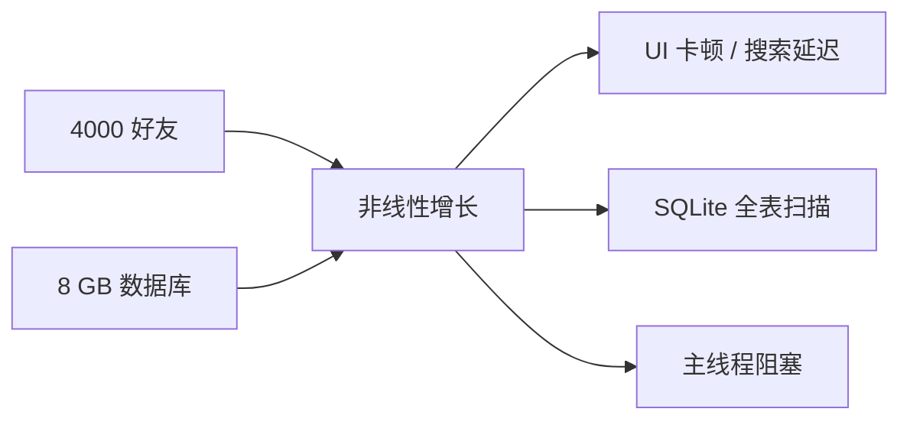

# 性能分析

> **基准假设：** ~4000 位好友，~8 GB SQLite 数据库。以下讨论的所有瓶颈均为非线性 —— 随着数据增长，性能**不会**平滑退化。

## 概述

VRCX 面向社交型 VR 重度用户，这类用户往往积累了数千好友和数年的游戏日志。虽然大多数功能在早期使用时表现良好，但多个热路径存在 **二次方（O(n²)）**、**全表扫描** 或 **重复线性扫描** 的行为，在大规模数据下会导致明显的 UI 退化。



---

## 瓶颈 1 — `findUserByDisplayName` 线性扫描

### 定位

`src/shared/utils/user.js` 第 280 行

```javascript
function findUserByDisplayName(cachedUsers, displayName) {
    for (const ref of cachedUsers.values()) {  // O(n) 扫描
        if (ref.displayName === displayName) {
            return ref;
        }
    }
    return undefined;
}
```

### 调用点清单

| 调用位置 | 文件 | 触发频率 |
|---------|------|---------|
| 玩家加入事件 | `gameLogCoordinator.js:89` | **高频** — 每次进房间 |
| 玩家加入日志 | `gameLogCoordinator.js:162` | **高频** — 同上 |
| 外部消息 | `gameLogCoordinator.js:409` | 中频 |
| 视频播放解析 | `mediaParsers.js:142` | 中频 |
| 资源加载解析 | `mediaParsers.js:210, 273, 330, 387` | **高频** — 5 个调用点 |
| 通知处理 | `notification/index.js:1021, 1087` | 中频 |
| 用户协调器 | `userCoordinator.js:635` | 低频 |

### 复杂度

- 单次调用：**O(n)**，n = `cachedUsers.size`（通常 4000–8000）
- 加入 80 人满房间：80 次加入事件 × O(n) = **O(80n)**
- 加上 `mediaParsers` 的乘数效应：每个日志事件可能多次调用 `findUserByDisplayName`
- 最坏情况（加入满房间）：约 **400,000 次字符串比较**

### 严重性：🔴 关键

最高优先级修复项。这个函数在实时事件处理中贡献了最大份额的可避免 CPU 开销。

### 未来方向

在 `userStore` 中构建反向索引 `Map<displayName, ref>`，与 `cachedUsers` 同步维护：

```javascript
// 在 user store 中
const displayNameIndex = new Map(); // displayName → ref

// 在 applyUser() 中维护：
// displayNameIndex.set(ref.displayName, ref);

// O(1) 查找：
function findUserByDisplayName(cachedUsers, displayName) {
    return displayNameIndex.get(displayName);
}
```

::: warning 注意
VRChat 中 displayName **不是全局唯一的**，但当前实现已经返回第一个匹配项。反向索引保持了相同的语义。
:::

---

## 瓶颈 2 — GameLog / 通知数据库搜索

### 定位

- `src/services/database/gameLog.js` 第 984 行（`searchGameLogDatabase`）
- `src/services/database/notifications.js` 第 77 行（`lookupNotificationDatabase`）

### 问题

两个函数都对多个列使用 `LIKE '%search%'` 模式，这**无法使用 B-tree 索引**，必然触发全表扫描：

```sql
-- gameLog.js：在 7 个表上重复执行，用 UNION ALL 合并
SELECT * FROM (
    SELECT ... FROM gamelog_location
    WHERE world_name LIKE @searchLike   -- 全表扫描
    ORDER BY id DESC LIMIT @perTable
)
UNION ALL
SELECT * FROM (
    SELECT ... FROM gamelog_join_leave
    WHERE display_name LIKE @searchLike -- 全表扫描
    ORDER BY id DESC LIMIT @perTable
)
-- ... 还有 5 个 UNION ALL 块
```

```sql
-- notifications.js：原始字符串拼接
WHERE (sender_username LIKE '%${search}%'
    OR message LIKE '%${search}%'
    OR world_name LIKE '%${search}%')
```

### 复杂度

| 参数 | 估计值 |
|------|-------|
| `gamelog_join_leave` 行数 | ~5,000,000（多年使用） |
| `gamelog_location` 行数 | ~500,000 |
| 扫描的表数 | 7（UNION ALL） |
| 每次搜索键入的扫描次数 | 7 × 每表全扫描 |

使用 `LIKE '%xxx%'` 时，SQLite 必须检查每个表中的**每一行**。在 8 GB 数据库规模下，每次搜索可能扫描**数百万行**。

### 附加问题 — SQL 注入

`notifications.js` 第 77 行使用**原始字符串拼接**而非参数化查询：

```javascript
// ⚠️ SQL 注入漏洞
`WHERE (sender_username LIKE '%${search}%' ...)`
```

虽然第 38 行做了 `search.replaceAll("'", "''")`，但这**不是完整的防护**。

### 严重性：🔴 关键

搜索性能与数据库年龄和大小成正比退化。使用 VRCX 多年的用户将经历最严重的延迟。

### 未来方向

**方案 A — SQLite FTS5（全文搜索）**

```sql
-- 在现有表旁创建 FTS 表
CREATE VIRTUAL TABLE gamelog_fts USING fts5(
    display_name, world_name, content='gamelog_join_leave'
);

-- 搜索变为 O(log n)，通过倒排索引
SELECT * FROM gamelog_fts WHERE gamelog_fts MATCH 'searchterm';
```

- 优点：文本搜索快几个数量级；内置于 SQLite
- 缺点：需要 schema 迁移，FTS 表增加约 30% 存储开销，所有插入都必须同步更新 FTS 索引

**方案 B — 前缀匹配 LIKE（`LIKE 'xxx%'`）**

如果不需要全文搜索，去掉前导 `%` 即可使用 B-tree 索引：

```sql
WHERE display_name LIKE 'search%'  -- 可使用索引
```

- 优点：零迁移成本；仅需修改 SQL
- 缺点：只能匹配前缀，不能匹配子串 —— 改变了用户可见行为

**方案 C — 应用层搜索索引**

在搜索对话框打开时从单次 `SELECT` 查询构建内存中的 trie 或倒排索引。后续键入在内存索引中搜索。

- 优点：初始加载后极快；无需修改 DB schema
- 缺点：内存开销；数据在重新索引前可能过期

::: tip 建议
方案 A（FTS5）是战略性选择。方案 C 是在 FTS 迁移不可行时的务实短期方案。
:::

---

## 瓶颈 3 — 共同好友图谱 O(n²)

### 定位

`src/views/Charts/components/MutualFriends.vue` 第 827 行（`buildGraphFromMutualMap`）

### 结构

```javascript
for (const [friendId, { friend, mutuals }] of mutualMap.entries()) {
    ensureNode(friendId, ...);
    for (const mutual of mutuals) {       // 内层循环
        ensureNode(mutual.id, ...);
        addEdge(friendId, mutual.id);     // 每对好友创建边
    }
}
```

### 复杂度

- 设 N = 好友数，M = 每个好友的平均共同好友数
- 边创建：**O(N × M)**
- 在密集社交图中（好友圈子）：M 趋近 N → **O(N²)**
- 图布局（`forceAtlas2.assign`）：已在 Web Worker 中，但随边数**超线性增长**

### 规模估算

| 好友数 | 估计边数 | 构建时间（约） |
|--------|---------|-------------|
| 100 | ~2,000 | < 1 秒 |
| 500 | ~50,000 | ~3 秒 |
| 2000 | ~800,000 | ~30 秒以上 |
| 4000 | ~3,200,000 | 可能数分钟 |

### 严重性：🟡 中等

图布局已在 Web Worker 中（不阻塞 UI）。图的构建在主线程上运行，但使用了基于哈希的去重（`graph.hasEdge`）。不过 4000 好友时，边的数量变得非常大。

### 未来方向

1. **按社区预过滤**：在构建完整图之前，按世界/群组亲和度聚类好友，然后只构建子图。这大幅降低了每个子图的 N。

2. **增量布局**：缓存之前的布局位置，仅在图变化时（添加/移除好友）重新布局，使用之前的布局作为初始位置。

3. **图大小上限**：添加可配置的阈值（例如最多 500 节点）。提供 UI 在生成图之前按好友分组过滤。

4. **将图构建移入 Worker**：将 `buildGraphFromMutualMap` 移入现有的 `graphLayoutWorker`，使构建和布局都在主线程之外。

---

## 瓶颈 4 — 好友列表重复排序/过滤

### 定位

`src/stores/friend.js` 第 79–165 行

### 结构

五个 `computed` 属性各自创建**新数组副本**并排序：

```javascript
const vipFriends = computed(() =>
    Array.from(friends.values())       // O(n) 拷贝
        .filter(f => f.isVIP)          // O(n)
        .sort(sortFn)                  // O(n log n)
);
const onlineFriends = computed(...)    // 相同模式
const activeFriends = computed(...)    // 相同模式
const offlineFriends = computed(...)   // 相同模式
const allFriends = computed(...)       // 相同模式
```

### 复杂度

- 任何好友属性变化都会使 `friends`（reactive Map）失效
- 触发**全部 5 个 computed** 重新评估：5 × (O(n) + O(n log n))
- 4000 好友时：5 × 4000 × log₂(4000) ≈ **240,000 次比较**
- 频繁触发场景：高峰时段好友上下线事件

### 严重性：🟡 中等

Vue 的 computed 缓存机制在依赖未变化时阻止了冗余评估，但 `friends` Map 是高度易变的 —— 任何好友状态变化（状态、位置、平台）都会使所有 watcher 失效。

### 未来方向

1. **基于分区的缓存**：不从完整列表过滤，而是维护独立的 `Set`（`vipIds`、`onlineIds` 等），在个别好友状态变化时增量更新。

2. **单次排序 + 视图切片**：排序完整列表一次，然后使用二分查找或偏移量创建分类视图，无需重新排序。

3. **`shallowRef` 数组 + 手动 diff**：仅跟踪最终排序后的数组，只在排序顺序实际变化时重新排序（而非每次好友更新）。

---

## 瓶颈 5 — 快速搜索主线程遍历

### 定位

`src/stores/search.js` 第 113 行（`quickSearchRemoteMethod`）

### 问题

旧版快速搜索在主线程上对**所有好友**进行遍历：

```javascript
for (const ctx of friendStore.friends.values()) {
    // 每个好友都执行 removeConfusables() + localeIncludes()
}
```

新版 **全局搜索**（`globalSearch.js` + `searchWorker.js`）已使用 Web Worker，但顶栏的**快速搜索**仍在主线程运行。

### 附加关注点 — globalSearch.js 的深度 watcher

```javascript
// 6 个 deep watcher，每个都触发完整数据序列化到 worker
watch(() => friendStore.friends, () => scheduleIndexUpdate(), { deep: true });
watch(() => avatarStore.cachedAvatars, () => scheduleIndexUpdate(), { deep: true });
// ... 还有 4 个
```

对大型 reactive Map 的 `deep: true` watcher 会触发 Vue 内部的深度遍历（访问每个嵌套属性），然后 `sendIndexUpdate()` 通过 `postMessage` 将**所有数据**序列化到 worker。200ms debounce 缓解了频率，但序列化成本是 O(总数据量)。

### 严重性：🟡 中等

快速搜索有 debounce 且结果限制为 4 条，可见影响有限。但 4000 好友时，每次键入可能处理 4000 × `removeConfusables` 调用。

### 未来方向

1. **将快速搜索合并到 Worker**：将快速搜索查询路由到现有的 `searchWorker`，而非在主线程上重复逻辑。

2. **将深度 watcher 替换为定向变更追踪**：不深度监听整个 Map，而是监听特定的变更事件，只向 worker 发送增量更新。

---

## 瓶颈 6 — SharedFeed `unshift` + 深度监听

### 定位

`src/stores/sharedFeed.js` 第 31 行（`rebuildOnPlayerJoining`）

### 问题

```javascript
// Array.unshift 是 O(n) —— 移动所有现有元素
onPlayerJoining.unshift(newEntry);
```

结合 feed 数组上的任何 `deep: true` watcher，每个**新事件**都会导致 O(n) 元素移位**加上** Vue 响应式系统对数组的完整深度遍历。

### 严重性：🟢 低

`maxEntries` 上限限制了数组大小。实际上这不是主要瓶颈，但该模式是次优的。

### 未来方向

1. **环形缓冲区**：使用固定大小的循环缓冲区代替 `unshift`。新条目覆盖最旧的条目，无需移位。

2. **`shallowRef` + 手动触发**：对 feed 数组使用 `shallowRef([])`，在变更后调用 `triggerRef()`，避免 Vue 的深度遍历。

---

## 补充发现 — Instance Store 的全量好友遍历

### 定位

`src/stores/instance.js` 第 74–91, 786, 991 行

### 问题

```javascript
// cleanInstanceCache：在每次 applyInstance() 时调用
const friendLocationTags = new Set(
    [...friendStore.friends.values()]      // 展开 4000 好友
        .map(f => f.$location?.tag)
        .filter(Boolean)
);
```

```javascript
// vrcxCoordinator.js 第 62-74 行：O(instances × friends)
instanceStore.cachedInstances.forEach((ref, id) => {
    if ([...friendStore.friends.values()].some(   // 每个实例都重新展开！
        (f) => f.$location?.tag === id
    )) { return; }
});
```

### 复杂度

- `cleanInstanceCache`：每次 instance apply 时 O(friends) —— 频繁调用
- `clearVRCXCache` 的实例循环：O(instances × friends) —— 不频繁但 O(n×m) 是浪费的

### 严重性：🟡 中等（实例缓存）/ 🟢 低（clearVRCXCache）

### 未来方向

维护一个响应式的 `Set<tag>` 存储当前好友的位置标签，在好友变更位置时增量更新。两个函数可使用 O(1) 查找。

---

## 优先级矩阵

| 优先级 | 瓶颈 | 复杂度类别 | 用户影响 | 修复难度 |
|--------|------|-----------|---------|---------|
| **P0** | `findUserByDisplayName` 线性扫描 | O(n) × 高频 | 🔴 关键 | ⭐ 简单 |
| **P1** | GameLog/通知 `LIKE '%x%'` | O(行数) 全扫描 | 🔴 关键 | ⭐⭐ 中等 |
| **P1** | `notifications.js` SQL 注入 | 安全漏洞 | 🔴 关键 | ⭐ 简单 |
| **P2** | 好友列表 5× 排序重算 | 5 × O(n log n) | 🟡 中等 | ⭐⭐ 中等 |
| **P2** | globalSearch 深度 watcher 序列化 | O(全部数据) | 🟡 中等 | ⭐⭐ 中等 |
| **P3** | Instance 缓存全量好友遍历 | O(friends) 每次 | 🟡 中等 | ⭐ 简单 |
| **P3** | 共同好友图谱 O(n²) | O(n²) 边 | 🟡 中等 | ⭐⭐⭐ 困难 |
| **P4** | SharedFeed unshift | O(条目数) | 🟢 低 | ⭐ 简单 |
| **P4** | clearVRCXCache 嵌套迭代 | O(instances × friends) | 🟢 低 | ⭐ 简单 |

---

## 非线性增长预测

下图展示了关键瓶颈的处理成本如何随好友数量**非线性增长**：

```
处理成本（任意单位）
│
│                                    ╱ 图谱 O(n²)
│                                  ╱
│                               ╱
│                            ╱
│                         ╱
│                      ╱          ╱ 5× 排序 O(n log n)
│                   ╱          ╱
│                ╱          ╱
│             ╱         ╱         ╱ 线性扫描 O(n)
│          ╱        ╱          ╱
│       ╱       ╱           ╱
│    ╱      ╱            ╱
│ ╱    ╱             ╱
├──────────────────────────── 好友数量
0   500  1000  2000  3000  4000
```

**核心洞察：** 在 4000 好友时，O(n²) 的图谱比 1000 好友时慢 **16 倍**（而非 4 倍）。线性扫描慢 4 倍，但它们在**每个事件**上运行，因此总 CPU 时间随事件频率乘性增长。
