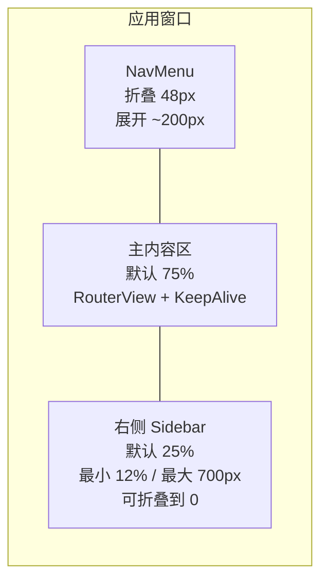

# 布局策略

## 当前布局架构



**关键布局事实：**
- `ResizablePanelGroup` 自动保存到 localStorage
- 右侧栏可折叠（0px），支持拖拽或切换
- NavMenu 可折叠到仅图标模式（48px）
- `KeepAlive` 切换路由时保持组件状态（排除 Charts）
- 14 个全局弹窗渲染在布局外的 portal 中

## 当前组件尺寸

| 组件 | 默认值 | 最小值 | 最大值 | 行为 |
|------|--------|--------|--------|------|
| NavMenu | ~200px | 48px（仅图标） | ~200px | 折叠为图标 |
| 主内容区 | 75% | — | — | 弹性 |
| 右侧 Sidebar | 25% | 12% | 700px | 可折叠到 0 |
| FriendsLocations 卡片 | 100% 缩放 | 50% 缩放 | 100% | 用户可配置 |
| FriendsLocations 间距 | 100% | 25% | 100% | 用户可配置 |

## Sidebar 当前功能

```
┌─ 搜索 (Ctrl+K / ⌘K) ─────────────────┐
├─ [刷新] [通知 🔔] [⚙️] ───────────────┤
├─ 标签页: [好友 (X/Y)] [群组 (Z)] ────┤
│                                        │
│  ★ VIP 好友（收藏分组）               │
│  ● 在线好友                            │
│  ◐ 活跃好友                            │
│  ○ 离线好友                            │
│  ▣ 同实例分组（可选）                 │
│                                        │
│  设置：7 种排序方式                    │
│  按实例分组（开关）                    │
│  按收藏分组拆分（开关）               │
└────────────────────────────────────────┘
```

**排序选项**：按字母、按状态、私有排底部、按最近活跃、按最近上线、按实例时长、按位置

## 设计原则

### 原则 1：渐进增强

> 先为**最小可用视口**设计，然后为更大屏幕增加复杂度。

| 视口 | 策略 |
|------|------|
| 小（400-600px） | 只显示核心信息：好友数、在线状态、名字。隐藏次要数据。 |
| 中（600-1000px） | 增加位置信息、状态详情、好友卡片。 |
| 大（1000px+） | 完整体验：多列布局、所有数据可见、图表、仪表盘。 |

### 原则 2：信息密度可控

> 用户应该能控制看到多少信息，而不是被迫接受一种密度。

当前机制：
- 卡片缩放滑块（50-100%）在 FriendsLocations
- 卡片间距滑块（25-100%）
- 表格密度设置（从 NavMenu 主题下拉框）
- 可折叠 Sidebar
- 可折叠 NavMenu
- FriendsLocations 可折叠收藏分组

### 原则 3：基于路由而非面板

> 主要功能放在路由（标签页）中，不放在侧边栏面板里。侧边栏只用于**快速浏览**。

这意味着：
- Sidebar 保持轻量（好友列表 + 基本状态）
- 复杂功能（FriendsLocations、GameLog、Charts）是全页路由
- 弹窗处理深入查看（UserDialog 11 标签页、GroupDialog 12+ 标签页）

### 原则 4：降级的 VR 模式

> VR 模式是一个**独立应用**，功能最小化。不要试图让桌面功能在 VR 中运行。

VR 模式有：
- 独立入口（`vr.js`）
- 无 Pinia、无 Vue Query
- 只有手腕覆盖层上的好友位置
- 专门为瞥一眼交互设计

## 布局决策框架

考虑新的布局改动时，回答这些问题：

```
1. 谁受益？
   □ 所有画像     → 值得做
   □ 只有重度用户 → 不能伤害其他人
   □ 只有大窗口   → 必须优雅降级
   □ 只有 VR      → 单独考虑

2. 400px 宽度下会怎样？
   □ 仍然可用     → ✅ 好
   □ 隐藏/折叠    → ✅ 可接受
   □ 坏掉了       → ❌ 需要重新设计

3. 增加 UI 复杂度了吗？
   □ 无新控件     → ✅ 简单
   □ 新的开关/设置 → 🔶 考虑是否真的需要
   □ 新面板/标签页 → ⚠️ 高代价——认真论证

4. 放在哪里？
   □ 在 Sidebar    → 必须适合快速浏览
   □ 在路由中     → 可以复杂
   □ 在弹窗中     → 最适合深入查看
   □ 新面板       → 尽量避免——用现有路由或弹窗
```

## 当前痛点 & 方案选项

### Sidebar：太复杂又信息不够

**问题**：用户想在 Sidebar 看更多信息（比如在收藏里显示同实例好友），但 Sidebar 已经很密了，小窗口用户体验会变差。

**方案**：
| 方案 | 优点 | 缺点 |
|------|------|------|
| A. 增加可切换的区块 | 用户选择看什么 | 更多设置复杂度和代码复杂度 |
| B. 改为增强 FriendsLocations | 全页有空间 | 不帮助 Sidebar 导向的用户 |
| C. 紧凑卡片 + 可展开详情 | 两全其美 | 实现复杂 |
| D. 什么都不做——保持 Sidebar 简单 | 维护代码少 | 用户持续要求 |

### FriendsLocations：Tab 还是 Dashboard

**问题**：FriendsLocations 是一个路由/标签页。用户想让它成为主视图或自定义仪表盘。

**方案**：
| 方案 | 优点 | 缺点 |
|------|------|------|
| A. 让 FriendsLocations 作为默认路由 | 对很多人最有用 | Feed 用户失去他们的默认页 |
| B. 允许用户选择默认路由 | 皆大欢喜 | 多一个设置 |
| C. 构建自定义仪表盘视图 | 最大灵活性 | 巨大的实现成本，只有重度+大窗口用户受益 |
| D. 给 FriendsLocations 添加小组件 | 渐进改善 | 可能变得太复杂 |

### 同实例好友：在哪里显示

**问题**：同实例分组在 Sidebar 和 FriendsLocations 都存在，有独立开关。用户想在收藏中也能看到。

**方案**：
| 方案 | 优点 | 缺点 |
|------|------|------|
| A. 在 Sidebar 收藏区域显示 | 一目了然 | Sidebar 更密，信息重复 |
| B. 用指示徽章代替完整显示 | 紧凑且有信息量 | 细节少 |
| C. 只保留在 FriendsLocations | Sidebar 干净 | 用户必须切换标签页 |
