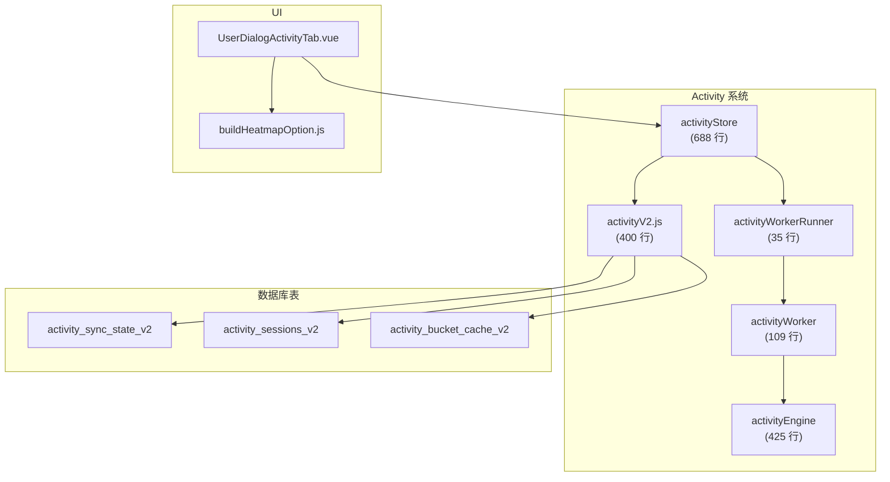
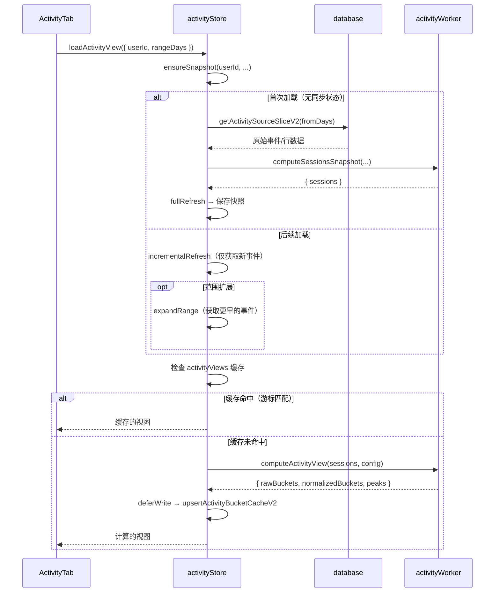

# Activity 系统

Activity 系统提供用户在线活动的热力图可视化和重叠分析。它将原始数据库事件处理为 session，计算 7×24 热力图分桶，并渲染 ECharts 热力图——全部通过三层架构完成，保持主线程的响应性。



## 概述


## 架构

系统使用三层来分离关注点：

| 层级 | 文件 | 职责 |
|------|------|------|
| **Store** | `stores/activity.js` | 状态管理、快照缓存、飞行中任务去重、缓存失效 |
| **Engine** | `shared/utils/activityEngine.js` | 纯函数：session 构建、分桶计算、归一化、峰值检测 |
| **Worker** | `workers/activityWorker.js` | 在主线程外通过 `postMessage` 运行引擎函数 |

### Worker 通信

`activityWorkerRunner.js` 将原始 Worker API 封装为基于 Promise 的接口：

```js
// 单例懒加载 worker
let worker = null;
let workerSeq = 0;
const pendingWorkerCallbacks = new Map();

export function runActivityWorkerTask(type, payload) {
    return new Promise((resolve, reject) => {
        const seq = ++workerSeq;
        pendingWorkerCallbacks.set(seq, { resolve, reject });
        getWorker().postMessage({ type, seq, payload });
    });
}
```

Worker 支持以下消息类型：

| 类型 | 输入 | 输出 |
|------|------|------|
| `computeSessionsSnapshot` | 原始事件/行数据 | `{ sessions, pendingSessionStartAt }` |
| `computeActivityView` | Sessions + 配置 | 热力图分桶 + 峰值 |
| `computeOverlapView` | 自己 + 目标 sessions | 重叠分桶 + 百分比 |
| `buildSessionsFromGamelog` | Gamelog 行数据 | `{ sessions }` |
| `buildSessionsFromEvents` | 在线/离线事件 | `{ sessions, pendingSessionStartAt }` |
| `buildHeatmapBuckets` | Sessions + 窗口 | `{ buckets }` |
| `buildOverlapBuckets` | 两个 session 数组 | `{ buckets }` |
| `normalizeHeatmapBuckets` | 原始分桶 + 配置 | `{ normalized }` |

## 数据源差异

系统根据查看的用户是当前用户还是好友来处理两种根本不同的数据源：

| 方面 | 自己（当前用户） | 好友 |
|------|----------------|------|
| **源表** | `gamelog_location`（加入/离开时间戳） | `feed_online_offline`（在线/离线事件） |
| **Session 构建器** | `buildSessionsFromGamelog()` | `buildSessionsFromEvents()` |
| **粒度** | 每个实例级别的 session 精度 | 仅在线/离线转换 |
| **开放尾部** | 最后一个 session 可能是开放的（仍在游戏中） | 无开放尾部概念 |
| **待处理开始** | 不适用 | 跟踪 `pendingSessionStartAt` 用于不完整 session |

## Session 快照系统

Store 维护一个基于内存的 LRU 缓存的 session 快照：

```js
const snapshotMap = new Map();  // userId → snapshot
const MAX_SNAPSHOT_ENTRIES = 12;
```

### 快照结构

```js
{
    userId: string,
    isSelf: boolean,
    sync: {
        userId: string,
        updatedAt: string,         // 最后刷新的 ISO 时间戳
        isSelf: boolean,
        sourceLastCreatedAt: string, // 增量更新的游标
        pendingSessionStartAt: number | null,
        cachedRangeDays: number    // 已获取的最大范围
    },
    sessions: Array<{ start, end, isOpenTail, sourceRevision }>,
    activityViews: Map,   // rangeDays → 计算后的视图
    overlapViews: Map     // cacheKey → 计算后的视图
}
```

### LRU 驱逐

快照通过 `Map.delete()` + `Map.set()`（访问时触摸）使用插入顺序驱逐。当缓存超过 12 个条目时，最旧的未触摸、非飞行中的快照被驱逐。

### 飞行中任务去重

并发请求通过 `inFlightJobs` Map 去重。任务键格式为 `${userId}:${isSelf}:${rangeDays}:${force|normal}`。

## 数据流

### 加载 Activity 热力图



### 三种刷新策略

| 策略 | 触发时机 | 行为 |
|------|---------|------|
| **全量刷新** | 首次加载或强制刷新 | 获取 `rangeDays` 内的所有源数据，从头构建 sessions |
| **增量刷新** | 后续加载 | 仅获取 `sourceLastCreatedAt` 之后的事件，合并新 sessions |
| **范围扩展** | 用户选择更长时间段 | 获取从 `cachedRangeDays` 到 `rangeDays` 的事件，前置更早的 sessions |

### 延迟写入

数据库写入（session 持久化、同步状态更新）通过 `deferWrite()` 排队，使用 `requestIdleCallback`（回退到 `setTimeout(0)`）以避免阻塞 UI。

## 重叠分析

重叠视图比较两个用户的 session 数据来发现他们同时在线的时段：

1. 两个用户的快照通过 `ensureSnapshot` 并行加载
2. 缓存键包含 `targetUserId:rangeDays:excludeKey`
3. 游标是一对：`selfCursor|targetCursor`
4. Worker 计算 `buildOverlapBuckets()` → 两个 session 数组的交集
5. 结果包含 `overlapPercent` 和 `bestOverlapTime`

### 排除时段

用户可以从重叠分析中排除特定时间范围（如睡眠时间）。这被编码为缓存键中的 `excludeKey`（`startHour-endHour`），确保不同的排除设置产生不同的缓存条目。

## 归一化算法

原始分桶值（每小时段的分钟数）通过 `normalizeBuckets()` 归一化到 0–1 用于热力图着色：

### 配置参数

```js
{
    floorPercentile: 15,    // 低于此百分位的值 → 0
    capPercentile: 85,      // 高于此百分位的值 → 1
    rankWeight: 0.2,        // 基于排名评分的混合权重
    targetCoverage: 0.25,   // 非零单元格的目标百分比
    targetVolume: 60        // 目标总"视觉权重"
}
```

这些参数通过 `pickActivityNormalizeConfig()` 和 `pickOverlapNormalizeConfig()` 按角色（self vs friend）和范围（7/30/90 天）进行调优。

## 数据库 Schema（V2）

每个用户三张表，以 `{userPrefix}_` 为前缀：

### `activity_sync_state_v2`

| 列 | 类型 | 用途 |
|----|------|------|
| `user_id` | TEXT PK | 目标用户 |
| `updated_at` | TEXT | 最后刷新时间戳 |
| `is_self` | INTEGER | 是否为当前用户的数据 |
| `source_last_created_at` | TEXT | 增量更新的游标 |
| `pending_session_start_at` | INTEGER | 不完整 session 开始（仅好友） |
| `cached_range_days` | INTEGER | 已获取的最大范围 |

### `activity_sessions_v2`

| 列 | 类型 | 用途 |
|----|------|------|
| `session_id` | INTEGER PK AUTO | 主键 |
| `user_id` | TEXT | 目标用户 |
| `start_at` | INTEGER | Session 开始时间戳（ms） |
| `end_at` | INTEGER | Session 结束时间戳（ms） |
| `is_open_tail` | INTEGER | Session 是否仍然活跃 |
| `source_revision` | TEXT | 构建时的源数据游标 |

索引：`(user_id, start_at)`、`(user_id, end_at)`

### `activity_bucket_cache_v2`

| 列 | 类型 | 用途 |
|----|------|------|
| `user_id` | TEXT | 拥有者用户 |
| `target_user_id` | TEXT | 目标用户（activity 视图为空） |
| `range_days` | INTEGER | 时间范围 |
| `view_kind` | TEXT | `'activity'` 或 `'overlap'` |
| `exclude_key` | TEXT | 排除时段键 |
| `bucket_version` | INTEGER | Schema 版本 |
| `raw_buckets_json` | TEXT | 原始分钟值（168 个槽位） |
| `normalized_buckets_json` | TEXT | 归一化的 0–1 值 |
| `built_from_cursor` | TEXT | 构建时的源游标 |
| `summary_json` | TEXT | 峰值/重叠统计 |
| `built_at` | TEXT | 构建时间戳 |

主键：`(user_id, target_user_id, range_days, view_kind, exclude_key)`

## 热力图渲染

`buildHeatmapOption.js` 为 7×24 热力图生成 ECharts 配置：

- **网格**：7 行（天）× 24 列（小时）
- **颜色梯度**：6 级分段（`0`、`0–0.2`、`0.2–0.4`、`0.4–0.6`、`0.6–0.8`、`0.8–1`）
- **周起始日**：通过 `weekStartsOn` 参数可配置
- **深色模式**：调整边框和高亮颜色
- **悬停提示**：显示每个单元格的原始分钟数

## 功能

| 功能 | 详细信息 |
|------|---------|
| **Activity 热力图** | 7×24 网格显示按天×小时的在线频率 |
| **重叠图表** | 比较当前用户和任意好友的在线时间 |
| **Top Worlds** | 最常访问世界的排名列表（按时间或访问次数） |
| **峰值统计** | 最活跃的日期和最活跃的时间段 |
| **时间段筛选** | 7、30、90、180 天 |
| **排除时段** | 从重叠分析中过滤睡眠/非活跃时间 |
| **右键菜单** | 右键保存图表为 PNG |
| **空状态** | 无数据时显示 `DataTableEmpty` |

## 文件映射

| 文件 | 行数 | 用途 |
|------|------|------|
| `stores/activity.js` | 688 | Pinia store：快照缓存、任务去重、加载编排 |
| `shared/utils/activityEngine.js` | 425 | 纯函数：session 构建、分桶计算、归一化 |
| `workers/activityWorker.js` | 109 | Web Worker 消息处理器 |
| `workers/activityWorkerRunner.js` | 35 | 基于 Promise 的 Worker 通信封装 |
| `services/database/activityV2.js` | 400 | V2 schema 的数据库 CRUD |
| `components/dialogs/UserDialog/activity/buildHeatmapOption.js` | 99 | ECharts 热力图配置构建器 |
| `components/dialogs/UserDialog/UserDialogActivityTab.vue` | ~600 | Activity 标签页 UI 组件 |

## 风险与注意事项

- **快照 LRU 驱逐跳过飞行中任务。** 如果所有 12 个快照槽位都被飞行中请求占用，缓存将暂时超过其限制。
- **`deferWrite()` 是发射后不管的。** 写入失败会被记录但不影响 UI。这意味着出错后数据库可能滞后于内存状态。
- **Self 与 friend 数据不对称。** Self 数据使用 gamelog（每个实例），friend 数据使用 feed 事件（仅在线/离线）。同一个热力图 UI 显示的是根本不同粒度的数据。
- **`mergeGapMs`（5 分钟）影响 session 精度。** 5 分钟内的事件被合并为单个 session。这是视觉噪音和精度之间的刻意权衡。
- **归一化是角色感知的。** 不同的 `pickActivityNormalizeConfig` 预设意味着相同的原始数据可能根据查看者产生不同的视觉结果。
- **Worker 是共享的。** 所有 activity 计算共享单个 Worker 实例。非常大的计算（如 180 天数据）会阻塞后续请求直到完成。
