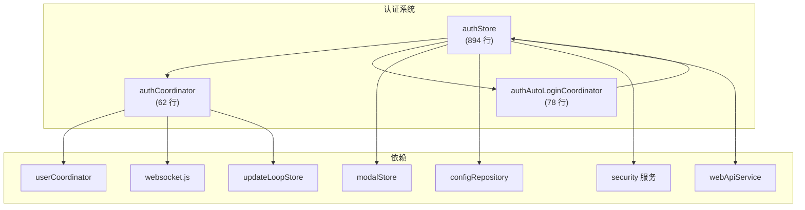
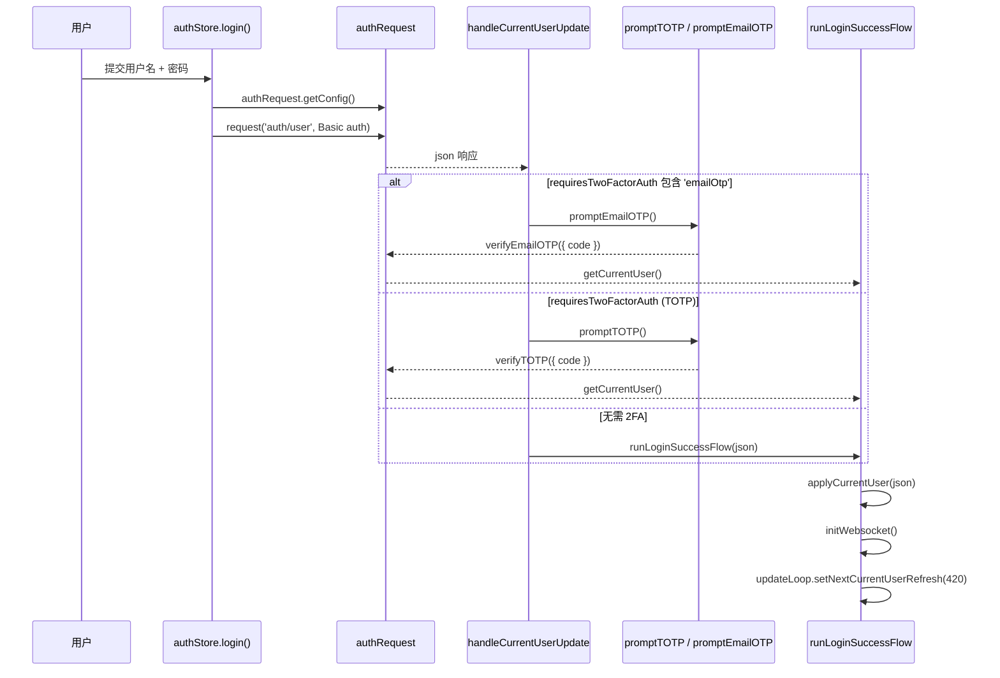
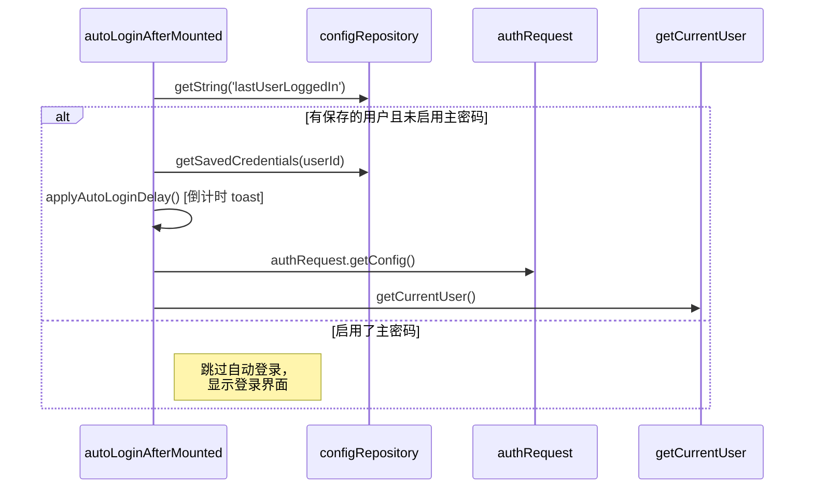
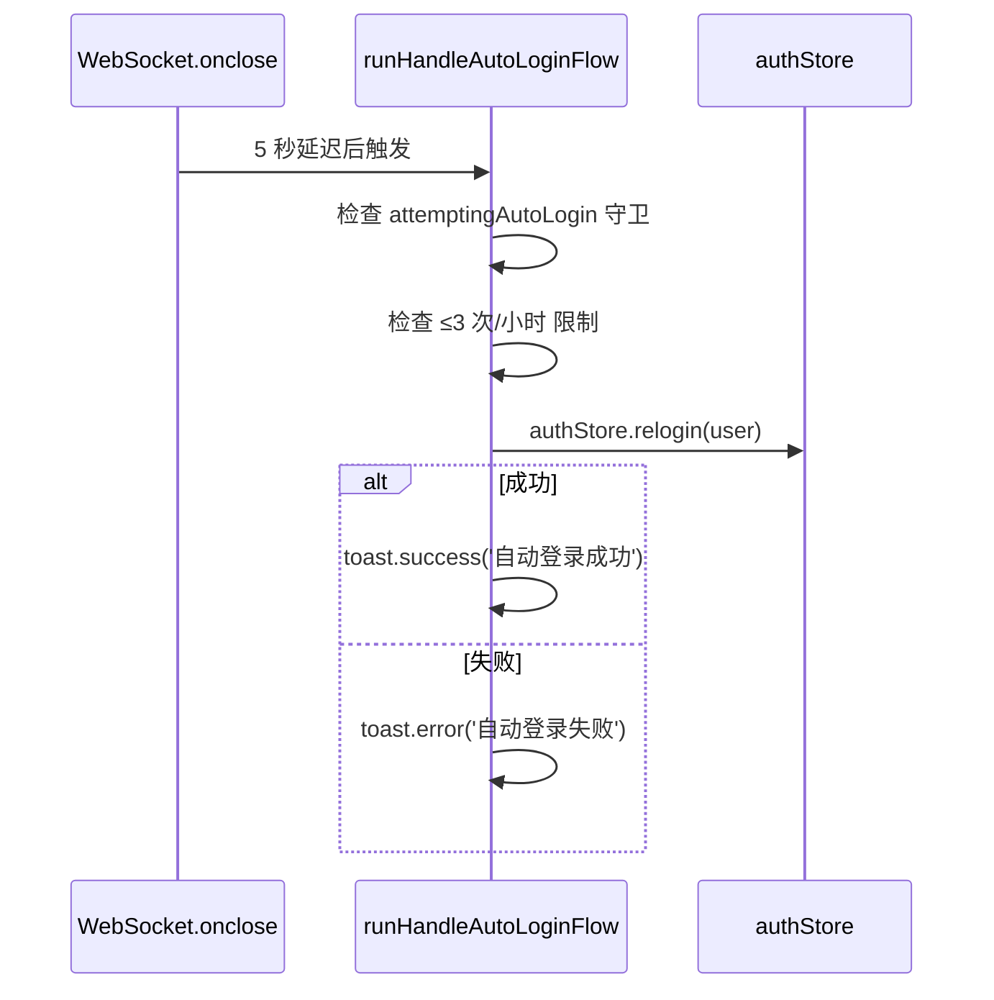
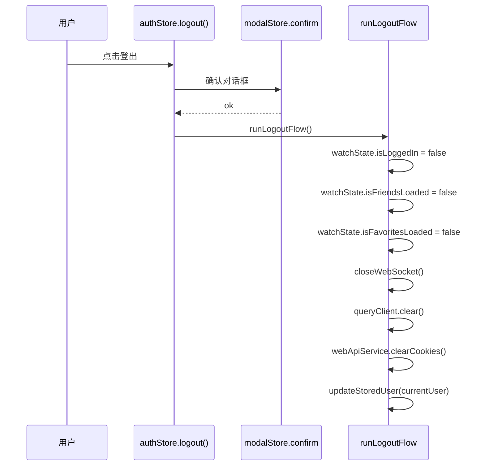

# 认证系统

认证系统管理 VRCX 的完整认证生命周期，包括手动登录、自动登录、凭证持久化、双因素认证（2FA）、主密码加密以及登出。它是应用启动时第一个激活的系统，所有其他子系统都依赖 `watchState.isLoggedIn` 来决定是否启动。



## 概览


## 状态结构

```js
// loginForm — 登录表单状态
loginForm: {
    loading: false,         // 认证请求进行中
    username: '',
    password: '',
    endpoint: '',           // 自定义 API 端点（可选）
    websocket: '',          // 自定义 WS 端点（可选）
    saveCredentials: false, // 是否持久化凭证
    lastUserLoggedIn: ''    // 上次成功登录的 userId
}

// enablePrimaryPasswordDialog — 设置主密码的弹窗
enablePrimaryPasswordDialog: {
    visible: false,
    password: '',
    rePassword: ''
}

// 其他响应式状态
credentialsToSave: null,            // 待持久化的凭证
twoFactorAuthDialogVisible: false,  // 2FA 弹窗激活
cachedConfig: {},                   // 最新的 VRC 配置
enableCustomEndpoint: false,        // 自定义 API 开关
attemptingAutoLogin: false          // 自动登录守卫标志
```

## 认证流程

### 手动登录



**关键细节：**
- 凭证通过 `btoa(encodeURIComponent(username):encodeURIComponent(password))` 编码为 Basic Auth
- 如果启用了 `saveCredentials` + 主密码，会额外通过 `security.encrypt()` 加密密码
- `credentialsToSave` ref 作为"待写入"缓冲，在登录成功后由 `updateStoredUser()` 消费

### 启动时自动登录



### 断线自动重连（WebSocket 关闭时）

当 WebSocket 意外关闭但登录状态仍然有效时：



**频率限制：** 1 小时滚动窗口内最多 3 次自动登录尝试。时间戳存储在 `state.autoLoginAttempts`（Set）中。

### 登录完成

```js
async function loginComplete() {
    await database.initUserTables(userStore.currentUser.id);
    watchState.isLoggedIn = true;         // 触发所有 store watcher
    AppApi.CheckGameRunning();            // 从热重载恢复状态
}
```

设置 `watchState.isLoggedIn = true` 是**主触发器**，它会激活：
- 好友同步 (`friendSyncCoordinator`)
- 通知初始化
- GameLog 处理
- 收藏加载
- 群组初始化
- 所有监听 `watchState.isLoggedIn` 的子系统

### 登出



## 双因素认证

VRCX 支持三种 2FA 方式，均使用共享的 `modalStore.otpPrompt()` 对话框：

| 方式 | 函数 | API 端点 | 验证码格式 |
|------|------|---------|-----------|
| TOTP（验证器应用） | `promptTOTP()` | `verifyTOTP` | 6 位数字 |
| 恢复码 OTP | `promptOTP()` | `verifyOTP` | 8 字符，格式 `XXXX-XXXX` |
| 邮箱 OTP | `promptEmailOTP()` | `verifyEmailOTP` | 邮件中的验证码 |

**方式之间的切换：**
- TOTP 对话框有"使用恢复码"按钮 → 切换到 OTP
- OTP 对话框有"使用验证器"按钮 → 切换到 TOTP
- 邮箱 OTP 对话框有"重新发送"按钮 → 调用 `resendEmail2fa()` 清除 cookie 并重新触发登录

## 凭证管理

### 存储结构

凭证存储在 `configRepository`（SQLite）的 `savedCredentials` 键下：

```json
{
    "usr_xxxx": {
        "user": { "id": "usr_xxxx", "displayName": "...", ... },
        "loginParams": {
            "username": "user@example.com",
            "password": "明文或加密文本",
            "endpoint": "",
            "websocket": ""
        },
        "cookies": "..."
    }
}
```

### 主密码加密

当 `enablePrimaryPassword` 为 true 时：
1. **登录时：** 提示输入主密码 → `security.decrypt(storedPassword, primaryPassword)` → 实际密码用于认证
2. **保存时：** `security.encrypt(actualPassword, primaryPassword)` → 存储为密文
3. **禁用时：** 用户输入主密码 → 所有存储的密码解密后以明文重新保存
4. **影响：** 主密码完全**禁用自动登录**

### 迁移

`migrateStoredUsers()` 处理以用户名为 key 的旧数据。它将所有条目重新以 `usr_xxxx` 格式为 key。

## 自定义 API 端点

用于开发/测试，用户可以切换 `enableCustomEndpoint` 来指定：
- 自定义 REST API 端点（替代 `api.vrchat.cloud`）
- 自定义 WebSocket 端点

这些值存储在 `AppDebug.endpointDomain` / `AppDebug.websocketDomain` 中，在任何登录尝试前应用。

## 文件映射

| 文件 | 行数 | 用途 |
|------|------|------|
| `stores/auth.js` | 894 | 所有认证状态、登录/登出、2FA 提示、凭证管理 |
| `coordinators/authCoordinator.js` | 62 | `runLogoutFlow()`、`runLoginSuccessFlow()` |
| `coordinators/authAutoLoginCoordinator.js` | 78 | `runHandleAutoLoginFlow()` 含频率限制 |
| `services/security.js` | — | 通过 Web Crypto API 加密/解密 |
| `services/webapi.js` | — | Cookie 管理、clearCookies、setCookies |
| `services/config.js` | — | SQLite 键值持久化 |

## 关键依赖

| 认证触达 | 方向 | 用途 |
|----------|------|------|
| `userCoordinator` | out → | 登录成功时 `applyCurrentUser()` |
| `updateLoopStore` | out → | 安排下次用户刷新（7分钟） |
| `websocket.js` | out → | `initWebsocket()` / `closeWebSocket()` |
| `watchState` | out → | 设置 `isLoggedIn`、`isFriendsLoaded` 等 |
| `modalStore` | out → | OTP 提示、确认对话框 |
| `notificationStore` | out → | 登出时重置通知初始化状态 |
| `queryClient` | out → | 登出时清除 Vue Query 缓存 |

## 风险与注意事项

- **`watchState.isLoggedIn` 是主开关。** 在 `loginComplete()` 中设为 `true` 会触发 15+ 个 store 的 watcher。在 `runLogoutFlow()` 中设为 `false` 会触发所有相同 store 的清理。
- **自动登录延迟** (`applyAutoLoginDelay`) 使用倒计时 toast 配合 `workerTimers.setTimeout` — 这是用户可配置的延迟（0-60秒），防止快速重连循环。
- **Cookie 持久化：** `user.cookies` 与凭证一起保存。`relogin()` 时在认证前恢复 cookie 以维持会话 — 如果 cookie 无效，则发起全新认证请求。
- **主密码仅为客户端加密** — 它不提供服务端安全性，只防止本地凭证暴露。
