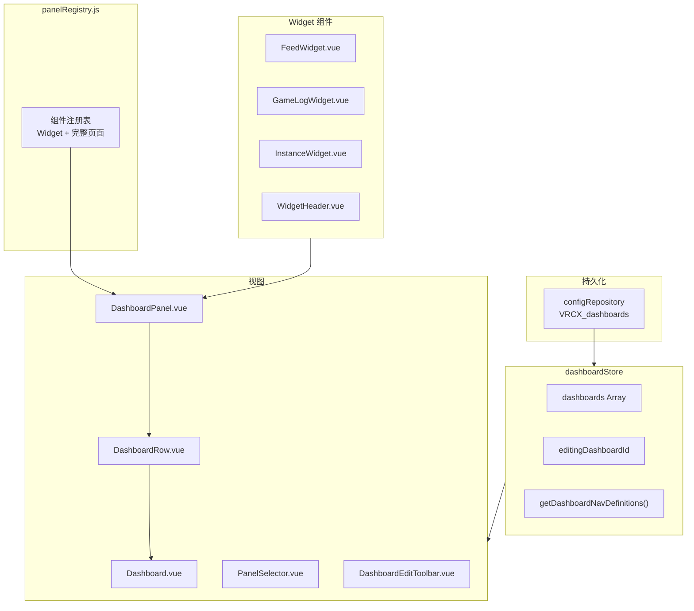

# 自定义仪表盘（Dashboard）

## 当前状态：✅ 基础版已实现（2026-03-13）

## 系统概览



## 数据结构

### Dashboard 配置

```javascript
{
    id: "uuid",              // crypto.randomUUID()
    name: "My Dashboard",    // 用户自定义名称
    icon: "LayoutDashboard", // Lucide 图标名
    rows: [
        {
            direction: "horizontal" | "vertical",
            panels: [
                // 完整页面：string
                "feed",
                // Widget：object
                { key: "widget-feed", config: { enabledTypes: [...] } }
            ]
        }
    ]
}
```

### 每行最多 2 个面板，支持 horizontal / vertical 排列。

## Widget 详情

### FeedWidget

| 项目 | 内容 |
|------|------|
| **数据源** | `feedStore.feedTableData` (WebSocket 实时推送) |
| **条目上限** | 100 条 |
| **可配置** | 事件类型过滤（在编辑模式下勾选 Online/Offline/Location 等） |
| **交互** | 用户名可点击 → `showUserDialog()`，世界名可点击 → `showWorldDialog()` |
| **时间显示** | < 1h: "3m ago"，≥ 1h: "2h ago" |

### GameLogWidget

| 项目 | 内容 |
|------|------|
| **数据源** | 独立从 DB 加载 + `vrcx:gamelog-entry` CustomEvent 实时推送 |
| **条目上限** | 200 条 |
| **可配置** | 事件类型过滤 |
| **不依赖** | 不复用 `gameLogStore.gameLogTableData`（独立数据源，避免必须打开 GameLog 页才能看数据） |

### InstanceWidget

| 项目 | 内容 |
|------|------|
| **数据源** | `instanceStore.currentInstanceUsersData` |
| **显示内容** | 当前世界名 + 可滚动玩家列表 |
| **不在游戏中** | 显示空状态提示 |

### WidgetHeader（共享组件）

所有 Widget 共用的标题栏：标题文字 + 可选的 ↗ 跳转按钮（点击跳到完整页面）。

## 导航集成

Dashboard 通过 NavMenu 动态渲染。`dashboardStore.getDashboardNavDefinitions()` 返回导航条目数组，Key 为 `dashboard:{id}` 格式。

用户可以创建多个 Dashboard，每个都会出现在导航菜单中。

## 关键依赖

| 模块 | 如何交互 |
|------|---------|
| **configRepository** | 持久化整个 dashboards 配置为 JSON 字符串 |
| **feedStore** | FeedWidget 读取 feedTableData |
| **instanceStore** | InstanceWidget 读取 currentInstanceUsersData |
| **gameLogStore** | GameLogWidget 通过 CustomEvent 监听新日志 |
| **NavMenu** | 动态渲染 dashboard 导航条目 |
| **router.js** | `dashboard` 路由，params = `{ id }` |

## 决策方向

### 下一步 Widget

以下 Widget 已分析可行但尚未实现：

| Widget | 优先级 | 数据源 | 实时更新 | 工作量 |
|--------|--------|--------|---------|--------|
| **OnlineFriends** | ⭐⭐⭐ | `friendStore` computed | ✅ WebSocket | 低（~80 行） |
| **Notification** | ⭐⭐⭐ | `notificationStore` | ✅ WebSocket | 中（~150 行） |
| **FriendsLocations** | ⭐⭐⭐ | `friend + location + favorite` | ✅ WebSocket | 中 |

### OnlineFriends Widget 概念

```
┌─ 好友状态 ───────── ↗ ┐
│ 🟢 12 在线  🟡 3 活跃 │
│                       │
│ [头像+名字] [头像+名字]│
│ [头像+名字] [头像+名字]│
└───────────────────────┘
```

- 顶部计数统计，下方头像网格
- auto-fill 自适应 panel 宽度
- 点击 → `showUserDialog()`

### Notification Widget 概念

```
┌─ 通知 ─── 🔴 3 ─── ↗ ┐
│ 👤 Alice 好友请求       │
│    [接受] [忽略]         │
│ 📨 Bob 邀请你到 World X │
│    [加入]              │
└───────────────────────┘
```

- 只显示未读 + 最近 24h
- 好友请求直接带操作按钮

### 不适合做 Widget 的页面

| 页面 | 原因 |
|------|------|
| FriendList | 操作型页面（批量删除、排序），不适合紧凑摘要 |
| Favorites | 管理型页面 |
| MyAvatars | 管理型页面 |
| Search | 交互型页面 |
| Charts | 需要大屏展示 |
| Moderation | 低频操作 |
