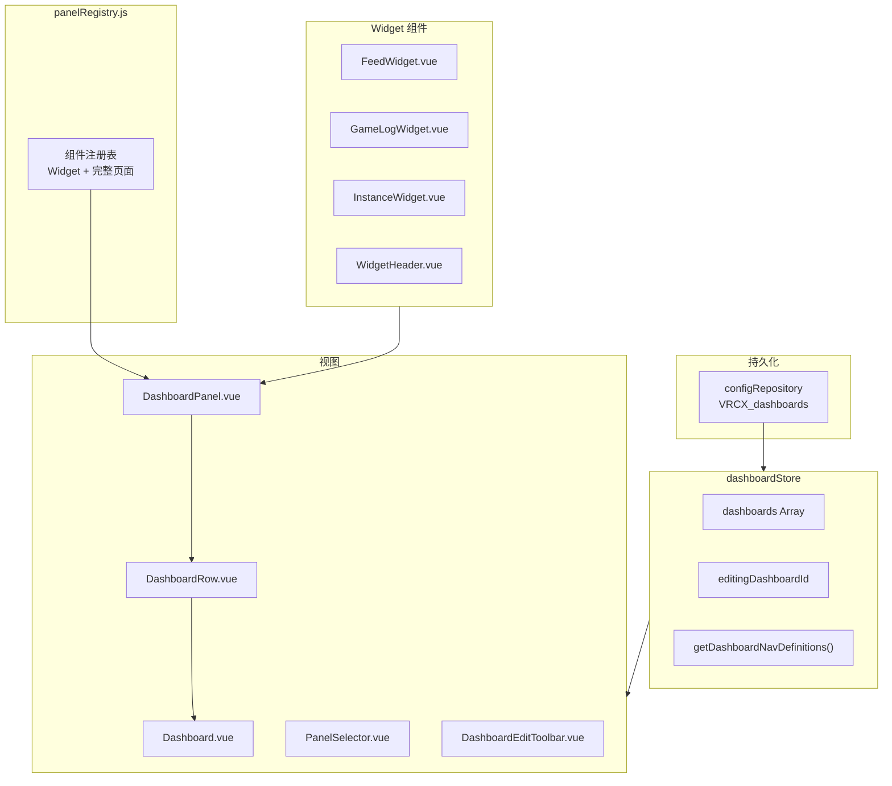

# 自定义仪表盘（Dashboard）

自定义仪表盘系统提供可定制的多面板布局，用户可以将 Widget 和完整页面组合为个性化仪表盘。



## 概览

## 数据结构

### Dashboard 配置

```javascript
{
    id: "uuid",              // crypto.randomUUID()
    name: "My Dashboard",    // 用户自定义名称
    icon: "LayoutDashboard", // Lucide 图标名
    rows: [
        {
            direction: "horizontal" | "vertical",
            panels: [
                // 完整页面：string
                "feed",
                // Widget：带配置的 object
                {
                    key: "widget:feed",
                    config: {
                        filters: ["GPS", "Online", "Offline"],  // 事件类型过滤
                        showType: true                          // 显示类型列
                    }
                },
                {
                    key: "widget:game-log",
                    config: {
                        filters: ["Location", "OnPlayerJoined"],
                        showDetail: true                        // 显示 Event/External 类型的详情
                    }
                },
                {
                    key: "widget:instance",
                    config: {
                        columns: ["icon", "displayName", "timer", "rank"]  // 列可见性
                    }
                }
            ]
        }
    ]
}
```

### 每行最多 2 个面板，支持 horizontal / vertical 排列。

## Widget 配置机制

Widget 的配置通过 **WidgetHeader 上的齿轮图标** 访问。鼠标悬停在 Widget 标题栏时齿轮会出现，点击打开下拉菜单进行多选配置。

### 配置数据流

```
用户点击下拉菜单中的复选框
  → Widget 的 toggleFilter / toggleColumn / toggleBooleanConfig
  → props.configUpdater(newConfig)
  → DashboardPanel.emitConfigUpdate → emit('select', { key, config })
  → DashboardRow 转发 → emit('update-panel', rowIndex, panelIndex, value)
  → Dashboard.handleLiveUpdatePanel
  → dashboardStore.updateDashboard（持久化到 configRepository）
  → 响应式更新通过 props 流回 Widget
```

关键设计决策：

- prop 名用 `configUpdater` 而非 `onConfigUpdate`，避免 Vue 3 自动将 `on*` 开头的 prop 转为事件监听器
- 非编辑模式下的配置更新通过 `handleLiveUpdatePanel` 直接写入 store
- 编辑模式下的配置更新通过 `handleUpdatePanel` 写入临时编辑状态 `editRows`
- `@select.prevent` 在 `DropdownMenuCheckboxItem` 上保持下拉菜单不关闭，支持连续多选

## 编辑模式

编辑模式下，每个面板显示：

- **已选择面板**：面板图标 + 名称 + 垃圾桶图标（清除选择）
- **未选择面板**："No Panel Selected" 文字 + "Select Panel" 按钮
- 行级 X 按钮可移除整个面板槽位

## Widget 详情

### FeedWidget

| 项目               | 内容                                                                |
| ------------------ | ------------------------------------------------------------------- |
| **数据源**         | `feedStore.feedTableData` (WebSocket 实时推送)                      |
| **条目上限**       | 100 条                                                              |
| **配置：过滤器**   | 事件类型过滤：GPS、Online、Offline、Status、Avatar、Bio             |
| **配置：显示类型** | 切换类型列的可见性                                                  |
| **交互**           | 用户名可点击 → `showUserDialog()`                                   |
| **样式**           | 用户名使用默认前景色（无加粗），与 Feed 标签页 columns.jsx 保持一致 |

### GameLogWidget

| 项目             | 内容                                                                                                      |
| ---------------- | --------------------------------------------------------------------------------------------------------- |
| **数据源**       | 独立从 DB 加载 `database.lookupGameLogDatabase()` + 通过 `gameLogStore.latestGameLogEntry` watch 实时推送 |
| **条目上限**     | 200 条                                                                                                    |
| **配置：过滤器** | 事件类型过滤：Location、OnPlayerJoined、OnPlayerLeft、VideoPlay、PortalSpawn、Event、External             |
| **配置：Detail** | 切换 Event/External 类型的详情显示（内联显示 data/message 而非 tooltip）                                  |
| **不依赖**       | 不复用 `gameLogStore.gameLogTableData`（独立数据源，避免必须打开 GameLog 页才能看数据）                   |
| **好友图标**     | OnPlayerJoined/OnPlayerLeft 后显示 ⭐（收藏）或 💚（好友）                                                |
| **VideoPlay**    | 显示 `videoId: videoName`，带 tooltip，可点击打开外部 URL（LSMedia/PopcornPalace 除外）                   |
| **Location**     | 包含 `grouphint` prop 显示群组名                                                                          |
| **样式**         | OnPlayerJoined：默认颜色；OnPlayerLeft：`text-muted-foreground/70`；无行悬停高亮                          |

### InstanceWidget

| 项目           | 内容                                                                                 |
| -------------- | ------------------------------------------------------------------------------------ |
| **数据源**     | `instanceStore.currentInstanceUsersData`                                             |
| **显示内容**   | 当前世界名 + 位置信息 + 玩家人数 + 可滚动玩家列表                                    |
| **配置：列**   | 切换列可见性：icon、displayName（始终显示）、rank、timer、platform、language、status |
| **默认列**     | icon、displayName、timer                                                             |
| **不在游戏中** | 显示空状态提示                                                                       |

### WidgetHeader（共享组件）

所有 Widget 共用的标题栏组件：

- 标题文字 + 图标
- 悬停时显示 ↗ 跳转按钮（点击跳到完整页面）
- 右侧 slot：悬停时显示齿轮配置按钮（通过 Widget 传入）

## 导航集成

Dashboard 通过 NavMenu 动态渲染。`dashboardStore.getDashboardNavDefinitions()` 返回导航条目数组，Key 为 `dashboard:{id}` 格式。

用户可以创建多个 Dashboard，每个都会出现在导航菜单中。

## 关键依赖

| 模块                 | 如何交互                                               |
| -------------------- | ------------------------------------------------------ |
| **configRepository** | 持久化整个 dashboards 配置为 JSON 字符串               |
| **feedStore**        | FeedWidget 读取 feedTableData                          |
| **instanceStore**    | InstanceWidget 读取 currentInstanceUsersData           |
| **gameLogStore**     | GameLogWidget 通过 latestGameLogEntry watch 监听新日志 |
| **NavMenu**          | 动态渲染 dashboard 导航条目                            |
| **router.js**        | `dashboard` 路由，params = `{ id }`                    |

## 决策方向

### 下一步 Widget

以下 Widget 已分析可行但尚未实现：

| Widget               | 优先级 | 数据源                         | 实时更新     | 工作量        |
| -------------------- | ------ | ------------------------------ | ------------ | ------------- |
| **OnlineFriends**    | ⭐⭐⭐ | `friendStore` computed         | ✅ WebSocket | 低（~80 行）  |
| **Notification**     | ⭐⭐⭐ | `notificationStore`            | ✅ WebSocket | 中（~150 行） |
| **FriendsLocations** | ⭐⭐⭐ | `friend + location + favorite` | ✅ WebSocket | 中            |

### OnlineFriends Widget 概念

```
┌─ 好友状态 ───────── ↗ ┐
│ 🟢 12 在线  🟡 3 活跃 │
│                       │
│ [头像+名字] [头像+名字]│
│ [头像+名字] [头像+名字]│
└───────────────────────┘
```

- 顶部计数统计，下方头像网格
- auto-fill 自适应 panel 宽度
- 点击 → `showUserDialog()`

### Notification Widget 概念

```
┌─ 通知 ─── 🔴 3 ─── ↗ ┐
│ 👤 Alice 好友请求       │
│    [接受] [忽略]         │
│ 📨 Bob 邀请你到 World X │
│    [加入]              │
└───────────────────────┘
```

- 只显示未读 + 最近 24h
- 好友请求直接带操作按钮

### 不适合做 Widget 的页面

| 页面       | 原因                                         |
| ---------- | -------------------------------------------- |
| FriendList | 操作型页面（批量删除、排序），不适合紧凑摘要 |
| Favorites  | 管理型页面                                   |
| MyAvatars  | 管理型页面                                   |
| Search     | 交互型页面                                   |
| Charts     | 需要大屏展示                                 |
| Moderation | 低频操作                                     |
