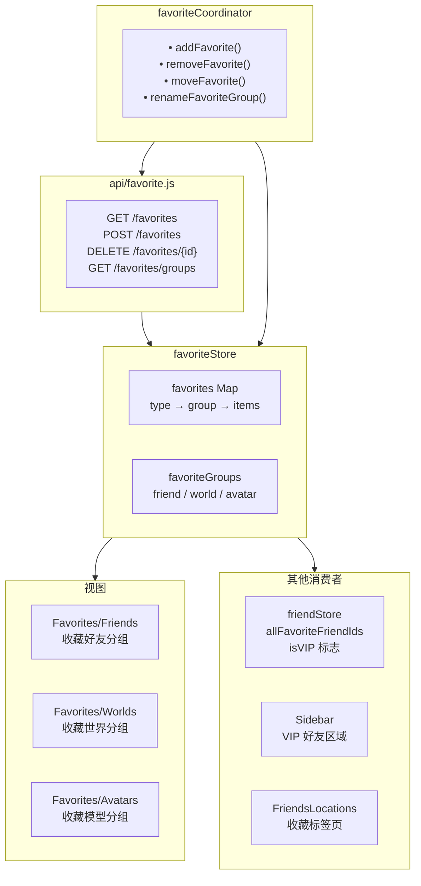
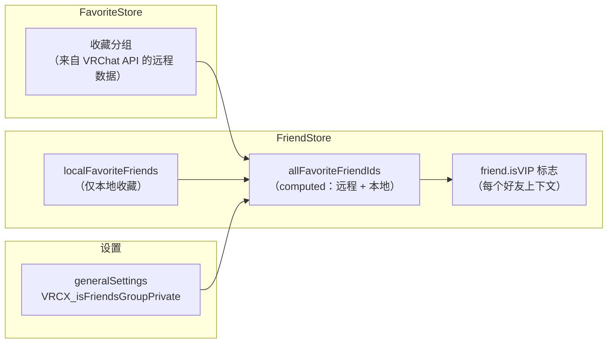

# Favorite 系统

## 系统概览



## 收藏类型

VRChat 支持三种收藏类型，每种有自己的分组结构：

| 类型 | 最大分组数 | 每组项目数 | 用于 |
|------|-----------|-----------|------|
| **friend** | 动态 | 动态 | Sidebar VIP、FriendsLocations |
| **world** | 动态 | 动态 | Favorites/Worlds 视图 |
| **avatar** | 动态 | 动态 | Favorites/Avatars 视图 |

## 收藏与好友系统的交互

收藏和好友系统之间的集成是最横切的关注点之一：



### 远程 vs 本地收藏

| 来源 | 存储位置 | 同步 | 用途 |
|------|---------|------|------|
| **远程** | VRChat API | 是，跨设备 | VRChat 官方收藏分组 |
| **本地** | VRCX 本地 DB | 否，仅本设备 | VRCX 特有的额外收藏 |

`allFavoriteFriendIds` computed 属性合并了两个来源，所以 UI 对它们的处理完全一致。

## 收藏操作

### 添加收藏
```
favoriteCoordinator.addFavorite(type, id, group)
├── 验证：不在该分组中
├── API：POST /favorites
├── 更新 favoriteStore
├── 如果 type === "friend"：
│   └── friendStore.updateSidebarFavorites()
└── 通知 toast
```

### 移除收藏
```
favoriteCoordinator.removeFavorite(type, id)
├── API：DELETE /favorites/{id}
├── 更新 favoriteStore
├── 如果 type === "friend"：
│   └── friendStore.updateSidebarFavorites()
└── 通知 toast
```

### 收藏分组排序

用户可以在 Sidebar 设置中重新排列收藏分组。这影响：
- Sidebar VIP 区域的排序
- FriendsLocations "收藏"标签页的分组
- Favorites/Friends 视图的分组排序

## 视图

### Favorites/Friends

按收藏分组组织的好友数据表。功能：
- 分组标签页/区块
- 点击打开 UserDialog
- 拖拽重新排序（组内）
- 从收藏中移除

### Favorites/Worlds

世界详情数据表：
- 缩略图、名称、作者、容量
- 点击打开 WorldDialog
- 启动选项
- 从收藏中移除

### Favorites/Avatars

模型详情数据表：
- 缩略图、名称、作者
- "切换到"按钮
- 从收藏中移除

## 关键依赖

| 模块 | 如何使用收藏 |
|------|-------------|
| **friendStore** | 读取收藏 ID 来计算 VIP 好友 |
| **Sidebar** | 基于收藏分组显示 VIP 区域 |
| **FriendsLocations** | "收藏"标签页按收藏分组过滤 |
| **userCoordinator** | 用户数据变化时更新收藏 |
| **friendRelationshipCoordinator** | 删除好友时从收藏中移除 |
| **avatarCoordinator** | 读取模型收藏 |
| **worldCoordinator** | 读取世界收藏 |
