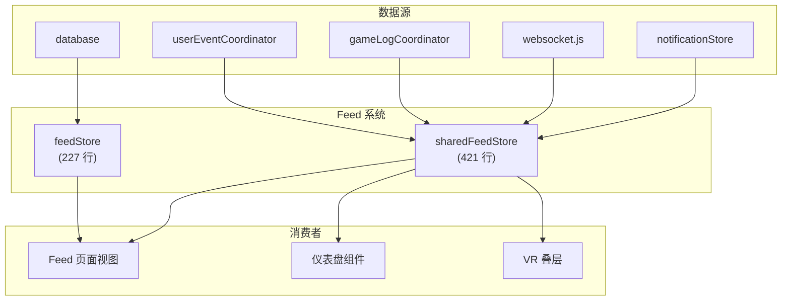

# Feed 系统

## 概述

VRCX 有两个 feed 系统：**Feed Store** 用于历史社交事件查看，**Shared Feed Store** 用于跨仪表盘、VR 叠层和通知中心的实时事件聚合。



## Feed Store

**数据库驱动的历史查看器。** 从 SQLite 数据库读取 `userEventCoordinator` 已持久化的事件。

| 事件类型 | 描述 |
|---------|------|
| `Online` / `Offline` | 好友上线/下线转换 |
| `GPS` | 好友位置变更 |
| `Status` | 状态文本/类型变更 |
| `Avatar` | 头像变更 |
| `Bio` | 简介文本变更 |

支持按日期范围、类型过滤、仅收藏过滤，以及客户端文本搜索。

## Shared Feed Store

**实时事件聚合器。** 用于仪表盘和 VR 叠层的实时 feed。事件由 coordinator 和 WebSocket pipeline 直接推送，不从数据库读取。

### `addEntry(entry)` — 核心入口

每个实时事件都经过此函数：

```js
function addEntry(entry) {
    // 1. 审核检查（跳过被屏蔽/静音的用户）
    if (moderationStore.isModerationBlocked(entry.userId)) return;

    // 2. 添加到会话表
    feedSessionTable.unshift(entry);

    // 3. 限制表大小
    if (feedSessionTable.length > maxEntries) feedSessionTable.pop();

    // 4. 如需要则通知 VR 叠层
    if (gameStore.isGameRunning) vrStore.sendFeedEntry(entry);
}
```

### 旅行者追踪

维护 `currentTravelers` Map 追踪正在移动（切换实例）的好友，供仪表盘和 VR 叠层消费。

## 对比

| 特性 | feedStore | sharedFeedStore |
|------|-----------|-----------------|
| 数据源 | 数据库（历史） | 直接推送（实时） |
| 持久化 | SQLite | 仅内存 |
| 范围 | 所有历史事件 | 当前会话 |
| 过滤 | 数据库查询 + 客户端搜索 | 仅审核检查 |
| 消费者 | Feed 页面 | 仪表盘、VR 叠层、Feed 页面 |
| 大小管理 | 数据库分页 | 数组上限 (maxEntries) |

## 文件映射

| 文件 | 行数 | 用途 |
|------|------|------|
| `stores/feed.js` | 227 | 历史 feed 查看器、数据库查询 |
| `stores/sharedFeed.js` | 421 | 实时 feed 聚合、旅行者追踪 |

## 风险与注意事项

- **`sharedFeedStore` 是会话范围的。** 页面刷新后数据丢失。只有数据库驱动的 `feedStore` 跨会话持久化。
- **`feedSessionTable` 使用 `unshift()` 的普通数组。** 对于活跃用户，频繁的 `unshift()` 操作可能降低性能。
- **`addEntry()` 中的审核过滤**意味着被屏蔽用户的事件从会话中静默丢失。
- **`currentTravelers`** 被深度监听。频繁的位置更新可能触发大量响应式重新计算。
