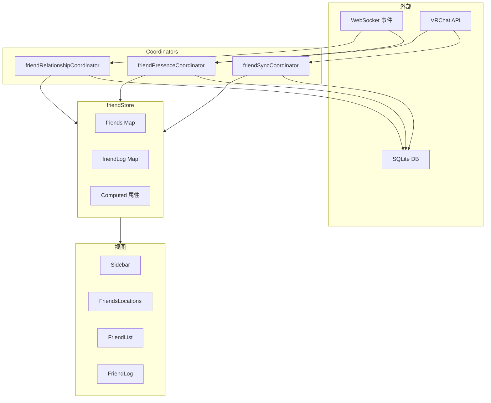
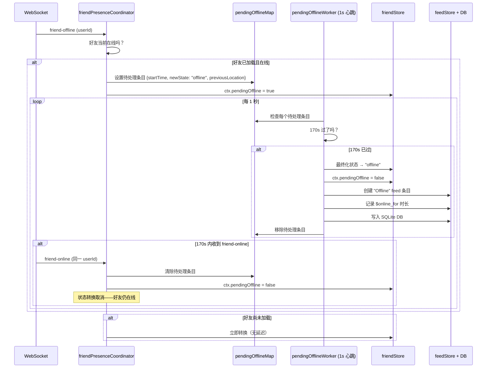

# Friend 系统

Friend 系统是 VRCX 中最复杂的子系统，跨越 1 个 Store、3 个 Coordinator 和 4 个主要视图。



## 概览

| 组件 | 职责 |
|------|------|
| **WebSocket 事件** | friend-online/offline/active, friend-location/update, friend-add/delete |
| **VRChat API** | GET /friends, GET /users/{id} |
| **SQLite DB** | friendLog 表、用户统计 |
| **friendRelationshipCoordinator** | addFriendship(), runDeleteFriendshipFlow(), updateFriendship() |
| **friendPresenceCoordinator** | runUpdateFriendFlow(), 170s 待离线机制, pendingOfflineWorker |
| **friendSyncCoordinator** | runInitFriendsListFlow(), runRefreshFriendsListFlow() |
| **friends Map** | ID → FriendContext |
| **sortedFriends** | `shallowRef` — 全局预排序好友列表，增量维护 |
| **Computed 属性** | vipFriends, onlineFriends, activeFriends, offlineFriends — 从 `sortedFriends` 过滤 |
| **Sidebar** | 快速好友列表（VIP / 在线 / 活跃 / 离线） |
| **FriendsLocations** | 卡片视图 + 虚拟滚动 |
| **FriendList** | 数据表，搜索 + 批量操作 |
| **FriendLog** | 历史表，添加/删除/改名事件 |

## FriendContext 数据结构

`friends` Map 中每个好友的结构：

```javascript
{
    id,                    // VRChat 用户 ID（如 "usr_xxx"）
    state,                 // "online" | "active" | "offline"
    isVIP,                 // true 表示在任何收藏分组中
    ref,                   // 完整用户对象引用（来自 userStore）
    name,                  // 显示名（快速访问）
    memo,                  // 用户备注文本
    pendingOffline,        // true 表示在 170s 延迟中
    $nickName              // 备注的第一行（昵称）
}
```

## sortedFriends 排序架构

不再由每个 `computed` 独立对完整的 `friends` Map 排序，store 维护一个全局预排序列表（`sortedFriends`，`shallowRef`）。所有派生 computed（`vipFriends`, `onlineFriends` 等）只**过滤**该列表 — 无需各自排序。

### 工作原理

```
sortedFriends  (shallowRef, 增量维护)
  ├── vipFriends       = sortedFriends.filter(online && isVIP)
  ├── onlineFriends    = sortedFriends.filter(online && !isVIP)
  ├── activeFriends    = sortedFriends.filter(active)
  ├── offlineFriends   = sortedFriends.filter(offline)
  └── friendsInSameInstance = sortedFriends.filter(online).groupBy(location)
```

### 增量维护

| 操作 | 函数 | 机制 |
|------|------|------|
| **插入/重排** | `reindexSortedFriend(ctx)` | 删除已有 → 二分查找 → splice 插入 |
| **删除** | `removeSortedFriend(id)` | 查找索引 → splice 删除 |
| **全量重建** | `rebuildSortedFriends()` | `Array.from(friends.values()).sort(comparator)` |

### 批处理模式

在批量操作（登录好友同步、好友编号分配、互关计数加载）期间，单独的 `reindexSortedFriend()` 调用会触发 O(n²) 工作。批处理模式延迟所有更新：

```
runInSortedFriendsBatch(() => {
    // 内部的 reindexSortedFriend() 调用只设置 pendingSortedFriendsRebuild = true
    for (const friend of friends) {
        applyUser(friend);
        reindexSortedFriend(ctx);  // → 空操作，只标记脏位
    }
});
// 批处理结束 → rebuildSortedFriends() → 单次全量排序
```

`sortedFriendsBatchDepth` 是计数器（非布尔值），支持嵌套批处理。

### 重建触发器

| 触发 | 机制 |
|------|------|
| 排序方式变更 | `watch(sidebarSortMethods)` → `rebuildSortedFriends()` |
| 登录/登出 | `watch(isLoggedIn)` → `sortedFriends.value = []` |
| 批处理结束 | `endSortedFriendsBatch()` → `rebuildSortedFriends()`（如果脏） |

### `reindexSortedFriend()` 调用点

| 位置 | 时机 |
|------|------|
| `friendStore.addFriend()` | 新好友加入 Map |
| `friendPresenceCoordinator.runUpdateFriendFlow()` | 状态/位置/名称变更 |
| `friendPresenceCoordinator.runUpdateFriendDelayedCheckFlow()` | 延迟检查后 VIP 状态变更 |
| `userCoordinator.applyUser()` | 完整用户数据到达 |
| `friendStore.setFriendNumber()` | 好友编号分配 |
| `friendStore.getFriendLog()` → 批处理 | 好友日志数据加载 |
| `friendStore.getAllUserMutualCount()` → 批处理 | 互关计数加载 |
| `friendStore.updateSidebarFavorites()` → 批处理 | 收藏分组变更 |

## Computed 属性

| 属性 | 来源 | 用途 |
|------|------|------|
| `allFavoriteFriendIds` | favoriteStore + 本地收藏 + 设置 | Sidebar VIP 区域、过滤 |
| `allFavoriteOnlineFriends` | `sortedFriends` 筛选 VIP + 在线 | Sidebar VIP 列表 |
| `onlineFriends` | `sortedFriends` 筛选在线、非 VIP | Sidebar 在线列表 |
| `activeFriends` | `sortedFriends` 筛选活跃状态 | Sidebar 活跃列表 |
| `offlineFriends` | `sortedFriends` 筛选离线/缺失 | Sidebar 离线列表 |
| `friendsInSameInstance` | `sortedFriends` 按共享实例分组 | Sidebar 分组、FriendsLocations |

## 170 秒待离线机制

这是 Friend 系统最微妙的部分。它防止网络抖动导致的虚假离线通知。



**为什么是 170 秒？** VRChat 的网络在世界切换时可能导致短暂断连。170 秒给了足够的时间让玩家在世界间旅行，而不会触发虚假的离线通知。

## 好友同步流程

### 初始加载（登录时）

```
runInitFriendsListFlow()
├── isFriendsLoaded = false
├── initFriendLog(currentUser)
│   ├── 首次运行？→ 拉取所有好友，创建日志条目
│   └── 后续？→ 从 DB 加载
├── tryApplyFriendOrder() → 顺序分配 friendNumber
├── getAllUserStats() → 从 DB 读取 joinCount, lastSeen, timeSpent
├── getAllUserMutualCount() → 共同好友数量
├── 迁移旧 JSON 数据 → SQLite（遗留）
└── isFriendsLoaded = true
```

### 增量刷新

```
runRefreshFriendsListFlow()
├── getCurrentUser()（如果距上次 > 5 分钟）
├── friendStore.refreshFriends()
│   └── GET /friends?offset=X&n=50（5 并发，有速率限制）
│       ├── 每个好友：addFriend() 或更新现有
│       └── 速率限制：50/页，并发上限
└── reconnectWebSocket()
```

### 好友刷新分页

API 是分页的（每页 50，5 个并发请求）。Store 处理：
- 发现新好友 → `addFriend()`
- 已有好友 → 更新状态
- 缺失的好友 → 由 `runUpdateFriendshipsFlow()` 处理

## 关系事件

### 添加好友流程
```
handleFriendAdd(args)
├── 验证：不是已有好友，不是自己
├── API：验证好友关系状态
├── 创建好友日志条目（type: "Friend"）
├── 分配 friendNumber（顺序递增）
├── 写入 SQLite
├── 排队通知
└── 删除对应的好友请求通知
```

### 删除好友流程
```
runDeleteFriendshipFlow(id)
├── confirmDeleteFriend() → 显示确认弹窗
├── API：验证好友关系
├── 创建好友日志条目（type: "Unfriend"）
├── 从所有收藏分组中移除
├── 写入 SQLite + 通知
├── 从日志中隐藏（如果设置启用）
└── 从 friendStore 中移除
```

### 追踪的变更
| 事件类型 | 触发时机 | 记录内容 |
|----------|---------|---------|
| `Friend` | 添加新好友 | displayName, friendNumber |
| `Unfriend` | 删除好友 | displayName |
| `FriendRequest` | 收到好友请求 | displayName |
| `CancelFriendRequest` | 取消请求 | displayName |
| `DisplayName` | 改名 | previousDisplayName → displayName |
| `TrustLevel` | 信任等级变化 | previousTrustLevel → trustLevel |

## 视图详情

### Sidebar（右侧面板）

**结构**：搜索 → 操作按钮 → 标签页（好友 / 群组） → 排序列表

**好友分类**（按顺序）：
1. VIP 好友（收藏分组）
2. 在线好友
3. 活跃好友
4. 离线好友
5. 同实例分组（可选）

**7 种排序**：按字母、按状态、私有排底部、按最近活跃、按最近上线、按实例时长、按位置

**设置**：按实例分组、隐藏同实例分组、按收藏分组拆分、收藏分组过滤

### FriendsLocations（全页）

**5 个标签页**：在线、收藏、同实例、活跃、离线

**虚拟滚动**动态行类型：
- `header` — 实例名 + 玩家数
- `group-header` — 可折叠收藏分组
- `divider` — 视觉分隔符
- `card` — 好友卡片行（1 个或多个卡片）

**卡片功能**：缩放 50-100%、间距 25-100%、按名字/签名/世界搜索

### FriendList（数据表）

**功能**：点击打开 UserDialog、多列排序、分页、列固定、带混淆字符检测的搜索、批量删除好友、加载资料（拉取缺失数据）

### FriendLog（历史表）

**事件类型**：Friend, Unfriend, FriendRequest, CancelFriendRequest, DisplayName, TrustLevel

**列**：日期、类型、显示名、之前的名字、信任等级、好友编号

## 文件清单

| 文件 | 行数 | 职责 |
|------|------|------|
| `stores/friend.js` | ~1400 | 好友状态、sortedFriends（shallowRef + 批处理）、computed 列表、好友日志 |
| `coordinators/friendPresenceCoordinator.js` | ~315 | WebSocket 在线状态事件、170s 待离线机制 |
| `coordinators/friendRelationshipCoordinator.js` | ~300 | 添加/删除好友关系、好友日志条目 |
| `coordinators/friendSyncCoordinator.js` | ~200 | 初始加载、增量刷新、分页 |

## 风险与注意事项

- **`sortedFriends` 是 `shallowRef`**，而非 `computed`。通过二分插入（`reindexSortedFriend`）和 splice 删除（`removeSortedFriend`）增量维护。仅在排序方式变更或登录状态转换时全量重建。
- **批处理操作**（`beginSortedFriendsBatch` / `endSortedFriendsBatch`）在批量好友列表刷新期间延迟排序更新。忘记调用 `endSortedFriendsBatch` 会静默抑制所有排序更新，直到下次重建。
- **170s 待离线**是时序最敏感的代码路径。1s 心跳 worker 和传入的 WebSocket 事件之间的竞态条件如果处理不当可能导致过期状态。
- **`friendsInSameInstance`** 现在遍历 `sortedFriends`（已排序）而非拼接 `vipFriends + onlineFriends`，因此分组排序与侧边栏排序一致，无需重新排序。
- **已知架构妥协**：`friend.js` 直接导入 `searchIndexCoordinator`（store → coordinator 反向依赖），用于异步备注/笔记加载回调。
