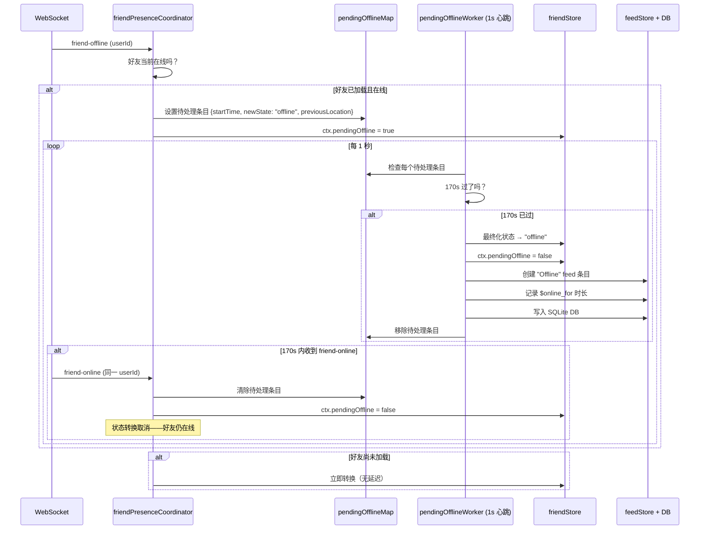

# Friend 系统

Friend 系统是 VRCX 中最复杂的子系统，跨越 1 个 Store、3 个 Coordinator 和 4 个主要视图。

## 系统概览

```mermaid
graph TD
    subgraph Store["friendStore"]
        friends["friends Map<br/>ID → FriendContext"]
        friendLog["friendLog Map"]
        computed["Computed:<br/>allFavoriteOnlineFriends<br/>onlineFriends<br/>activeFriends<br/>offlineFriends<br/>friendsInSameInstance"]
    end

    subgraph Coordinators
        sync["friendSyncCoordinator<br/>• runInitFriendsListFlow()<br/>• runRefreshFriendsListFlow()"]
        presence["friendPresenceCoordinator<br/>• runUpdateFriendFlow()<br/>• 170s 待离线机制<br/>• pendingOfflineWorker"]
        relationship["friendRelationshipCoordinator<br/>• addFriendship()<br/>• runDeleteFriendshipFlow()<br/>• updateFriendship()"]
    end

    subgraph Views["视图"]
        sidebar["Sidebar<br/>快速好友列表<br/>VIP / 在线 / 活跃 / 离线"]
        locations["FriendsLocations<br/>卡片视图<br/>虚拟滚动"]
        list["FriendList<br/>数据表<br/>搜索 + 批量操作"]
        log["FriendLog<br/>历史表<br/>添加/删除/改名事件"]
    end

    subgraph External["外部"]
        ws["WebSocket 事件<br/>friend-online/offline/active<br/>friend-location/update<br/>friend-add/delete"]
        api["VRChat API<br/>GET /friends<br/>GET /users/{id}"]
        db["SQLite DB<br/>friendLog 表<br/>用户统计"]
    end

    ws --> presence
    ws --> relationship
    api --> sync
    api --> presence
    sync --> Store
    presence --> Store
    relationship --> Store
    Store --> Views
    relationship --> db
    presence --> db
    sync --> db
```



## FriendContext 数据结构

`friends` Map 中每个好友的结构：

```javascript
{
    id,                    // VRChat 用户 ID（如 "usr_xxx"）
    state,                 // "online" | "active" | "offline"
    isVIP,                 // true 表示在任何收藏分组中
    ref,                   // 完整用户对象引用（来自 userStore）
    name,                  // 显示名（快速访问）
    memo,                  // 用户备注文本
    pendingOffline,        // true 表示在 170s 延迟中
    $nickName              // 备注的第一行（昵称）
}
```

## Friend Store Computed 属性

| 属性 | 来源 | 用途 |
|------|------|------|
| `allFavoriteFriendIds` | favoriteStore + 本地收藏 + 设置 | Sidebar VIP 区域、过滤 |
| `allFavoriteOnlineFriends` | 筛选 VIP + 在线的好友 | Sidebar VIP 列表 |
| `onlineFriends` | 筛选在线、非 VIP 的好友 | Sidebar 在线列表 |
| `activeFriends` | 筛选活跃状态的好友 | Sidebar 活跃列表 |
| `offlineFriends` | 筛选离线/缺失的好友 | Sidebar 离线列表 |
| `friendsInSameInstance` | 按共享实例分组的好友 | Sidebar 分组、FriendsLocations |

## 170 秒待离线机制

这是 Friend 系统最微妙的部分。它防止网络抖动导致的虚假离线通知。



**为什么是 170 秒？** VRChat 的网络在世界切换时可能导致短暂断连。170 秒给了足够的时间让玩家在世界间旅行，而不会触发虚假的离线通知。

## 好友同步流程

### 初始加载（登录时）

```
runInitFriendsListFlow()
├── isFriendsLoaded = false
├── initFriendLog(currentUser)
│   ├── 首次运行？→ 拉取所有好友，创建日志条目
│   └── 后续？→ 从 DB 加载
├── tryApplyFriendOrder() → 顺序分配 friendNumber
├── getAllUserStats() → 从 DB 读取 joinCount, lastSeen, timeSpent
├── getAllUserMutualCount() → 共同好友数量
├── 迁移旧 JSON 数据 → SQLite（遗留）
└── isFriendsLoaded = true
```

### 增量刷新

```
runRefreshFriendsListFlow()
├── getCurrentUser()（如果距上次 > 5 分钟）
├── friendStore.refreshFriends()
│   └── GET /friends?offset=X&n=50（5 并发，有速率限制）
│       ├── 每个好友：addFriend() 或更新现有
│       └── 速率限制：50/页，并发上限
└── reconnectWebSocket()
```

### 好友刷新分页

API 是分页的（每页 50，5 个并发请求）。Store 处理：
- 发现新好友 → `addFriend()`
- 已有好友 → 更新状态
- 缺失的好友 → 由 `runUpdateFriendshipsFlow()` 处理

## 关系事件

### 添加好友流程
```
handleFriendAdd(args)
├── 验证：不是已有好友，不是自己
├── API：验证好友关系状态
├── 创建好友日志条目（type: "Friend"）
├── 分配 friendNumber（顺序递增）
├── 写入 SQLite
├── 排队通知
└── 删除对应的好友请求通知
```

### 删除好友流程
```
runDeleteFriendshipFlow(id)
├── confirmDeleteFriend() → 显示确认弹窗
├── API：验证好友关系
├── 创建好友日志条目（type: "Unfriend"）
├── 从所有收藏分组中移除
├── 写入 SQLite + 通知
├── 从日志中隐藏（如果设置启用）
└── 从 friendStore 中移除
```

### 追踪的变更
| 事件类型 | 触发时机 | 记录内容 |
|----------|---------|---------|
| `Friend` | 添加新好友 | displayName, friendNumber |
| `Unfriend` | 删除好友 | displayName |
| `FriendRequest` | 收到好友请求 | displayName |
| `CancelFriendRequest` | 取消请求 | displayName |
| `DisplayName` | 改名 | previousDisplayName → displayName |
| `TrustLevel` | 信任等级变化 | previousTrustLevel → trustLevel |

## 视图详情

### Sidebar（右侧面板）

**结构**：搜索 → 操作按钮 → 标签页（好友 / 群组） → 排序列表

**好友分类**（按顺序）：
1. VIP 好友（收藏分组）
2. 在线好友
3. 活跃好友
4. 离线好友
5. 同实例分组（可选）

**7 种排序**：按字母、按状态、私有排底部、按最近活跃、按最近上线、按实例时长、按位置

**设置**：按实例分组、隐藏同实例分组、按收藏分组拆分、收藏分组过滤

### FriendsLocations（全页）

**5 个标签页**：在线、收藏、同实例、活跃、离线

**虚拟滚动**动态行类型：
- `header` — 实例名 + 玩家数
- `group-header` — 可折叠收藏分组
- `divider` — 视觉分隔符
- `card` — 好友卡片行（1 个或多个卡片）

**卡片功能**：缩放 50-100%、间距 25-100%、按名字/签名/世界搜索

### FriendList（数据表）

**功能**：点击打开 UserDialog、多列排序、分页、列固定、带混淆字符检测的搜索、批量删除好友、加载资料（拉取缺失数据）

### FriendLog（历史表）

**事件类型**：Friend, Unfriend, FriendRequest, CancelFriendRequest, DisplayName, TrustLevel

**列**：日期、类型、显示名、之前的名字、信任等级、好友编号
