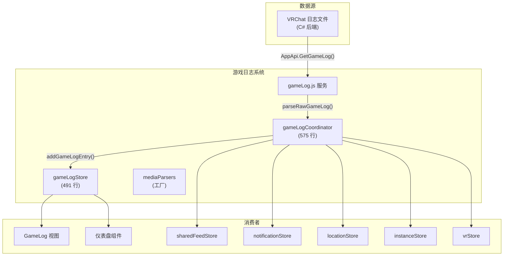
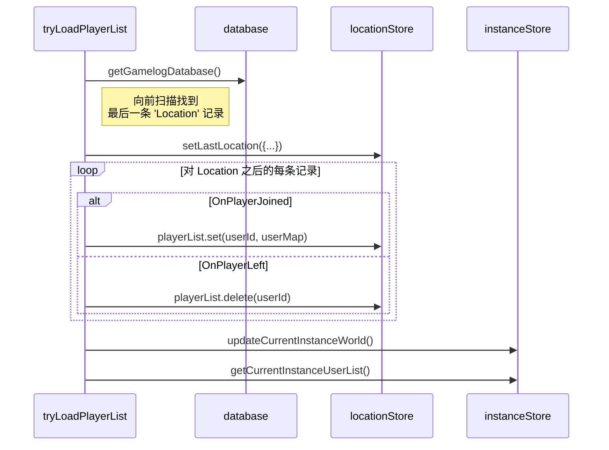

# 游戏日志系统

## 概述

游戏日志系统处理 VRChat 的本地游戏日志文件，追踪玩家交互、实例切换、媒体播放和游戏内事件。它是 VRCX 了解"游戏内正在发生什么"的主要来源 — 用客户端观察数据补充 WebSocket 实时数据，获取 VRChat API 不暴露的信息。



## 事件类型

Coordinator 根据 `gameLog.type` 分发事件：

### 实例与位置事件

| 类型 | 描述 | 副作用 |
|------|------|--------|
| `location-destination` | 正在前往新实例 | 重置位置、清除 now playing、更新世界信息 |
| `location` | 到达新实例 | 设置 `lastLocation`、创建条目、更新 VR 叠层 |
| `vrc-quit` | VRChat 退出信号 | 可选 QuitFix（如卡住则终止 VRC 进程） |
| `openvr-init` | SteamVR 初始化 | 设置 `isGameNoVR = false`、更新 OpenVR 状态 |
| `desktop-mode` | 桌面模式（无 VR） | 设置 `isGameNoVR = true` |

### 玩家事件

| 类型 | 描述 | 副作用 |
|------|------|--------|
| `player-joined` | 玩家加入当前实例 | 添加到 `playerList`、如未知则获取用户 |
| `player-left` | 玩家离开当前实例 | 从 `playerList` 移除、计算会话时长 |

### 媒体事件

| 类型 | 描述 | 副作用 |
|------|------|--------|
| `video-play` | 视频播放器启动 | 解析媒体源、更新 now playing |
| `video-sync` | 视频跳转/位置更新 | 更新播放偏移量 |
| `vrcx` | 来自世界的自定义 VRCX 事件 | 分发到世界专用解析器 |

### 资源事件

| 类型 | 描述 | 副作用 |
|------|------|--------|
| `resource-load-string` | 字符串资源加载 | 如启用则记录 |
| `resource-load-image` | 图片资源加载 | 如启用则记录 |
| `api-request` | 游戏内的 VRC API 请求 | 解析 emoji/print/inventory URL |
| `screenshot` | 截图 | 通过 `vrcxStore.processScreenshot` 处理 |
| `sticker-spawn` | 贴纸生成 | 如启用则保存贴纸到文件 |

### 其他事件

| 类型 | 描述 | 副作用 |
|------|------|--------|
| `portal-spawn` | 世界中出现传送门 | 记录到数据库 |
| `avatar-change` | 玩家切换头像 | 追踪每玩家头像历史 |
| `event` | 自定义游戏事件 | 记录到数据库 |
| `notification` | 游戏内通知 | (空操作) |
| `udon-exception` | Udon 脚本错误 | 如启用则 console 输出 |
| `photon-id` | Photon 网络玩家 ID | 将 photonId → 用户映射到大厅 |

## 数据流

### 游戏日志处理管线

```mermaid
sequenceDiagram
    participant Backend as C# 后端
    participant Loop as updateLoop
    participant Parse as addGameLogEvent
    participant Service as gameLogService
    participant Process as addGameLogEntry
    participant Stores as 多个 Store
    participant DB as Database

    Backend->>Loop: AppApi.GetGameLog()
    Loop->>Parse: addGameLogEvent(json)
    Parse->>Service: parseRawGameLog(type, data, args)
    Service-->>Parse: 结构化 gameLog 对象
    Parse->>Process: addGameLogEntry(gameLog, location)

    alt 位置事件
        Process->>Stores: locationStore.setLastLocation()
        Process->>Stores: instanceStore.updateCurrentInstanceWorld()
        Process->>Stores: vrStore.updateVRLastLocation()
    end

    alt 玩家事件
        Process->>Stores: locationStore.lastLocation.playerList.set/delete
        Process->>Stores: instanceStore.getCurrentInstanceUserList()
        Process->>DB: database.addGamelogJoinLeaveToDatabase()
    end

    Process->>Stores: sharedFeedStore.addEntry(entry)
    Process->>Stores: notificationStore.queueGameLogNoty(entry)
    Process->>Stores: gameLogStore.addGameLog(entry)
```

### 启动时玩家列表恢复

当 VRCX 在 VRChat 已运行时启动，`tryLoadPlayerList()` 从数据库历史重建当前玩家列表：



## Now Playing 系统

游戏日志通过 `nowPlaying` 状态追踪世界中正在播放的媒体：

```js
nowPlaying: {
    playing: false,
    url: '',
    title: '',          // 解析后的标题
    displayName: '',    // 谁启动的
    offset: 0,          // 播放偏移量（秒）
    startTime: 0,       // 开始时间戳
    // ... 特定来源字段
}
```

### 媒体来源解析器

世界专用的媒体解析器通过 `createMediaParsers()` 工厂创建：

| 解析器 | 世界 | 用途 |
|--------|------|------|
| `addGameLogVideo` | 任意 | 通用视频 URL 检测 |
| `addGameLogPyPyDance` | PyPyDance | PyPyDance 世界歌曲解析 |
| `addGameLogVRDancing` | VRDancing | VRDancing 世界歌曲解析 |
| `addGameLogZuwaZuwaDance` | ZuwaZuwaDance | ZuwaZuwaDance 世界歌曲解析 |
| `addGameLogLSMedia` | LS Media | LS Media 世界 URL 解析 |
| `addGameLogPopcornPalace` | Popcorn Palace | Cinema 世界视频解析 |

## QuitFix 功能

`vrc-quit` 事件处理器包含可选的 "QuitFix" 功能，用于 VRChat 关闭时卡住的情况：

```js
case 'vrc-quit':
    if (advancedSettingsStore.vrcQuitFix) {
        const bias = Date.parse(gameLog.dt) + 3000;
        if (bias < Date.now()) {
            // 忽略过期的退出信号
            break;
        }
        AppApi.QuitGame().then((processCount) => {
            if (processCount === 1) {
                console.log('QuitFix: Killed VRC');
            }
        });
    }
    break;
```

**安全检查：**
- 仅在退出信号距当前时间 3 秒内时激活（防止对重放日志执行操作）
- 如果有超过 1 个 VRC 进程运行则不终止（多实例）

## 文件映射

| 文件 | 行数 | 用途 |
|------|------|------|
| `stores/gameLog/index.js` | 491 | GameLog 状态、now playing、表管理 |
| `stores/gameLog/mediaParsers.js` | — | 世界专用媒体解析器工厂 |
| `coordinators/gameLogCoordinator.js` | 575 | 核心事件处理器、玩家列表恢复 |
| `services/gameLog.js` | — | 原始日志解析、后端桥接 |
| `views/GameLog/` | — | GameLog 页面视图组件 |

## 关键依赖

| 依赖 | 方向 | 用途 |
|------|------|------|
| `locationStore` | 读/写 | `lastLocation`、玩家列表管理 |
| `instanceStore` | 写入 | 实例世界更新、加入历史 |
| `userStore` | 读取 | 缓存用户用于名称解析 |
| `friendStore` | 读取 | 玩家事件的好友检查 |
| `vrStore` | 写入 | VR 位置更新 |
| `photonStore` | 读/写 | Photon 大厅头像追踪 |
| `galleryStore` | 写入 | Emoji/print/sticker 自动捕获 |
| `sharedFeedStore` | 写入 | 推送条目到仪表盘/VR |
| `notificationStore` | 写入 | 桌面/声音通知 |
| `gameStore` | 读取 | `isGameRunning` 检查 |

## 风险与注意事项

- **coordinator（575 行）是一个巨大的 switch 语句。** 每个 case 处理不同的游戏日志类型，带有跨 store 副作用。
- **`tryLoadPlayerList()` 对未知用户执行顺序 API 调用** — 如果游戏中有很多非好友玩家，可能导致频率限制。
- **去重基于 URL**（`lastVideoUrl`、`lastResourceloadUrl`）— 防止刷屏但可能错过合法的重播。
- **now playing 系统**依赖世界专用解析器。添加新世界支持需要添加新的解析器函数。
- **`addGameLogEntry()` 从更新循环调用** — 游戏活跃时每个轮询周期运行。性能至关重要。
- **`photon-id` 处理**通过 `cachedUsers` 的线性扫描映射显示名到用户 — `findUserByDisplayName()` 对缓存大小为 O(n)。
