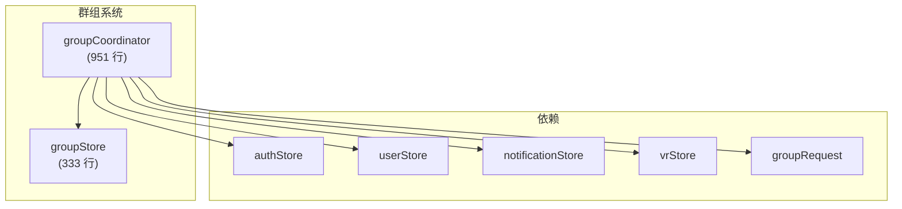

# 群组系统

群组系统管理 VRChat 的群组数据，包括群组对话框、成员管理、审核和群组实例。它分为 store（状态 + 简单 UI 逻辑）和 coordinator（复杂的跨 store 操作），遵循标准的 VRCX 分离模式。



## 概览


## 状态结构

### `groupDialog` — 多标签页群组详情弹窗

```js
groupDialog: {
    visible: false,
    loading: false,
    activeTab: 'Info',
    id: '',
    inGroup: false,            // 当前用户是否为成员
    ownerDisplayName: '',
    ref: {},                   // 缓存的群组引用
    announcement: {},          // 最新公告帖
    posts: [],                 // 所有群组帖子
    postsFiltered: [],         // 搜索过滤后的帖子
    calendar: [],              // 群组活动
    members: [],               // 成员列表
    memberSearch: '',
    instances: [],             // 活跃群组实例
    memberRoles: [],           // 可用角色
    memberFilter: { name: '...', id: null },
    memberSortOrder: { name: '...', value: 'joinedAt:desc' },
    postsSearch: '',
    galleries: {}
}
```

### 共享状态

```js
currentUserGroups: reactive(new Map())  // groupId → 当前用户的群组数据
cachedGroups: new Map()                  // 所有遇到的群组
inGameGroupOrder: []                     // 游戏内群组标签排序
groupInstances: []                       // 当前活跃群组实例
```

## Coordinator 函数

### `groupCoordinator.js`（951 行）

| 函数 | 行数 | 用途 |
|------|------|------|
| `initUserGroups()` | ~80 | 登录时获取并缓存所有用户群组 |
| `applyGroup(json)` | ~60 | 群组数据实体转换 |
| `showGroupDialog(groupId)` | ~200 | 打开群组对话框，加载所有标签页 |
| `getGroupDialogGroup(groupId)` | ~100 | 刷新群组对话框数据 |
| `handleGroupMember(args)` | ~50 | 处理 WebSocket 的成员更新 |
| `onGroupLeft(groupId)` | ~30 | 处理离开群组事件 |
| 审核功能 | ~200 | 封禁、踢出、角色管理 |
| 画廊/帖子功能 | ~200 | 群组画廊和帖子管理 |

### 成员管理

支持按角色过滤成员和多种排序方式。群组管理员还可以使用群组成员审核视图：
- 批量封禁/踢出操作
- CSV 导入/导出封禁列表
- 带类型过滤的审计日志查看器
- 角色分配

## 文件映射

| 文件 | 行数 | 用途 |
|------|------|------|
| `stores/group.js` | 333 | 群组状态、对话框、缓存群组 |
| `coordinators/groupCoordinator.js` | 951 | 所有跨 store 群组逻辑 |

## 风险与注意事项

- **`cachedGroups` 不是响应式的** — 它是普通 `Map()`，不是 `reactive()`。组件应引用 `currentUserGroups`（响应式）或 `groupDialog.ref`。
- **`getAllGroupPosts` 有 50 页安全上限**以防止无限分页循环。
- **群组角色权限检查**使用 `hasGroupPermission()` 工具函数，需要完整的包含角色的群组 ref。
- **游戏内群组排序**（`inGameGroupOrder`）独立维护，仅从游戏日志事件更新。
