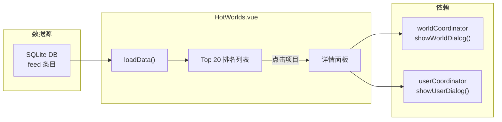

# Hot Worlds（实验性）

Hot Worlds 是 Charts 页面中的实验性标签页，基于本地数据库中的好友访问数据对 VRChat 世界进行排名。



## 概览

| 项目 | 详情 |
|------|------|
| **位置** | Charts 页面 → Hot Worlds 标签页 |
| **组件** | `views/Charts/components/HotWorlds.vue` |
| **数据源** | `database.getHotWorlds(days)` — 聚合好友访问 feed 条目 |
| **状态** | 实验性 |

## 功能

| 功能 | 详情 |
|------|------|
| **时段选择** | ToggleGroup：7 / 30 / 90 天（默认：30） |
| **排名** | 按独立好友数排序的 Top 20 世界 |
| **双列布局** | 宽屏下将 Top 20 分为两列显示 |
| **进度条** | 宽度与 `uniqueFriends / maxFriends` 成比例 |
| **趋势指示** | 每个世界的 `TrendingUp` / `TrendingDown` 图标（来自 `world.trend`） |
| **汇总统计** | 总世界数、上升/下降数量、总访问数 |
| **详情面板** | 侧边 Sheet 面板显示每个世界的好友访问明细 |

## 数据流

```
用户选择时段（7/30/90 天）
  → database.getHotWorlds(selectedDays)
  → 返回：[{ worldId, worldName, uniqueFriends, visitCount, trend, ... }]
  → 显示 Top 20，计算列和统计

用户点击世界行
  → openDetail(world)
  → database.getHotWorldFriendDetail(worldId, selectedDays)
  → 返回：[{ userId, displayName, visitCount }]
  → 在 Sheet 面板中显示
```

## 关键设计决策

1. **仅本地数据**：所有排名从用户自己的 feed 数据库计算 — 不调用 VRChat API。排名反映的是用户好友圈的偏好，而非全局热度。
2. **限制 20 个**：仅显示 Top 20 以保持 UI 聚焦。完整数据集可能包含更多条目。
3. **切换时段重置详情**：更改时段会关闭详情面板并重新加载数据。

## 文件清单

| 文件 | 用途 |
|------|------|
| `views/Charts/components/HotWorlds.vue` | 完整组件 — 数据加载、显示、详情面板 |
| `services/database.js` | `getHotWorlds()`、`getHotWorldFriendDetail()` 查询 |
