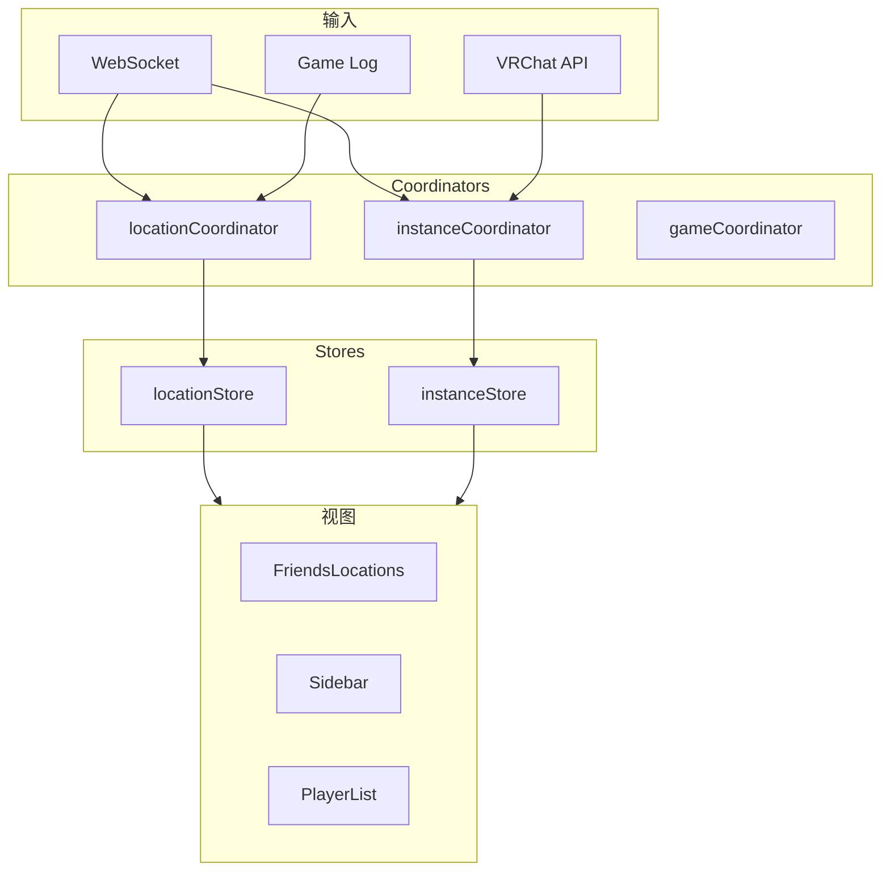
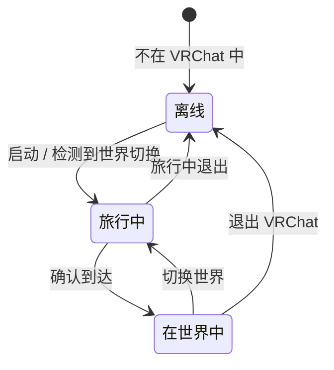

# Instance & Location 系统

Instance & Location 系统跟踪当前用户在 VRChat 世界中的位置，并管理好友和其他玩家的缓存实例数据。




## 概览

| 组件 | 说明 |
|------|------|
| **locationStore** | lastLocation（当前）, lastLocation$traveling, $travelingToLocation |
| **instanceStore** | cachedInstances Map（200 条 LRU）, 每实例 playerList, queuedInstances |
| **locationCoordinator** | runSetCurrentUserLocationFlow(), parseLocationTag() |
| **instanceCoordinator** | getInstance(), 玩家列表管理 |
| **gameCoordinator** | CheckGameRunning(), 实例启动 |
| **WebSocket** | user-location, friend-location |
| **VRChat API** | GET /instances/{id} |
| **Game Log** | 来自 VRChat 日志的位置事件 |

## 位置追踪

### 当前用户位置状态

当前用户可能处于以下状态之一：



**locationStore 关键字段：**

| 字段 | 类型 | 用途 |
|------|------|------|
| `lastLocation` | string | 当前位置标签（如 `wrld_xxx:12345~private(usr_yyy)`） |
| `lastLocation$traveling` | string | 正在前往的位置 |
| `$travelingToLocation` | boolean | 是否在旅行中 |

### 位置标签格式

VRChat 使用标签格式的位置：

```
wrld_xxxxxxxx-xxxx-xxxx-xxxx-xxxxxxxxxxxx:12345~type(usr_xxx)~region(us)~nonce(xxx)
│                                          │     │              │           │
│                                          │     │              │           └─ Nonce
│                                          │     │              └─ 区域
│                                          │     └─ 实例类型 + 所有者
│                                          └─ 实例 ID
└─ 世界 ID
```

**实例类型：** `public`、`hidden`、`friends`、`private`、`group`

### 位置更新来源

位置数据来自多个来源，优先级不同：

| 来源 | 优先级 | 触发方式 | 延迟 |
|------|--------|---------|------|
| WebSocket `user-location` | 最高 | 服务器推送 | ~1-5s |
| WebSocket `friend-location` | 高 | 服务器推送 | ~1-5s |
| Game Log 文件 | 中 | 文件轮询 | 不定 |
| API `GET /users/{id}` | 较低 | 定期刷新 | 300s-3600s |

## Instance Store

### 缓存实例

Instance store 维护一个基于 `$fetchedAt` 时间戳的 **200 条缓存**：

```javascript
cachedInstances = reactive(new Map())  // instanceId → 实例数据

// 每个缓存实例包含：
{
    id,                    // 完整实例标签
    worldId,               // 世界 ID 部分
    instanceId,            // 数字实例 ID
    type,                  // public|hidden|friends|private|group
    ownerId,               // 实例所有者用户 ID
    region,                // us|eu|jp
    capacity,              // 玩家上限
    userCount,             // 当前玩家数
    users,                 // 玩家列表预览
    $fetchedAt,            // 缓存时间戳（用于 LRU）
    // ... 世界数据、群组数据等
}
```

### 每实例玩家列表

每个实例追踪其玩家列表。数据来自：
1. **VRChat API** — `GET /instances/{id}` 返回用户列表
2. **Game Log** — 当前用户在该实例中时

### 队列系统

VRChat 支持实例队列（等待加入满员实例）：

| 事件 | 处理函数 | 效果 |
|------|---------|------|
| `instance-queue-joined` | `instanceQueueUpdate()` | 加入 `queuedInstances` |
| `instance-queue-position` | `instanceQueueUpdate()` | 更新位置 |
| `instance-queue-ready` | `instanceQueueReady()` | 通知用户，可以加入 |
| `instance-queue-left` | `removeQueuedInstance()` | 从队列移除 |

## Location Coordinator

### `runSetCurrentUserLocationFlow()`

当前用户位置变化时调用（WebSocket `user-location` 事件）：

```
runSetCurrentUserLocationFlow(location, $location_at)
├── 解析位置标签 → worldId, instanceId, type, region
├── 这是新位置吗？（与 lastLocation 不同）
│   ├── 是：
│   │   ├── 设置 $travelingToLocation = true
│   │   ├── 更新 lastLocation$traveling
│   │   ├── 从 API 获取实例数据
│   │   ├── 更新 instanceStore 缓存
│   │   ├── 创建游戏日志条目
│   │   └── 完成：lastLocation = newLocation
│   └── 否：
│       └── 刷新实例玩家数
└── 如果 VR 活跃，通知 VR 覆盖层
```

## 与其他系统的交互

### Game Log 集成

`gameLogCoordinator` 创建位置相关的日志条目：

| 事件 | 触发时机 | 记录的数据 |
|------|---------|-----------|
| `Location` | 用户进入世界 | worldId, instanceId, 玩家数 |
| `OnPlayerJoined` | 其他玩家加入 | 玩家 userId, displayName |
| `OnPlayerLeft` | 玩家离开 | 玩家 userId, displayName |

### VR 覆盖层

位置数据显示在 VR 手腕覆盖层上：
- 当前世界名称
- 玩家数量
- 带位置摘要的好友列表

## 年龄限制实例显示

当 `appearanceSettingsStore.isAgeGatedInstancesVisible` 为 `false` 时，年龄限制实例在好友列表中被隐藏，替换为锁图标 + "Restricted" 文本。

- **设置项**：`VRCX_isAgeGatedInstancesVisible`（默认：`false`）
- **影响的视图**：`Location.vue`（好友侧边栏/卡片）、`WorldDialogInstancesTab.vue`（世界详情实例列表）、`GroupsSidebar.vue`（群组成员）
- **行为**：`Location.vue` 通过设置 + `ageGate` 标志计算 `isAgeRestricted`。受限时，位置链接替换为不可点击的锁图标和 tooltip。

## 关键依赖

| 模块 | 读取 | 写入 |
|------|------|------|
| **locationStore** | —（叶子 store） | — |
| **instanceStore** | user, friend, group, location, world, notification, sharedFeed, appearanceSettings | — |
| **locationCoordinator** | advancedSettings, gameLog, game, instance, location, notification, user, vr | location, instance, gameLog |
| **instanceCoordinator** | instance | instance |
| **gameCoordinator** | advancedSettings, avatar, gameLog, game, instance, launch, location, modal, notification, updateLoop, user, vr, world | game, instance, location |

::: tip 安全修改区
`locationStore` 是**叶子 store** — 没有跨 store 依赖。你可以安全地修改其内部结构而不影响其他 store。但是，很多 coordinator 和视图**读取**它，所以改变其公共 API 需要检查消费者。
:::

::: warning 高风险区域
`instanceStore` 有 **6 个依赖 store**。改变实例数据结构可能会级联到游戏日志、通知、共享 feed 和 VR 覆盖层。
:::
