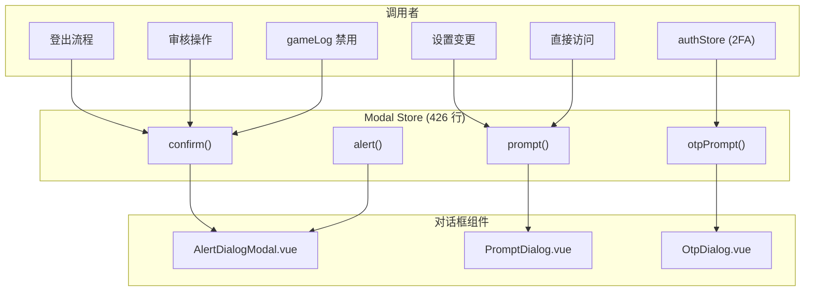

# Modal 系统

Modal 系统提供集中化的、基于 Promise 的对话框 API，用于确认、提醒、文本输入和 OTP 输入。它替代了分散在各 store 中的对话框状态 — 任何 store 或 coordinator 都可以 `await modalStore.confirm(...)` 来获取用户输入。



## 概览


## API

### `confirm(options)` → `Promise<ConfirmResult>`

显示带确定/取消按钮的确认对话框。

```js
const { ok, reason } = await modalStore.confirm({
    title: '确认',
    description: '你确定吗？',
    confirmText: '是',        // 可选
    cancelText: '否',          // 可选
    dismissible: true,         // 可选，默认 true
    destructive: false         // 可选，使用危险按钮样式
});
// reason: 'ok' | 'cancel' | 'dismiss' | 'replaced'
```

### `alert(options)` → `Promise<ConfirmResult>`

显示仅有确定按钮的提醒对话框。取消和关闭都解析为 `ok`。

### `prompt(options)` → `Promise<PromptResult>`

显示带验证的文本输入对话框。

```js
const { ok, value } = await modalStore.prompt({
    title: '输入名称',
    description: '请输入名称。',
    inputValue: '',            // 预填值
    inputType: 'text',         // 'text' | 'password'
    pattern: /\S+/,            // 验证正则
    errorMessage: '无效输入'    // pattern 失败时显示
});
```

### `otpPrompt(options)` → `Promise<PromptResult>`

为 2FA 认证显示专用 OTP 输入对话框。

```js
const { ok, reason, value } = await modalStore.otpPrompt({
    mode: 'totp',              // 'totp' | 'emailOtp' | 'otp'
    confirmText: '验证',
    cancelText: '使用恢复码'
});
// cancel 可以表示"切换到另一种 2FA 方式"
```

## 替换语义

当新对话框在另一个仍待处理时打开，旧的会以 `reason: 'replaced'` 解析：

```js
function openBase(mode, options) {
    if (pending) {
        finishWithoutClosing('replaced'); // 旧对话框强制完成
    }
    return new Promise((resolve) => {
        pending = { resolve };
    });
}
```

这防止了 Promise 泄漏 — 调用者总是得到一个解析结果。

## 文件映射

| 文件 | 行数 | 用途 |
|------|------|------|
| `stores/modal.js` | 426 | 基于 Promise 的对话框 API |
| `components/ui/alert-dialog/AlertDialogModal.vue` | — | 确认/提醒渲染 |
| `components/dialogs/PromptDialog.vue` | — | 文本输入对话框 |
| `components/dialogs/OtpDialog.vue` | — | OTP 输入对话框 |

## 风险与注意事项

- **每种类型只能打开一个对话框。** 在一个 `confirm()` 待处理时打开第二个会替换第一个（以 `'replaced'` 解析）。
- **`alert()` 没有取消语义。** ESC/关闭和点击确定都解析为 `ok: true`。
- **`destructive` 标志**纯粹是视觉的 — 仅改变确认按钮样式。实际的破坏性操作是调用者的责任。
- **OTP 模式**有语义重载："取消"按钮在 TOTP 模式下表示"切换到恢复码"，而非"中止认证"。
