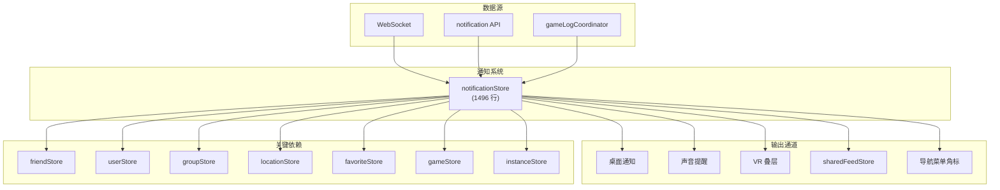
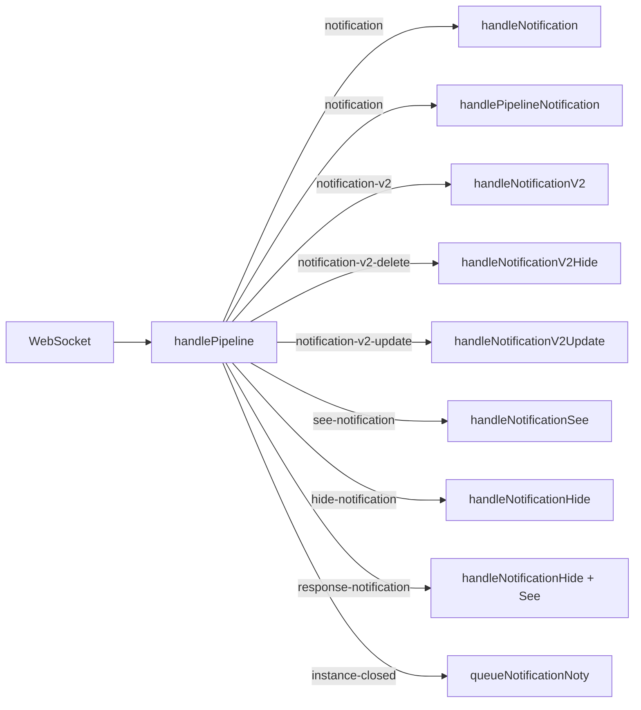
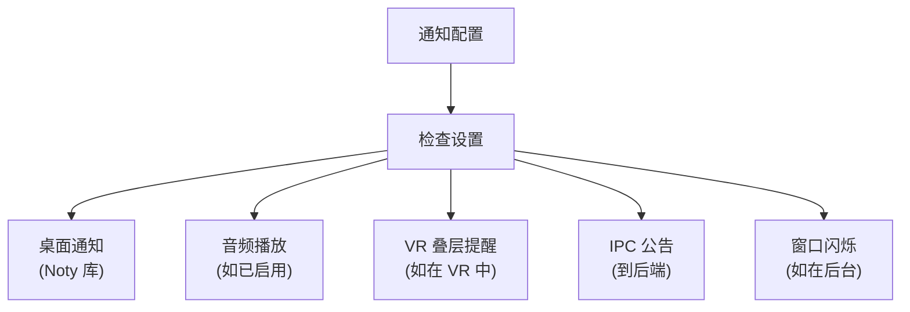

# 通知系统

通知系统是 VRCX 中最复杂的单一 store（1496 行）。它处理来自 VRChat 的所有通知类型 — 好友请求、邀请、邀请请求、投票踢人、实例关闭 — 并将它们桥接到桌面通知、声音提醒、VR 叠层提醒和应用内通知中心。拥有 15 个依赖 store，是代码库中依赖数量最多、影响范围最广的系统。



## 概览


## 通知类型

### V1 通知（旧版）

| 类型 | 描述 | 来源 |
|------|------|------|
| `friendRequest` | 收到好友请求 | WS: `notification` |
| `requestInvite` | 他人向你请求邀请 | WS: `notification` |
| `requestInviteResponse` | 你的邀请请求回复 | WS: `notification` |
| `invite` | 直接邀请到实例 | WS: `notification` |
| `inviteResponse` | 你的邀请回复 | WS: `notification` |
| `voterequired` | 投票踢人发起 | WS: `notification` |
| `boop` | Boop 通知 | WS: `notification` |

### V2 通知（新版）

| 类型 | 描述 | 来源 |
|------|------|------|
| `group.announcement` | 群组公告 | WS: `notification-v2` |
| `group.invite` | 群组加入邀请 | WS: `notification-v2` |
| `group.joinRequest` | 群组加入请求 | WS: `notification-v2` |
| `group.queueReady` | 群组实例队列就绪 | WS: `notification-v2` |
| `group.informative` | 群组信息通知 | WS: `notification-v2` |
| `instance.closed` | 实例关闭通知 | WS: `instance-closed` |

### GameLog 通知

| 类型 | 描述 | 来源 |
|------|------|------|
| `OnPlayerJoined` | 玩家加入当前实例 | GameLog |
| `OnPlayerLeft` | 玩家离开当前实例 | GameLog |
| `PortalSpawn` | 世界中出现传送门 | GameLog |
| `AvatarChange` | 玩家切换头像 | GameLog |
| `Event` | 自定义 Udon 事件 | GameLog |
| `VideoPlay` | 视频播放器启动 | GameLog |

## 状态结构

```js
// 通知表 — 显示在通知中心
notificationTable: {
    data: [],                                      // 所有通知
    search: '',
    filters: [
        { prop: 'type', value: [] },              // 类型过滤
        { prop: ['senderDisplayName'], value: '' } // 文本过滤
    ],
    pageSize: 20,
    pageSizeLinked: true,
    paginationProps: { layout: 'sizes,prev,pager,next,total' }
}

unseenNotifications: []    // 未查看的通知 ID
isNotificationsLoading: false
isNotificationCenterOpen: false
```

## WebSocket 事件处理

### Pipeline 分发



### `handlePipelineNotification` — 大型 Switch

这个约 120 行的函数处理所有 V1 通知类型。对于每种类型：

1. 确定通知消息（含 i18n）
2. 设置适当的声音
3. 判断是否显示桌面通知
4. 检查好友是否为 VIP 收藏（用于特殊提醒）
5. 处理特殊动作（如自动接受邀请）
6. 将通知排入显示队列

**特殊行为：**
- **`requestInvite`**：可根据设置自动接受
- **`invite`**：显示位置详情，处理 `canInvite` 检查
- **`friendRequest`**：如自动接受则触发 `handleFriendAdd()`
- **`boop`**：旧版处理，兼容旧 boop 格式

## 标记已读系统

通知系统使用**排队批处理**方式标记已读：

```js
const seeQueue = [];       // 待处理的通知 ID
const seenIds = new Set();  // 已处理的 ID
let seeProcessing = false;  // 互斥锁

// 将通知排入已读队列
function queueMarkAsSeen(notificationId, version = 1) {
    if (seenIds.has(notificationId)) return;
    seenIds.add(notificationId);
    seeQueue.push({ id: notificationId, version });
    processSeeQueue();
}

// 顺序处理队列，含重试逻辑
async function processSeeQueue() {
    if (seeProcessing) return;
    seeProcessing = true;
    while (seeQueue.length > 0) {
        const item = seeQueue.shift();
        try {
            await notificationAPI.see(item);
        } catch (err) {
            if (shouldRetry(err)) {
                seeQueue.unshift(item); // 放回队首重试
                await delay(429_RETRY_MS);
            }
        }
    }
    seeProcessing = false;
}
```

## 桌面通知系统 (`playNoty`)

`playNoty` 函数（约 145 行）是统一的通知渲染器：



**每种通知类型的配置选项：**
- 启用/禁用桌面通知
- 声音文件选择
- 音量
- 自定义声音覆盖
- VR 手腕叠层显示
- 详细消息 vs 摘要

## 文件映射

| 文件 | 行数 | 用途 |
|------|------|------|
| `stores/notification/index.js` | 1496 | 所有通知状态、处理器、noty 队列、标记已读 |
| `stores/notification/notificationUtils.js` | — | 通知分类工具函数 |
| `api/notification.js` | — | 通知端点 API 请求 wrapper |

## 关键依赖

| 依赖 | 方向 | 用途 |
|------|------|------|
| `friendStore` | 读取 | 检查发送者是否为好友/收藏 |
| `favoriteStore` | 读取 | 检查 VIP 收藏状态用于声音 |
| `groupStore` | 读取 | 从群组通知显示群组对话框 |
| `locationStore` | 读取 | 获取当前位置用于邀请检查 |
| `userStore` | 读取 | 获取用户 ref、显示用户对话框 |
| `gameStore` | 读取 | 检查游戏是否运行（用于 VR 通知） |
| `instanceStore` | 读取 | 邀请通知的实例详情 |
| `sharedFeedStore` | 写入 | 推送通知条目到 feed |
| `uiStore` | 写入 | `notifyMenu('notification')` 角标更新 |
| `wristOverlaySettingsStore` | 读取 | VR 通知配置 |
| `generalSettingsStore` | 读取 | 通知启用/禁用设置 |

## 风险与注意事项

- **单一 store 1496 行。** 这是最大的 store，是未来拆分到多个 coordinator 的候选。
- **15 个 store 依赖。** 依赖 store API 的任何变更都可能在此产生级联影响。
- **`playNoty` 函数**同时使用 `Noty` 库和 `vue-sonner` toast — 两个不同的通知渲染系统共存。
- **`unseenNotifications`** 是 ID 数组而非 Set。线性扫描性能随未读通知增多而下降。
- **V1 和 V2 通知**使用不同的数据结构和不同的 API 端点。store 维护并行的处理路径。
- **声音播放**在主线程通过 `Audio()` API 进行 — 通知爆发可能导致音频重叠。
- **processSeeQueue 中的频率限制处理**使用简单重试 — 如果 VRC API 返回 429，队列会退避但继续。
